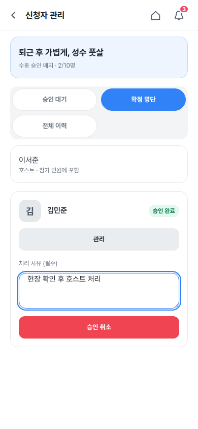
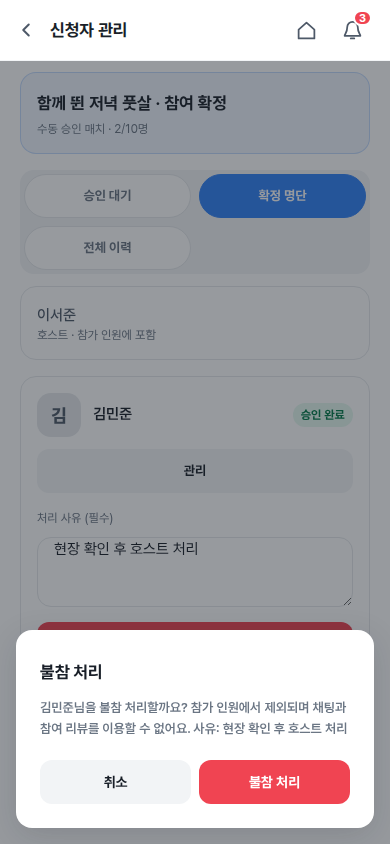
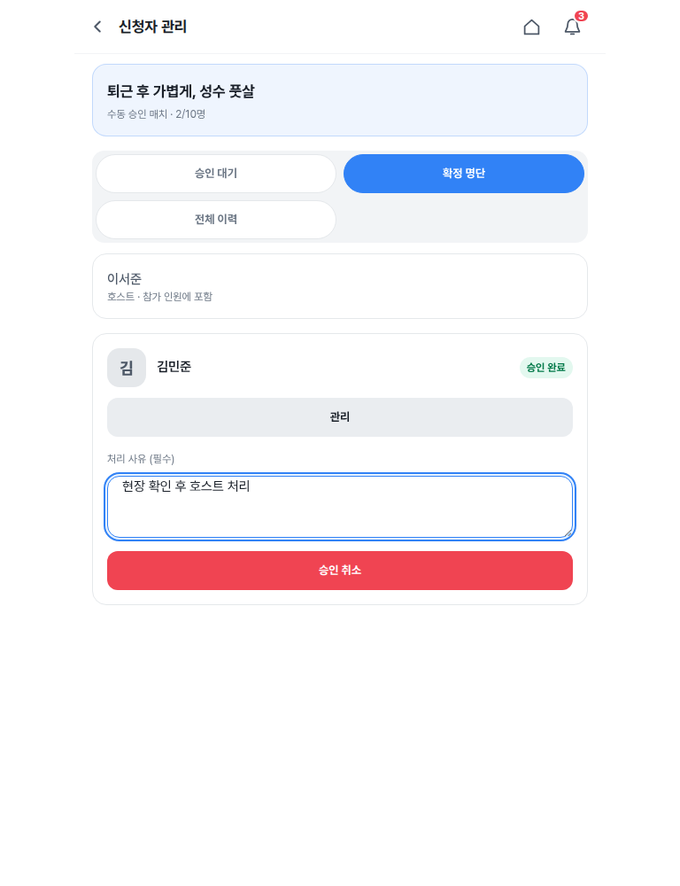
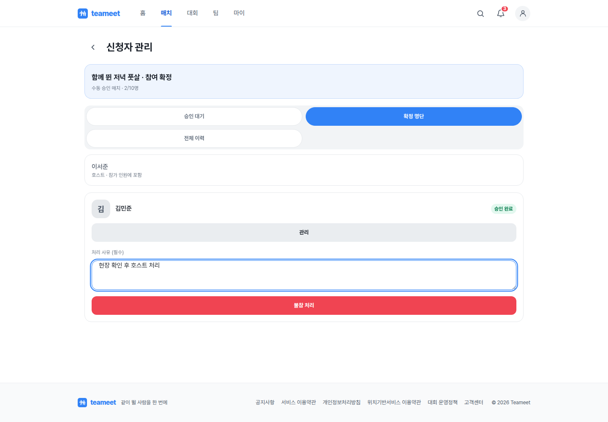
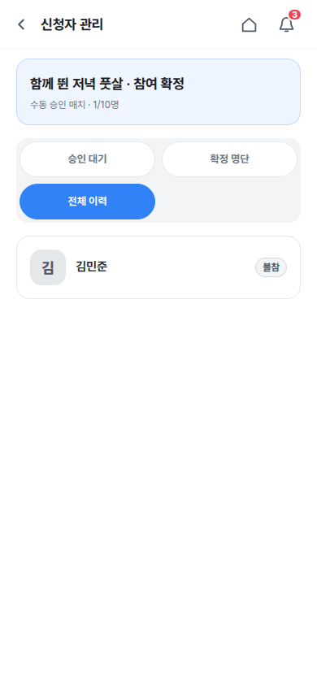

# Task 130 — V1 match create/edit contract audit

## Scope

- Backend: `apps/v1_api/src/matches`, `apps/v1_api/src/team-matches`, creator profile guard
- Frontend: `apps/v1_web/src/components/matches`, `apps/v1_web/src/components/team-matches`
- Tests: focused backend/frontend contract tests and match E2E follow-up

## Goal

Verify personal-match and team-match creation/editing end to end, including creator
profile requirements, team permissions, master-data selection, payload mapping, image
upload persistence, and the absence of hard-coded production form values.

## Acceptance Criteria

- [x] Personal-match creation requires real name, phone, and gender.
- [x] Team-match creation additionally requires an active owner/manager membership.
- [x] Sport, district region, and host team IDs come from live API data.
- [x] Empty image selection persists as `null`; no mock image is silently submitted.
- [x] Uploaded images are included in create/update payloads and survive detail hydration.
- [x] Edit forms hydrate the requested entity without mock or seed fallback.
- [x] Create/update DTO fields match frontend payloads exactly.
- [x] Personal-match detail exposes separate edit and applicant-management actions.
- [x] Personal-match edit exposes every mutable create/update field.
- [x] Focused backend, frontend, and browser scenarios pass.

## Progress Snapshot

- 2026-08-03: Static audit found a hard-coded personal-match mock image submitted for
  empty create/edit image state, plus runtime labels falling back to fixed sport/team
  examples while live selection data was unavailable. Remediation and regression tests
  started on `audit/v1-match-create-edit-contracts`.
- 2026-08-03: Added payload tests for live sport/region/team IDs, create/edit hydration,
  and both empty/uploaded image states. Frontend focused tests pass (12/12).
  Added host-team sport equality validation because the team-match API previously
  allowed a single-sport team to publish a different-sport match. Backend Jest remains
  blocked in this worktree because the shared install cannot resolve `nestjs-pino` and
  the host Node 18 runtime is below the repository's required Node 22.
- 2026-08-04: Upgraded the local toolchain to Node 22, restored the frozen pnpm install,
  regenerated the v1 Prisma client, and rebuilt a clean local QA database/stack. Focused
  backend tests pass (24/24), focused frontend tests pass (12/12 before the follow-up,
  then 7/7 for the touched create clients), and v1 web typecheck passes.
- 2026-08-04: Browser QA found two additional wizard regressions. Draft persistence used
  a passive effect/state updater that could lose the last place/time input during route
  navigation, and the legacy sample cleanup erased legitimate `+7 days, 18:00-20:00`
  values field-by-field. Drafts now persist synchronously through a ref, while legacy
  cleanup only runs when the complete historical sample draft matches.
- 2026-08-04: Production-mode local QA E2E passes for personal matches (2/2), including
  live sport/region IDs, upload, create, detail image hydration, requested-entity edit,
  and update. Team-match create/detail/edit E2E also passes (1/1), including an authorized
  live host team ID and uploaded image persistence. The v1 discovery smoke remains green
  (2/2). Task acceptance criteria are complete.
- 2026-08-06: Follow-up application lifecycle audit covers personal/team-match apply,
  approve, reject, approved presentation, and withdraw. The audit found non-atomic
  resubmit/reject/withdraw transitions, team-match deadline enforcement gaps, false
  approved presentation for unrelated viewers after a team match became matched, and
  missing audit/notification side effects for automatically rejected opponent teams.

## Application Lifecycle Follow-up

- [x] Resubmit, reject, and withdraw transitions only update the status observed by the
  caller and return a conflict when another transition wins first.
- [x] Team-match application and approval reject actions after `deadlineAt`.
- [x] Only the actually approved applicant team sees `승인 완료`; unrelated viewers see
  that opponent selection is closed without receiving approved affordances.
- [x] Automatically rejected team-match applications receive individual status logs and
  manager notifications.
- [x] Focused backend/frontend regression tests and canonical API docs cover the repaired
  lifecycle.

- 2026-08-06: Follow-up remediation completed. Added persisted
  `v1_team_matches.deadline_at`, enforced it on team-match apply/approve, made resubmit,
  reject, and withdraw expected-status transitions, logged/notified every automatically
  rejected applicant team, and limited approved UI to the actual approved viewer. Focused
  verification: API service suites 42/42, web lifecycle suites 21/21, API/web typecheck
  green, and Prisma client generation green.
- 2026-08-07: Host detail now separates `매치 수정` from `신청자 관리`, and edit exposes
  sport, region, content, image, capacity, level/gender/rules, place/address, match time,
  and application deadline. Focused release verification passed before the dev push.

## 2026-09-18 개인 매치 참여 중심 기능 확장

- 사용자 승인 범위: 개인 매치 완료·참여 횟수, 후기 진입, 신청 관리 redirect 수정,
  확정 명단, 호스트 채팅, 내 매치 페이지네이션, 시작 전 승인 참가 취소. 득점/승패 기록 제외.
- 기준 `origin/dev` 82698757d, 격리 worktree `/tmp/teameet-personal-match`,
  branch `feat/personal-match-participation` (기존 공유 트리 WIP는 보존).
- 기존 모델/컬럼을 사용하며 migration은 필요하지 않다.
- 완료 기준: endAt이 있으면 종료 이후, 없으면 시작 이후 호스트가 실제 종료를 확인한다.
  취소/보관 매치는 완료 불가. 완료를 반복해도 참여 횟수는 중복되지 않는다.
- [x] Phase 1: 최신 코드 재점검·범위 확정
- [x] Phase 2: API·UI 구현 (7개 항목)
- [x] Phase 3: 단위/실DB/브라우저 검증과 390/768/1440 스크린샷
- [x] Phase 4: 계약 문서·changeset·PR·리뷰 — PR #1223 (`dev` 대상)

### Progress Snapshot

실제 Prisma 참가자 완료 전환과 승인 후 철회가 같은 매치 행 잠금으로 직렬화된다.
완료된 참가자는 채팅 권한을 유지하며, 철회된 참가자는 권한에서 빠진다.
UI에는 완료 확인 모달, 참가 취소 확인 모달, 확정 명단/전체 이력 탭과 내 매치 더 보기를 연결했다.
API 집중 단위 테스트 52건, Web 집중 테스트 53건, API 실DB 통합 테스트 5건과
양쪽 typecheck를 통과했다. 실DB 최초 RED에서 필수 약관 fixture 누락을 확인해
테스트·QA fixture에 실제 동의 절차를 추가한 뒤 GREEN을 확인했다.
headed Chromium으로 390/768/1440px 21개 화면과 완료·채팅·철회·후기·페이지네이션
7개 액션을 검증했으며 console/network 오류는 0건이다. 모바일 고정 CTA가 완료 버튼을
가리던 문제와 완료 상태의 영문 노출도 이 과정에서 수정했다.
PR용 대표 증거는 `docs/screenshots/personal-match-participation/`의 모바일 완료·철회·이력,
태블릿 신청자 관리, 데스크톱 참여 완료 화면 5장으로 승격했다.

## 개인 매치 누락 보완 — 2026-09-19

- [x] Phase 1: 호스트 승인 취소·불참 API와 실제 참가자/신청 상태 및 감사 로그 계약 구현
- [x] Phase 2: 신청자 관리의 처리 액션, 확인·실패 처리와 명단/전체 이력 동기화
- [x] Phase 3: 실제 DB 권한·경합 검증, headed 브라우저 390/768/1440 및 오류 수집 보강
- [ ] Phase 4: canonical API/시나리오/PR 증거 갱신, CI 확인 후 dev 머지
- 승인 취소는 시작 전 active 참가자를 removed로, 불참 처리는 시작 후 완료 확정 전
  active 참가자를 no_show로 전환한다. 호스트 자신의 참가·완료된 참가 이력은 변경하지 않는다.
- 두 액션 모두 호스트 권한, 필수 사유, 매치 행 잠금, 신청 cancelled_by_host 전이,
  참가자·신청 상태 변경 로그를 요구한다. 정원·채팅·후기·활동 횟수에서 제외한다.
- UI는 사용자 선택 A안: 확정 명단의 기존 참가자 관리 메뉴 + 사유 입력 + 기존 확인 모달 재사용.
- 이전 전수 보고의 25/25는 실측 목록이 없으므로 완료 근거로 사용하지 않는다.
  314건 단위 테스트 통과와 이전 21개 캡처/7개 액션은 각각 해당 범위의 증거다.
  기존 QA 보고의 consoleErrors는 pageerror만 측정했으므로 console.error 0건을 뜻하지 않는다.

### Progress Snapshot — host actions

- 추가한 호스트 액션 2/2 구현. Web 집중 테스트 8/8, 실제 PostgreSQL API 통합 테스트 9/9 통과.
- API/Web `tsc --noEmit` 각 1회 통과. `git diff --check` 통과, touched code 신규 TODO/FIXME 없음.
- QA runner PID 88896 종료 및 자체 browser.close 완료. 이번 전용 API/Web 프로세스 종료,
  임시 PostgreSQL만 종료 후 fixture 파일은 재현용으로 보존한다. 다른 작업의 서버·브라우저는 건드리지 않는다.
- headed Chromium `host-actions` 실행: 390/768/1440px 3/3 viewport, 캡처 14/14,
  확인 취소 6건 + 실제 저장 액션 2건 = 8/8 통과. 콘솔 error, pageerror,
  requestfailed, API HTTP 오류 각각 0건. raw report: `output/playwright/visual-audit/personal-participation/host-actions-report.json`.
- Persona: 호스트 이서준 / 참가자 김민준, 새 격리 DB fixture. 운영/alpha 데이터 변경 없음.
- 판정: 390px 버튼/사유/하단 확인 모달 가림 없음, 768px 카드/폼 정렬 정상,
  1440px 기존 shell/카드 폭 유지, 모든 캡처 가로 overflow 없음. 기존 카드·메뉴·확인 모달 재사용.
- 이 두 신규 메뉴의 변경 전 전용 캡처는 없다(기존 화면에 기능 자체가 없었음).
  이전 명단 baseline은 앞선 참여 흐름 QA 증거로만 유지하며 신규 메뉴의 before로 오인하지 않는다.
- 이번 변경은 승인 취소·불참 처리 누락 보완이며 개인 매치 모든 기능에 대한 전수 완료 선언은 아니다.
  후속 분석 항목: `reopen`의 트랜잭션 밖 상태 판정과 unconditional update 경합은 별도 회귀 검증 필요.

### 호스트 액션 대표 증거

