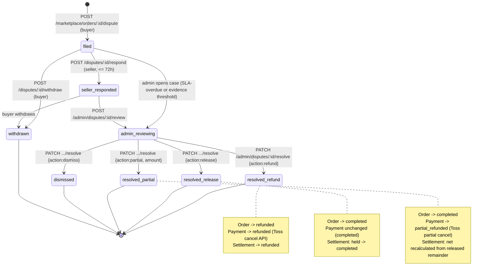

# Task 70 — Marketplace Payment Lifecycle (Tech Design)

**Owner**: tech-planner
**Sibling**: `.github/tasks/70-marketplace-payment-lifecycle.md` (project-director, product scope)
**Status**: Draft v1 (parallel with director)
**Branch hint**: `feat/task-70-marketplace-payment-lifecycle`

---

## 0. Assumptions (from director's defaults; reconcile in review)

| # | Assumption | Source | Open for director |
|---|---|---|---|
| A1 | Escrow = in-house ledger (no Toss Escrow API). Toss Payments used only as PG. | Task brief | No |
| A2 | Auto-release window = **7 days** from `deliveredAt`. | Task brief | No |
| A3 | Platform commission = **10%** (preserving current behavior — project-director override of 5% suggestion). Extract to single constant. See §7. | Task brief vs. code | Resolved — director kept 10% |
| A4 | Dispute SLA = 72h seller response / 7d admin decision. Enforced via timestamp comparisons, not cron state transitions (reads compute "overdue" badges). | Task brief | No |
| A5 | Settlement cycle T+7 from *release* (not from payment). `Payout` batch groups *released* settlements into ops-scheduled payout runs. | Task brief | No |
| A6 | `Dispute` model is **unified** (team-match + marketplace) via discriminator `targetType`. Rationale: existing `DisputesService` is 100% in-memory (Principle #1 debt). Splitting leaves it stranded. | §7 + advisor reconcile | **YES — needs sign-off** |

---

## 1. Prisma Migration Plan

### 1.1 Migration file

Path: `apps/api/prisma/migrations/20260418070000_marketplace_payment_lifecycle/migration.sql`

Back-compat: `ALTER TYPE ... ADD VALUE` is append-only (Postgres-safe, no rewrite). New columns default nullable. Data backfill for in-memory disputes = `INSERT` seed statements at end of migration (3 fixtures from `disputes.service.ts` lines 65-213).

### 1.2 Enum changes

```prisma
enum OrderStatus {
  pending
  paid
  escrow_held      // existing — retire in favor of 'paid' being the hold state; keep for back-compat
  shipped
  delivered
  completed        // buyer confirmed OR auto-released
  disputed         // existing
  refunded         // existing
  cancelled        // existing
  auto_released    // NEW — distinguishes admin-audit trail from buyer confirm
}

enum PaymentStatus {
  // UNCHANGED — do NOT add 'held'/'released' here.
  // Rationale: Payment = PG transaction (Toss side). Escrow lifecycle belongs on MarketplaceOrder.
  // Adding duplicative states on Payment causes drift (two sources of truth for "is money released?").
  pending
  completed
  refunded
  partial_refunded
  failed
}

enum SettlementStatus {
  pending
  processing
  completed
  failed
  refunded         // NEW — fixes settlements.service.ts:74,76 hardcoded `refunded: 0`
  held             // NEW — settlement exists but escrow not yet released (order still in paid/shipped/delivered)
}

enum DisputeStatus {
  // NEW enum — replaces the string union type currently declared in disputes.service.ts
  filed
  seller_responded
  admin_reviewing
  resolved_refund       // buyer wins: full refund
  resolved_release      // seller wins: release escrow to seller
  resolved_partial      // split: partial refund, remainder released
  dismissed             // admin rejects filing (no evidence)
  withdrawn             // buyer rescinds before resolution
}

enum DisputeTargetType {
  // NEW — discriminator for unified Dispute model
  marketplace_order
  team_match
}

enum DisputeActorRole {
  // NEW — for DisputeEvent.actorRole
  buyer
  seller
  admin
  system
}

enum PayoutStatus {
  // NEW
  pending       // batched, awaiting processing
  processing    // admin marked as in-flight (ops exporting to bank)
  paid          // confirmed transferred
  failed        // bank rejection
  cancelled     // admin reversed before paid
}

enum NotificationType {
  // ADD VALUES (append-only):
  order_shipped
  order_delivered
  order_auto_released
  dispute_filed
  dispute_responded
  dispute_resolved
  payout_paid
}
```

### 1.3 New / changed models

```prisma
model MarketplaceOrder {
  // ADD fields (nullable, back-compat):
  escrowReleasedAt    DateTime?  @map("escrow_released_at")
  autoReleaseAt       DateTime?  @map("auto_release_at")   // set when status -> delivered; = deliveredAt + 7d

  // 1:1 back-relation only (no FK column here — FK lives on Dispute.orderId to keep single source of truth).
  dispute  Dispute?  @relation("OrderDispute")

  @@index([status, autoReleaseAt])  // NEW — for cron sweeper
}

model SettlementRecord {
  // ADD fields:
  orderId     String?  @map("order_id")   // denormalized for payout grouping
  payoutId    String?  @map("payout_id")
  releasedAt  DateTime? @map("released_at")

  payout  Payout?  @relation(fields: [payoutId], references: [id])

  @@index([recipientId, status])
  @@index([payoutId])
}

model Dispute {
  // NEW — unified model replacing the in-memory array in disputes.service.ts
  id             String            @id @default(cuid())
  targetType     DisputeTargetType @map("target_type")
  orderId        String?           @unique @map("order_id")          // FK — set when targetType = marketplace_order
  teamMatchId    String?           @map("team_match_id")             // set when targetType = team_match
  reporterUserId String            @map("reporter_user_id")
  respondentUserId String?         @map("respondent_user_id")         // seller for marketplace; null resolved at creation for team_match
  reporterTeamId String?           @map("reporter_team_id")           // team_match path
  reportedTeamId String?           @map("reported_team_id")
  type           String                                              // Deliberately not an enum — new reason codes (e.g. dispute categories per SportType) must not require migrations. Whitelist enforced at DTO layer via @IsIn. See §7 TD14.
  reason         String                                              // short category (enum-string; keep String for forward-compat w/o migration)
  description    String            @db.Text
  status         DisputeStatus     @default(filed)
  resolution     String?           @db.Text
  resolutionAmount Int?            @map("resolution_amount")          // partial refund amount (won)
  adminNotes     String?           @map("admin_notes") @db.Text
  sellerRespondedAt DateTime?      @map("seller_responded_at")
  adminReviewingAt DateTime?       @map("admin_reviewing_at")
  resolvedAt     DateTime?         @map("resolved_at")
  createdAt      DateTime          @default(now()) @map("created_at")
  updatedAt      DateTime          @updatedAt @map("updated_at")

  order     MarketplaceOrder?  @relation("OrderDispute", fields: [orderId], references: [id], onDelete: SetNull)
  teamMatch TeamMatch?         @relation("TeamMatchDispute", fields: [teamMatchId], references: [id], onDelete: SetNull)
  reporter  User               @relation("DisputesFiled", fields: [reporterUserId], references: [id])
  respondent User?             @relation("DisputesResponded", fields: [respondentUserId], references: [id])
  events    DisputeEvent[]

  @@index([status, createdAt])
  @@index([targetType, status])
  @@index([reporterUserId])
  @@index([respondentUserId])
  @@map("disputes")
}

model DisputeEvent {
  // NEW — chronological audit trail (replaces in-memory history[])
  id             String            @id @default(cuid())
  disputeId      String            @map("dispute_id")
  actorUserId    String?           @map("actor_user_id")             // null when actorRole = system
  actorRole      DisputeActorRole  @map("actor_role")
  message        String            @db.Text
  attachmentUrls String[]          @map("attachment_urls")
  createdAt      DateTime          @default(now()) @map("created_at")

  dispute Dispute @relation(fields: [disputeId], references: [id], onDelete: Cascade)
  actor   User?   @relation("DisputeEventActors", fields: [actorUserId], references: [id], onDelete: SetNull)

  @@index([disputeId, createdAt])
  @@map("dispute_events")
}

model Payout {
  // NEW — batch grouping for released settlements (instead of folding into Settlement because a payout can aggregate N settlements for one recipient)
  id            String       @id @default(cuid())
  batchId       String       @map("batch_id")                        // UUID shared across one admin batch run
  recipientId   String       @map("recipient_id")
  grossAmount   Int          @map("gross_amount")                    // sum of settlement.amount
  platformFee   Int          @map("platform_fee")                    // sum of settlement.commission
  netAmount     Int          @map("net_amount")                      // sum of settlement.netAmount
  status        PayoutStatus @default(pending)
  processedAt   DateTime?    @map("processed_at")
  failureReason String?      @map("failure_reason")
  createdAt     DateTime     @default(now()) @map("created_at")
  updatedAt     DateTime     @updatedAt @map("updated_at")

  recipient   User               @relation("UserPayouts", fields: [recipientId], references: [id])
  settlements SettlementRecord[]

  @@index([batchId])
  @@index([recipientId, status])
  @@index([status, createdAt])
  @@map("payouts")
}
```

User model additions: relations `disputesFiled`, `disputesResponded`, `disputeEventActors`, `payouts` (all back-fill empty).

TeamMatch model addition: `disputes Dispute[] @relation("TeamMatchDispute")` (empty back-fill).

### 1.4 In-memory dispute backfill (migration tail)

**Recommendation — drop the 3 in-memory fixtures, start the table empty.**

The existing fixtures in `disputes.service.ts:65-213` reference team IDs (`team-001`, `team-002`, etc.) and match IDs (`tm-001`) that do not exist in the live `sport_teams` / `team_matches` tables — they are admin-page mock data only. Attempting to INSERT with those IDs would violate FK constraints; inserting with nullable FK columns would leak stub rows into production-facing queries.

Migration body: schema DDL only, no INSERT. Demo data for admin smoke tests belongs in `apps/api/prisma/seed.ts` under an explicit dev-only guard (`if (process.env.NODE_ENV !== 'production')`), not in the migration. Flag this as the default in director review (§8 Q-new).

If director overrides: backfill via separate seed script with real team IDs resolved at runtime, not SQL string literals.

---

## 2. API Surface

### 2.1 New endpoints

| Method | Path | Auth | Service | Body DTO | Response summary |
|---|---|---|---|---|---|
| POST | `/marketplace/orders/:id/ship` | JwtAuthGuard (seller only) | MarketplaceService | `ShipOrderDto { carrier?, trackingNumber? }` | Order (status=shipped, shippedAt=now) |
| POST | `/marketplace/orders/:id/deliver` | JwtAuthGuard (buyer or seller) | MarketplaceService | none | Order (status=delivered, deliveredAt=now, autoReleaseAt=+7d) |
| POST | `/marketplace/orders/:id/confirm-receipt` | JwtAuthGuard (buyer only) | MarketplaceService | none | Order (status=completed) + Settlement released + Notification |
| POST | `/admin/orders/:id/force-release` | JwtAuthGuard + AdminGuard | MarketplaceService | `{ note: string }` | Order (status=auto_released), same service method as cron; for ops retry + integration-test determinism |
| POST | `/marketplace/orders/:id/dispute` | JwtAuthGuard (buyer only, within window) | DisputesService | `FileDisputeDto { type, description, attachmentUrls? }` | Dispute + DisputeEvent |
| GET | `/marketplace/orders/me` | JwtAuthGuard | MarketplaceService | — | Cursor-paginated list of buyer's orders w/ dispute summary |
| GET | `/marketplace/orders/:id` | JwtAuthGuard (buyer or seller) | MarketplaceService | — | Order detail + dispute (if any) |
| GET | `/disputes/me` | JwtAuthGuard | DisputesService | query `?role=buyer|seller|all` | Cursor-paginated disputes across both sides |
| GET | `/disputes/:id` | JwtAuthGuard (participant or admin) | DisputesService | — | Dispute + events[] |
| POST | `/disputes/:id/respond` | JwtAuthGuard (seller only, state=filed) | DisputesService | `RespondDisputeDto { message, attachmentUrls? }` | Dispute (status=seller_responded) + DisputeEvent |
| POST | `/disputes/:id/messages` | JwtAuthGuard (buyer/seller participant) | DisputesService | `DisputeMessageDto { message, attachmentUrls? }` | DisputeEvent |
| POST | `/disputes/:id/withdraw` | JwtAuthGuard (buyer only, state in filed/seller_responded) | DisputesService | `{ reason? }` | Dispute (status=withdrawn) + escrow resumes auto-release clock |
| GET | `/admin/disputes` | JwtAuthGuard + AdminGuard | DisputesService | query `status`, `targetType`, `cursor` | Cursor-paginated disputes with events preview |
| GET | `/admin/disputes/:id` | JwtAuthGuard + AdminGuard | DisputesService | — | Dispute + full events[] + order/teamMatch snapshot |
| POST | `/admin/disputes/:id/review` | JwtAuthGuard + AdminGuard | DisputesService | `{ note? }` | Dispute (status=admin_reviewing) + DisputeEvent |
| PATCH | `/admin/disputes/:id/resolve` | JwtAuthGuard + AdminGuard | DisputesService | `ResolveDisputeDto { action: refund|release|partial, amount?, note }` | Dispute (resolved_*) + Settlement/Payment mutations + Notifications |
| GET | `/admin/payouts` | JwtAuthGuard + AdminGuard | PayoutsService | query `status`, `recipientId`, `batchId`, `cursor` | Cursor-paginated payouts |
| GET | `/admin/payouts/eligible` | JwtAuthGuard + AdminGuard | PayoutsService | — | Settlements where `status=completed` AND `payoutId IS NULL` grouped by recipient (preview) |
| POST | `/admin/payouts/batch` | JwtAuthGuard + AdminGuard | PayoutsService | `CreateBatchDto { recipientIds?: string[], cutoffDate?: ISO }` | `{ batchId, payouts: Payout[], totalNet }` |
| PATCH | `/admin/payouts/:id/mark-paid` | JwtAuthGuard + AdminGuard | PayoutsService | `{ externalRef?: string, note? }` | Payout (status=paid) + SettlementRecord (status=completed, no change; now includes releasedAt on settlement) |
| PATCH | `/admin/payouts/:id/mark-failed` | JwtAuthGuard + AdminGuard | PayoutsService | `{ reason: string }` | Payout (status=failed); settlements revert to `status=completed, payoutId=null` (requeue) |

### 2.2 Modified endpoints

| Method | Path | Change |
|---|---|---|
| POST | `/marketplace/listings/:id/order` | No DTO change; response now reflects `OrderStatus.pending` consistently |
| POST | `/marketplace/orders/:orderId/confirm` | On success: set `status=paid` (not `escrow_held`; keep enum value alive but stop writing new rows to it — single source of truth = `paid`). Also create `SettlementRecord(status=held, payoutId=null)` instead of `pending`. |
| POST | `/payments/:id/refund` | Admin-triggered refund paths now go through `DisputesService.resolveRefund()` instead of direct user call; user-initiated refund only allowed on unreleased orders within cancellation policy |
| GET | `/admin/settlements` | Unchanged shape; `refunded` summary now reflects real `SettlementStatus.refunded` rows |
| POST | `/admin/disputes` | **REMOVED.** Admins no longer create disputes; buyers create via `/marketplace/orders/:id/dispute`. Admin-only creation was only used by the in-memory stub. |
| PATCH | `/admin/disputes/:id/status` | **REMOVED.** Replaced by `/admin/disputes/:id/review` + `/admin/disputes/:id/resolve`. |

### 2.3 DTO additions

Location: `apps/api/src/marketplace/dto/`, `apps/api/src/disputes/dto/`, `apps/api/src/payouts/dto/` (new module).

```ts
// ship-order.dto.ts
export class ShipOrderDto {
  @IsOptional() @IsString() @MaxLength(50) carrier?: string;
  @IsOptional() @IsString() @MaxLength(100) trackingNumber?: string;
}

// file-dispute.dto.ts
export class FileDisputeDto {
  @IsIn(['not_as_described', 'not_delivered', 'damaged', 'other']) type!: string;
  @IsString() @MinLength(10) @MaxLength(2000) description!: string;
  @IsOptional() @IsArray() @ArrayMaxSize(5) @IsUrl({}, { each: true }) attachmentUrls?: string[];
}

// respond-dispute.dto.ts / dispute-message.dto.ts
export class DisputeMessageDto {
  @IsString() @MinLength(1) @MaxLength(2000) message!: string;
  @IsOptional() @IsArray() @ArrayMaxSize(5) @IsUrl({}, { each: true }) attachmentUrls?: string[];
}

// resolve-dispute.dto.ts
export class ResolveDisputeDto {
  @IsIn(['refund', 'release', 'partial', 'dismiss']) action!: 'refund'|'release'|'partial'|'dismiss';
  @ValidateIf((o) => o.action === 'partial') @IsInt() @Min(1) amount?: number;
  @IsString() @MinLength(5) @MaxLength(1000) note!: string;
}

// create-batch.dto.ts
export class CreateBatchDto {
  @IsOptional() @IsArray() @IsUUID('4', { each: true }) recipientIds?: string[];
  @IsOptional() @IsISO8601() cutoffDate?: string;
}
```

**No `Record<string, unknown>`.** All nested payloads typed.

---

## 3. State Machines (Mermaid)

### 3.1 MarketplaceOrder escrow lifecycle

```mermaid
stateDiagram-v2
  [*] --> pending: POST /marketplace/listings/:id/order
  pending --> cancelled: buyer cancels before pay / PG failure
  pending --> paid: POST /marketplace/orders/:id/confirm (Toss OK)
  paid --> shipped: POST /marketplace/orders/:id/ship (seller)
  paid --> refunded: admin dispute resolve=refund (rare, before ship)
  shipped --> delivered: POST /marketplace/orders/:id/deliver (buyer or carrier webhook)
  delivered --> completed: POST /marketplace/orders/:id/confirm-receipt (buyer)
  delivered --> auto_released: cron sweeper at autoReleaseAt (no dispute)
  delivered --> disputed: POST /marketplace/orders/:id/dispute (buyer, within window)
  shipped --> disputed: POST .../dispute (buyer, window open)
  paid --> disputed: POST .../dispute (seller not shipped within deadline)
  disputed --> completed: admin resolve=release (seller wins)
  disputed --> refunded: admin resolve=refund (buyer wins, full)
  disputed --> completed: admin resolve=partial (split; partial refund processed, remainder released)
  disputed --> delivered: buyer withdraws (auto-release timer resumes original autoReleaseAt — per Q3)
  completed --> [*]
  auto_released --> [*]
  refunded --> [*]
  cancelled --> [*]

  note right of completed
    Triggers SettlementRecord.status: held -> completed
    escrowReleasedAt = NOW()
    Notification: payment_confirmed (seller)
  end note

  note right of disputed
    autoReleaseAt is preserved but cron guards on status='delivered' only
    so cron never fires on disputed orders.
  end note
```



**Dispute window guard**: a dispute can only be filed when `status IN (paid, shipped, delivered) AND completed_at IS NULL AND auto_released_at IS NULL`. Attempting after `completed` or `auto_released` → 409 `DISPUTE_WINDOW_CLOSED`.

### 3.2 Dispute lifecycle



**Edge case — dispute after auto-release**: blocked by order-state guard (see §3.1 note). Attempt returns `409 DISPUTE_WINDOW_CLOSED`.

**Edge case — concurrent ship + dispute**: serializable via `updateMany` guard. Ship transitions `paid -> shipped` only; dispute filing is a `Dispute.create({ orderId })` (unique-constraint guaranteed 1:1 by `Dispute.orderId @unique`) inside the same transaction that transitions `MarketplaceOrder.status -> disputed` via guarded `updateMany`.

---

## 4. Parallel Work Breakdown

### Wave 0 — Serial (blocks everything) · owner: **backend-data-dev**

Shared files — **single owner, no parallel**:
- `apps/api/prisma/schema.prisma` — all enum + model additions + User/TeamMatch/MarketplaceOrder/SettlementRecord edits.
- `apps/api/prisma/migrations/20260418070000_marketplace_payment_lifecycle/migration.sql` — author + in-memory dispute backfill INSERTs.
- `apps/api/src/disputes/disputes.service.ts` — **full rewrite** from in-memory to Prisma. Delete hardcoded fixtures (lines 65-213), `buildTeamSummary` (300-308), `createHistory` helper move to `DisputeEventsFactory`.
- `apps/api/src/disputes/disputes.module.ts` — wire PrismaModule import, add PayoutsModule link if needed.
- `apps/api/test/fixtures/disputes.ts` — **NEW** fixture factory.
- `apps/api/test/fixtures/marketplace.ts` — add `createOrder`, `createOrderWithEscrow`, `createDisputedOrder` factories.
- `apps/api/test/fixtures/payments.ts` — add `createMarketplacePayment` (currently only match-bound).
- `apps/api/test/fixtures/payouts.ts` — **NEW**.

Acceptance: schema compiles (`pnpm prisma generate`), migration applies cleanly (`pnpm db:push` on fresh DB), all existing `apps/api/test/**` still compile (no runtime changes yet to other services).

### Wave 1 — Parallel · 4 agents

All leaf-file-scoped, no shared-file touch except frontend-data-dev (single owner of `use-api.ts`).

#### Wave 1A — backend-data-dev · services + state machines + unit tests
Owned leaf files:
- `apps/api/src/disputes/disputes.service.ts` (business logic — state machine + transaction composition)
- `apps/api/src/marketplace/marketplace.service.ts` (ship/deliver/confirm-receipt/auto-release + dispute guard)
- `apps/api/src/marketplace/marketplace-orders.service.ts` **(NEW)** — split orders out of marketplace.service if file grows > 500 lines
- `apps/api/src/payouts/` **(NEW MODULE)** — `payouts.service.ts`, `payouts.module.ts`, `payouts-sweeper.service.ts` (cron)
- `apps/api/src/settlements/settlements.service.ts` (add `markHeld`, `markReleased`, `markRefunded`, `assignPayout` methods)
- `apps/api/src/common/constants/commission.ts` **(NEW)** — `MARKETPLACE_COMMISSION_RATE = 0.10` single constant (resolves §7 debt — preserves existing 10% per director decision)
- `apps/api/src/**/*.spec.ts` — new unit spec files alongside each service.

**Cron**: `@nestjs/schedule` (already transitive in NestJS stack; verify via `pnpm add @nestjs/schedule` in api package). Pattern:
```ts
@Cron(CronExpression.EVERY_HOUR)
async sweepAutoRelease() {
  const result = await this.prisma.marketplaceOrder.updateMany({
    where: { status: 'delivered', autoReleaseAt: { lte: new Date() } },
    data: { status: 'auto_released', completedAt: new Date(), escrowReleasedAt: new Date() },
  });
  // then fan out settlement.markReleased + notifications for updated ids
}
```
Race-safe: `updateMany` with status guard; `disputed` orders are excluded naturally.

#### Wave 1B — backend-api-dev · controllers + DTOs + OpenAPI
Owned leaf files:
- `apps/api/src/marketplace/marketplace.controller.ts` (add 5 routes)
- `apps/api/src/disputes/disputes.controller.ts` (buyer-facing + remove admin-create/status routes)
- `apps/api/src/disputes/disputes-admin.controller.ts` **(NEW)** — admin routes split for clarity
- `apps/api/src/payouts/payouts.controller.ts` **(NEW)**
- All new DTO files under `*/dto/` (listed in §2.3)
- Controller-level `.spec.ts` files (supertest-style unit coverage).

**Do NOT touch** services (Wave 1A scope) or any file in other waves.

#### Wave 1C — frontend-data-dev · hooks + types + MSW
Owned shared files (**single owner** for wave):
- `apps/web/src/hooks/use-api.ts` — add:
  - `useMyOrders()` · `useOrder(id)` · `useConfirmReceipt()` · `useShipOrder()` · `useDeliverOrder()` · `useFileDispute()`
  - `useMyDisputes(role)` · `useDispute(id)` · `useRespondDispute()` · `useSendDisputeMessage()` · `useWithdrawDispute()`
  - `useAdminDisputes()` (replaces existing) · `useAdminDispute(id)` · `useReviewDispute()` · `useResolveDispute()`
  - `useAdminPayouts()` · `useEligiblePayouts()` · `useCreatePayoutBatch()` · `useMarkPayoutPaid()` · `useMarkPayoutFailed()`
- `apps/web/src/types/marketplace.ts` · `dispute.ts` · `payout.ts` — new type files
- `apps/web/src/test/msw/handlers/marketplace.ts` (extend)
- `apps/web/src/test/msw/handlers/admin.ts` (replace dispute handlers + add payout handlers) — **single owner**
- `apps/web/src/test/msw/handlers/disputes.ts` **(NEW)**

**Do NOT touch** page components (Wave 1D).

#### Wave 1D — frontend-ui-dev · pages + components
Owned leaf files (all new or contained edits):
- `apps/web/src/app/(main)/marketplace/orders/[id]/page.tsx` **(NEW)** — buyer order detail w/ confirm-receipt CTA, dispute entry point
- `apps/web/src/app/(main)/my/orders/page.tsx` **(NEW or extend)** — buyer order list
- `apps/web/src/app/(main)/marketplace/orders/[id]/dispute/page.tsx` **(NEW)** — dispute filing form
- `apps/web/src/app/(main)/my/disputes/page.tsx` **(NEW)** — buyer/seller dispute list (role tab)
- `apps/web/src/app/(main)/my/disputes/[id]/page.tsx` **(NEW)** — message thread view
- `apps/web/src/app/admin/disputes/[id]/page.tsx` **(NEW)** — admin detail + resolve action modal
- `apps/web/src/app/admin/disputes/page.tsx` — update filters + columns for new status set
- `apps/web/src/app/admin/payouts/page.tsx` **(NEW)** — batch creation + mark-paid
- `apps/web/src/app/admin/settlements/page.tsx` — update status filter enum (+ `refunded`, `held`)
- `apps/web/src/components/marketplace/order-status-badge.tsx` **(NEW)**
- `apps/web/src/components/disputes/dispute-thread.tsx` **(NEW)** — reuse `components/chat/chat-bubble.tsx`
- `apps/web/src/components/disputes/resolve-action-modal.tsx` **(NEW)** — `components/ui/modal.tsx` based

**Do NOT touch** `use-api.ts`, any hook file, any MSW file (Wave 1C scope).

#### Wave 1E — infra-devops-dev · cron deploy config
Owned files:
- `apps/api/src/main.ts` — **DO NOT TOUCH** (bootstrap is shared; only Wave 0 backend-data-dev touches it if at all)
- `apps/api/src/app.module.ts` — add `ScheduleModule.forRoot()` + `PayoutsModule` import (shared but atomic, easy 3-line edit)
- `deploy/Dockerfile.api` — verify cron-enabled build (no change expected if process runs in same container)

If director opts to run sweeper as separate worker process (scale concern), add new `apps/api/src/main-worker.ts` + `deploy/Dockerfile.worker`. **Default: single-process cron** (simpler, matches current stack).

### Wave 2 — Serial · integration + E2E + docs

- backend-data-dev: `apps/api/test/integration/marketplace-lifecycle.e2e-spec.ts` — happy path + auto-release + dispute-resolve
- backend-data-dev: `apps/api/test/integration/disputes-lifecycle.e2e-spec.ts`
- backend-data-dev: `apps/api/test/integration/payouts-batch.e2e-spec.ts`
- frontend-data-dev + ui-dev pair: Playwright specs in `e2e/tests/marketplace-payment-lifecycle.spec.ts` (dev-login as buyer → full flow)
- docs-writer: update `CLAUDE.md` → add lifecycle endpoints, hooks, architecture notes; update `AGENTS.md` if present

### Shared-file matrix

| File | Owner | Wave | Conflict risk |
|---|---|---|---|
| `apps/api/prisma/schema.prisma` | backend-data-dev | 0 | High — MUST finish before Wave 1 starts |
| `apps/api/src/app.module.ts` | infra-devops-dev | 1E (atomic add) | Low |
| `apps/web/src/hooks/use-api.ts` | frontend-data-dev | 1C | Medium — single owner, no parallel edits |
| `apps/web/src/test/msw/handlers/admin.ts` | frontend-data-dev | 1C | Low |
| `apps/web/src/app/admin/settlements/page.tsx` | frontend-ui-dev | 1D | Low (small edit) |

---

## 5. Test Scenario Inventory

### Happy path
- **MP-H1**: Buyer orders → Toss confirm → `status=paid` → seller `/ship` → `/deliver` → buyer `/confirm-receipt` → `status=completed` → `SettlementRecord(status=completed)` → admin `/admin/payouts/batch` → Payout(pending) → `/mark-paid` → Payout(paid) + Notification `payout_paid`.

### Edge cases
- **MP-E1 Auto-release**: deliveredAt + 7d reaches cron → `status=auto_released` → same settlement release + notification `order_auto_released`.
- **MP-E2 Dispute in window**: delivered + dispute filed → cron skips (status=disputed) → seller responds within 72h → admin reviews → resolve=release → order completes, settlement released.
- **MP-E3 Partial refund**: resolve=partial with amount=5000 on 50000 order → Toss partial cancel → settlement amount recalculated on the 45000 released portion → payout uses net portion.
- **MP-E4 Buyer withdraws dispute**: status=disputed → withdrawn → order reverts to `delivered`, `autoReleaseAt` **resumes original value** (per Q3 recommendation b; prevents grief-then-withdraw from extending the release clock).
- **MP-E5 Seller no-response past 72h**: admin opens case manually (no automatic transition); SLA badge renders on `/admin/disputes`.

### Error paths
- **MP-R1 Dispute after auto-release**: attempt → 409 `DISPUTE_WINDOW_CLOSED`.
- **MP-R2 Concurrent confirm-receipt race**: two buyer requests → `updateMany({ where: { id, status: 'delivered' }, data: { status: 'completed' } })` → count=1 wins, other returns 409 `ORDER_ALREADY_COMPLETED`. Test via `Promise.all` against Prisma.
- **MP-R3 Non-admin payout attempt**: 403 on all `/admin/payouts/*`.
- **MP-R4 Non-buyer confirm-receipt**: 403.
- **MP-R5 Non-seller ship**: 403.
- **MP-R6 Webhook replay**: duplicate Toss `PAYMENT_STATUS_CHANGED` → `syncPaymentStatusFromWebhook` is idempotent today; verify still holds when marketplace orders join the path.
- **MP-R7 Resolve without amount on partial action**: 400 class-validator `ValidateIf` rejects missing amount.
- **MP-R8 Dispute filing by non-buyer**: 403.
- **MP-R9 Dispute message by non-participant**: 403.
- **MP-R10 Batch creates payout with zero eligible**: returns `{ batchId, payouts: [], totalNet: 0 }` without DB write (no empty Payout rows).
- **MP-R11 Mark-paid on already-paid payout**: `updateMany` guard on `status='processing' OR status='pending'` → 409 `PAYOUT_ALREADY_FINALIZED`.

### Race pattern (task 69 idiom, replicated)
All state-changing mutations use:
```ts
const result = await prisma.xxx.updateMany({
  where: { id, status: { in: [allowedPrior] } },
  data: { status: next, ...timestamps },
});
if (result.count === 0) throw new ConflictException('CONFLICT_CODE');
```

### Mock data updates required (same PR)
**Backend inline mocks** (`*.spec.ts`):
- `apps/api/src/disputes/disputes.service.spec.ts` — rewrite from in-memory fixture assertions to Prisma-backed (use `truncateAll` + fixture factory).
- `apps/api/src/marketplace/marketplace.service.spec.ts` — add lifecycle transition tests.
- `apps/api/src/payments/payments.service.spec.ts` — adjust for new marketplace/settlement interplay.
- `apps/api/src/settlements/settlements.service.spec.ts` — add `held`/`refunded` status coverage.
- `apps/api/src/payouts/payouts.service.spec.ts` — new.

**Backend integration** (`test/integration/*.e2e-spec.ts`):
- `marketplace.e2e-spec.ts` existing — extend with ship/deliver/confirm flows.
- `marketplace-lifecycle.e2e-spec.ts` — new.
- `disputes-lifecycle.e2e-spec.ts` — new.
- `payouts-batch.e2e-spec.ts` — new.

**Backend fixtures** (`apps/api/test/fixtures/`):
- `marketplace.ts` — extend w/ `createOrder`, `createEscrowedOrder`, `createDeliveredOrder`, `createDisputedOrder`.
- `payments.ts` — extend w/ `createMarketplacePayment(userId, orderId)`.
- `disputes.ts` — **new** `createDispute`, `createDisputeEvent`.
- `payouts.ts` — **new** `createPayout`, `createPayoutBatch`.

**Frontend** (Vitest + MSW):
- `apps/web/src/test/msw/handlers/admin.ts` — replace dispute handlers with new status values + add payout handlers.
- `apps/web/src/test/msw/handlers/marketplace.ts` — add order-lifecycle routes.
- `apps/web/src/test/msw/handlers/disputes.ts` — new.
- Component tests for new pages under `apps/web/src/**/*.test.tsx`.

---

## 6. Security Checklist

| # | Surface | Control |
|---|---|---|
| S1 | `/admin/payouts/*`, `/admin/disputes/*resolve` | `JwtAuthGuard + AdminGuard` stack (same pattern as `/admin/settlements`) |
| S2 | Payout amount computation | **Server-computed** from `SettlementRecord.netAmount` aggregation. Client payload only specifies `recipientIds` / `cutoffDate` — never amounts. |
| S3 | Resolve partial amount | Server-side invariant: `0 < amount < order.amount`. ValidateIf + service check. |
| S4 | Toss webhook | Signature verified via `TOSS_WEBHOOK_SECRET` (already implemented in `payments.service.ts:402`). Production throws if missing. |
| S5 | Idempotency — confirm-receipt | Race-safe via `updateMany` status guard; no client-supplied idempotency key needed. State itself is the key. |
| S6 | Idempotency — payout mark-paid | Same pattern: `updateMany({ where: { id, status: { in: ['pending','processing'] } } })`. Accepts optional `externalRef` for audit; stored in `failureReason`-like `externalRef` column (add column in §1.3 if director approves). **Open question**: add `Payout.externalRef` column? Recommended YES. |
| S7 | Dispute filing abuse | Rate-limit: 1 dispute per order (enforced by `Dispute.orderId @unique`). 3 disputes per user per 24h (enforced via in-memory or Redis rate limiter — piggyback on existing NestJS `ThrottlerModule` if present; otherwise add). |
| S8 | Dispute message attachments | URL-allowlist: only URLs under `/uploads/` (existing `Upload` model) accepted via regex or DB lookup. Reject off-domain URLs. |
| S9 | Admin impersonation of dispute message | Admin posts as `actorRole=admin`, never `actorRole=buyer` or `seller`. Controller-level enforcement. |
| S10 | Seller read access to buyer PII | Dispute detail response excludes buyer email/phone; includes only nickname + profile image (follow task 69 public-profile pattern). |
| S11 | Order ownership on ship/deliver/confirm-receipt | Controller checks `orderId` → service verifies `order.sellerId === userId` (ship) / `order.buyerId === userId` (confirm-receipt). 403 otherwise. |
| S12 | Webhook replay after partial refund | `syncPaymentStatusFromWebhook` keeps terminal-state check; add `PARTIAL_CANCELED` → `partial_refunded` branch. |
| S13 | Mass payout exfil | AdminGuard is mandatory. Add audit log entry in `AdminUserAuditLog`-like pattern for every payout batch creation / mark-paid (new `PayoutAuditLog` or piggyback on existing audit model). Director sign-off needed. |

### Threat model summary
1. **Buyer files fraudulent dispute to block seller payout indefinitely** → mitigated by admin decision SLA (7d default) + dispute-limit rate throttle (S7).
2. **Seller ships nothing, buyer never disputes, auto-release releases escrow** → mitigated by buyer education (in-app), dispute window up to `deliveredAt + 7d`. If seller never marks shipped, admin manual escalation.
3. **Admin insider releases payouts to shill account** → mitigated by audit log + 2-person-rule recommended but out-of-scope (flag for Q3).
4. **Race on confirm-receipt + auto-release cron** → mitigated by `updateMany` guards on both paths (§5 MP-R2).

---

## 7. Tech Debt Resolved (in-scope for this PR)

| # | Location | Debt | Fix |
|---|---|---|---|
| TD1 | `apps/api/src/disputes/disputes.service.ts:65-213` | Entire service is in-memory with 3 hardcoded fixtures; never persisted | **Full Prisma rewrite** with Dispute + DisputeEvent models. Migration includes data backfill. |
| TD2 | `apps/api/src/disputes/disputes.service.ts:38-61` | Local type aliases `DisputeType` / `DisputeStatus` with stringly-typed unions | Replace with Prisma enums (`DisputeStatus`, `DisputeTargetType`) |
| TD3 | `apps/api/src/disputes/disputes.service.ts:300-308` | `buildTeamSummary` fabricates team names from `teamId.slice(-3)` | Removed; real Prisma relations used |
| TD4 | `apps/api/src/settlements/settlements.service.ts:123` | Hardcoded `0.1` (10%) commission | Extract to `apps/api/src/common/constants/commission.ts` — single `MARKETPLACE_COMMISSION_RATE = 0.10` constant. Director decision: preserve 10% (reject 5% as unfounded behavior change). |
| TD5 | `apps/api/src/marketplace/marketplace.service.ts:251` | Hardcoded `0.10` commission duplicated | Same fix as TD4 — import constant. |
| TD6 | `apps/api/src/settlements/settlements.service.ts:73-76` | `refunded: 0` hardcoded summary because `SettlementStatus` has no `refunded` value | Add `SettlementStatus.refunded` enum value; compute real `refunded` aggregate. |
| TD7 | `apps/api/src/disputes/disputes.controller.ts:29-39` | `POST /admin/disputes` exists but has no real use (admin-created disputes never seen in UX spec) | Remove endpoint; replace with buyer-facing `POST /marketplace/orders/:id/dispute` |
| TD8 | `apps/api/src/disputes/disputes.controller.ts:41-54` | `PATCH /admin/disputes/:id/status` is a bag-of-transitions without guard rails | Split into `review` (admin_reviewing) and `resolve` (resolved_*) with typed actions |
| TD9 | `apps/web/src/app/admin/disputes/page.tsx:11-37` | Status/type label maps are local constants; no i18n hookup | Out-of-scope unless director adds i18n to task 70. If deferred: document in §8 Q6. |
| TD10 | `apps/api/src/disputes/disputes.module.ts` | No PrismaModule import (service currently doesn't need it) | Add PrismaModule, NotificationsModule, MarketplaceModule (circular — use forwardRef) |
| TD11 | `apps/api/src/marketplace/marketplace.service.ts:38-53` | `tossEnabled` branch has duplicate logic with `payments.service.ts` | Extract shared `TossPaymentsClient` helper in `apps/api/src/common/toss/` — **in-scope** because marketplace order confirm will grow; avoids cargo-culting for ship/deliver/confirm-receipt flows |
| TD12 | `MarketplaceOrder.escrow_held` enum value | Used today on no-op basis (written but never read distinctly from `paid`) | Retain enum value for back-compat; stop writing new rows to it. Add comment in schema. |
| TD13 | `apps/web/src/app/admin/disputes/page.tsx:11-37` (already listed as TD9) | see TD9 | see TD9 |
| TD14 | `Dispute.type` as `String` column | Would be tempting to enumize, but dispute-reason taxonomy will evolve (per sport, per listing type) | Explicitly kept as String with DTO-level `@IsIn([...])` whitelist. Adding new reason = DTO change only, no migration. |

**None deferred** except TD9 (flagged for director to decide scope).

---

## 8. Open Questions for Director

| # | Question | Options | Recommendation |
|---|---|---|---|
| Q1 | ~~Commission rate~~ | **RESOLVED** by project-director: preserve 10% for all channels. 5% suggestion rejected as unfounded behavior change. Extract to constant. | Closed |
| Q2 | Unified `Dispute` model with discriminator (team-match + marketplace) vs. split? | (a) Unified. (b) Separate models. | **(a)** — resolves TD1 (in-memory team-match disputes) in same PR, Principle #1 |
| Q3 | Buyer dispute withdrawal: does auto-release timer reset to NOW + 7d or resume original? | (a) Reset. (b) Resume (use original `autoReleaseAt`). | **(b)** — less rewardful for griefing behavior |
| Q4 | Payout run model: aggregate N settlements into one Payout per recipient, or 1:1? | (a) Aggregate (one Payout per recipient per batch). (b) 1:1 per settlement. | **(a)** — operationally cleaner, matches bank transfer reality. Settlement retains `payoutId` FK. |
| Q5 | Separate worker process for auto-release cron vs. in-API process? | (a) Same process `@Cron`. (b) New `deploy/Dockerfile.worker`. | **(a) for MVP**, flag (b) for post-launch scale |
| Q6 | i18n for new dispute/payout UI labels — in scope? | (a) In scope. (b) Out of scope, label maps only. | Director choice |
| Q7 | Payout audit log (S13) — new `PayoutAuditLog` model or reuse `AdminUserAuditLog` pattern? | (a) New model. (b) Extend existing. (c) Skip for MVP. | **(a)** — distinct action taxonomy |
| Q8 | Dispute attachment storage: reuse `Upload` model or separate bucket? | (a) Reuse. (b) Separate. | **(a)** — simpler |
| Q9 | Should auto-release grace differ by listing type? (`sell` 7d, `rent` 3d, `group_buy` 14d?) | (a) Uniform 7d. (b) Per-type. | **(a) for MVP**; per-type flagged for follow-up |
| Q10 | Direct Toss escrow API — confirm off-table? | Brief says in-house ledger | Confirm explicit |
| Q11 | Drop the 3 in-memory dispute fixtures instead of migrating them? (FK targets don't exist; see §1.4) | (a) Drop, start empty; dev seed in `seed.ts`. (b) Resolve team IDs at runtime via migration script. | **(a)** — cleaner, no FK hazard |

---

## 9. Risks & Dependencies

- **R1** (Low — mitigation locked in): Dispute table starts empty per §1.4; the in-memory fixtures in `disputes.service.ts:65-213` are being dropped because their team/match IDs don't exist in live tables. Admin-page smoke data moves to `seed.ts` behind a dev-only guard. Director sign-off on this in Q-new.
- **R2** (Med): `@nestjs/schedule` may need to be added to `apps/api/package.json`. Verify in Wave 0.
- **R3** (Med): Toss partial-cancel API contract (§3.2 resolved_partial) — verify response shape matches `callTossCancel` stub; may need partial-amount parameter. Spike before Wave 1A.
- **R4** (Low): Auto-release cron correctness under clock skew / multi-instance deploy — mitigated by `updateMany` guard (idempotent per row).
- **R5** (Med): Frontend bundle size — adding 8 new pages. Accept for now; defer code-splitting to future perf pass.

**Blocking dependencies on other tasks**: none. Task 69 (team application lifecycle) is merged and provides the race pattern idiom copied in §5.

---

## 10. Ambiguity Log

| Date | Ambiguity | Resolution |
|---|---|---|
| 2026-04-18 | Task brief says `PaymentStatus` gets new values but `OrderStatus` already has them | Decided to keep escrow lifecycle on `OrderStatus`; document in §1.2 with rationale |
| 2026-04-18 | `DisputeEvent` model specified but `Dispute` model never existed | Unified Dispute model proposed (Q2) |
| 2026-04-18 | Commission rate 5% vs 10% | **Resolved**: director kept 10%, extracted to constant |

---

**Summary**: escrow lives on `MarketplaceOrder` (not `PaymentStatus`) to avoid dual sources of truth; the happy path is `pending → paid → shipped → delivered → (completed via confirm-receipt OR auto_released via cron)` with `SettlementRecord` transitioning `held → completed` at release and aggregating into Admin-triggered `Payout` batches for recipient payout runs. `Dispute` is a new unified model (resolves in-memory tech debt); filed from `delivered|shipped|paid` within window, it blocks the auto-release cron via status guard and resolves via admin `resolve(action: refund|release|partial|dismiss)` which drives the corresponding Payment/Settlement/Order mutations inside a single `prisma.$transaction`.
