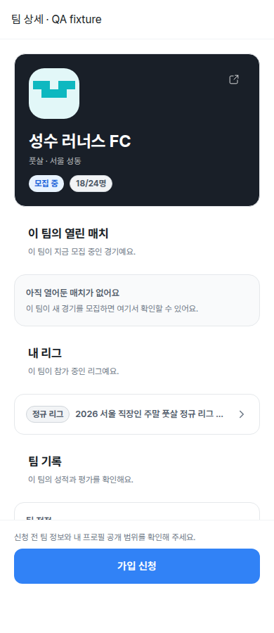
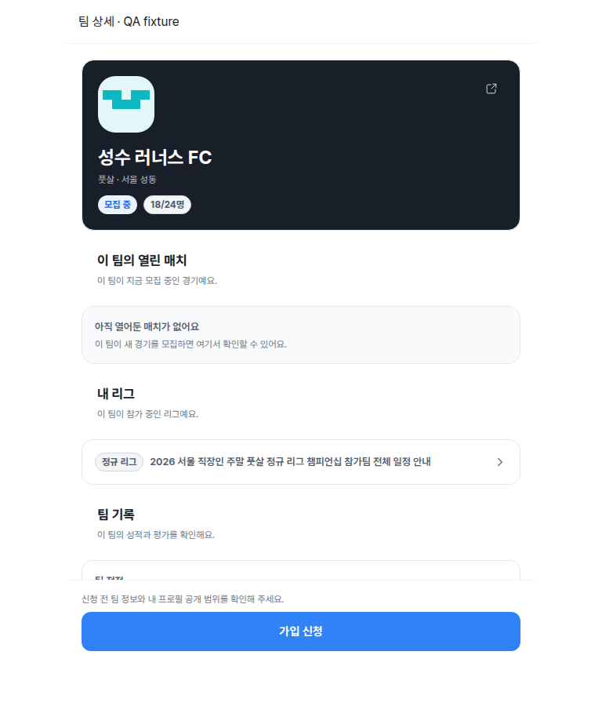
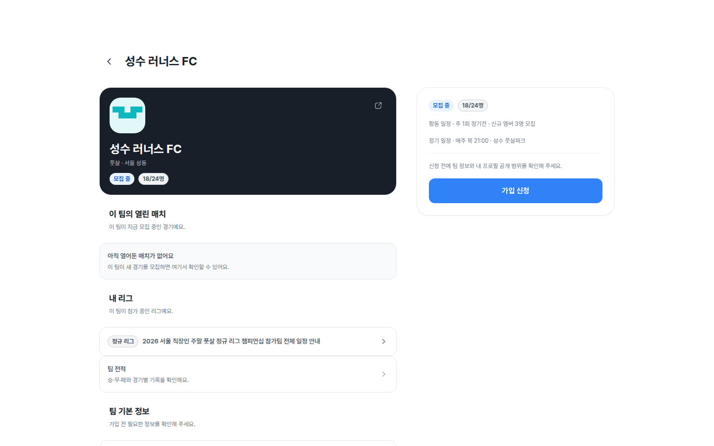

# 99 V1 Team Detail Unification

## Scope

- Frontend: `apps/v1_web`
- Backend contract cleanup: `apps/v1_api/src/teams/teams.service.ts` only if needed for dead route alignment
- Canonical routes:
  - Team detail: `/teams/[id]`
  - Team edit: `/teams/[id]/edit`
  - Team members: `/teams/[id]/members`

## Problem

`/teams/[id]` and `/my/teams/[id]` show different versions of the same team. My team cards route to a reduced my-team detail page, while the public team detail has fuller information. Owner/manager actions are split across my-team detail and members pages, and the API exposes `manageRoute: /teams/:id/manage` even though no v1 route exists there.

## Requirements

- `/teams/[id]` is the single full team detail surface for outsiders and members.
- `/my/teams` cards navigate to the canonical `/teams/[id]` detail.
- Owner/manager users see an operations menu on `/teams/[id]`.
- Member users see team detail and chat entry, without owner/manager operations.
- Outsiders keep join/request/withdraw/closed CTA behavior.
- `/my/teams/[id]` and `/my/teams/[id]/members` must not become separate competing detail surfaces.
- No dead `/teams/[id]/manage` links.

## Acceptance Criteria

- Given an outsider opens `/teams/[id]`, they see full team detail and a join-related CTA only.
- Given an owner or manager opens `/teams/[id]`, they see full team detail plus operations for edit and member management.
- Given a member opens `/teams/[id]`, they see full team detail and team chat entry but no edit/member-management operations.
- Given a user opens `/my/teams`, selecting a team lands on `/teams/[id]`.
- Given a direct visit to `/my/teams/[id]`, it redirects to `/teams/[id]`.
- Given a direct visit to `/my/teams/[id]/members`, it redirects to `/teams/[id]/members`.
- API/frontend links no longer point to `/teams/[id]/manage`.

## Validation

- `git diff --check`
- `pnpm --filter v1_web lint:patterns`
- Type/lint/build if local command resolution permits
- Browser smoke with owner/manager/member/outsider where local seed data allows:
  - `/my/teams`
  - `/teams/[id]`
  - `/my/teams/[id]`
  - `/my/teams/[id]/members`

## Progress Snapshot

- 2026-06-29: Implemented canonical `/teams/[id]` routing from `/my/teams`, added redirects from old my-team detail/member routes, added owner/manager operations on team detail, changed member/owner CTA to team chat, and aligned `manageRoute` away from dead `/teams/:id/manage`.

## 2026-09-07 Android 상세 레이아웃 후속 수정

- 사용자 범위: `/teams/:id` 안의 **내 리그** 목록 오른쪽 여백과 하단 가입 바에 의한 스크롤 가림. 별도 `/my/leagues` 수정이 아니다.
- 최신 `origin/dev` `fbd0c9470` 기반 `fix/android-team-detail-layout`, 작업 공간 `/tmp/teameet-task145`. 기존 공유 작업 폴더는 `992dba62f`의 오래된 브랜치여서 내 리그 코드가 없었다. 그 폴더의 초기 Task 145/스크롤 패치는 최종 배포본이 아니며 이 작업 공간의 diff가 정본이다.
- [x] 리그 목록의 암묵적 auto grid track을 `minmax(0, 1fr)`로 제한해 긴 제목이 본문 폭을 늘리지 않게 한다. 기존 말줄임과 리그 상세 링크 유지.
- [x] 모바일 CTA의 border-box를 ResizeObserver로 측정하고 본문 끝에 실제 높이 + 16px를 확보한다. 안내/오류 문구, 화면 폭, Android safe area 변경을 추적하고 unmount에서 해제한다.
- [x] 실제 `TeamDetailPageView`와 globals/tokens/desktop CSS를 사용하는 fixture harness를 headed Chromium에서 검증했다. 긴 한글 리그명 + native safe-bottom 48px + 가입 오류 안내가 조건이다. API transport와 Next navigation은 QA adapter를 사용했으므로 인증/API/실기기 E2E 통과를 의미하지 않는다.

| viewport | 리그 오른쪽 초과 before → after | 마지막 내용과 CTA 간격 before → after | verdict |
| --- | --- | --- | --- |
| 390 × 900 | 142.59px → 0px | -73.13px → 약 16px | PASS |
| 768 × 900 | 0px → 0px | -56.98px → 약 16px | PASS |
| 1440 × 900 | 0px → 0px | 데스크톱 사이드 CTA 유지 | PASS |

- 증거: `output/playwright/visual-audit/team-detail-layout/{before,after}-{390,768,1440}-league.png`, 모바일 `*-bottom.png`, `before.json`, `after.json`. before/after browser page errors 및 HTTP 오류 0. after는 오른쪽 차이 ≤1px, 하단 여유 ≥15px assertion을 적용한다.
- 캡처 harness: `/tmp/team-layout-qa.cjs`, `/tmp/team-layout-browser.cjs`. 앱 소스를 직접 bundle하며 API fixture를 실데이터로 저장하지 않는다. 서버와 브라우저는 각 실행의 finally에서 종료.
- 기존 `teams-page.test.tsx` 좁은 실행은 최신 dev의 `@tanstack/query-sync-storage-persister`가 기존 설치 의존성에 없어 수집 단계에서 막혔다(테스트 실패/통과 판정 전). 앞선 오래된 브랜치의 15 tests pass는 최신 코드 검증으로 재사용하지 않는다.
- scoped `git diff --check` 통과, touched source TODO/FIXME/HACK/XXX 없음, 새로운 runtime import 파일 없음. 커밋·배포하지 않았고 Android 실기기/실제 API 검증은 남아 있다.

### dev 반영 준비 (2026-09-07)

- 사용자 요청: dev에 반영. `git fetch origin dev` 후 `a7ea73dc6`까지 fast-forward; 대상 source와 충돌 없음.
- 별도 worktree에 frozen lockfile로 v1_web 의존성을 설치해 앞선 테스트 수집 blocker를 해소했다. 최신 source의 `teams-page.test.tsx`: **32 tests passed**. v1_web `tsc --noEmit` 통과.
- 아래 파일은 위 fixture 화면 검증의 canonical 증거다(실기기/실데이터 화면으로 오인하지 않는다).

| mobile 390 | tablet 768 | desktop 1440 |
| --- | --- | --- |
|  |  |  |

모바일 하단: [수정 전](../../docs/screenshots/team-detail-layout/before-390-bottom.png) → [수정 후](../../docs/screenshots/team-detail-layout/after-390-bottom.png). 같은 폴더에 모든 폭의 before/after 원본을 유지한다.
