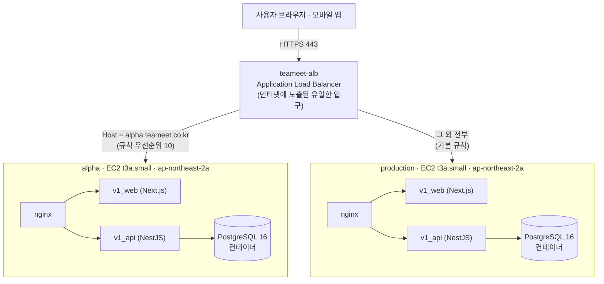
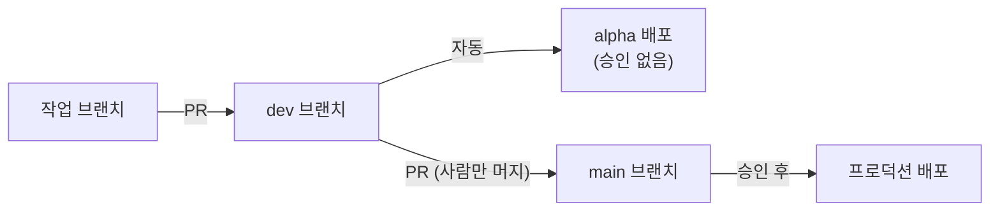
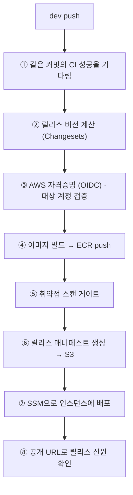
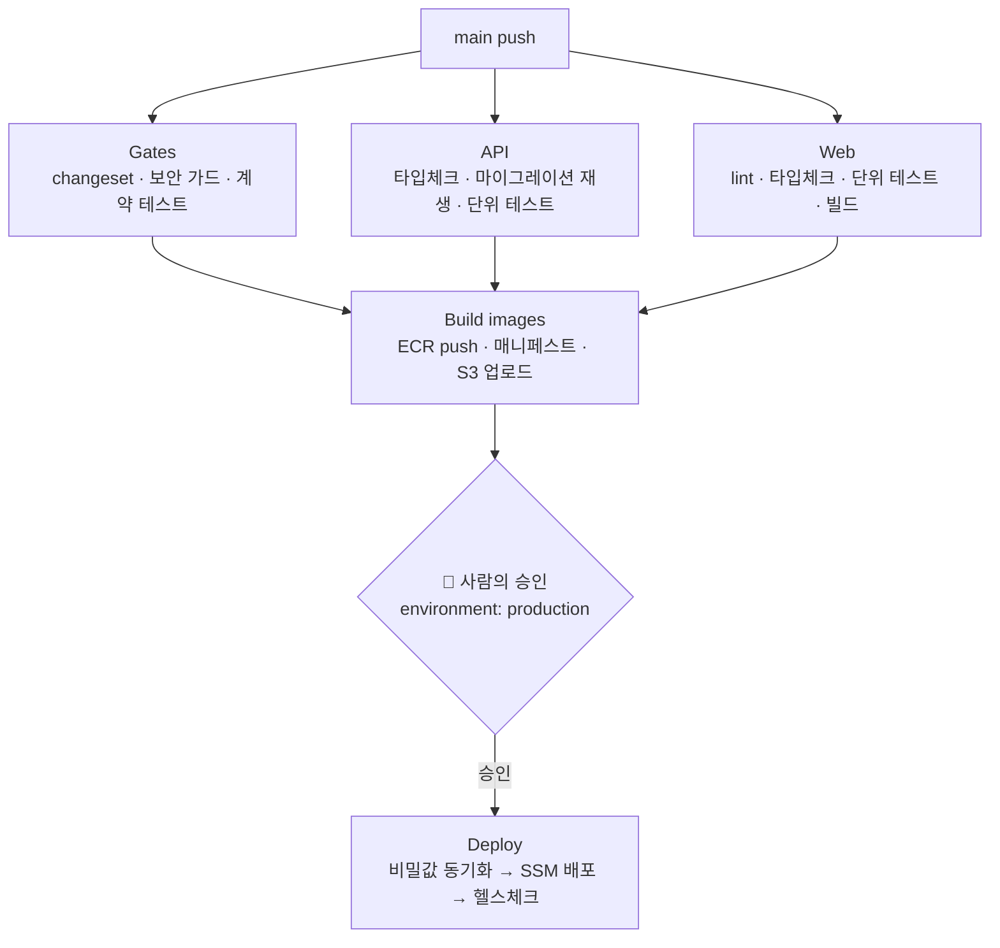

# Teameet

> 생활체육 동호인을 위한 멀티스포츠 소셜 매칭 플랫폼


풋살·농구·배드민턴·아이스하키 등 11개 생활체육 종목의 개인 매치와 팀 매칭을 지원하는 모바일 중심 소셜 플랫폼입니다. 레슨 수강권 거래, 스포츠 용품 장터, 실시간 채팅, 토스페이먼츠 결제를 통합 제공합니다.

---

## Screenshots

> Coming soon — 개발 중

---

## Features

### 매칭

| 기능 | 설명 |
|------|------|
| 개인 매치 모집 | 11개 종목, 레벨·성별·지역 필터로 참가자 모집 |
| 팀 대 팀 매칭 | 신청/승인 2단계 플로우, 쿼터별 스코어 기록 |
| 팀 신뢰 점수 | 매너·지각률·노쇼율·정보 일치도 4개 지표 |
| GPS 도착 인증 | 경기 당일 현장 위치 기반 도착 확인 |
| 상호 평가 | 매치 완료 후 스킬·매너 양방향 리뷰 |
| 팀 뱃지 시스템 | 매너왕·시간약속·정직한 팀 등 누적 성과 뱃지 |

### 소셜

| 기능 | 설명 |
|------|------|
| 팀 프로필 | SNS 연동, 홍보 영상, 활동 이력 통합 관리 |
| 실시간 채팅 | Socket.IO 기반 채팅, 읽음 처리, 타이핑 인디케이터 |
| 인앱 알림 | 매치·결제·레슨·팀 관련 실시간 알림 |
| FCM 푸시 알림 | 백그라운드 푸시 지원 (iOS / Android) |
| 용병 시스템 | 부족한 인원을 개인 플레이어로 채우는 매칭 |

### 커머스

| 기능 | 설명 |
|------|------|
| 레슨 / 수강권 | 코치 레슨 개설, 1회권·다회권·기간 무제한권 판매 |
| 출결 관리 | 정기 스케줄 및 회차별 체크인 관리 |
| 장터 (Marketplace) | 스포츠 용품 판매·대여·공동구매, 에스크로 결제 |
| 결제 | 토스페이먼츠 — 카드·토스페이·네이버페이·카카오페이·계좌이체 |
| 부분 환불 | 레슨·매치·장터 전 도메인 부분 환불 지원 |

### 관리

| 기능 | 설명 |
|------|------|
| 어드민 대시보드 | 사용자·팀·매치·레슨·장터 통합 관리 |
| 분쟁 처리 | 거래 분쟁 접수 및 중재 플로우 |
| 정산 관리 | 코치·판매자 정산 내역 및 지급 처리 |
| 통계 | 종목별·지역별·기간별 활동 통계 |

---

## Architecture

> 이 절은 **처음 합류한 개발자**가 읽는 것을 기준으로 씁니다. 낯선 용어는 처음 나올 때 뜻을
> 함께 적었습니다. 코드 구조는 [Project Structure](#project-structure), 인프라와 배포는
> 아래 [인프라 구조](#인프라-구조--무엇이-어디서-도는가)와
> [배포 파이프라인](#배포-파이프라인)을 보세요.

### 애플리케이션 구조

```
┌─────────────────────────────────────────────────────────┐
│                     Client Layer                        │
│   Next.js 15 (App Router)  ·  Capacitor 6 (iOS/Android) │
└───────────────────┬─────────────────────────────────────┘
                    │ REST (HTTPS)
                    ▼
┌─────────────────────────────────────────────────────────┐
│                    API Layer                            │
│              NestJS 11  ·  Socket.IO 4                  │
│   Auth  ·  Matches  ·  Teams  ·  Payments  ·  Chat      │
└──────────┬──────────────────────┬───────────────────────┘
           │                      │ Pub/Sub
           ▼                      ▼
┌──────────────────┐   ┌─────────────────────┐
│  PostgreSQL 16   │   │      Redis 7        │
│  (Prisma ORM)    │   │  Cache · Sessions   │
│                  │   │  Socket.IO Adapter  │
└──────────────────┘   └─────────────────────┘
```

```
Client (Next.js) ──→ API (NestJS) ──→ PostgreSQL
       │                    │
       └── Socket.IO ──────→ Redis Pub/Sub
```

---

### 인프라 구조 — 무엇이 어디서 도는가

살아 있는 환경은 **두 개**입니다. 둘은 서로 다른 EC2 인스턴스에서 돌지만, **로드밸런서는
하나를 나눠 씁니다.**

- **alpha** (`alpha.teameet.co.kr`) — `dev` 브랜치가 머지되면 자동으로 올라가는 검증용 환경
- **production** (`teameet.co.kr`) — 실제 사용자가 쓰는 환경. `main` 브랜치 + 사람의 승인이 필요



배포되는 스택(`deploy/docker-compose.prod.yml`)의 서비스는 **다섯 개**입니다.

| 서비스 | 역할 |
|---|---|
| `nginx` | 앞단에서 요청을 웹/API로 분배 |
| `v1_web` | Next.js 프론트엔드 (`apps/v1_web`) |
| `v1_api` | NestJS 백엔드 (`apps/v1_api`) |
| `v1_postgres` | PostgreSQL 16 |
| `v1_uploads_init` | 업로드 디렉터리 권한을 맞추고 종료하는 **1회성 초기화 컨테이너** |

> 📌 **헷갈리기 쉬운 점 1 — `apps/`에 앱이 네 벌 있습니다.**
> `apps/v1_api`·`apps/v1_web`이 **지금 배포되는 것**이고, `apps/api`·`apps/web`은 이전 세대
> 코드입니다. 위쪽 [애플리케이션 구조](#애플리케이션-구조) 다이어그램은 이전 세대 기준이라
> Redis와 Socket.IO가 나오지만, **현재 배포 스택에는 Redis가 없습니다.**

> 📌 **헷갈리기 쉬운 점 2 — 프로덕션 인스턴스에는 컨테이너가 8개 떠 있습니다.**
> 그중 `teameet_web`·`teameet_api`·`teameet_postgres`·`teameet_redis` 네 개는
> **2026-07에 아카이빙된 이전 세대 스택**이 아직 정리되지 않고 남아 있는 것입니다.
> 실제 서비스는 `teameet_nginx`·`teameet_v1_web`·`teameet_v1_api`·`teameet_v1_postgres`
> 네 개가 담당합니다.

**로드밸런서(ALB)** 는 들어온 요청을 어느 서버로 보낼지 정하는 교통정리 담당입니다. 여기서는
요청에 붙은 **호스트 이름**을 보고 나눕니다 — `alpha.teameet.co.kr`이면 alpha 인스턴스로,
나머지는 프로덕션으로 보냅니다. 80(HTTP) 리스너는 443(HTTPS)으로 리다이렉트만 합니다.

두 환경 모두 **애플리케이션은 Docker 컨테이너로** 돌고, 각 인스턴스 안의 **nginx 컨테이너가
앞단**에서 웹(Next.js)과 API(NestJS)로 나눠 보냅니다.

#### 두 환경 비교

| | alpha | production |
|---|---|---|
| 도메인 | `alpha.teameet.co.kr` | `teameet.co.kr` |
| 인스턴스 | `teameet-alpha-dev` · t3a.small | `matchup-production` · t3a.small |
| 가용영역 | ap-northeast-2a | ap-northeast-2a |
| 보안그룹 | `teameet-alpha-sg` | `matchup-sg` (인바운드 **80/443만**) |
| 컨테이너 이미지 저장소 | `teameet-alpha-v1-{api,web}` | `teameet-prod-v1-{api,web}` |
| 배포 소스 버킷 | `teameet-alpha-deploy-…` | `teameet-prod-deploy-…` |
| DB 백업 | 없음 | `teameet-prod-backups-…` (일 1회) |
| 런타임 비밀값 | 인스턴스의 `.env` (운영자가 직접 관리) | GitHub Secrets → **Parameter Store** → `.env` (배포마다 갱신) |
| 배포 승인 | 없음 (자동) | **필요** (`environment: production`) |
| 트리거 | `dev` 브랜치 push | `main` 브랜치 push |

> ⚠️ **알아둘 차이**: 두 인스턴스는 같은 코드를 돌리지만 **호스트 환경이 미묘하게 다릅니다.**
> 실제로 alpha에는 Docker Compose 플러그인이 있고 프로덕션에는 없어서, alpha에서 멀쩡히
> 통과한 배포 스크립트가 프로덕션에서 처음 실행될 때 깨진 사고가 있었습니다.
> **"alpha에서 됐으니 프로덕션도 된다"는 보장이 아닙니다.**

#### 데이터베이스는 아직 인스턴스 안에 있습니다

`PostgreSQL`은 관리형 서비스(RDS)가 아니라 **EC2 안의 컨테이너**로 돕니다. 데이터는 Docker
볼륨(`deploy_v1_postgres_data`)에 저장됩니다.

백업 구성과 복구 절차는 [`docs/ops/prod-backup.md`](docs/ops/prod-backup.md)에 있습니다.
DB를 인스턴스 밖(RDS)으로 옮기는 계획은 `docs/ops/rds-migration-design.md`에 정리돼 있습니다.

프로덕션 DB는 매일 두 겹으로 백업됩니다 — **논리 덤프**(02:30 KST, S3, 30일 보관)와
**볼륨 스냅샷**(03:00 KST, 7일 보관). alpha에는 백업이 없습니다(검증용 환경이므로 의도된 것).

---

### 배포 파이프라인

두 환경의 파이프라인은 **모양이 다릅니다.** alpha는 빠르게, 프로덕션은 여러 관문을 거칩니다.

#### 전체 흐름 — 코드가 사용자에게 닿기까지



**작업은 항상 `dev`에서 시작합니다.** `dev → main` 승격은 **사람이 GitHub에서 직접 머지**하는
것이 유일한 경로입니다 — 자동으로 승격하는 워크플로는 없습니다.

#### alpha 파이프라인 (`deploy-alpha.yml`)

`dev`에 push되면 **job 하나**가 처음부터 끝까지 담당합니다.



①이 중요합니다 — alpha 워크플로는 **같은 커밋에 대한 CI(`deploy.yml`)가 성공할 때까지
기다립니다.** 테스트가 깨진 코드가 alpha에 올라가지 않게 하는 장치입니다.

#### 프로덕션 파이프라인 (`deploy.yml`)

`main`에 push되면 **5개 job**이 순서대로 돕니다.



`Gates` · `API` · `Web` 세 개는 **동시에** 돌고, 셋 다 통과해야 `Build images`로 넘어갑니다.
그리고 **`Deploy` 앞에는 사람이 눌러야 하는 승인 버튼**이 있습니다. 승인 전까지 프로덕션은
전혀 바뀌지 않습니다.

`Deploy` job이 하는 일은 네 단계입니다.

| 스텝 | 하는 일 |
|---|---|
| `Sync runtime env` | GitHub Secrets를 **Parameter Store**(암호화 저장소)에 올리고, 인스턴스가 그걸 받아 `.env`를 다시 만듭니다 |
| `Run deploy-prod.sh` | S3에서 소스를 내려받아 해시를 대조하고, 새 컨테이너로 교체합니다 |
| `Health check` | 인스턴스 내부 + **공개 URL**에서 응답 헤더의 커밋 SHA가 방금 배포한 것과 같은지 확인합니다 |

> 💡 왜 비밀값을 Parameter Store를 거쳐 보낼까요? 인스턴스에 명령을 보내는 SSM은 **명령
> 내용이 감사 로그(CloudTrail)에 남습니다.** 비밀번호를 명령에 직접 실으면 그대로 기록되므로,
> 값은 암호화 저장소에 두고 명령에는 **경로만** 실어 보냅니다.

#### 안전장치 — 왜 이렇게 복잡한가

| 장치 | 막는 사고 |
|---|---|
| **불변 이미지 태그** (ECR `IMMUTABLE`) | 같은 태그로 다른 이미지를 덮어쓰는 것. 한 번 배포된 이미지는 내용이 바뀌지 않습니다 |
| **다이제스트 고정** | 태그가 아니라 `sha256:…` 다이제스트로 배포 — "어제의 `latest`"와 "오늘의 `latest`"가 다른 문제를 없앱니다 |
| **S3 + sha256 대조** | 전송 중 손상되거나 바꿔치기된 소스로 배포되는 것 |
| **SSM (SSH 아님)** | 서버에 접속 포트를 열어 두는 것. 단기 자격증명만 쓰고 인바운드 포트가 필요 없습니다 |
| **승인 게이트** (프로덕션만) | 머지가 곧바로 실사용자에게 나가는 것 |
| **롤백 CAS** | 되돌리는 사이 다른 배포가 끼어드는 것 (되돌리기 전 현재 SHA를 입력해 대조) |
| **changeset 게이트** | 무엇이 바뀌었는지 기록 없이 릴리스되는 것 |

#### 되돌리기 (롤백)

`rollback-alpha.yml` · `rollback-prod.yml`을 **수동 실행**합니다. 실행할 때 **지금 돌고 있다고
알고 있는 커밋 SHA**를 입력해야 하며, 실제와 다르면 거부됩니다.

되돌릴 대상은 인스턴스에 기록된 **직전 릴리스**입니다. 따라서 **성공한 배포가 2회 이상 쌓여야**
롤백이 가능합니다(첫 배포 직후에는 되돌아갈 기준점이 없습니다).

#### 워크플로 한눈에 보기

| 파일 | 언제 도는가 | 무엇을 하는가 |
|---|---|---|
| `deploy.yml` | `main`/`dev` push, PR, 수동 | 검증(Gates·API·Web) + **`main`일 때만** 빌드·배포 |
| `deploy-alpha.yml` | `dev` push, 수동 | alpha 빌드 + 배포 |
| `rollback-alpha.yml` | 수동 | alpha를 직전 릴리스로 되돌리기 |
| `rollback-prod.yml` | 수동 | 프로덕션을 직전 릴리스로 되돌리기 |
| `release-main.yml` | 수동 | 검증된 alpha 버전을 기준으로 승격 PR 생성 |

---

## Tech Stack

| 분류 | 기술 | 버전 | 역할 |
|------|------|------|------|
| **Frontend** |  Next.js | 15.x | App Router, SSR/SSG |
| **Frontend** |  React | 19.x | UI 라이브러리 |
| **Frontend** |  Tailwind CSS | 4.x | 유틸리티 CSS |
| **Frontend** | TanStack Query | 5.x | 서버 상태 관리, 캐싱 |
| **Frontend** | Zustand | 5.x | 클라이언트 상태 관리 |
| **Frontend** | next-intl | 4.x | 국제화 (ko / en) |
| **Mobile** |  Capacitor | 6.x | iOS / Android 래핑 |
| **Backend** |  NestJS | 11.x | REST API, Socket.IO |
| **Backend** |  TypeScript | 5.7.x | 타입 안전 개발 |
| **ORM** |  Prisma | 6.x | DB 스키마, 마이그레이션 |
| **Database** |  PostgreSQL | 16 | 주 데이터베이스 |
| **Cache** |  Redis | 7 | 세션, 캐시, Socket 어댑터 |
| **Auth** | JWT + OAuth | — | 카카오 / 네이버 / 애플 |
| **Payment** | 토스페이먼츠 | — | 결제, 환불, 정산 |
| **Monorepo** | pnpm + Turborepo | pnpm 9.x | 워크스페이스 빌드 |
| **Testing** | Vitest / Jest / Playwright | — | 단위 · E2E 테스트 |
| **Deploy** | Docker + Nginx | — | 컨테이너 배포 |

---

## Project Structure

```
sports-platform/
├── apps/
│   ├── web/                        # Next.js 프론트엔드 (포트 3003)
│   │   └── src/
│   │       ├── app/
│   │       │   ├── (auth)/         # 로그인, 온보딩
│   │       │   ├── (main)/         # 홈, 매치, 팀, 레슨, 장터, 채팅 등
│   │       │   ├── admin/          # 어드민 패널 (보호된 라우트)
│   │       │   ├── landing/        # 랜딩 페이지
│   │       │   └── layout.tsx      # 루트 레이아웃 (폰트, 다크모드, i18n)
│   │       ├── components/
│   │       │   ├── ui/             # 공유 UI (EmptyState, Modal, Toast 등)
│   │       │   ├── layout/         # Sidebar, BottomNav, Footer
│   │       │   ├── form/           # 공유 폼 컴포넌트
│   │       │   └── landing/        # 랜딩 전용 컴포넌트
│   │       ├── hooks/              # 커스텀 훅 (인증, 무한스크롤 등)
│   │       ├── lib/
│   │       │   ├── utils.ts        # 날짜·금액 포맷터, 공통 유틸
│   │       │   ├── constants.ts    # 종목 색상, 아이콘, 공통 상수
│   │       │   └── api/            # API 클라이언트 (Axios 래핑)
│   │       ├── stores/             # Zustand 스토어 (auth, notification)
│   │       └── types/              # TypeScript 공통 타입 정의
│   │
│   └── api/                        # NestJS 백엔드 (포트 8111)
│       ├── src/
│       │   ├── auth/               # JWT, OAuth (카카오·네이버·애플)
│       │   ├── users/              # 사용자 프로필, 스포츠 프로필
│       │   ├── matches/            # 개인 매치 CRUD, 참가, 팀 구성
│       │   ├── team-matches/       # 팀 매치 신청·승인·스코어·평가
│       │   ├── teams/              # 팀 프로필, 멤버 관리
│       │   ├── lessons/            # 레슨 개설, 수강권, 출결
│       │   ├── marketplace/        # 장터 상품, 주문, 에스크로
│       │   ├── venues/             # 구장 정보, 리뷰
│       │   ├── payments/           # 토스페이먼츠 연동, 환불
│       │   ├── chat/               # 채팅방, 메시지
│       │   ├── notifications/      # 인앱 알림, FCM
│       │   ├── reviews/            # 매치·구장 리뷰
│       │   ├── disputes/           # 분쟁 접수·처리
│       │   ├── settlements/        # 정산 관리
│       │   ├── mercenary/          # 용병 매칭
│       │   ├── badges/             # 팀 뱃지
│       │   ├── realtime/           # Socket.IO Gateway
│       │   ├── admin/              # 어드민 전용 API
│       │   └── common/             # 필터, 인터셉터, 데코레이터
│       └── prisma/
│           ├── schema.prisma       # DB 스키마 (42개 모델)
│           ├── seed.ts             # 초기 데이터 시드 (destructive full seed)
│           ├── seed-mocks.ts       # idempotent dev mock sync
│           └── mock-data-catalog.ts # canonical dev mock dataset
│
├── e2e/                            # Playwright E2E 테스트
├── scripts/
│   ├── qa/                         # 수동 QA/감사 보조 스크립트
│   └── docs/                       # 문서용 스크린샷 캡처 스크립트
├── deploy/                         # Dockerfile, Nginx 설정, EC2 스크립트
├── docs/
│   ├── screenshots/                # 문서에 참조되는 canonical 스크린샷
│   ├── reference/                  # 버전 관리되는 시각 레퍼런스
│   └── plans/                      # 실행/정리 계획 문서
├── docker-compose.yml              # 로컬 개발 (PostgreSQL + Redis)
├── turbo.json                      # Turborepo 파이프라인
└── pnpm-workspace.yaml
```

---

## Getting Started

### Prerequisites

- **Node.js** >= 22
- **pnpm** >= 9
- **Docker** + Docker Compose

### Installation

```bash
# 저장소 클론
git clone https://github.com/your-org/sports-platform.git
cd sports-platform

# 의존성 설치
pnpm install
```

### Environment Variables

환경변수 파일을 준비합니다.

```bash
cp apps/api/.env.example apps/api/.env
cp apps/web/.env.example apps/web/.env.local
```

## AutoQA

`.autoqa/` oracle과 ledgers를 기준으로 실제 브라우저/DB 시나리오를 돌리는 repo-local operator가 포함돼 있습니다.

기본 흐름:

```bash
pnpm autoqa
```

이 커맨드는 다음 순서로 동작합니다.

1. `.autoqa` scaffold / preflight 확인
2. scenario docs + scope-freeze refresh
3. heartbeat/background 가능 여부 판단
4. 현재 Codex host에서 automation이 없으면 즉시 foreground cycle로 fallback
5. cron-friendly wrapper / crontab example도 함께 갱신

주요 명령:

```bash
pnpm autoqa
pnpm autoqa:status
pnpm autoqa:scenarios
pnpm autoqa:cycle
pnpm autoqa:cron
pnpm autoqa:cron:install
pnpm autoqa:cron:status

make autoqa
make autoqa-status
make autoqa-scenarios
make autoqa-cycle
make autoqa-cron
make autoqa-cron-install
make autoqa-cron-status
```

foreground fallback이 중요한 저장소라서, background unavailable일 때는 fake dispatch로 멈추지 않고 `.autoqa/status.md`에 fallback reason을 기록한 뒤 현재 세션에서 cycle을 계속 진행합니다. 장기 반복 실행이 필요하면 `pnpm autoqa:cron:install` 또는 `make autoqa-cron-install` 로 managed cron entry를 바로 설치할 수 있고, 기본 cadence는 30분마다 한 번입니다.

#### Backend (`apps/api/.env`)

| Variable | Description | Required |
|----------|-------------|----------|
| `DATABASE_URL` | PostgreSQL 연결 문자열 | Yes |
| `REDIS_URL` | Redis 연결 문자열 | Yes |
| `JWT_SECRET` | JWT Access Token 서명 키 | Yes |
| `JWT_REFRESH_SECRET` | JWT Refresh Token 서명 키 | Yes |
| `KAKAO_CLIENT_ID` | 카카오 OAuth 앱 키 | Yes |
| `KAKAO_CLIENT_SECRET` | 카카오 OAuth 시크릿 | Yes |
| `NAVER_CLIENT_ID` | 네이버 OAuth 앱 키 | Yes |
| `NAVER_CLIENT_SECRET` | 네이버 OAuth 시크릿 | Yes |
| `TOSS_SECRET_KEY` | 토스페이먼츠 시크릿 키, 없으면 mock mode | No |
| `TOSS_CLIENT_KEY` | 토스페이먼츠 클라이언트 키, 없으면 mock widget | No |
| `FCM_SERVICE_ACCOUNT` | Firebase 서비스 계정 JSON | No |
| `API_PORT` | 서버 포트 (기본값: 8111) | No |

#### Frontend (`apps/web/.env.local`)

| Variable | Description | Required |
|----------|-------------|----------|
| `NEXT_PUBLIC_API_URL` | 백엔드 API 주소 | Yes |
| `NEXT_PUBLIC_SOCKET_URL` | Socket.IO 서버 주소 | Yes |
| `NEXT_PUBLIC_TOSS_CLIENT_KEY` | 토스페이먼츠 클라이언트 키, 없으면 mock widget | No |
| `NEXT_PUBLIC_KAKAO_MAP_KEY` | 카카오맵 JavaScript 키 | No |

### Start Development

```bash
# 1. 전체 개발 스택 실행 (Docker Compose)
make up

# 2. DB 스키마 반영
make db-push

# 3. 화면 검증용 canonical mock 데이터 동기화 (권장)
make db-seed-mocks

# 4. 초기 데이터 전체 재시드가 필요할 때만
make db-seed

# 5. 이미지 데이터만 안전하게 보강
make db-seed-images

# 6. 로그와 함께 붙어서 실행하려면
make dev
```

`make db-seed-mocks` / `pnpm db:seed:mocks`는 기존 dev DB를 지우지 않고 canonical mock users / teams / matches / lessons / listings / mercenary posts / team matches를 upsert합니다. `make db-seed`는 baseline seed를 다시 넣는 destructive full seed이고, `make db-seed-images`는 비어 있는 이미지 slot만 보강합니다.

Docker dev runtime notes:
- `make dev-web`는 `deps + web`를 함께 다시 올리는 공식 복구 경로입니다. `docker compose restart web`만으로는 node_modules bootstrap과 `.next` reset이 보장되지 않습니다.
- shared Docker dev stack은 `apps/web/.next`를 stack-local volume으로 격리합니다. host에서 `pnpm --filter web build`를 돌려도 container web의 dev artifact를 더 이상 직접 덮어쓰지 않습니다.
- `docker compose ps`상 `web`가 정상인데 브라우저 `localhost:3003`만 500이면 host-side `pnpm --filter web dev` / `next dev`가 같은 포트를 점유했는지 `lsof -nP -iTCP:3003 -sTCP:LISTEN`로 먼저 확인합니다.

| 서비스 | URL |
|--------|-----|
| Frontend | http://localhost:3003 |
| Backend API | http://localhost:8111 |
| Swagger 문서 | http://localhost:8111/docs |
| Prisma Studio | http://localhost:5555 (별도 실행) |

---

## Development

### 전체 명령어

```bash
make dev             # 전체 개발 스택 실행 (attached logs)
make up              # 전체 개발 스택 실행 (detached)
make stop            # 컨테이너 중지
make down            # 컨테이너 제거

pnpm build           # 전체 프로덕션 빌드
pnpm lint            # 전체 린트 검사
pnpm clean           # 빌드 캐시 및 .next 정리
pnpm qa:manual:routes
pnpm qa:manual:ui-gaps
pnpm qa:visual:audit:manifest
pnpm qa:visual:audit:capture
pnpm docs:screenshots:overview
pnpm docs:screenshots:app

make db-push         # Prisma 스키마 → DB 즉시 반영 (dev)
make db-bootstrap-deploy # deploy bootstrap 로직 검증 (empty DB fallback 포함)
make db-migrate      # Prisma 마이그레이션 생성 및 적용
make db-seed-mocks   # canonical mock 데이터만 idempotent sync
make db-seed-mocks-deploy # deploy checksum gate와 동일한 조건으로 mock sync
make db-seed         # 초기 데이터 시드 (destructive full seed)
make db-seed-images  # 이미지 데이터만 안전하게 보강

pnpm db:bootstrap:deploy # 루트에서 deploy DB bootstrap 실행
pnpm db:seed:mocks   # 루트에서 api mock sync 실행
pnpm db:seed:mocks:deploy # 루트에서 deploy checksum gate mock sync 실행
```

### V1 database operations

Use these commands for `apps/v1_api`; do not use legacy `apps/api` DB commands for v1 production data.

```bash
pnpm v1:db:generate
pnpm v1:db:migrate
pnpm v1:db:seed          # base reference data only
pnpm v1:db:seed:demo     # explicit demo personas/data
pnpm v1:db:seed:all      # demo plus coverage data
pnpm v1:db:cleanup:demo  # dry-run counts for 00000000/@teameet.v1 demo cleanup
```

`demo`/`coverage`/`all` seed modes require `V1_HOST_ADMIN_PASSWORD` (8+ chars) set in `apps/v1_api/.env` — used as the `host@teameet.v1` account password. Seeding fails fast without it.

Actual v1 demo cleanup requires a backup, count review, and explicit execution:

```bash
pnpm --filter v1_api db:cleanup:demo -- --execute --confirm=delete-v1-demo-data
```

### 개별 앱

```bash
# Frontend
cd apps/web
pnpm dev             # Next.js dev server (포트 3003, 로컬 직접 실행 시)
pnpm build           # 프로덕션 빌드
pnpm test            # Vitest 단위 테스트
pnpm test:watch      # 와치 모드

# Backend
cd apps/api
pnpm dev             # NestJS watch mode (포트 8111, 로컬 직접 실행 시)
pnpm build           # 프로덕션 빌드
pnpm test            # Jest 단위 테스트
pnpm test:cov        # 커버리지 리포트 포함
```

### 저장소 위생 규칙

- 루트에는 앱 엔트리와 설정 파일만 둡니다. 일회성 QA 도구는 `scripts/qa/`, 문서 캡처 도구는 `scripts/docs/`에 둡니다.
- 문서에서 참조하는 스크린샷은 `docs/screenshots/`를 canonical 경로로 사용합니다.
- 디자인/기획용 버전 관리 레퍼런스 이미지는 `docs/reference/`에 둡니다.
- 전수 시각 감사 raw artifact는 `output/playwright/visual-audit/` 아래에만 둡니다. 검토 후 canonical로 승격된 결과만 `docs/screenshots/`로 이동합니다.
- 로컬 산출물과 캐시는 `playwright-report/`, `test-results/`, `.playwright-mcp/`, `.pnpm-store/`, `tmp/`, `ec2-info`처럼 git ignore 대상에만 둡니다.

---

## API Reference

<details>
<summary>주요 API 엔드포인트 보기</summary>

전체 API 문서는 개발 서버 실행 후 `http://localhost:8111/docs` (Swagger UI)에서 확인할 수 있습니다.

#### Auth — `/api/v1/auth`

| Method | Path | Description |
|--------|------|-------------|
| `POST` | `/register` | 이메일 회원가입 |
| `POST` | `/login` | 이메일 로그인 |
| `POST` | `/kakao` | 카카오 OAuth 로그인 |
| `POST` | `/naver` | 네이버 OAuth 로그인 |
| `POST` | `/apple` | 애플 로그인 |
| `POST` | `/refresh` | Access Token 갱신 |
| `GET` | `/me` | 현재 인증 사용자 정보 |
| `DELETE` | `/withdraw` | 회원 탈퇴 |

#### Matches — `/api/v1/matches`

| Method | Path | Description |
|--------|------|-------------|
| `GET` | `/` | 매치 목록 (필터: 종목·지역·레벨·날짜) |
| `GET` | `/recommended` | 추천 매치 (프로필 기반) |
| `POST` | `/` | 매치 생성 |
| `GET` | `/:id` | 매치 상세 |
| `POST` | `/:id/join` | 매치 참가 |
| `DELETE` | `/:id/leave` | 매치 참가 취소 |
| `POST` | `/:id/teams` | 팀 구성 |
| `POST` | `/:id/complete` | 매치 종료 처리 |

#### Teams — `/api/v1/teams`

| Method | Path | Description |
|--------|------|-------------|
| `GET` | `/` | 팀 목록 검색 |
| `POST` | `/` | 팀 생성 |
| `GET` | `/:id` | 팀 상세 및 신뢰 점수 |

#### Users — `/api/v1/users`

| Method | Path | Description |
|--------|------|-------------|
| `GET` | `/me` | 내 프로필 |
| `PATCH` | `/me` | 내 프로필 수정 |
| `GET` | `/me/matches` | 내 매치 이력 |
| `GET` | `/:id` | 타 사용자 프로필 |

#### Payments — `/api/v1/payments`

| Method | Path | Description |
|--------|------|-------------|
| `POST` | `/prepare` | 결제 준비 (토스페이먼츠 주문 생성) |
| `POST` | `/confirm` | 결제 승인 |
| `POST` | `/:id/refund` | 결제 환불 (부분 환불 지원) |
| `GET` | `/me` | 내 결제 내역 |

#### 기타 도메인

| 도메인 | Base Path |
|--------|-----------|
| 팀 매칭 | `/api/v1/team-matches` |
| 레슨 | `/api/v1/lessons` |
| 장터 | `/api/v1/marketplace` |
| 구장 | `/api/v1/venues` |
| 채팅 | `/api/v1/chat` |
| 알림 | `/api/v1/notifications` |
| 리뷰 | `/api/v1/reviews` |
| 용병 | `/api/v1/mercenary` |

</details>

### API 규약

- **Base URL**: `/api/v1/*`
- **응답 형식**: `{ status: string, data: T, timestamp: string }`
- **에러 코드**: `DOMAIN_ERROR_CODE` 형태 (예: `MATCH_NOT_FOUND`, `PAYMENT_FAILED`)
- **페이지네이션**: Cursor 기반 — `cursor`, `limit` 파라미터

### 인증 플로우

1. 소셜 로그인 (카카오·네이버·애플) 또는 이메일 로그인
2. 서버에서 **JWT Access Token + Refresh Token** 발급
3. Access Token: `Authorization: Bearer <token>` 헤더
4. Refresh Token: HTTP-only 쿠키 (자동 갱신)

---

## Database

Prisma + PostgreSQL 16 기반. 주요 모델 42개.

- `make db-seed`: destructive full seed. 주요 테이블을 baseline sample data로 다시 채웁니다.
- `make db-seed-mocks`: unrelated dev/E2E 데이터는 유지한 채 canonical mock dataset만 upsert합니다.
- `make db-seed-images`: records를 지우지 않고 local `public/mock/` 기반 이미지 필드만 보강합니다.

<details>
<summary>전체 모델 목록 보기</summary>

| 모델 | 설명 |
|------|------|
| `User` | 사용자 계정, OAuth 정보, 위치, 매너 점수 |
| `UserSportProfile` | 종목별 레벨, ELO 레이팅, 포지션 |
| `Match` | 개인 매치 (모집·진행·완료) |
| `MatchParticipant` | 매치 참가 내역 |
| `Team` | 매치 내 팀 구성 |
| `Review` | 매치 참가자 간 상호 평가 |
| `Payment` | 토스페이먼츠 결제 내역 |
| `Notification` | 인앱 알림 |
| `Venue` | 구장 정보 (위치, 시설, 운영시간) |
| `VenueReview` | 구장 리뷰 |
| `SportTeam` | 팀 / 클럽 프로필 |
| `TeamMatch` | 팀 대 팀 매치 |
| `TeamMatchApplication` | 팀 매치 신청·승인 |
| `ArrivalCheck` | GPS 기반 도착 인증 |
| `MatchEvaluation` | 팀 매치 후 상호 평가 (6개 항목) |
| `TeamTrustScore` | 팀 신뢰 점수 집계 |
| `Badge` | 팀 뱃지 |
| `Lesson` | 레슨 개설 (반복 일정 포함) |
| `LessonTicketPlan` | 수강권 플랜 (1회권·다회권·기간권) |
| `LessonTicket` | 사용자 보유 수강권 |
| `LessonSchedule` | 레슨 회차별 일정 |
| `LessonAttendance` | 회차별 출결 |
| `MarketplaceListing` | 장터 상품 (판매·대여·공동구매) |
| `MarketplaceOrder` | 장터 주문 (에스크로 상태 관리) |
| `MarketplaceReview` | 거래 후 판매자 리뷰 |
| `Favorite` | 즐겨찾기 (매치·팀·구장·상품) |

</details>

**지원 종목 (11개)**: 축구 · 풋살 · 농구 · 배드민턴 · 아이스하키 · 피겨스케이팅 · 쇼트트랙 · 수영 · 테니스 · 야구 · 배구

---

## Testing

```bash
# Frontend 단위 테스트 (Vitest + jsdom)
cd apps/web && pnpm test

# Backend 단위 테스트 (Jest)
cd apps/api && pnpm test

# Backend 커버리지 리포트
cd apps/api && pnpm test:cov

# E2E 테스트 전체 실행 (shared dev stack, single active runner only)
make dev
make test-e2e

# 특정 스펙만 실행
npx playwright test e2e/home.spec.ts

# UI 모드로 실행 (디버깅용)
npx playwright test --ui

# Isolated Playwright runtime 기동
make e2e-isolated-up RUN=NotifSmoke

# Isolated runtime에 특정 스펙 실행
make test-e2e-isolated-spec RUN=NotifSmoke SPEC=e2e/tests/notification-center.spec.ts PROJECT="Desktop Chrome"

# Isolated runtime 정리
make e2e-isolated-down RUN=NotifSmoke
```

- shared `make dev` 흐름은 여전히 single active Playwright runner 계약이다.
- 두 개 이상의 local runner가 필요하면 isolated targets만 사용한다. `RUN`은 lowercase compose project name으로 정규화되며, run별 web/api port, auth dir, stack-local `.next` volume이 분리된다.
- 상세 실행 절차와 병렬 실행 예시는 [docs/PLAYWRIGHT_E2E_RUNBOOK.md](./docs/PLAYWRIGHT_E2E_RUNBOOK.md)를 기준으로 본다.

**E2E 테스트 커버 영역**

| 영역 | 항목 수 |
|------|---------|
| 홈 / 네비게이션 렌더링 | 8 |
| 매치 목록·상세·생성 | 6 |
| 팀·레슨·장터 페이지 | 9 |
| 다크모드 렌더링 | 8 |
| 반응형 레이아웃 (375px / 768px / 1280px) | 7 |
| 접근성 (터치 타겟, ARIA) | 4 |
| **합계** | **125** |

---

## Deployment

```bash
# Frontend 이미지 빌드
docker build \
  -f deploy/Dockerfile.web \
  --build-arg NEXT_PUBLIC_API_URL=/api/v1 \
  --build-arg NEXT_PUBLIC_TOSS_CLIENT_KEY="${TOSS_CLIENT_KEY:-}" \
  --build-arg INTERNAL_API_ORIGIN="${INTERNAL_API_ORIGIN:-http://api:8100}" \
  -t teameet-web .

# Backend 이미지 빌드
docker build -f deploy/Dockerfile.api -t teameet-api .

# 프로덕션 전체 실행
docker-compose -f deploy/docker-compose.prod.yml --env-file deploy/.env up -d
# Docker Compose plugin이 설치된 환경에서는 `docker compose ...`도 사용 가능
```

- Nginx 리버스 프록시로 Frontend(3000) / Backend(8100) 라우팅
- GitHub Actions는 코드를 EC2 `~/teameet`에 `rsync`한 뒤 이미지 빌드, `prisma/bootstrap-deploy-db.ts`로 DB bootstrap/migration을 적용하고, checksum-gated `prisma/seed-mocks.ts --checksum-gate`, `prisma/seed-images.ts`를 수행
- 프로덕션 배포는 `DB_PASSWORD`, `JWT_SECRET`만 필수이며, `TOSS_*`가 비어 있으면 결제 기능만 mock mode로 동작한다
- `DEPLOY_SYNC_MOCK_DATA`는 기본 `true`이며, 정확히 `false`일 때만 deploy mock sync를 끈다
- 신규/빈 운영 DB는 `bootstrap-deploy-db.ts`가 `db push + migrate resolve`로 현재 schema를 먼저 고정하고, 기존 운영 DB는 계속 `migrate deploy` 경로를 사용한다
- 운영 EC2 SSH 계정 기준은 `ec2-user`다
- SSL 종료는 Nginx 레이어에서 처리
- EC2 초기 설정: `deploy/setup-ec2.sh` 참고

---

## Contributing

### 브랜치 네이밍

```
feat/short-description    # 신규 기능
fix/short-description     # 버그 수정
docs/short-description    # 문서 변경
infra/short-description   # 인프라·빌드 설정
```

### 커밋 메시지

```
type: short one-line summary
```

영어·소문자·imperative mood 사용 (예: `add`, `fix`, `remove`).

| Type | 사용 시점 |
|------|-----------|
| `feat` | 새 기능 추가 |
| `fix` | 버그 수정 |
| `refactor` | 동작 변경 없는 코드 구조 개선 |
| `docs` | 문서만 수정 |
| `test` | 테스트 추가 / 수정 |
| `chore` | 빌드, CI, 도구 설정 변경 |
| `infra` | 인프라 변경 |

**예시**
```
feat: add team arrival check with gps verification
fix: prevent double submission on payment form
refactor: extract sport profile logic into service class
```

### Pull Request 규칙

- `main` 브랜치 직접 push 금지 — PR 필수
- PR 제목은 커밋 메시지와 동일한 형식
- PR 본문 구조:

```markdown
## Summary
- 변경한 것과 이유 (1~3줄)

## Changes
- 영역별 주요 변경 목록

## Dependencies (if any)
- 선행 PR 또는 머지 순서 제약
```

- 리뷰어 최소 1명 승인 후 머지
- CI (lint + test) 통과 필수

---

## Powered By

| 라이브러리 | 용도 |
|-----------|------|
| [Next.js](https://nextjs.org) | 풀스택 React 프레임워크 |
| [NestJS](https://nestjs.com) | 백엔드 프레임워크 |
| [Prisma](https://www.prisma.io) | TypeScript ORM |
| [TanStack Query](https://tanstack.com/query) | 서버 상태 관리 |
| [Zustand](https://zustand-demo.pmnd.rs) | 클라이언트 상태 관리 |
| [Socket.IO](https://socket.io) | 실시간 양방향 통신 |
| [Tailwind CSS](https://tailwindcss.com) | 유틸리티 CSS 프레임워크 |
| [next-intl](https://next-intl-docs.vercel.app) | Next.js 국제화 |
| [Capacitor](https://capacitorjs.com) | 웹 → iOS/Android 네이티브 래핑 |
| [토스페이먼츠](https://docs.tosspayments.com) | 국내 결제 게이트웨이 |
| [Turborepo](https://turbo.build) | 모노레포 빌드 오케스트레이션 |
| [Playwright](https://playwright.dev) | E2E 테스트 자동화 |

---

## License

Private — All rights reserved.
