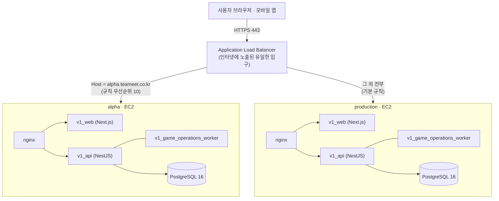
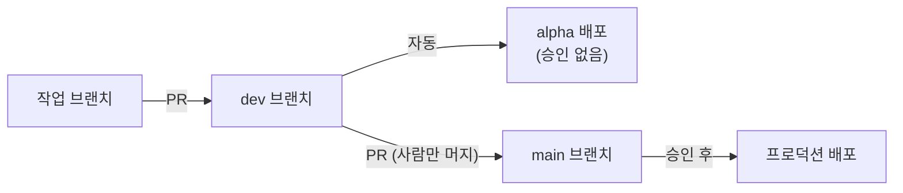
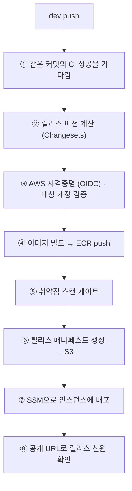
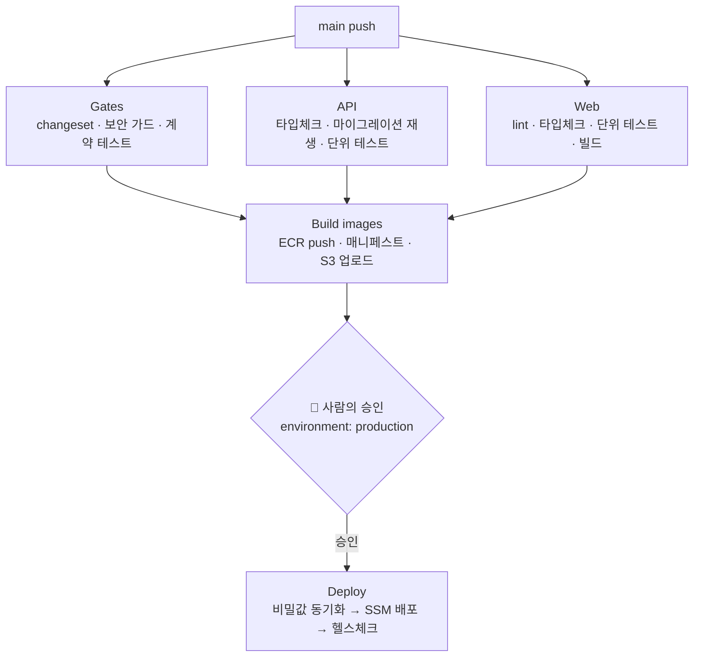

# Teameet

> 생활체육 동호인을 위한 멀티스포츠 팀·대회 플랫폼


팀밋(Teameet)은 축구·풋살·러닝·수영 생활체육의 개인 매치와 팀을 찾고, 아마추어 대회·정규 리그 신청부터
라이브 스코어와 경기 기록까지 한 흐름으로 이어 주는 서비스예요. 서비스 주소: https://teameet.co.kr

---

## 서비스 기능

기능 목록을 이 README에 따로 적지 않아요 — 코드와 어긋나기 쉬워서예요. 현행 기능과 공개 정보는 아래를 봐 주세요.

- 서비스: https://teameet.co.kr · AI/크롤러용 안내서: https://teameet.co.kr/llms.txt
  (소스: `apps/v1_web/src/app/llms.txt/route.ts`)
- 기획 문서: [`docs/product/`](docs/product/) · 사용자 흐름 시나리오: [`docs/scenarios/index.md`](docs/scenarios/index.md)
- 대회·리그·팀 매치의 정본 설계: [`docs/design/competition-canonical-flow.md`](docs/design/competition-canonical-flow.md)
- 어드민 사용 안내: [`docs/guides/admin-user-guide.md`](docs/guides/admin-user-guide.md)

---

## Architecture

> 이 절은 **처음 합류한 개발자**가 읽는 것을 기준으로 씁니다. 낯선 용어는 처음 나올 때 뜻을
> 함께 적었습니다. 코드 구조는 [Project Structure](#project-structure), 인프라와 배포는
> 아래 [인프라 구조](#인프라-구조--무엇이-어디서-도는가)와 [배포 파이프라인](#배포-파이프라인)을 보세요.

### 애플리케이션 구조

```
┌──────────────────────────────────────────────────────────────┐
│                         Client                               │
│  브라우저 (apps/v1_web, Next.js 16 App Router)                │
│  Android 셸 (apps/v1_android) · iOS 셸 (apps/v1_ios)          │
│    └ 두 네이티브 셸은 배포된 웹을 로드하고 푸시·권한·딥링크만 담당 │
└───────────────┬───────────────────────────┬──────────────────┘
                │ REST /api/v1 (웹이 rewrite) │ Socket.IO
                ▼                           ▼
┌──────────────────────────────────────────────────────────────┐
│                 API — apps/v1_api (NestJS 11)                │
│  인증·팀·매치·팀 매치·대회·리그·경기 운영·채팅·알림·어드민       │
│  푸시: Web Push(VAPID) · APNs · FCM                          │
└───────────────┬──────────────────────────────────────────────┘
                ▼
        PostgreSQL 16 (Prisma 6)
```

- 웹은 `/api/*`·`/uploads/*` 요청을 API로 rewrite 해요(`apps/v1_web/next.config.ts`).
- 세션은 `teameet_v1_session` httpOnly 쿠키 하나로 유지돼요.
- API 계약 문서: [`docs/api/README.md`](docs/api/README.md)

---

### 인프라 구조 — 무엇이 어디서 도는가

살아 있는 환경은 **두 개**입니다. 둘은 서로 다른 EC2 인스턴스에서 돌지만, **로드밸런서는
하나를 나눠 씁니다.**

- **alpha** (`alpha.teameet.co.kr`) — `dev` 브랜치가 머지되면 자동으로 올라가는 검증용 환경
- **production** (`teameet.co.kr`) — 실제 사용자가 쓰는 환경. `main` 브랜치 + 사람의 승인이 필요


```mermaid
graph TB
    U["사용자 브라우저 · 모바일 앱"]
    ALB["Application Load Balancer<br/>(인터넷에 노출된 유일한 입구)"]

    U -->|HTTPS 443| ALB
    ALB -->|"Host = alpha.teameet.co.kr<br/>(규칙 우선순위 10)"| A
    ALB -->|"그 외 전부<br/>(기본 규칙)"| P

    subgraph A["alpha · EC2"]
        AN["nginx"] --> AW["v1_web (Next.js)"]
        AN --> AA["v1_api (NestJS)"]
        AA --- AG["v1_game_operations_worker"]
        AA --> AP[("PostgreSQL 16")]
    end

    subgraph P["production · EC2"]
        PN["nginx"] --> PW["v1_web (Next.js)"]
        PN --> PA["v1_api (NestJS)"]
        PA --- PG["v1_game_operations_worker"]
        PA --> PP[("PostgreSQL 16")]
    end
```

배포되는 스택(`deploy/docker-compose.prod.yml`, alpha는 `deploy/docker-compose.alpha.yml`을 겹쳐 씀)의 서비스는 다음과 같습니다.

| 서비스 | 역할 |
|---|---|
| `nginx` | 앞단에서 요청을 웹/API로 분배 |
| `v1_web` | Next.js 프론트엔드 (`apps/v1_web`, 3013) |
| `v1_api` | NestJS 백엔드 (`apps/v1_api`, 8121) |
| `v1_game_operations_worker` | 경기 운영 작업을 처리하는 워커(같은 API 이미지, `WORKER_PORT` 기본 8122) |
| `v1_postgres` | PostgreSQL 16 컨테이너 (prod compose에 정의) |
| `v1_uploads_init` | 업로드 디렉터리 권한을 맞추고 종료하는 **1회성 초기화 컨테이너** |

> 📌 **헷갈리기 쉬운 점 — 현재 배포 스택에는 Redis가 없습니다.** 옛 v0 시절 문서(`docs/archive/`)에는
> Redis가 나오지만 v1 스택은 쓰지 않습니다.

**로드밸런서(ALB)** 는 들어온 요청을 어느 서버로 보낼지 정하는 교통정리 담당입니다. 여기서는
요청에 붙은 **호스트 이름**을 보고 나눕니다 — `alpha.teameet.co.kr`이면 alpha 인스턴스로,
나머지는 프로덕션으로 보냅니다. 80(HTTP) 리스너는 443(HTTPS)으로 리다이렉트만 합니다.

두 환경 모두 **애플리케이션은 Docker 컨테이너로** 돌고, 각 인스턴스 안의 **nginx 컨테이너가
앞단**에서 웹(Next.js)과 API(NestJS)로 나눠 보냅니다.

#### 두 환경 비교

| | alpha | production |
|---|---|---|
| 도메인 | `alpha.teameet.co.kr` | `teameet.co.kr` |
| 컨테이너 이미지 | 환경별 ECR 저장소(다이제스트 고정) | 환경별 ECR 저장소(다이제스트 고정) |
| DB 백업 | 없음(검증용 환경) | 있음 — 구성은 `docs/ops/prod-backup.md` |
| 런타임 비밀값 | 인스턴스의 `.env` (운영자가 직접 관리) | GitHub Secrets → **Parameter Store** → `.env` (배포마다 갱신) |
| 배포 승인 | 없음 (자동) | **필요** (`environment: production`) |
| 트리거 | `dev` 브랜치 push | `main` 브랜치 push |

> ⚠️ **알아둘 차이**: 두 인스턴스는 같은 코드를 돌리지만 **호스트 환경이 미묘하게 다릅니다.**
> 실제로 alpha에는 Docker Compose 플러그인이 있고 프로덕션에는 없어서, alpha에서 멀쩡히
> 통과한 배포 스크립트가 프로덕션에서 처음 실행될 때 깨진 사고가 있었습니다.
> **"alpha에서 됐으니 프로덕션도 된다"는 보장이 아닙니다.**

#### 데이터베이스

DB 위치(컨테이너 Postgres ↔ RDS 전환), 백업, 복구 절차는 운영 문서가 정본입니다 — 이 README는
그 상태를 단정하지 않습니다.

- 백업 구성·복구: [`docs/ops/prod-backup.md`](docs/ops/prod-backup.md)
- RDS 전환 설계·실행: [`docs/ops/rds-migration-design.md`](docs/ops/rds-migration-design.md),
  [`docs/ops/rds-cutover-runbook.md`](docs/ops/rds-cutover-runbook.md)
- v1 DB 운영: [`docs/ops/v1-database-operations.md`](docs/ops/v1-database-operations.md)

---

### 배포 파이프라인

두 환경의 파이프라인은 **모양이 다릅니다.** alpha는 빠르게, 프로덕션은 여러 관문을 거칩니다.

#### 전체 흐름 — 코드가 사용자에게 닿기까지


```mermaid
graph LR
    F["작업 브랜치"] -->|PR| D["dev 브랜치"]
    D -->|자동| AD["alpha 배포<br/>(승인 없음)"]
    D -->|"PR (사람만 머지)"| M["main 브랜치"]
    M -->|"승인 후"| PD["프로덕션 배포"]
```

**작업은 항상 `dev`에서 시작합니다.** `dev → main` 승격은 **사람이 GitHub에서 직접 머지**하는
것이 유일한 경로입니다 — 자동으로 승격하는 워크플로는 없습니다.

#### alpha 파이프라인 (`deploy-alpha.yml`)

`dev`에 push되면 **job 하나**가 처음부터 끝까지 담당합니다.


```mermaid
graph TD
    S["dev push"] --> W["① 같은 커밋의 CI 성공을 기다림"]
    W --> V["② 릴리스 버전 계산 (Changesets)"]
    V --> C["③ AWS 자격증명 (OIDC) · 대상 계정 검증"]
    C --> B["④ 이미지 빌드 → ECR push"]
    B --> G["⑤ 취약점 스캔 게이트"]
    G --> M["⑥ 릴리스 매니페스트 생성 → S3"]
    M --> D["⑦ SSM으로 인스턴스에 배포"]
    D --> H["⑧ 공개 URL로 릴리스 신원 확인"]
```

①이 중요합니다 — alpha 워크플로는 **같은 커밋에 대한 CI(`deploy.yml`)가 성공할 때까지
기다립니다.** 테스트가 깨진 코드가 alpha에 올라가지 않게 하는 장치입니다.

#### 프로덕션 파이프라인 (`deploy.yml`)

`main`에 push되면 **5개 job**이 순서대로 돕니다.


```mermaid
graph TD
    S["main push"] --> G["Gates<br/>changeset · 보안 가드 · 계약 테스트"]
    S --> A["API<br/>타입체크 · 마이그레이션 재생 · 단위 테스트"]
    S --> W["Web<br/>lint · 타입체크 · 단위 테스트 · 빌드"]
    G --> BI["Build images<br/>ECR push · 매니페스트 · S3 업로드"]
    A --> BI
    W --> BI
    BI --> AP{"🛑 사람의 승인<br/>environment: production"}
    AP -->|승인| DP["Deploy<br/>비밀값 동기화 → SSM 배포 → 헬스체크"]
```

`Gates` · `API` · `Web` 세 개는 **동시에** 돌고, 셋 다 통과해야 `Build images`로 넘어갑니다.
그리고 **`Deploy` 앞에는 사람이 눌러야 하는 승인 버튼**이 있습니다. 승인 전까지 프로덕션은
전혀 바뀌지 않습니다.

`Deploy` job이 하는 일은 네 단계입니다.

| 스텝 | 하는 일 |
|---|---|
| `Sync runtime env` | GitHub Secrets를 **Parameter Store**(암호화 저장소)에 올리고, 인스턴스가 그걸 받아 `.env`를 다시 만듭니다 |
| `Run deploy-prod.sh` | S3에서 소스를 내려받아 해시를 대조하고, 새 컨테이너로 교체합니다 |
| `Health check` | 인스턴스 내부 + **공개 URL**에서 응답 헤더의 커밋 SHA가 방금 배포한 것과 같은지 확인합니다 |

> 💡 왜 비밀값을 Parameter Store를 거쳐 보낼까요? 인스턴스에 명령을 보내는 SSM은 **명령
> 내용이 감사 로그(CloudTrail)에 남습니다.** 비밀번호를 명령에 직접 실으면 그대로 기록되므로,
> 값은 암호화 저장소에 두고 명령에는 **경로만** 실어 보냅니다.

#### 안전장치 — 왜 이렇게 복잡한가

| 장치 | 막는 사고 |
|---|---|
| **불변 이미지 태그** (ECR `IMMUTABLE`) | 같은 태그로 다른 이미지를 덮어쓰는 것. 한 번 배포된 이미지는 내용이 바뀌지 않습니다 |
| **다이제스트 고정** | 태그가 아니라 `sha256:…` 다이제스트로 배포 — "어제의 `latest`"와 "오늘의 `latest`"가 다른 문제를 없앱니다 |
| **S3 + sha256 대조** | 전송 중 손상되거나 바꿔치기된 소스로 배포되는 것 |
| **SSM (SSH 아님)** | 서버에 접속 포트를 열어 두는 것. 단기 자격증명만 쓰고 인바운드 포트가 필요 없습니다 |
| **승인 게이트** (프로덕션만) | 머지가 곧바로 실사용자에게 나가는 것 |
| **롤백 CAS** | 되돌리는 사이 다른 배포가 끼어드는 것 (되돌리기 전 현재 SHA를 입력해 대조) |
| **changeset 게이트** | 무엇이 바뀌었는지 기록 없이 릴리스되는 것 |

#### 되돌리기 (롤백)

`rollback-alpha.yml` · `rollback-prod.yml`을 **수동 실행**합니다. 실행할 때 **지금 돌고 있다고
알고 있는 커밋 SHA**를 입력해야 하며, 실제와 다르면 거부됩니다.

되돌릴 대상은 인스턴스에 기록된 **직전 릴리스**입니다. 따라서 **성공한 배포가 2회 이상 쌓여야**
롤백이 가능합니다(첫 배포 직후에는 되돌아갈 기준점이 없습니다).

#### 워크플로 한눈에 보기

| 파일 | 언제 도는가 | 무엇을 하는가 |
|---|---|---|
| `deploy.yml` | `main`/`dev` push, PR, 수동 | 검증(Gates·API·Web) + **`main`일 때만** 빌드·배포 |
| `deploy-alpha.yml` | `dev` push, 수동 | alpha 빌드 + 배포 |
| `rollback-alpha.yml` | 수동 | alpha를 직전 릴리스로 되돌리기 |
| `rollback-prod.yml` | 수동 | 프로덕션을 직전 릴리스로 되돌리기 |
| `release-main.yml` | 수동 | 검증된 alpha 버전을 기준으로 승격 PR 생성(base는 `dev`) |
| `android-alpha.yml` · `ios-alpha.yml` | `dev` push·PR(각 앱 경로 변경 시), 수동 | 네이티브 셸 alpha 빌드 |
| `android-production-bundle.yml` | 수동 | Android 프로덕션 번들 |

---

## Tech Stack

| 분류 | 기술 | 버전 | 역할 |
|------|------|------|------|
| **Web** | Next.js | 16.x | App Router, SSR |
| **Web** | React | 19.x | UI |
| **Web** | Tailwind CSS | 4.x | 유틸리티 CSS + 디자인 토큰 |
| **Web** | TanStack Query | 5.x | 서버 상태 관리·캐싱(persist 포함) |
| **Web** | Axios · Socket.IO client · TipTap | — | HTTP · 실시간 · 리치 텍스트 |
| **API** | NestJS | 11.x | REST API, Socket.IO |
| **API** | TypeScript | 5.7.x | 타입 안전 개발 |
| **ORM** | Prisma | 6.x | DB 스키마, 마이그레이션 |
| **Database** | PostgreSQL | 16 | 주 데이터베이스 |
| **Push** | web-push(VAPID) · APNs · FCM | — | 웹·iOS·Android 푸시 |
| **Mobile** | Android(Kotlin/Gradle) · iOS(XcodeGen `project.yml`) | — | 배포된 웹을 로드하는 네이티브 셸 |
| **Monorepo** | pnpm + Turborepo | pnpm 9.x | 워크스페이스 빌드 |
| **Release** | Changesets | — | 버전·CHANGELOG |
| **Testing** | Vitest · Jest · Supertest · Playwright | — | 단위 · 통합 · E2E |
| **Deploy** | Docker + Nginx · GitHub Actions · AWS(ECR·S3·SSM) | — | 컨테이너 배포 |

---

## Project Structure

```
matchup-sports-platform/
├── apps/
│   ├── v1_web/                 # Next.js 웹 (포트 3013)
│   │   └── src/
│   │       ├── app/            # 라우트 — 사용자 화면·admin/·tournament-ops/, globals.css·tokens.css
│   │       ├── components/     # 도메인별 컴포넌트 + v1-ui/(공유 셸·프리미티브)
│   │       ├── hooks/          # use-v1-api.ts 등 서버 상태 훅
│   │       ├── lib/            # API 클라이언트·라벨·날짜 등 유틸
│   │       ├── types/          # API 타입
│   │       └── test/msw/       # Vitest용 MSW 핸들러
│   ├── v1_api/                 # NestJS API (포트 8121, prefix /api/v1)
│   │   ├── src/<domain>/       # auth, teams, team-matches, matches, tournaments, games,
│   │   │                       # game-operations, league-matches, chat, notifications, admin …
│   │   ├── prisma/             # schema.prisma · migrations/ · 시드
│   │   └── test/               # 통합 스펙 · fixtures · helpers
│   ├── v1_android/             # Android 네이티브 셸
│   └── v1_ios/                 # iOS 네이티브 셸 (project.yml)
├── e2e/                        # v1 Playwright (v1.config.ts, v1-tests/)
├── deploy/                     # Dockerfile.v1-*, compose(prod·alpha), nginx, 배포 스크립트
├── scripts/                    # release/ · qa/ · alpha 검증·캡처 스크립트
├── docs/                       # 지도: docs/README.md
├── infra/load/                 # k6 부하 테스트
├── .github/                    # workflows/ · tasks/
├── docker-compose.yml          # 로컬 개발 스택
├── turbo.json
└── pnpm-workspace.yaml
```

레거시 v0 앱(`apps/api`·`apps/web`)은 제거됐어요. 필요하면 태그 `legacy-v0-final`에서 볼 수 있어요.

---

## Getting Started

### Prerequisites

- **Node.js** >= 22
- **pnpm** 9 (`packageManager: pnpm@9.15.4`)
- **Docker** + Docker Compose

### Installation

```bash
git clone https://github.com/kim-song-jun/matchup-sports-platform.git
cd matchup-sports-platform
pnpm install
```

### Environment Variables

- 변수 이름과 용도는 루트 `.env.example`을 봐 주세요. 실제 값은 저장소에 커밋하지 않아요.
- alpha 환경 운영: [`docs/ops/v1-alpha-environment.md`](docs/ops/v1-alpha-environment.md) ·
  배포 가이드: [`deploy/DEPLOY_GUIDE.md`](deploy/DEPLOY_GUIDE.md)

### Start Development

```bash
docker compose up -d v1_postgres v1_api v1_web
# v1_api 컨테이너가 db:generate → db:push → db:seed(base) → dev 를 순서대로 실행해요
# API  http://localhost:8121/api/v1 (Swagger /docs) · Web http://localhost:3013
```

`v1_postgres`는 호스트에 포트를 열지 않아요(컨테이너 네트워크 안에서만 5432). 호스트에서 `pnpm --filter v1_api dev`로
API를 직접 띄우려면 접근 가능한 DB의 `DATABASE_URL`을 따로 지정해야 해요.

> 화면 동작 검증은 로컬 서버가 아니라 alpha 배포(`https://alpha.teameet.co.kr`)에서 해요 —
> 절차는 `CLAUDE.md`의 "Alpha 실측 검증"과 [`scripts/README-alpha-verify.md`](scripts/README-alpha-verify.md).

---

## Development

```bash
pnpm --filter v1_web lint     # tsc --noEmit + v1 패턴 검사
pnpm --filter v1_api lint     # tsc --noEmit + 대회 표면 검사
pnpm --filter v1_web build
pnpm --filter v1_api build
```

### V1 database operations

```bash
pnpm v1:db:generate
pnpm v1:db:migrate
pnpm v1:db:seed          # base reference data only
pnpm v1:db:seed:demo     # explicit demo personas/data
pnpm v1:db:seed:all      # demo plus coverage data
pnpm v1:db:cleanup:demo  # dry-run counts for 00000000/@teameet.v1 demo cleanup
```

`demo`/`coverage`/`all` seed modes require `V1_HOST_ADMIN_PASSWORD` (8+ chars) set in `apps/v1_api/.env` — used as the
`host@teameet.v1` account password. Seeding fails fast without it.

Actual v1 demo cleanup requires a backup, count review, and explicit execution:

```bash
pnpm --filter v1_api db:cleanup:demo -- --execute --confirm=delete-v1-demo-data
```

스키마를 바꾸면 **반드시 migration 파일을 함께** 커밋해요(CI가 빈 DB 재생 + 드리프트 0을 검사). 자세한 규칙은 `CLAUDE.md`.

### 저장소 위생 규칙

- 루트에는 앱 엔트리와 설정 파일만 둡니다. QA 보조 도구는 `scripts/qa/`, 문서용 렌더 스크립트는 `scripts/docs/`에 둡니다.
- 문서에서 참조하는 스크린샷은 `docs/screenshots/`, 디자인/기획용 레퍼런스 이미지는 `docs/reference/`에 둡니다.
- 로컬 산출물과 캐시는 `playwright-report/`, `test-results/`, `.playwright-mcp/`, `.pnpm-store/`, `tmp/`처럼 git ignore 대상에만 둡니다.

---

## Testing

```bash
pnpm --filter v1_web test               # Vitest + jsdom (src/**/*.test.{ts,tsx})
pnpm --filter v1_api test               # Jest unit (src/**/*.spec.ts)
pnpm --filter v1_api test:integration   # Jest integration (test/**/*.integration-spec.ts, DB 필요)
pnpm v1:test                            # v1_api unit + v1_web test
pnpm test:e2e:v1                        # Playwright (e2e/v1.config.ts, v1 스택 가동 전제)
```

Playwright 운영 절차: [`docs/guides/playwright-e2e-runbook.md`](docs/guides/playwright-e2e-runbook.md)

---

## Contributing

- 작업 브랜치의 base와 PR 대상은 항상 **`dev`** 예요. `dev → main` 승격은 사람만 해요(`CLAUDE.md` "Git 브랜치 정책").
- v1 앱·배포 경로를 바꾸는 PR에는 `.changeset/*.md`가 필요해요(`scripts/release/check-changeset-policy.mjs`).
- PR 제목·본문은 한국어로 써요. 리뷰·시각 검증 절차: [`docs/ops/pr-review-visual-workflow.md`](docs/ops/pr-review-visual-workflow.md)
- 커밋 메시지: `type(scope): summary` — `feat` · `fix` · `refactor` · `docs` · `test` · `chore` · `infra`.
- 에이전트용 지침: [`CLAUDE.md`](CLAUDE.md)(정본) · [`AGENTS.md`](AGENTS.md)(Codex 요약)

---

## License

Private — All rights reserved.
