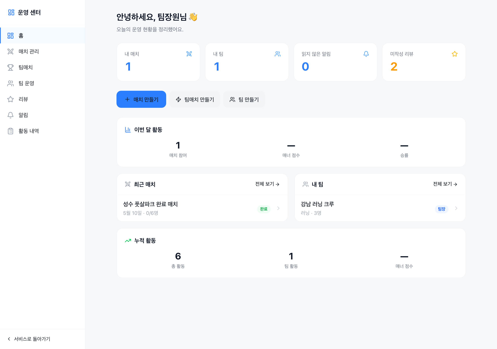
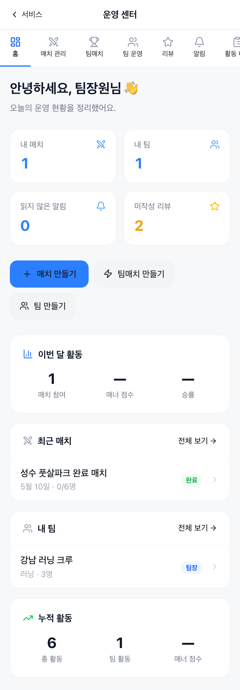
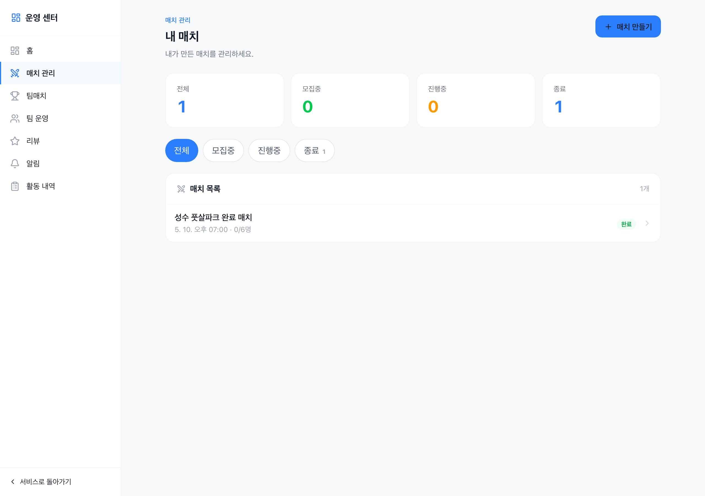
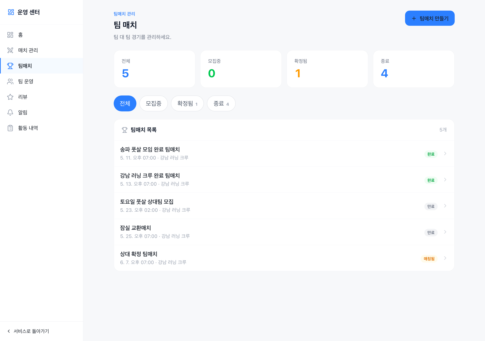
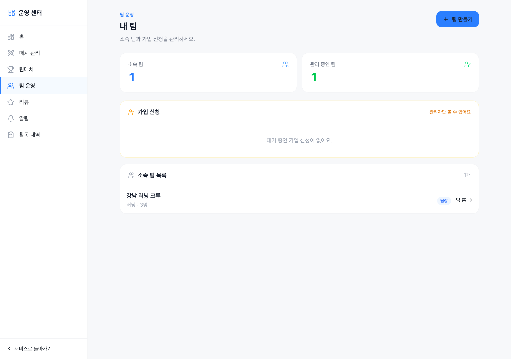
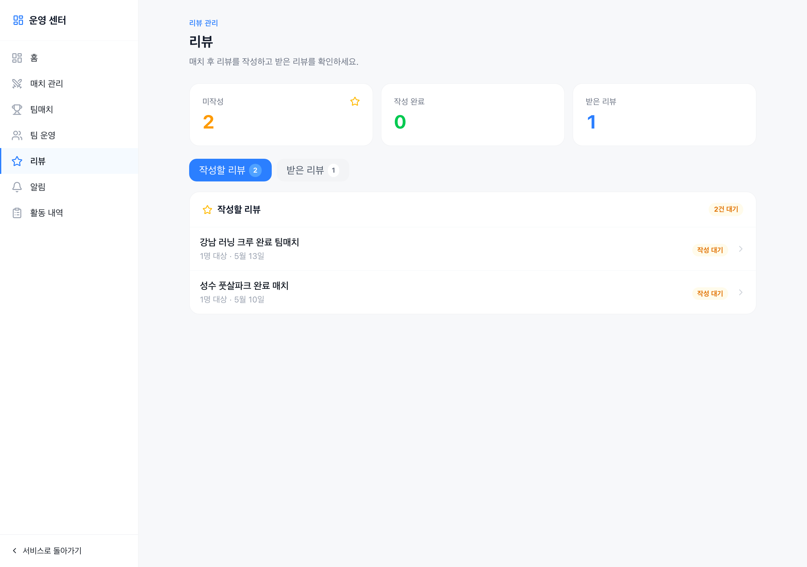
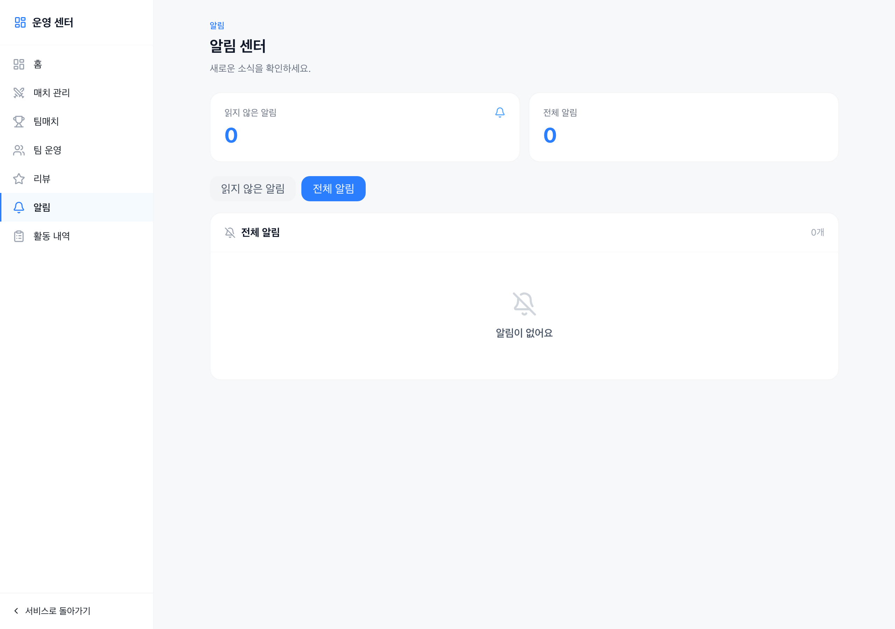
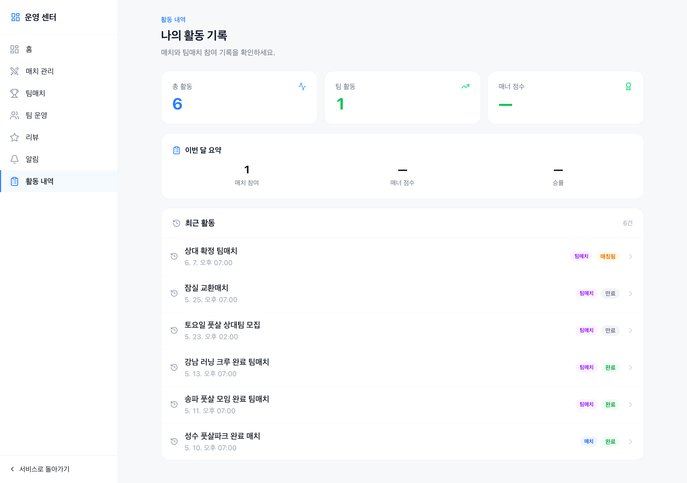
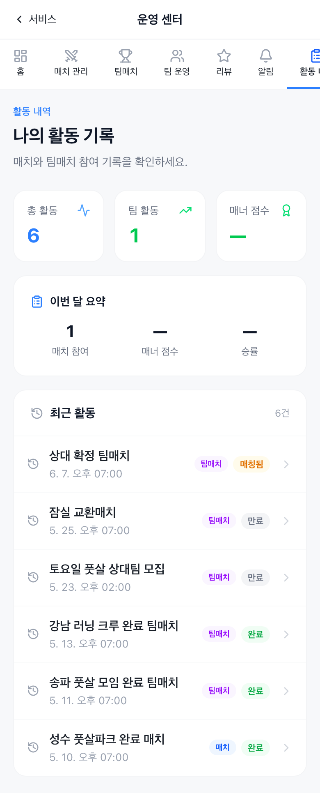

# 운영 센터 사용 매뉴얼

> Teameet 운영 센터(`/admin`)는 팀 매니저와 팀장이 매치·팀·리뷰·알림을 한 곳에서 관리할 수 있는 개인 대시보드입니다.

---

## 목차

1. [접속 방법](#1-접속-방법)
2. [화면 구성](#2-화면-구성)
3. [홈 (대시보드)](#3-홈-대시보드)
4. [매치 관리](#4-매치-관리)
5. [팀매치](#5-팀매치)
6. [팀 운영](#6-팀-운영)
7. [리뷰](#7-리뷰)
8. [알림](#8-알림)
9. [활동 내역](#9-활동-내역)
10. [모바일 사용 팁](#10-모바일-사용-팁)

---

## 1. 접속 방법

로그인 후 두 가지 방법으로 운영 센터에 접속할 수 있습니다.

- **URL 직접 입력**: `https://[서비스 주소]/admin`
- **메인 화면 → 프로필 메뉴 → 운영 센터** 탭 또는 링크 클릭

> **권한**: 로그인한 사용자라면 누구나 접속할 수 있습니다. 팀 관련 기능(가입 신청 승인 등)은 팀장/매니저 역할이 있어야 합니다.

---

## 2. 화면 구성

### 데스크탑 (1280px 이상)

| 영역 | 설명 |
|------|------|
| **왼쪽 사이드바** | 7개 메뉴 고정 표시. 현재 페이지는 파란색으로 강조 |
| **상단 로고** | "운영 센터" — 클릭 시 홈으로 이동 |
| **본문 영역** | KPI 카드 → 필터/탭 → 목록 순서로 구성 |
| **하단 "서비스로 돌아가기"** | 메인 앱(`/home`)으로 이동 |

### 모바일 (390px)

| 영역 | 설명 |
|------|------|
| **상단 헤더** | "← 서비스", "운영 센터" 제목 |
| **상단 탭 바** | 7개 메뉴를 가로 스크롤로 접근. 현재 메뉴 파란 밑줄 |
| **본문** | 데스크탑과 동일한 카드·목록 구조, 세로로 펼쳐짐 |

---

## 3. 홈 (대시보드)

**경로**: `/admin`

### KPI 카드 (4개)

| 카드 | 의미 |
|------|------|
| **내 매치** | 내가 만들거나 참가한 개인 매치 수 |
| **내 팀** | 소속된 팀 수 |
| **읽지 않은 알림** | 미확인 알림 수 (주황색 강조) |
| **미작성 리뷰** | 매치 후 아직 작성하지 않은 리뷰 수 (주황색 강조) |

### 빠른 액션

| 버튼 | 이동 경로 |
|------|----------|
| **+ 매치 만들기** | `/matches/new` |
| **⚡ 팀매치 만들기** | `/team-matches/new` |
| **👥 팀 만들기** | `/teams/new` |

### 하단 정보 카드 (데스크탑 2열)

- **이번 달 활동**: 이번 달 매치 참여 수 · 매너 점수 · 승률
- **최근 매치**: 내 매치 1건 미리보기 → "전체 보기" 클릭 시 매치 관리 이동
- **내 팀**: 소속 팀 1건 미리보기 → "전체 보기" 클릭 시 팀 운영 이동
- **누적 활동**: 전체 참여 수 · 팀 활동 · 전체 매너 점수

---

## 4. 매치 관리

**경로**: `/admin/matches`

### KPI 카드 (4개)

| 카드 | 의미 |
|------|------|
| **전체** | 내 매치 총 수 |
| **모집중** | 현재 참가자를 받고 있는 매치 (녹색 강조) |
| **진행중** | 경기 당일 또는 진행 중인 매치 (주황색 강조) |
| **종료** | 완료·마감된 매치 |

### 상태 필터 탭

`전체` / `모집중` / `진행중` / `종료` 탭을 눌러 목록을 필터링합니다.  
탭 우측의 숫자 뱃지가 해당 상태의 매치 수를 나타냅니다.

### 매치 목록

각 행을 클릭하면 해당 매치 상세 페이지로 이동합니다.

| 표시 정보 | 설명 |
|----------|------|
| **타이틀** | 매치 이름 |
| **날짜 · 참가 현황** | `5월 10일 오후 7:00 · 0/6명` 형식 |
| **상태 뱃지** | `모집중` (녹색) / `진행중` (주황) / `완료` (회색) 등 |

### 매치 만들기

우측 상단 **+ 매치 만들기** 버튼 → `/matches/new` 페이지로 이동합니다.

---

## 5. 팀매치

**경로**: `/admin/team-matches`

팀 대 팀 경기를 관리합니다. 내 팀이 호스트이거나 상대방으로 신청한 팀매치가 모두 표시됩니다.

### KPI 카드 (4개)

| 카드 | 의미 |
|------|------|
| **전체** | 관련 팀매치 총 수 |
| **모집중** | 상대팀을 찾고 있는 경기 |
| **확정팀** | 상대팀이 결정되어 경기 확정된 건 (주황 강조) |
| **종료** | 완료·만료된 경기 |

### 상태 필터 탭

`전체` / `모집중` / `확정팀` / `종료` 탭으로 필터링합니다.

### 팀매치 목록

| 표시 정보 | 설명 |
|----------|------|
| **타이틀** | 팀매치 이름 |
| **날짜 · 팀 이름** | `5월 11일 오후 7:00 · 강남 러닝 크루` |
| **상태 뱃지** | `완료` / `만료` / `매칭됨` (주황) 등 |

### 팀매치 만들기

우측 상단 **+ 팀매치 만들기** 버튼 → `/team-matches/new` 페이지로 이동합니다.

---

## 6. 팀 운영

**경로**: `/admin/teams`

소속 팀과 가입 신청을 관리합니다.

### KPI 카드 (2개)

| 카드 | 의미 |
|------|------|
| **소속 팀** | 내가 속한 팀 수 |
| **관리 중인 팀** | 팀장/매니저 역할인 팀 수 (녹색 강조) |

### 가입 신청 섹션

- **팀장·매니저**만 볼 수 있는 섹션
- 대기 중인 신청이 있으면 신청자 목록이 표시됩니다
- 각 신청자 행에서 **수락** / **거부** 버튼으로 처리합니다
- 대기 신청이 없으면 "대기 중인 가입 신청이 없어요." 메시지 표시

> 팀장/매니저가 아닌 멤버는 해당 섹션이 보이지 않습니다.

### 소속 팀 목록

각 팀 행 우측의 **팀 홈 →** 링크를 클릭하면 해당 팀 홈 페이지(`/teams/[id]`)로 이동합니다.

| 표시 정보 | 설명 |
|----------|------|
| **팀 이름** | 팀 공식 이름 |
| **종목 · 멤버 수** | `러닝 · 3명` 형식 |
| **역할 뱃지** | `팀장` (파란) / `매니저` (초록) / `멤버` (회색) |

### 팀 만들기

우측 상단 **+ 팀 만들기** 버튼 → `/teams/new` 페이지로 이동합니다.

---

## 7. 리뷰

**경로**: `/admin/reviews`

매치 후 리뷰를 작성하고 받은 리뷰를 확인합니다.

### KPI 카드 (3개)

| 카드 | 의미 |
|------|------|
| **미작성** | 아직 작성하지 않은 리뷰 수 (주황 강조) |
| **작성 완료** | 이미 제출한 리뷰 수 (녹색) |
| **받은 리뷰** | 다른 플레이어가 나에게 남긴 리뷰 수 (파란) |

### 탭 전환

| 탭 | 내용 |
|----|------|
| **작성할 리뷰** | 아직 제출하지 않은 리뷰 목록. 행 클릭 시 리뷰 작성 페이지 이동 |
| **받은 리뷰** | 다른 플레이어가 남긴 리뷰 목록 (평점 포함) |

### 작성할 리뷰 목록

| 표시 정보 | 설명 |
|----------|------|
| **매치 이름** | 리뷰 대상 매치 제목 |
| **대상 수 · 날짜** | `1명 대상 · 5월 13일` |
| **상태 뱃지** | `작성 대기` (주황) |

행을 클릭하면 해당 매치의 리뷰 작성 페이지로 이동합니다.

---

## 8. 알림

**경로**: `/admin/notifications`

서비스 알림을 한눈에 확인합니다.

### KPI 카드 (2개)

| 카드 | 의미 |
|------|------|
| **읽지 않은 알림** | 미확인 알림 수 (파란 강조) |
| **전체 알림** | 누적 알림 총 수 |

### 필터 탭

| 탭 | 내용 |
|----|------|
| **읽지 않은 알림** | 확인 안 한 새 알림만 표시 |
| **전체 알림** | 모든 알림 시간순 표시 |

알림 행을 클릭하면 해당 매치·팀·리뷰 페이지로 이동합니다.

---

## 9. 활동 내역

**경로**: `/admin/audit`

나의 모든 매치·팀 참여 기록을 한곳에서 봅니다.

### KPI 카드 (3개)

| 카드 | 의미 |
|------|------|
| **총 활동** | 전체 참여 매치+팀매치 수 (파란) |
| **팀 활동** | 팀 소속 경기 수 (녹색) |
| **매너 점수** | 내 누적 매너 점수 (녹색) |

### 이번 달 요약

이번 달의 **매치 참여** · **매너 점수** · **승률**을 간략히 표시합니다.

### 최근 활동 목록

| 표시 정보 | 설명 |
|----------|------|
| **매치 이름** | 참여한 매치·팀매치 제목 |
| **날짜** | 경기 일시 |
| **유형 뱃지** | `팀매치` (보라) / `매치` (파란) |
| **상태 뱃지** | `완료` (녹색) / `매칭팀` (주황) 등 |

---

## 10. 모바일 사용 팁

- **상단 탭 바를 좌우로 스와이프**해 7개 메뉴를 이동할 수 있습니다
- KPI 카드는 모바일에서 **2열 그리드**로 배치되어 한눈에 파악됩니다
- 목록 행은 **우측 화살표(>)** 로 상세 이동을 안내합니다
- 미작성 리뷰·읽지 않은 알림이 있으면 KPI 카드 숫자가 **주황/파란색으로 강조**되어 확인을 유도합니다
- 페이지 상단 **← 서비스** 버튼으로 메인 앱으로 바로 돌아갈 수 있습니다

---

## 부록: 상태 뱃지 색상 표

| 뱃지 | 색상 | 의미 |
|------|------|------|
| `모집중` | 녹색 | 참가자 모집 중 |
| `진행중` | 주황 | 현재 경기 진행 |
| `확정팀` | 주황 | 팀매치 상대 확정 |
| `매칭됨` | 주황 | 팀매치 매칭 완료 |
| `완료` | 녹색 | 경기 종료 및 정산 완료 |
| `만료` | 회색 | 기간 만료 |
| `작성 대기` | 주황 | 리뷰 미작성 |
| `팀장` | 파란 | 팀 소유자 |
| `매니저` | 초록 | 팀 관리자 |
| `멤버` | 회색 | 일반 팀원 |
