# Alpha QA: authenticated captain B after-gallery

12 original viewport screenshots, captured 2026-10-02 08:22:22–08:28:07 UTC at CSS widths 402, 787, and 1180.

## Scope and interpretation

- #1516: filtered tournament empty state, showing 진행 중 · 수영 · 남성부 and 조건에 맞는 대회가 없어요
- #1518: confirmed friendly score A 0:1 B and expanded goal disclosure
- #1522: male gender condition 남 on the team card and team detail

These are authenticated captain B after captures. Earlier guest before captures used a different role, so this is not a same-role guest re-test. The participant text 결과를 확인하고 후기를 남겨요. was observed; guest text 경기 결과가 확정됐어요. was not verified in this role. The participant text is visible in the desktop capture and recorded page text, outside the mobile/tablet viewport framing.

Desktop team list and detail were each fully reloaded once without a captured React418 recurrence. This is a bounded observation, not proof that the root cause is resolved. One `team match chat auto-resolve failed V1ApiError: Request failed` warning appeared at 08:23:40.963 UTC. Chat was not clicked, so no chat feature defect is concluded. Exact serving SHA was not observed.

The tablet empty-state CTA is largely below or obscured by the bottom-navigation region in this viewport framing; the capture does not establish CTA accessibility or activation. No server-changing controls were clicked. This package does not close issues or claim a full regression pass.

## Gallery

### Filtered tournament empty state

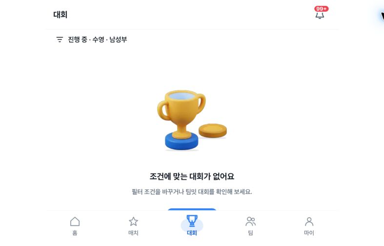

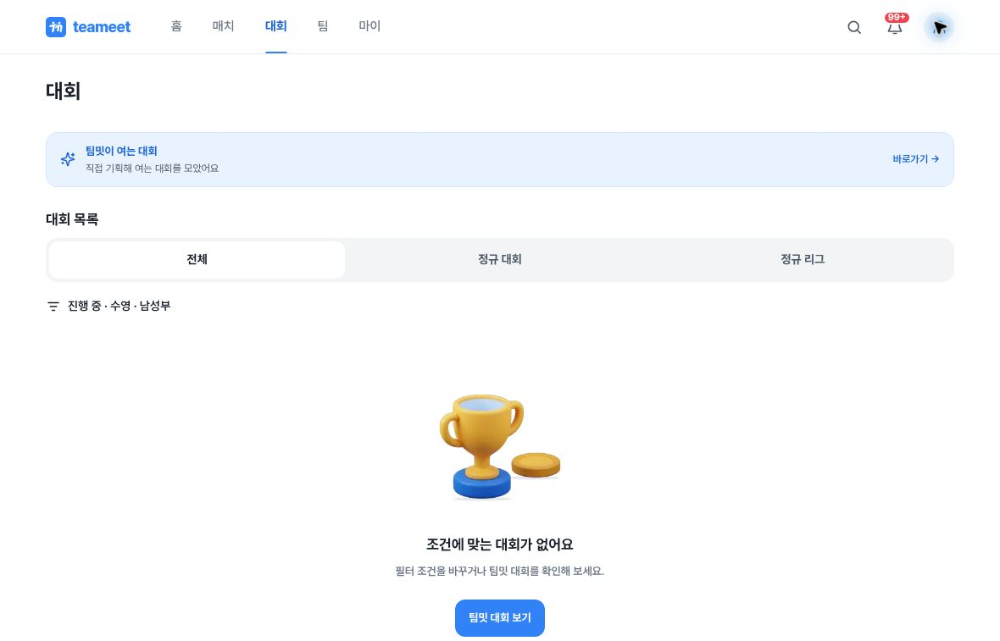

### Confirmed friendly result

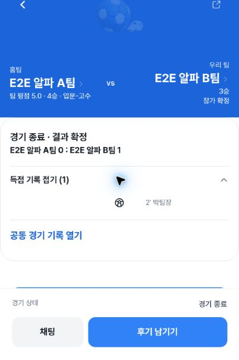

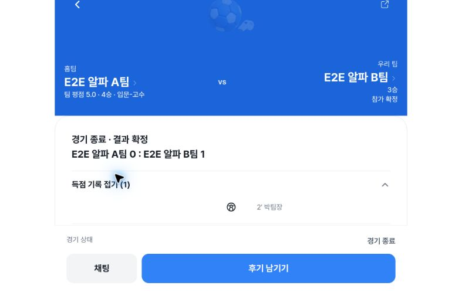

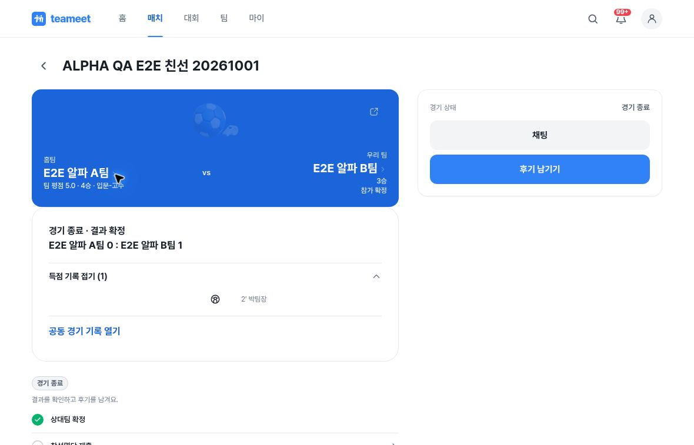

### Team-list gender label

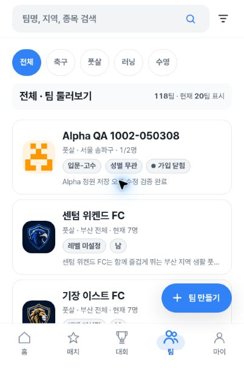

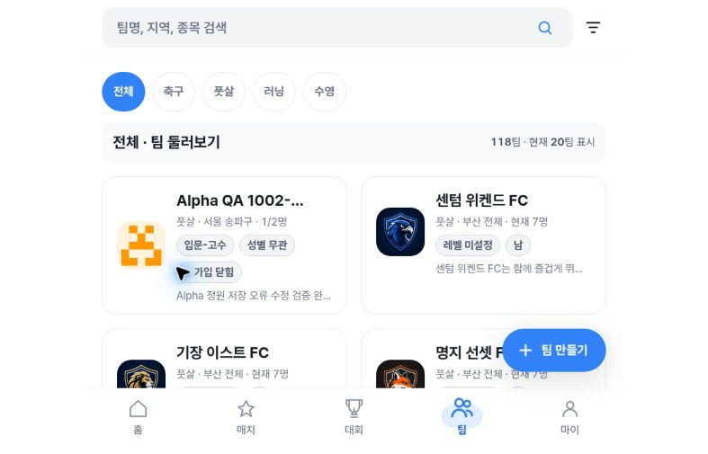

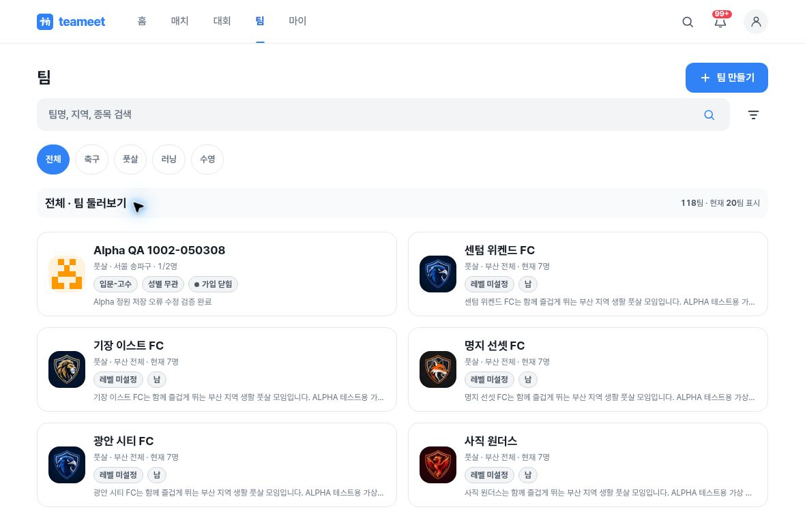

### Team-detail gender condition

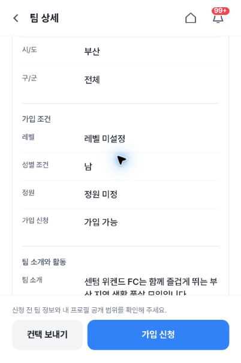

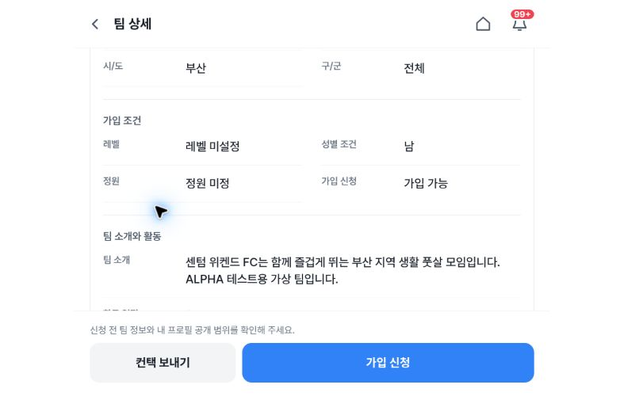

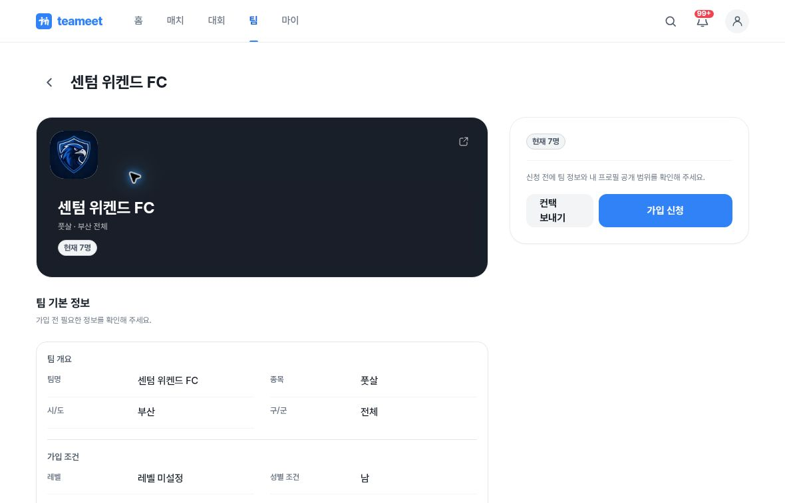

## Evidence integrity

All 12 image files preserve their original bytes and were individually pixel-reviewed. The proof contains timestamps, routes, CSS and raster dimensions, SHA-256 hashes, Git blob hashes, observations, and limitations. Mobile CSS dimensions are 402×606 while saved JPEG rasters are 402×605. The publication proof replaces local source paths with filenames and adds review metadata; capture measurements are unchanged.
