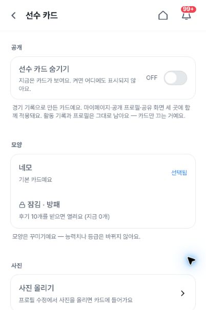
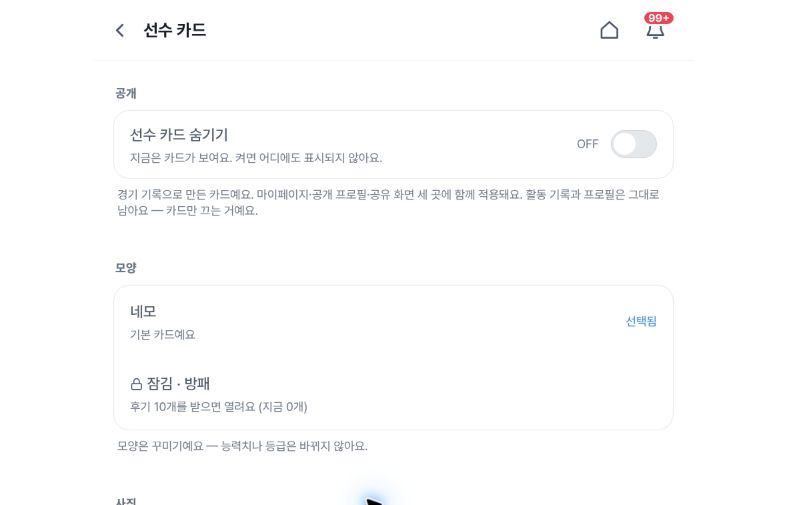
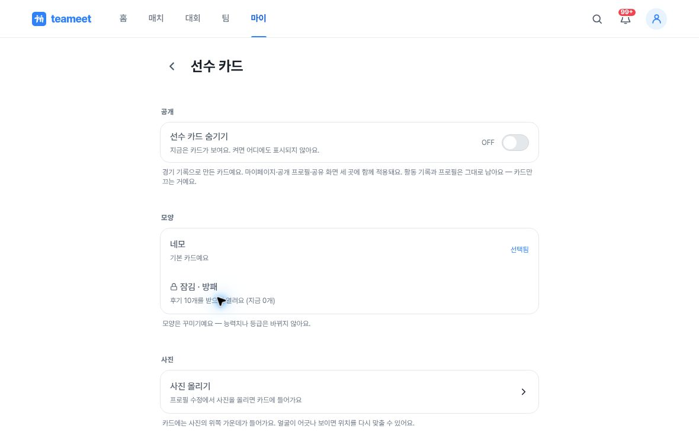
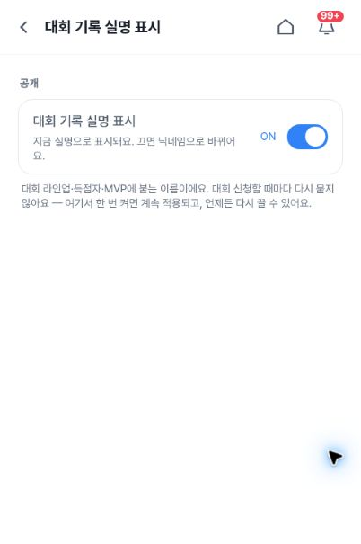
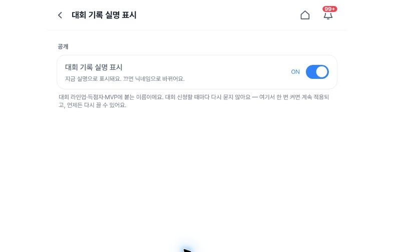
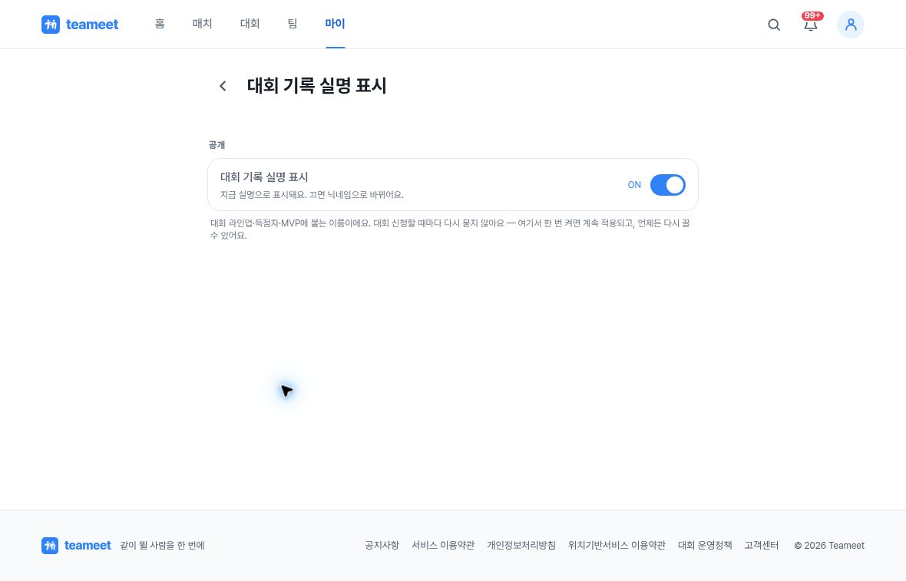

# Alpha QA: settings header after-gallery for #1458

Fresh captures following fix #1508, taken on 2026-10-02 from 08:07:01 to 08:07:53 UTC on https://alpha.teameet.co.kr.

## Result and scope

The original duplicate-header regression passed on both `/my/settings/player-card` and `/my/settings/tournament-real-name`, at CSS widths 402, 787, and 1180. The recorded observations show one Back link at every width. Desktop has one visible H1; mobile and tablet have one app-bar text title without a duplicate in-page title. This is not a claim of broader accessibility compliance or an instruction to close any issue. No privacy setting was changed.

Deployment run 36979105341 was reported successful at 07:54:18 UTC with head 9a35d05abd32afd16c1becc1e00a5fd4ced2fc99, which includes #1508. The serving page SHA was not directly observed during this capture session.

## Screenshots

### player-card

### tournament-real-name

## Evidence handling

The six JPGs are unchanged original capture bytes. `1458-after1508-settings-header-proof.json` contains the recorded routes, timestamps, CSS dimensions, title and Back-link observations, and unchanged toggle states. `metadata.json` includes image dimensions, SHA-256 and Git blob hashes, privacy review, and scope limits. The two mobile CSS viewports were recorded at height 606; their saved JPEGs measure 605 pixels high.
