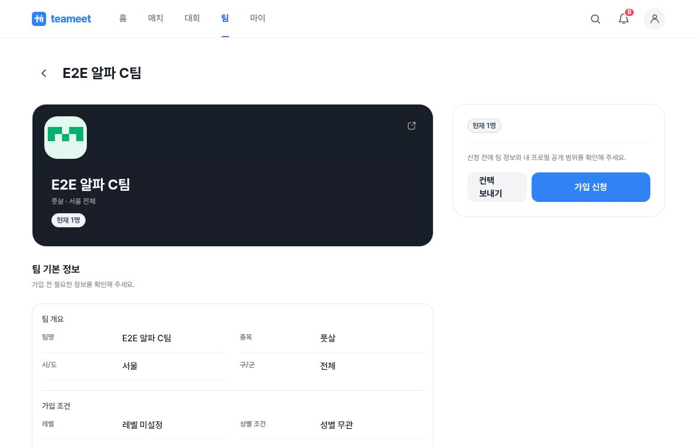
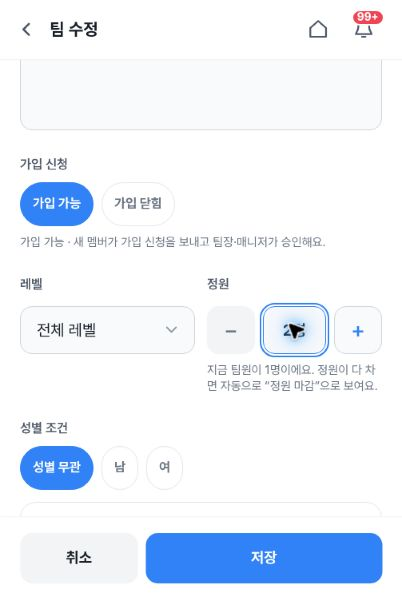
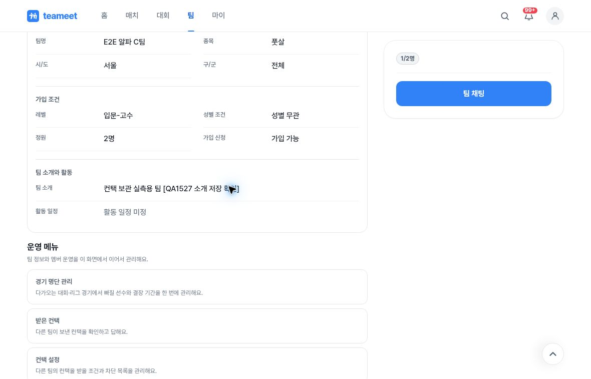
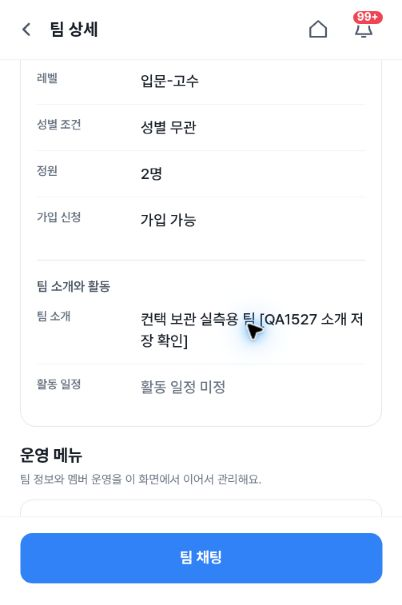
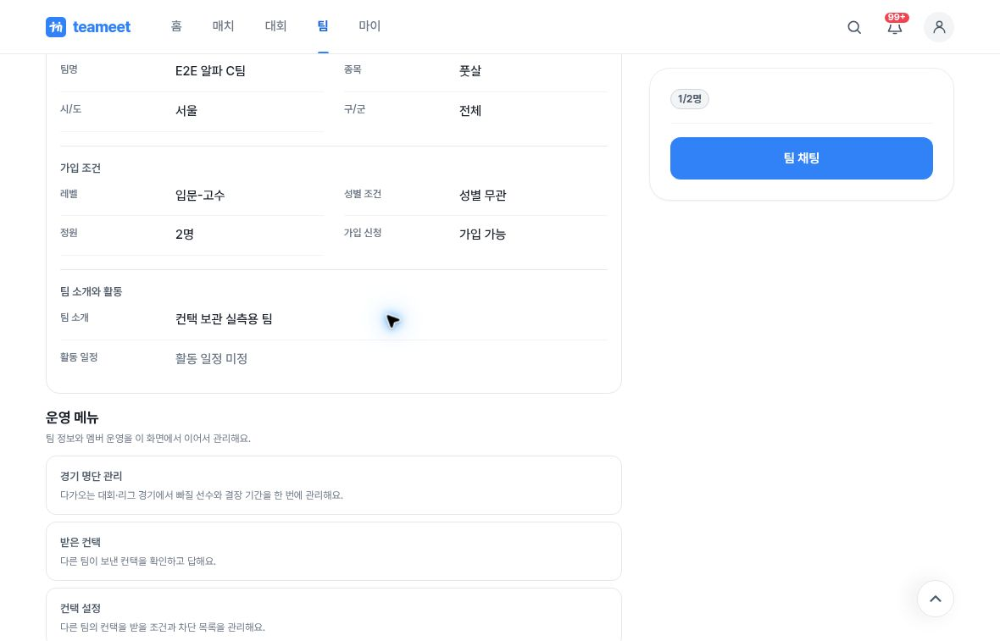

# Alpha QA: introduction-only save changes an unspecified level

Mock fixture: **E2E 알파 C팀**. Environment: https://alpha.teameet.co.kr.
Captured on 2026-10-02, 06:54:38–06:56:47 UTC.

## Observation

The public team detail initially showed **레벨 미설정** (level unspecified). Opening the edit form displayed **전체 레벨** (all levels). The tester changed only the introduction and saved normally. The detail then showed **입문-고수** (beginner–advanced), which persisted after a full reload. Restoring only the original introduction through a second normal save did not restore the unspecified level.

This evidence records a candidate unintended level change. The screenshot sequence proves the visible before/after states; the claim that the level control was untouched comes from the tester’s recorded UI actions. The capture session did not directly identify the page deployment SHA. Capacity also saved as 2, but this evidence package does not classify that capacity behavior as a new defect.

## Screenshot sequence

1. Before editing, level unspecified

2. Edit form: all-levels control and minimum capacity 2, neither changed by interaction

3. Temporary introduction saved; public level now beginner–advanced

4. Mobile full reload preserves the temporary introduction and changed level

5. Original introduction restored and reloaded; changed level remains

## Evidence handling

All five images are original JPEG capture bytes, visually reviewed without cropping, redrawing, or edits. They contain only team detail or edit fields, with no member list, member names, profile IDs, join dates, or credentials. No raw session/proof JSON is included. `metadata.json` records image dimensions, SHA-256 hashes, Git blob hashes, captions, and the verification limits. The screenshots have no EXIF fields.
