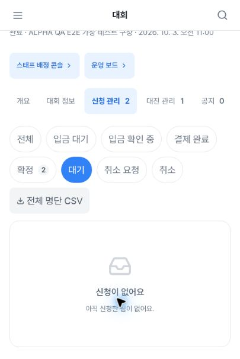
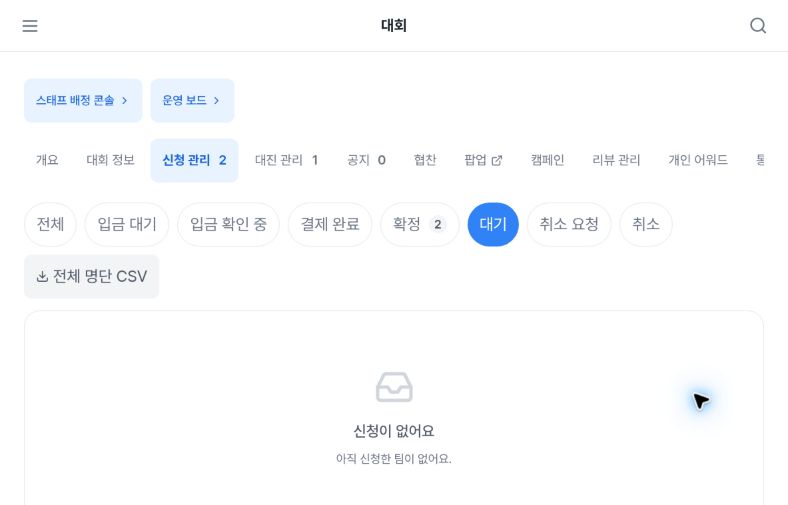
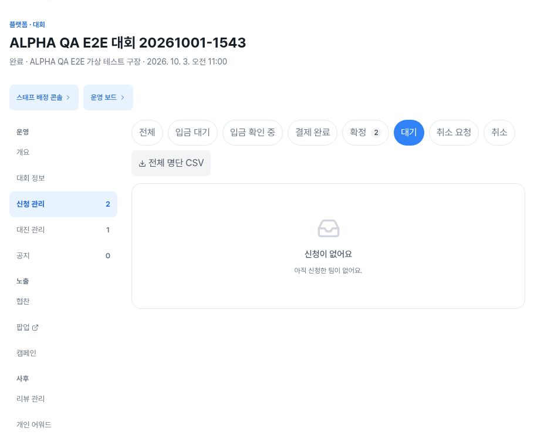

# Admin tournament registrations: filtered empty-state copy evidence

Observed on https://alpha.teameet.co.kr on 2026-10-03 UTC, using synthetic QA tournament data.

## Finding

With **신청 관리 2 / 확정 2** visible and the **대기** filter selected, the empty result says **신청이 없어요 / 아직 신청한 팀이 없어요.** The message implies that no teams have applied at all, although two registrations are visible in the overall count and returning to **전체** restores two review buttons.

This is a misleading filtered-empty message, not evidence that existing registrations were deleted or that the backend lost data. Expected copy should communicate that there are no registrations matching the selected waiting status.

### Reproduction

1. Open the synthetic tournament registration-management page with two confirmed applications.
2. Select **대기**, which has no matching rows.
3. Observe the global-looking empty message while the overall/confirmed counts remain 2.
4. Return to **전체**: the empty message disappears and two **명단 검토** buttons return.

## Images

| CSS viewport | Published raster | Evidence |
|---|---|---|
| 405×606 | 405×606, full viewport |  |
| 789×505 | 788×505, full viewport raster rounding |  |
| 1183×758 | 927×758, global sidebar excluded |  |

## Provenance and limits

- [Sanitized DOM observation timeline](empty-filter-sanitized-proof.json), including **전체** restoration
- [Provenance and screenshot SHA-256](provenance.json)
- Exact UTC values in the DOM timeline are DOM observation timestamps. Screenshot calls did not separately record exact capture times; `captureUTC` is therefore `null`.
- CSS viewport width is **789**, while the tablet PNG is **788** pixels wide. These are distinct measurements, not conflicting device sizes.
- Browser window resizing plus browser zoom was used, not physical-device emulation.
- Desktop screenshot is cropped horizontally to exclude the global sidebar. It is not a full-viewport overflow test.
- Only inspected, sanitized evidence is published. No member names, phone numbers, dates of birth, secrets, original roster screenshots, or full roster DOM are included.
