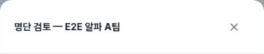
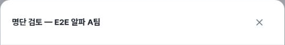
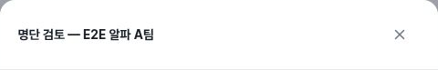

# Admin roster review: initial keyboard focus evidence

Observed on https://alpha.teameet.co.kr on 2026-10-03 UTC, using synthetic QA league/tournament data.

## Finding

Opening **명단 검토** leaves keyboard focus outside the visible dialog. Tab and Shift+Tab can continue through background registration controls. This was observed in league and tournament registration management at CSS viewports **405×606, 789×505, and 1183×758**.

The [sanitized DOM timeline](focus-sanitized-proof.json) is the focus evidence: `activeInModal: false` accompanies background controls such as **명단 검토**, **경기별 명단**, and **마감 예외 허용**. The three league header crops below establish dialog identity only. A screenshot cannot establish initial keyboard focus by itself.

### Reproduction

1. Open the synthetic league or tournament registration-management page with an existing application.
2. Open **명단 검토**.
3. Inspect the active element, then press Tab or Shift+Tab without first manually moving focus into the dialog.
4. Observe that the active element remains outside the dialog or moves to another background control.

Expected: opening the dialog places keyboard focus in the dialog; subsequent keyboard navigation remains within the open dialog.

### Scope and counterchecks

- League mobile: after a supported locator explicitly focused the close button inside the dialog, Shift+Tab/Tab cycled within the dialog. This finding is specifically the initial focus path, not a claim that all focus trapping is broken.
- League tablet: Escape closed the review dialog and focus was on **명단 검토**.
- League desktop: clicking the X closed the review dialog and focus was on **명단 검토**.
- Tournament observations are recorded in the same sanitized timeline; these images are league dialog headers.

## Images

| CSS viewport | Published raster/crop | Evidence |
|---|---|---|
| 405×606 | 373×77 header |  |
| 789×505 | 481×77 header |  |
| 1183×758 | 480×77 header |  |

## Provenance and limits

- [Provenance and screenshot SHA-256](provenance.json)
- Exact UTC values in the DOM timeline are DOM observation timestamps. Screenshot calls did not separately record exact capture times; `captureUTC` is therefore `null`.
- Browser window resizing plus browser zoom was used, not physical-device emulation.
- Tablet full-viewport screenshots rasterize to 788 pixels even though the measured CSS viewport is 789 pixels. The images in this folder are header crops, not full viewports.
- Header crops must not be used to judge full-viewport overflow.
- Only inspected, sanitized evidence is published. No member names, phone numbers, dates of birth, secrets, original roster screenshots, or full roster DOM are included.
