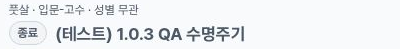
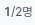

# Completed fixture: desktop list-card supplement

This adds one list-card observation to [issue1587](https://github.com/kim-song-jun/matchup-sports-platform/issues/1587) / [PR1590](https://github.com/kim-song-jun/matchup-sports-platform/pull/1590), separate from the [earlier three-width detail after](https://github.com/kim-song-jun/matchup-sports-platform/blob/53ea4bb37d5f0e2c065a7ece7dccd3a522453c61/docs/qa/2026-10-03-completed-match-after/README.md).

At **2026-10-03T17:36:50.666Z**, the queryless `/matches` page at **1181×757 CSS px, DPR1** contains the exact same fixture anchor. Its card shows **“종료” twice** (badge and status copy), **“1/2명”**, and no **“모집 완료”** text. The list's shorter “종료” wording agrees with the prior detail's completed status/count; the longer detail-specific “종료된 매치예요” phrase is absent from the card, which is not treated as a defect.

Identity was checked by exact resolved href against all six original detail observations and by the same URL SHA256 against all six immutable public detail rows. Public JSON uses the same hash, `f1e57d56506c764aae0c00318e4091dbed950c0678793414b668c987839b2720`, plus a route template. These are observations at different times; the detail flow was not rerun.

[Card DOM](proof.json) · [Later title read](title-supplement.json) · [Scope](summary.json) · [Identity and geometry checks](verification.json) · [Capture provenance](provenance.json) · [Manifest](manifest.json)

## Actual safe crops

**All three crops come from one1181×757 source screenshot**, capture call **17:36:50.670–17:36:50.695Z**, immediately after the main DOM sample. The card rectangle is x598.5,y266,width528,height131 and fits inside the viewport. The two status-node rectangles fit inside that card.

Synthetic title and completed badge:

Participant count:

Card status copy:

The initial title array is empty because its collector queried h1–h4. A separate **17:37:26.613Z** read finds the actual title DIV, “(테스트) 1.0.3 QA 수명주기”, at the same target href. The screenshot predates that supplementary read; its timestamp has not been moved. This is **one card, one desktop viewport, two DOM reads and one capture call producing three crops**.

## Scope and limits

The collector reports the existing list page remained from the **17:03:59.270Z** detail-return observation and was subsequently scrolled normally. No fresh navigation/reload, search/filter action or card click was performed for this supplement. The observed URL has no query string and recorded searchQuery is empty; this is not an audit of every possible hidden filter.

Runtime serving SHA, normalized API status/displayState and viewer role remain unobserved. Same historical persona is not established. This does not test list CTA behavior, link activation, other cards, mobile/tablet lists, permission causes or full issue acceptance. No application, save, notification, result, fixture or role change was performed according to the collector; no HTTP/database audit was collected.

The safe crops exclude host/member names, venues, other cards and account areas. The publisher viewed all three safe crops and checked their hashes/dimensions plus the original URL and remote hashed identity comparison. The full source screenshot was not opened by the publisher; original-to-crop equality is collector-attested.
