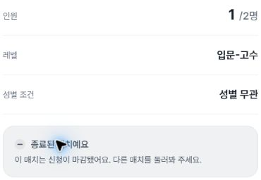
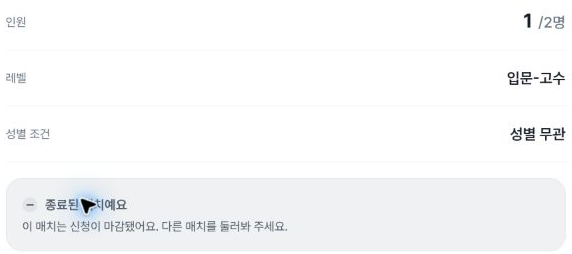
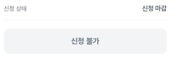
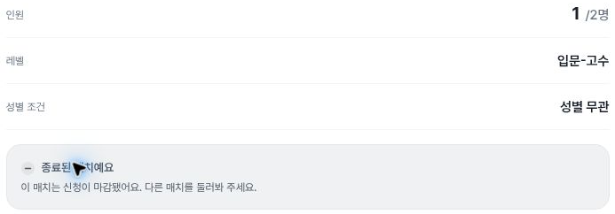

# Completed-match notice after PR1590

Fresh alpha observations for [PR1590](https://github.com/kim-song-jun/matchup-sports-platform/pull/1590), addressing [issue1587](https://github.com/kim-song-jun/matchup-sports-platform/issues/1587). At **402×606,787×505 and1181×757 CSS px**, the observed completed fixture shows **“종료된 매치예요”**, badge **“종료”**, count **“1/2명”**, and one rendered disabled **“신청 불가”** button. The old notice-title query returns zero matches in all six DOM observations.

The [frozen before desktop DOM](https://github.com/kim-song-jun/matchup-sports-platform/blob/877d4a4c0b4a495df88003ea78112981bcce1869/docs/qa/2026-10-03-individual-copy-candidates/individual-detail-copy-proof.json), observed08:49:01.785Z, has the same fixture URL and title “모집 완료”. Its body text is byte-for-byte equal to the current rendered body: “이 매치는 신청이 마감됐어요. 다른 매치를 둘러봐 주세요.” Before evidence independently established the disabled CTA on desktop only; current mobile/tablet disabled states are new observations.

**Same viewer/persona is not established.** The collector reports admin-content access in the current authenticated session immediately before navigation, but match-specific host/participant/viewer role was not exposed or changed. The historical browser viewer is unrecorded. This proves the current displayed copy and controls, not permission equivalence or the backend reason applications are disabled.

[DOM proof](proof.json) · [Navigation](entry.json) · [Exit](exit.json) · [Scope](summary.json) · [Verification](verification.json) · [Capture provenance](provenance.json) · [Manifest](manifest.json)

## Timing and scope

Fresh navigation started **2026-10-03T17:00:09.918Z**, completed **17:00:10.639Z**. It follows the successful [8ec820c Deploy Alpha run](https://github.com/kim-song-jun/matchup-sports-platform/actions/runs/37137230471), whose deploy job completed16:52:37Z and completed-success run updated16:52:38Z. [Deployment context](deployment-context.json) is separate from browser identity: **runtime serving SHA is unknown**.

There are **six DOM records, six source capture calls and nine safe crops**. Per width, badge/CTA and count/notice were captured separately. Each observation has two responsive CTA nodes, only one rendered; both carry disabled=true. Zero-sized hidden copies are preserved in proof and are not counted as two visible buttons. Positive rendered geometry does not imply viewport visibility: badges leave the viewport in later notice observations.

The full title is independently recorded in DOM because the pointer covers a few glyphs in the notice images. The UI status label is not a freshly captured API status/displayState. No application CTA was activated.

## Safe product images

Source rasters are402×605,787×504 and1181×757 pixels, with DPR1.25/1.5/1. Mobile/tablet raster heights differ from DOM CSS heights. All dates below are2026-10-03 UTC. The opaque fixture URL is represented by a route template andSHA256 in public JSON; source hashes retain provenance.

### Mobile

Completed status badge. Proof row0; DOM **17:01:17.250Z**; capture **17:01:17.256Z–17:01:17.270Z**.

Rendered disabled application CTA. Proof row0; DOM **17:01:17.250Z**; capture **17:01:17.256Z–17:01:17.270Z**.

One-of-two count and completed notice. Proof row1; DOM **17:01:17.566Z**; capture **17:01:17.570Z–17:01:17.587Z**.

### Tablet

Completed status badge. Proof row2; DOM **17:02:09.391Z**; capture **17:02:09.398Z–17:02:09.419Z**.

Rendered disabled application CTA. Proof row2; DOM **17:02:09.391Z**; capture **17:02:09.398Z–17:02:09.419Z**.

One-of-two count and completed notice. Proof row3; DOM **17:02:09.720Z**; capture **17:02:09.723Z–17:02:09.743Z**.

### Desktop

Completed status badge. Proof row4; DOM **17:03:04.122Z**; capture **17:03:04.126Z–17:03:04.149Z**.

Rendered disabled application CTA. Proof row4; DOM **17:03:04.122Z**; capture **17:03:04.126Z–17:03:04.149Z**.

One-of-two count and completed notice. Proof row5; DOM **17:03:04.475Z**; capture **17:03:04.479Z–17:03:04.500Z**.

## Return and limits

The visible detail-back-link call is **17:03:58.923–17:03:59.011Z**. The final observation at **17:03:59.270Z** records `/matches` with no visible detail title. No list count/order, scroll restoration or focus return was measured.

Current widths402/787/1181 differ slightly from historical405/789/1183. Header and notice shots are separate page positions, not a simultaneous full-screen claim. Mobile/tablet window scrollY remains0 in the file while element positions change; no inner-container offset was recorded, so that scalar does not establish no scrolling.

This bundle does not cover PR1591's desktop page-title duplication or PR1592's cost description. No signup, save, payment, result change, host action, role switch or other lifecycle fixture was tested according to the collector. No network/database mutation audit or screen-reader speech test was performed. Safe crops exclude participant/host identities, detailed title, venue, image URLs and account areas. The publisher viewed only the nine safe crops; original-to-crop equality remains collector-attested.
