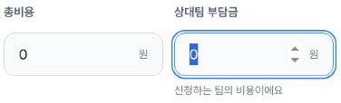
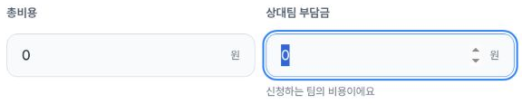
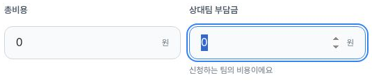

# Cost input description: new three-width evidence

Issue [#1578](https://github.com/kim-song-jun/matchup-sports-platform/issues/1578) / [PR1583](https://github.com/kim-song-jun/matchup-sports-platform/pull/1583). This checks the actual input on `/team-matches/new/condition`, separately from earlier public-detail copy. The new record contains **3 control/AX observations, 5 local-title DOM observations, 6 collector action-call records, 1 exit record and 3 safe crops**.

At **404×606, 787×505 and1180×757 CSS px**, the opponent-fee number input has label **상대팀 부담금** and `aria-describedby` pointing to exactly one non-hidden node containing **신청하는 팀의 비용이에요**. The input is active and `:focus-visible` at all3 endpoints, with exactly one accessible-name match. Both read values remain0; no amount was changed. The total-cost input has no description reference in these records.

The collector reports moving from total cost with actual Tab. The saved evidence contains the focused endpoint, not a separate Tab call log or preceding total-cost-active snapshot. The AX excerpt exposes the active spinbutton and helper as a generic node; the description association is established by DOM linkage. No spoken screen-reader output or separately serialized computed-description field was tested.

[Control DOM and AX excerpts](associated-controls.json) · [Local title observations](draft-proof.json) · [Recorded action bounds](actions.json) · [Scope](summary.json) · [Provenance](provenance.json) · [Independent checks](verification.json) · [Manifest](manifest.json)

## Safe input crops

Mobile404×606, DPR1.25: DOM **2026-10-03T13:54:56.810Z**, capture **13:54:56.835–13:54:56.852Z**.

Tablet787×505, DPR1.5: DOM **13:55:58.712Z**, capture **13:55:58.735–13:55:58.762Z**.

Desktop1180×757, DPR1: DOM **13:55:59.016Z**, capture **13:55:59.039–13:55:59.058Z**.

## Local title handling and limits

The initial visible title and description are empty at **13:53:32.681Z**. A synthetic title is entered; the stored length sequence is **0→17→17→0→0**. Previous returns to a still nonempty17-character title at **13:56:29.958Z**. Explicit clearing is confirmed at **13:56:30.141Z**, then fresh info reentry confirms empty title at **13:56:45.620Z**. Full title values are not stored in these DOM records. Description remains empty at all5 observations.

The separate [exit record](exit.json) places the browser on `/team-matches` at **13:58:29.841Z**. Exit is not deletion of the local draft; other existing draft values may remain. Only the QA title change was explicitly restored. Storage and hidden fields were not comprehensively audited.

The inner numeric INPUT is24px high; no overall44px pointer-target claim is made. The amounts are untouched local defaults, not saved public fixture pricing or a cost-sharing-mode test. No amount save, final creation, payment, team selection, upload, poster-loading or whole-issue PASS is asserted. Action bounds are collector CUA call times, not an independent browser-event log. Runtime serving SHA is unknown.

Safe crop pixels, hashes, dimensions and DOM/capture mapping were independently checked. Original-to-crop equality is collector-attested; originals were not read by the publisher. These are new observations with their own widths and UTCs; earlier blocked input checks are not retroactively relabeled.
