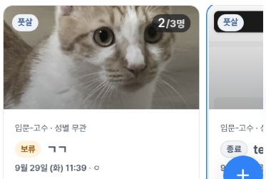
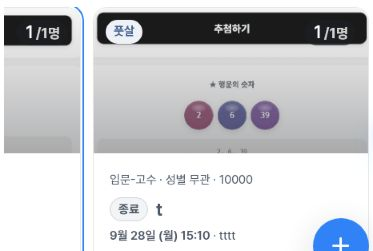
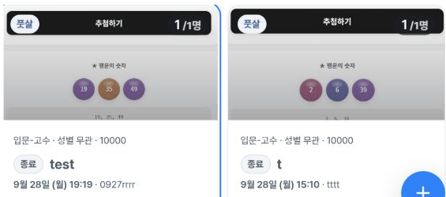
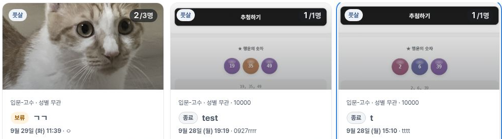

# Individual featured cards: keyboard-focus visibility evidence

Read-only QA on https://alpha.teameet.co.kr on **2026-10-03, 03:52:42.164–03:57:36.039 UTC**, using the individual list with latest sorting and the futsal filter.

## Finding

On the CSS405×606 viewport, Tab reaches the middle featured card, but only approximately **76.8 of its 276 CSS pixels (27.8%)** are horizontally visible in the approximately 364.8px rail. Forward focus leaves rail scrollLeft at 0; after reaching the third card, Shift+Tab returns to the middle card while scrollLeft remains approximately 487.2, clipping the opposite side.

The reverse state remained clipped from the 03:53:12.748 observation to the 03:54:10.603 observation, and the forward sequence was repeated. This was not recorded solely during an immediate animation transition.

Expected: reveal the focused card fully within the horizontal rail when the card fits. Actual: the focused link and outline are present, but most of the middle card is outside the visible rail on mobile.

| Measured CSS viewport | Focused middle-card width visible | Control observation |
|---|---|---|
| 405×606 | 76.8 / 276px | Mostly clipped in forward and reverse focus |
| 789×505 | 272 / 276px | Approximately 4px clipped at an edge; title remains readable |
| 1183×758 | 320 / 320px | Fully visible; all three cards fit |

## Reproduction and controls

1. Open `/matches?sort=latest&sportId=b60abf1d-0caf-477e-ba61-d51984e63151`.
2. With keyboard focus on the preceding final sport link (**수영 0**), press Tab to reach the first featured card, then Tab to the middle card.
3. Observe the middle-card focus rectangle and the unchanged horizontal scroll position.
4. Tab to the third card; it is brought fully into view. Shift+Tab to the middle card and observe the clipping at the opposite edge.

The test used supported locator keyboard entry followed by Tab, Shift+Tab, and Enter, without injected DOM focus or scripted scroll mutation. All three links have tabIndex 0 and matching main-list counterparts.

Enter reached the exact expected detail URL for the second card on mobile, third on tablet, and first on desktop. Tested Back paths preserved the latest/futsal query. Returned focus was BODY and rail scrollLeft was 0; those return observations are context, not an independently established defect.

**Cause is unknown.** No source-code inspection or specific CSS/JavaScript root cause is claimed. This evidence does not declare a definitive WCAG violation.

## Inspected crops

The crops stop before the host-identity row. Cat/test cover artwork remains, while host names and personal photos are excluded. Crop dimensions are not used to calculate focused visibility.

- Mobile forward: 
- Mobile reverse: 
- Tablet control: 
- Desktop control: 

## Evidence

- [Summary](summary.json)
- [Sanitized DOM focus/geometry timeline](rail-safe-proof.json)
- [Exact Enter destinations and return context](rail-destinations-safe.json)
- [Capture UTC bounds, crop provenance, and image hashes](provenance.json)
- [File SHA-256 manifest](manifest.json)

All 17 recorded focused-visibility measurements were independently recomputed as horizontal intersections of the focused card and rail rectangles. All three expected/actual destination pairs match. Observations use resized/zoomed cloud Chromium, not physical-device emulation. CSS tablet width789 and source raster width788 are distinct; published images are crops. No original full screenshots, host/member names, phone numbers, dates of birth, credentials, or profile identities are included.
