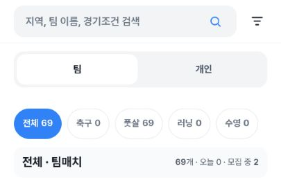
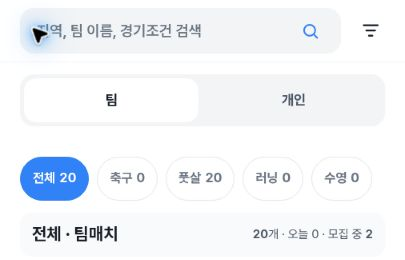
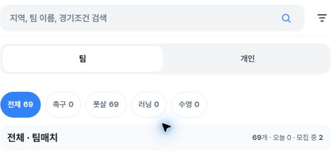
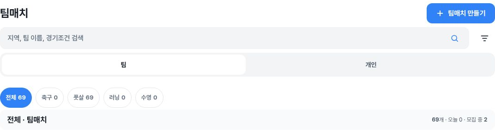
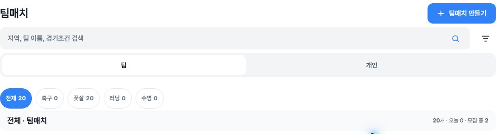

# Match list sorting and pagination: alpha QA evidence

Read-only browser QA on https://alpha.teameet.co.kr during **2026-10-03 03:17:18–03:40:37 UTC**. [Deploy Alpha run 37091460871](https://github.com/kim-song-jun/matchup-sports-platform/actions/runs/37091460871) reports successful deployment of `dbb6468d81809649026e6a9c193d5a982f8a57b6`; the browser itself did not independently expose a build SHA.

## Finding: detail Back loses loaded team-list pages

After loading additional team-match pages, opening a detail and returning through either browser Back or the in-app Back link resets the rendered list to **20 cards**, with More available again.

| CSS viewport | Browser Back | In-app Back |
|---|---|---|
| 405×606 | 69 → 20 | 69 → 20 |
| 789×505 | 69 → 20 | 40 → 20 |
| 1183×758 | 69 → 20 | 40 → 20 |

Four measured combinations lose 49 previously loaded cards; two lose 20 from the actually captured 40-card baseline. All six demonstrate loss of loaded-pagination state. This is not a claim that backend records were deleted.

### Reproduction

1. Open `/team-matches` and use More until additional pages have loaded; wait for the observed card count to settle.
2. Open the completed friendly match `/team-matches/cb3442a3-3cb1-49e3-97ad-0410e4280349`.
3. Return with browser Back or the in-app Back link.
4. The list returns with 20 cards instead of retaining the previously loaded pages.

Expected: returning from detail preserves the loaded list pages. The mobile latest + friendly case retains `sort=latest&kind=friendly`, but also resets the loaded list from 29 to 20.

**Scroll-position restoration was not measured.** No numeric or general scroll-loss claim is made. No before-build comparison establishes that PR #1563 introduced this behavior.

## Before/after header crops

These six images illustrate three 69 → 20 examples. They do not establish a 69-card baseline for the two in-app Back cases recorded at 40.

| Example | Before | After |
|---|---|---|
| Mobile in-app Back |  |  |
| Tablet browser Back |  |  |
| Desktop browser Back |  |  |

## Sorting and filter observations

- Team default and latest pagination each reach 69 unique match URLs without duplicate main-list rows. Repeated and cross-width sequence comparisons are recorded in the summary.
- Default availability groups remain primary; the entire list is not one globally chronological sequence.
- Latest order is different from displayed match-start-date order and stable across widths. Registration/creation timestamps are not exposed, so creation-time ordering semantics are unverified.
- Individual main-list comparisons use 8 rows and exclude the separate 3-card featured rail. Latest + futsal retains its 6-row sequence and query after in-app Back; swimming is empty, and All resets to the original 8.
- Desktop latest team coverage includes resizing already-loaded tablet data; desktop default pagination was loaded separately.

## Evidence and limits

- [Summary and explicit unverified cases](summary.json)
- [Six-case Back comparison](back-comparison-safe.json)
- [Sanitized 44-observation DOM timeline](sort-sanitized-proof.json)
- [Screenshot crop provenance, capture UTC bounds, and SHA-256](screenshot-provenance.json)
- [Sampled console summary](console-summary.json)
- [File checksums](manifest.json)

No schedule-undetermined team card or live time-boundary fixture was available. All 8 individual main-list cards had past dates, so future-date ordering and individual pagination remain unverified. Deadline sorting and exhaustive filter × viewport combinations were not exercised in this pass. Pending client-update observations are explicitly excluded from comparisons.

The console sample contains the latest 50 warning/error entries at 03:34:21.951 UTC, all classified as browser-extension metadata errors; it is not an exhaustive clean-console claim.

Browser viewports were CSS405×606, CSS789×505, and CSS1183×758 using window resizing and browser zoom, not physical-device emulation. Images are pixel-preserving header crops, not full-viewport overflow evidence. Screenshot call start/end UTC bounds are preserved separately from exact DOM observation times.

The original tablet/desktop in-app baseline labels incorrectly anticipated 69 cards. They were corrected to the actual recorded 40 without modifying row data or UTC, and original labels are retained for traceability. No extra UI retest was used for this correction.

Only inspected, sanitized evidence is published: no member or host names, personal photos, phone numbers, birth dates, credentials, or original full screenshots.
