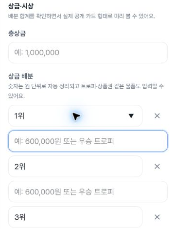
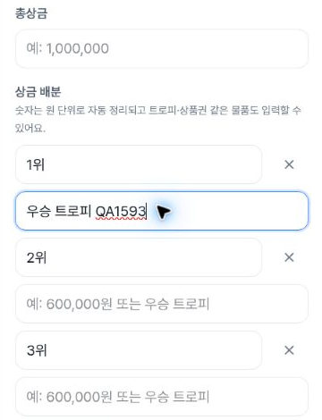
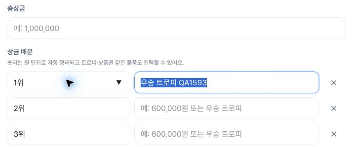
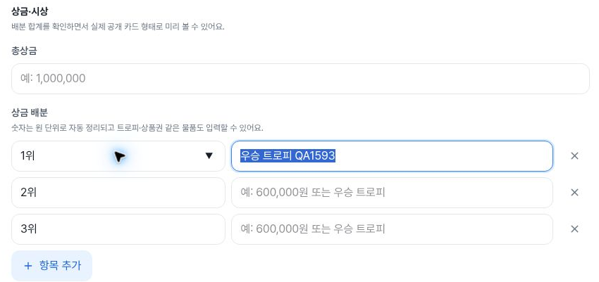

# Tournament creation: prize editor after PR1593

For [issue1439](https://github.com/kim-song-jun/matchup-sports-platform/issues/1439) and [PR1593](https://github.com/kim-song-jun/matchup-sports-platform/pull/1593), this new alpha creation-step4 run shows the mobile prize-content input on its own full-width row. At the same **402×606 CSS viewport**, its width increased from **161.287506px to 328.800018px**, and the full example “예: 600,000원 또는 우승 트로피” is readable in the safe image. The first-row native Tab sequence reaches name → content → delete at all three observed widths.

This package contains **11 step4 DOM snapshots, 31 selected action records and 4 safe crops**, plus separate initial/navigation/exit observations. [Before evidence](https://github.com/kim-song-jun/matchup-sports-platform/blob/c6aa94b4f25d8f94842efb95a70ea61f8155fe1b/docs/qa/2026-10-03-tournament-step4-new/README.md) remains unchanged. Existing-tournament editing is a separate surface and is not included here.

[DOM proof](proof.json) · [Actions](actions.json) · [Entry](entry.json) · [Initial blank state](initial.json) · [Date navigation](navigation.json) · [Exit/reentry](create-exit.json) · [Scope](summary.json) · [Recalculation](verification.json) · [Capture provenance](provenance.json) · [Manifest](manifest.json)

## Width and keyboard observations

| Current CSS viewport | Content width | Total-prize width | Layout | Earlier CSS viewport / content width |
| --- | ---: | ---: | --- | --- |
| 402×606, DPR1.25 | 328.800018px | 328.800018px | Name/delete above; content below with 8px gap | 402×606 /161.287506px |
| 789×505, DPR1.5 | 374px | 683.333374px | Name/content/delete on one row | 787×505 /373.208344px |
| 1183×757, DPR1 | 456.609375px | 821px | Name/content/delete on one row | 1181×757 /455.40625px |

Only mobile is an exact CSS-viewport comparison. Tablet and desktop are 2px wider than before; their small width changes are not attributed to the fix. Empty rows in all four images show the complete example. Input clientWidth equals scrollWidth, but that is not the basis of the placeholder-readability conclusion.

The nine saved first-row name/content/delete endpoints (three per width) have `focusVisible:true`, 44px-high targets, and rectangles inside the corresponding viewport. Each delete target is 44×44px. Six native Tab calls support the forward routes. Three Shift+Tab calls are recorded, but there is no separate reverse-endpoint DOM sample. On mobile, delete is visually above content while the native forward order remains name → content → delete. Delete was focused, not activated. This is a bounded route check, not a full editor keyboard, screen-reader speech or WCAG audit. Other rows and the entire footer region are not certified unobscured.

## Local value retention and exit

One synthetic content value, “우승 트로피 QA1593”, was entered on mobile. Actions record step4 → step3 → step4; the returned step4 DOM at **18:37:19.871Z** retains that value, and subsequent tablet/desktop samples retain it through resizing. There is no separate step3 DOM snapshot. Default rank names remain 1위/2위/3위; total prize and the other two content fields remain empty.

The entered content was explicitly cleared and observed empty at **18:39:08.991Z before Cancel**. Cancel therefore does not prove that it cleared the prize field. After returning to step1, the first Cancel call is **18:39:09.320–18:39:09.592Z**. The immediate sample at **18:39:09.652Z** is still the creation URL and is excluded from settled-exit success. At **18:39:23.039Z**, the list URL is observed with the title input absent. These observation gaps are not navigation-latency measurements.

Actual create-link reentry at **18:40:07.002Z** shows mounted title and sport fields empty. Prize fields are unmounted at step1, so hidden prize reset/storage cleanup is unverified. A second Cancel returned but a 3-second URL wait timed out according to the collector. The top list link was then used at **18:41:02.763–18:41:02.855Z**; the final observation at **18:41:13.778Z** is `/admin/tournaments`, with the title input absent. That second Cancel is not counted as successful navigation.

## Images and timing

Fresh navigation began **2026-10-03T18:34:06.740Z** and completed **18:34:07.299Z**. [Deploy Alpha run37143395492](https://github.com/kim-song-jun/matchup-sports-platform/actions/runs/37143395492) for commit `27a021fc7650672d5af25217108b101dc856c8d5` has success metadata updated **18:31:28Z**, with the deploy job completed **18:31:27Z**. [Workflow metadata](deployment-context.json) establishes the time boundary; **browser runtime serving SHA remains unknown**.

The step4 DOM window is **18:36:27.295–18:39:08.991Z**; final exit is **18:41:13.778Z**. Source rasters are mobile **402×605**, tablet **789×505**, and desktop **1183×757 pixels**. Mobile raster height differs from CSS height606. Capture-call intervals below are distinct from DOM times.

Mobile empty content focused: DOM **18:36:27.448Z**; screenshot **18:37:00.380–18:37:00.403Z**. The screenshot starts **32.932 seconds later**; no continuous-state claim bridges that interval.

Mobile synthetic content retained after the stepper return: DOM **18:37:19.871Z**; screenshot **18:37:19.877–18:37:19.895Z**. Its scroll position differs from the first mobile image.

Tablet: DOM **18:38:09.829Z**; screenshot **18:38:09.834–18:38:09.857Z**.

Desktop: DOM **18:38:37.399Z**; screenshot **18:38:37.404–18:38:37.435Z**.

## Limits

Minimal local title/sport/date setup was used to reach step4. Date inputs record `2026-10-17T11:35` and deadline `2026-10-14T23:59`; these are local input strings, not timezone-converted instants. Two unmatched selectors are excluded from successful-action counts. The 31 records are selected calls, not every browser event or a network audit.

All 11 step4 samples show one disabled step5 button. No step5/final-summary, creation, save, upload, publication, Enter activation, or promotion toggle was exercised in this run according to the collector. A visible submit button is not proof of successful creation. Earlier promotion toggle evidence is not rerun by these observations. No server-write absence, permission contract, database state, virtual keyboard, whole-app acceptance, or all-long-values-at-once readability is established.

All four public crops were independently viewed and their bytes, dimensions, bounds and chronology checked. They contain generic form labels, default ranks and synthetic QA text. Original full screenshots remain unpublished and were not opened by the publisher; original-to-crop equality is collector-attested. Public entry/summary remove internal deployment attribution and retain only independently retrieved workflow metadata. Source inputs and source hashes are preserved.
