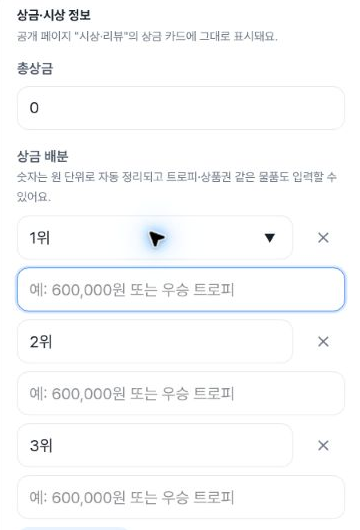
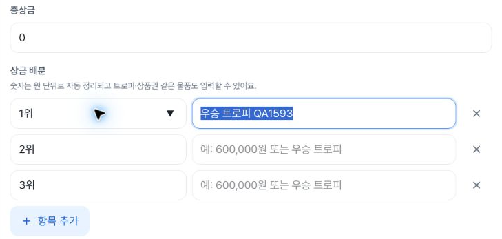
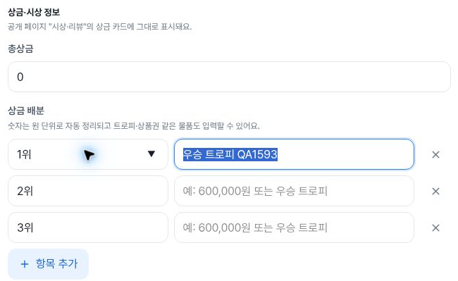
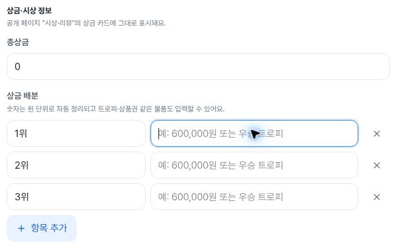

# Existing tournament: inline prize editor after PR1593

This package checks the existing synthetic tournament's Info prize editor for [issue1439](https://github.com/kim-song-jun/matchup-sports-platform/issues/1439) / [PR1593](https://github.com/kim-song-jun/matchup-sports-platform/pull/1593). At **402×606 CSS px**, the content input occupies a separate full-width **328.800018px** row and the full cash-or-trophy example is readable. The selected native keyboard routes retain focus on their intended controls. One synthetic local value persists through resizing; leaving Info and reentering restores all eight observed baseline values.

**There is no matching historical edit-surface before.** These are current after-only observations, separate from the [creation before/after package](https://github.com/kim-song-jun/matchup-sports-platform/blob/19280a0023f8fe8cc420522be6bf500e52129d00/docs/qa/2026-10-03-prize-create-after/README.md). Creation widths and retention results are not substituted for this surface.

[DOM proof](proof.json) · [Actions](actions.json) · [Earlier mobile actions](prelude-actions.json) · [Entry](entry.json) · [Eight-field baseline](initial.json) · [Away/reentry equality](discard.json) · [Exit](exit.json) · [Scope](summary.json) · [Recalculation](verification.json) · [Capture provenance](provenance.json) · [Manifest](manifest.json)

## Geometry and keyboard scope

| CSS viewport | Content width | Total-prize width | Content layout |
| --- | ---: | ---: | --- |
| 402×606, DPR1.25 | 328.800018px | 328.800018px | Below name/delete with 8px gap |
| 789×505, DPR1.5 | 383.604187px | 699.333374px | Same row as name/delete |
| 1183×757, DPR1 | 341.40625px | 629px | Same row as name/delete |

All selected first-row input targets are 44px high; delete controls are 44×44px. Document width equals viewport width in all 13 proof rows. The active target's rectangle fits the viewport and `focusVisible` is true in each row. This does not assert that the full prize region, every field, the Add button and Save button are simultaneously visible. Desktop has a narrower editor container than tablet; these are observed dimensions, not a measured regression.

The package contains **13 DOM snapshots and 17 main selected action records**, plus **3 earlier edit action records** retaining original indices31–33 from a combined capture log. Those indices do not mean 34 edit actions, and earlier creation calls are not counted again. Two discovery frames made with the combined collector are excluded; this package uses its own 13-row proof and four fresh capture intervals.

On mobile, the actual name→content Tab is recorded at **18:43:54.488–18:43:54.557Z**. The first saved proof endpoint is **18:45:11.074Z**, **76.517 seconds after that call ended**. It is a later content-focus observation, not an immediate endpoint or a continuous-state measurement. The collector reports no intervening product change. A separate initial mobile name-focus DOM sample is not included.

Mobile then records content→delete Tab and delete→content Shift+Tab endpoints. Tablet and desktop each record name→content→delete and reverse delete→content. Across the prelude/main ledgers there are six forward Tab calls and three Shift+Tab calls; the three reverse endpoints are independently saved at rows2/7/11. Eleven of the 13 rows are keyboard-related endpoints, with one local-entry and one restored endpoint. Delete is focused, not activated. This is one selected first-row route per width, not full editor keyboard or screen-reader speech certification. Mobile visual order keeps delete above content while native forward order is name→content→delete.

## Local draft and return

The baseline at **18:43:54.485Z** contains eight observed values: total prize `0`, default ranks1위/2위/3위, three blank content fields and an existing synthetic test-only description. Only the first content field receives “우승 트로피 QA1593”. It is present at **18:45:36.366Z** and retained through tablet/desktop resizing; the other seven values match the baseline throughout.

The inline prize region's recorded Cancel/reset control count is zero. No Cancel click is claimed. The actual Overview-link call at **18:46:32.280–18:46:32.374Z** is followed by an Overview URL and zero prize inputs at **18:46:32.643Z**. Info-link reentry at **18:46:51.715–18:46:51.795Z** is followed by the restored endpoint at **18:46:52.581Z**. All eight name/value pairs exactly match the initial baseline, including the first content becoming blank. These observations establish UI restoration after route-away/reentry; they do not inspect component identity, local storage or the database.

Final Overview-link call: **18:47:09.800–18:47:09.875Z**. Final observation: **18:47:10.116Z**, Overview URL, zero prize fields and zero visible dialogs. Save was not activated according to the collector; this is not a network-write audit. The enabled Save button and `insideForm:false` metadata do not establish save behavior or permission correctness.

## Safe images and time attribution

Fresh navigation began **2026-10-03T18:43:18.324Z** and completed **18:43:18.652Z**. It follows [Deploy Alpha run37143395492](https://github.com/kim-song-jun/matchup-sports-platform/actions/runs/37143395492), commit `27a021fc7650672d5af25217108b101dc856c8d5`, success metadata updated **18:31:28Z**. [Deployment context](deployment-context.json) is separate from browser identity: **runtime serving SHA remains unknown**.

The source rasters are mobile **402×605**, tablet **789×505** and desktop **1183×757 pixels**. Mobile CSS height is606, distinct from raster height605. Full example readability is based on these actual pixels, not input scrollWidth/clientWidth equality. Empty rows show the full example; the restored desktop first row has partial pointer occlusion, with the other empty rows providing readable examples.

Mobile empty content focused: DOM **18:45:11.074Z**; screenshot **18:45:11.079–18:45:11.093Z**.

Tablet retained synthetic value: DOM **18:46:00.131Z**; screenshot **18:46:00.136–18:46:00.158Z**.

Desktop retained synthetic value: DOM **18:46:31.855Z**; screenshot **18:46:31.861–18:46:31.884Z**.

Desktop baseline restored after leaving and reentering: DOM **18:46:52.581Z**; screenshot **18:46:52.588–18:46:52.616Z**.

## Limits and provenance

The run uses the current admin session and a synthetic fixture. No matching before viewer, API status or browser bundle identity is established. No Save, Enter activation, creation, upload, step5, publication, promotion interaction, result update, network/database inspection, virtual keyboard or screen-reader speech is exercised in this package. The action lists are selected records, not an exhaustive audit. Arbitrarily long single-line values need not fit at once. Full issue or whole-app acceptance is not inferred.

All four safe crops were independently viewed and their hashes, dimensions, crop bounds, DOM mappings and timestamps checked. They contain generic labels, ranks, zero and synthetic QA text. Original screenshots remain unpublished and were not opened by the publisher; original-to-crop equality remains collector-attested. Public JSON replaces opaque tournament URLs with templates and hashes, retaining shared fixture identity across Info and Overview without publishing the identifier. Original safe source files and their hashes remain unchanged; the manifest covers the projected public bytes.
