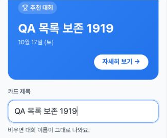
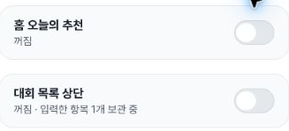
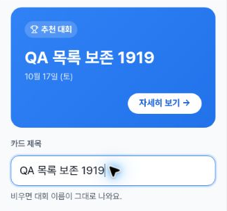
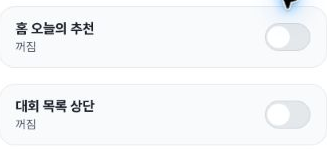

# Promotion title retention: new List check and bounded Home history

This supplements [issue1439](https://github.com/kim-song-jun/matchup-sports-platform/issues/1439) with a new **402×606 CSS px, DPR1.25** creation-step4 List promotion check. The actual custom-title input value **“QA 목록 보존 1919”** matches before OFF, after turning ON again, and after step4 → step3 → step4. OFF shows **“꺼짐 · 입력한 항목 1개 보관 중”** with zero recorded mounted editing fields. This is one representative List title at one width.

The new bundle contains **7 promotion DOM snapshots, 23 selected action records and 5 safe crops**, plus separate initial/navigation/step-away/exit observations. Historical Home evidence is reused below as an older report, not counted as a fresh Home or three-width exact-value run.

[DOM proof](proof.json) · [Actions](actions.json) · [Entry](entry.json) · [Initial state](initial.json) · [Date navigation](navigation.json) · [Step-away](step-away.json) · [Exit](exit.json) · [Scope](summary.json) · [Value checks](verification.json) · [History and source contract](prior-evidence-and-contract.json) · [Capture provenance](provenance.json) · [Manifest](manifest.json)

## Current List sequence

| Proof row / UTC | List state | Mounted fields | Actual title value |
| --- | --- | ---: | --- |
| 0 /19:20:35.154 | ON baseline | 9 | Empty |
| 1 /19:20:35.276 | ON after entry | 9 | QA 목록 보존 1919 |
| 2 /19:20:35.642 | OFF, one item retained | 0 | Unmounted, unavailable |
| 3 /19:20:55.730 | Reenabled | 9 | QA 목록 보존 1919 |
| 4 /19:20:56.878 | Returned from step3 | 9 | QA 목록 보존 1919 |
| 5 /19:21:57.840 | Explicitly cleared | 9 | Empty |
| 6 /19:21:58.177 | OFF restored | 0 | Unmounted, unavailable |

The exact input values, rather than preview fallback text alone, establish retention. OFF does not expose the title input, so its value is unavailable at that instant; the reenabled input supplies the retention check. The separate step-away observation at **19:20:56.112Z** shows “참가 조건” and zero promotion switches before the recorded return.

Only the title changes. After explicitly clearing it, all **nine named List values** equal their initial mounted baseline; the other eight values are equal in every mounted sample. The baseline includes date copy **“10월 17일 (토)”** and priority **“0”**, so it is not an all-empty-fields baseline. Home stays OFF with zero recorded fields in every current proof row. Final Home/List summaries both read plain “꺼짐”.

The nine fields are mounted DOM observations, not nine simultaneously visible controls. Some rectangles are outside the viewport. Each sampled field is44px high, but this run does not certify every control's visibility or keyboard access. The active-element label is null on input rows; named field records separately identify the title and its value. No accessible-name, full tab-order, Space, screen-reader or virtual-keyboard result is inferred.

## Images and exact capture intervals

All times below are **2026-10-03 UTC**. Source rasters are **402×605 pixels**, distinct from the **402×606 CSS viewport**. Output crops are327px wide. DOM time and screenshot-call intervals remain separate.

Entered List title and preview: DOM **19:20:35.276Z**, capture **19:20:35.281–19:20:35.303Z**.

List OFF with one retained item, Home OFF: DOM **19:20:35.642Z**, capture **19:20:35.645–19:20:35.670Z**.

List reenabled with the same actual title: DOM **19:20:55.730Z**, capture **19:20:55.736–19:20:55.756Z**.

Step4→3→4 return with the same actual title: DOM **19:20:56.878Z**, capture **19:20:56.887–19:20:56.913Z**.

Explicit clear followed by both promotions OFF: DOM **19:21:58.177Z**, capture **19:21:58.184–19:21:58.202Z**.

## Cleanup and untested submission

The changed List title is directly restored before exiting. After returning to step1, the local wizard title and sport are explicitly reset to blank; the snapshot at **19:21:58.667Z** records both blank and one disabled step5 button. The actual Cancel-link call is **19:21:58.670–19:21:58.758Z**. At **19:21:58.930Z**, the URL is `/admin/tournaments`, promotion-switch count is0, and the wizard title is absent. Cancel was not needed to establish the already-explicitly-cleared title. Date fields are not rechecked after exit, and UI exit does not audit storage erasure.

The local navigation date strings are start `2026-10-17T12:19` and deadline `2026-10-14T23:59`; these are input strings, not timezone-converted instants. Save/final creation, step5/final summary, Enter, upload and publication were not performed according to the collector. Seven proof snapshots and the final basic-state snapshot show step5 disabled. The 23 selected calls are not an exhaustive event or network log.

## Historical Home evidence, kept separate

The [PR1492 QA comment posted 2026-10-01T21:53:17Z](https://github.com/kim-song-jun/matchup-sports-platform/pull/1492#issuecomment-5941415210) reports title entry, OFF showing one retained item, and ON retaining the value, in a deployment context identified there as `c2c1501f3`. It supplies no exact entered string or per-action UTC.

The publisher independently viewed its already-public [390px OFF](https://github.com/kim-song-jun/matchup-sports-platform/blob/b772e9b6eb077ac9286a054c527fbb6b57789a8f/.screenshots/alpha-qa-1001/1492-promo-off-390.png), [768px OFF](https://github.com/kim-song-jun/matchup-sports-platform/blob/b772e9b6eb077ac9286a054c527fbb6b57789a8f/.screenshots/alpha-qa-1001/1492-promo-off-768.png), [1440px OFF](https://github.com/kim-song-jun/matchup-sports-platform/blob/b772e9b6eb077ac9286a054c527fbb6b57789a8f/.screenshots/alpha-qa-1001/1492-promo-off-1440.png), and [390px ON](https://github.com/kim-song-jun/matchup-sports-platform/blob/b772e9b6eb077ac9286a054c527fbb6b57789a8f/.screenshots/alpha-qa-1001/1492-promo-on-390.png) images. OFF images show Home's retained-one summary and List's plain OFF. The ON image shows Home preview text; its actual title input is outside the image, so exact custom input versus fallback remains unresolved. Three OFF screenshots do not prove three complete exact-value retention runs. Those historical images are linked, not copied into this new evidence tree. No current Home, tablet or desktop value-retention execution is added.

## Bounded static source support and deployment timing

The immutable [promotion component at27a021](https://github.com/kim-song-jun/matchup-sports-platform/blob/27a021fc7650672d5af25217108b101dc856c8d5/apps/v1_web/src/components/admin/tournaments/promo-card-fields.tsx) spreads the previous value for each text/toggle update. The [creation page](https://github.com/kim-song-jun/matchup-sports-platform/blob/27a021fc7650672d5af25217108b101dc856c8d5/apps/v1_web/src/app/admin/tournaments/new/page.tsx) dispatches `set-promo`, and the [reducer/withPromoValue](https://github.com/kim-song-jun/matchup-sports-platform/blob/27a021fc7650672d5af25217108b101dc856c8d5/apps/v1_web/src/app/admin/tournaments/new/tournament-create-model.ts) update local state. No autosave or localStorage write occurs in those inspected update bodies. Comparing the corresponding c2c1501f and27a021 sources finds only toggle visual markup changed in the promotion component; the reducer and withPromoValue function text are identical. This supports the inspected path's local-state behavior, not a global or runtime absence assertion.

The application does have [query-cache localStorage persistence](https://github.com/kim-song-jun/matchup-sports-platform/blob/27a021fc7650672d5af25217108b101dc856c8d5/apps/v1_web/src/lib/query-persist.ts). That implementation excludes admin/auth/me query segments and mutation dehydration. It is incorrect to say the whole application lacks localStorage. Form submission, image selection and start-registration have separate mutation calls in the inspected page; none is tested here. No browser network/database/storage audit was performed.

New navigation ran **19:18:26.376–19:18:26.927Z**, after [Deploy Alpha run37143395492](https://github.com/kim-song-jun/matchup-sports-platform/actions/runs/37143395492) for27a021 recorded success at its **18:31:28Z** update. [Deployment metadata](deployment-context.json) is contextual; **runtime serving SHA remains unknown**. Current observations, historical Home report and static source comparison are distinct evidence types and times.

All five current crops were independently viewed and verified against supplied output hashes, dimensions, bounds and proof mappings. They show generic controls and synthetic QA text. Original private screenshots were not read or published; source-to-crop equality remains collector-attested. The source inputs remain unchanged. This bounded representative-title result does not certify every field type, every width, all of issue1439 or the whole app.
