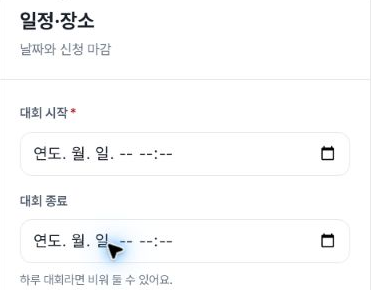

# Direct tournament stepper: new mobile observation

Issue [#1437](https://github.com/kim-song-jun/matchup-sports-platform/issues/1437), scoped to direct stepper buttons and local field retention. This new **404×606 CSS px, DPR1.25** execution contains **9 DOM records, 6 collector action-call records, 3 stepper transitions and 2 safe crops**, observed **2026-10-03T13:33:06.358–13:34:39.975Z**.

After a local synthetic title and sport selection, the collector clicks step2, step1 and step2 again. Each resulting DOM observation records the corresponding **H2 as activeElement, tabIndex−1**. Returning to step1 preserves the exact local title and selected sport. Step2 null field reads indicate absent mounted fields and do not establish clearing.

The header list-link exit is followed by a fresh step1 observation with empty title and sport, then a final list observation. These endpoints do not establish the state of unmounted fields or server storage. Server-write actions are reported as0; no independent network audit was performed.

[DOM proof](proof.json) · [Action call bounds](actions.json) · [Scope and limits](summary.json) · [Provenance](provenance.json) · [Independent checks](verification.json) · [Manifest](manifest.json)

## Actual safe crops

Step2 heading and blank date controls: DOM **13:33:42.225Z**; capture **13:33:42.228–13:33:42.245Z**. This is later than the initial step2 endpoint at13:33:06.823Z.

Returned step1: DOM **13:33:42.569Z**; capture **13:33:42.572–13:33:42.601Z**. The pointer partly obscures the title; full string retention is established by DOM.

The crops show bounded visible form content; active focus and navigation method require the accompanying records. No scrollY, layout geometry or `:focus-visible` values were measured. Consequently this evidence does not claim full scroll restoration or a visible focus ring. Action times are collector CUA call bounds, not an independent browser-event log.

The prior unpublished files were lost. This new mobile execution does not reconstruct them, change their timestamps, or substitute for previous tablet/desktop runs. Runtime serving SHA is unknown. Dates, stage3–5, final Create and the complete issue regression suite are outside this record.
