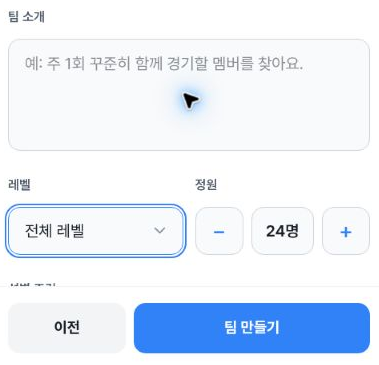
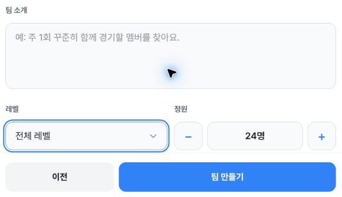
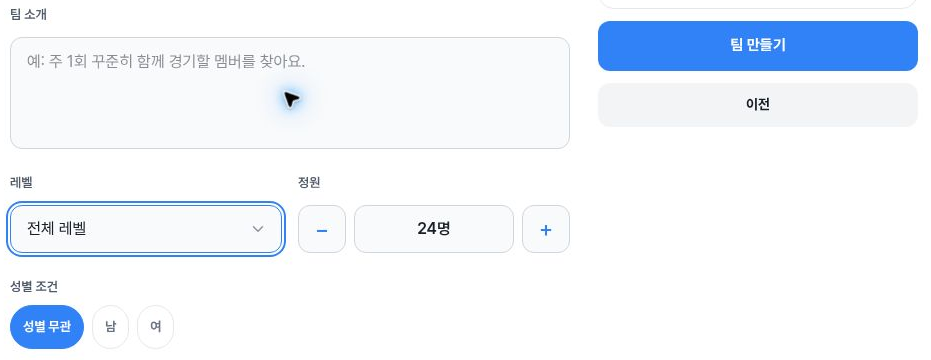

# Blank team form: focus and Previous-link reentry

Issue [#1534](https://github.com/kim-song-jun/matchup-sports-platform/issues/1534) / [PR1539](https://github.com/kim-song-jun/matchup-sports-platform/pull/1539). New observations at **402×606, 787×505 and1180×757 CSS px** contain **18 focus DOM records:12 applicable field endpoints and6 BODY observations**, plus **22 collector action-call records,4 route snapshots and3 safe crops**. Overall observation range: **2026-10-03T14:22:36.567–14:28:03.013Z**.

At each width, the collector opens **더 꾸미기**, clicks the blank **팀 소개** field, then uses native **Tab→레벨, Shift+Tab→팀 소개, Tab→레벨**. All12 recorded field endpoints have `focusVisible=true`, matching active AX lines, and rectangles wholly within the viewport. Recalculated two-dimensional intersection with both the CTA ancestor and button is0 at every applicable endpoint.

- Mobile: level bottom **485.200012px**, bottom-fixed CTA ancestor top **516.799988px**, clearance about**31.6px**
- Tablet: level bottom **412px**, bottom-fixed CTA ancestor top **416px**, clearance **4px**
- Desktop: CTA is a **sticky right panel**, x642,width320. It is spatially separate from the fields; a bottom-footer comparison would be inappropriate

The level SELECT is48px high at all6 level endpoints. The6 BODY rows retain their original geometric overlap=true, including2 desktop BODY rectangles extending below the viewport. Their `focusComparisonApplicable=false` makes them inapplicable to field-obstruction assessment.

[Focus DOM proof](proof.json) · [Action call bounds](actions.json) · [Route snapshots](routes.json) · [Scope](summary.json) · [Independent geometry checks](verification.json) · [Provenance](provenance.json) · [Manifest](manifest.json)

## Actual safe crops

Mobile402×606, DPR1.25: DOM **14:22:37.473Z**, capture **14:22:37.491–14:22:37.508Z**.

Tablet787×505, DPR1.5: DOM **14:26:15.147Z**, capture **14:26:15.169–14:26:15.193Z**.

Desktop1180×757, DPR1: DOM **14:27:20.007Z**, capture **14:27:20.025–14:27:20.049Z**.

## Exit, reentry and limits

At each width, the action ledger records a visible **이전** link click, a `/teams` route snapshot, then the visible team-create link. Reentry DOM rows5/11/17 have empty team name/introduction and a collapsed optional section. The collector’s emptiness checks use the attached field value and return null if the field is absent; the collapsed introduction remains attached. Other hidden fields were not audited.

**A second keyboard focus sequence after reentry is not recorded.** This set establishes the first focus sequence and the subsequent blank reentry separately. No populated values were entered or cleared, so it does not prove storage cleanup or populated-form reset. Keyboard traversal from the image chooser was not replayed; introduction focus began by click. Selection values were not serialized for before/after comparison.

The large gaps between Previous-call completion and list snapshots are observation gaps, not measured navigation latency. CUA call bounds and capture/DOM times are distinct. The final `/teams` observation is **14:28:03.013Z**.

No typed values, option changes, creation, upload or Enter actions were performed according to the collector. Default capacity, region, sport or level values may remain populated. This is not a creation E2E, role/permission, screen-reader speech or whole-app test. Runtime serving SHA is unknown.

Actual safe pixels, local hashes, PNG dimensions and capture mappings were checked. Source-original pixel equality remains collector-attested; originals were not read by the publisher.
