# Terms keyboard after: placement focus, consent reset and native popups

New live alpha observations for [PR1589](https://github.com/kim-song-jun/matchup-sports-platform/pull/1589), addressing the remaining keyboard branch of [issue1464](https://github.com/kim-song-jun/matchup-sports-platform/issues/1464). **At all three tested widths, consecutive ArrowDown/ArrowUp changes placement signup→tournament_application→signup while retaining SELECT focus and focus-visible. The earlier SELECT→BODY failure did not recur in these sequences.**

The [frozen before evidence](https://github.com/kim-song-jun/matchup-sports-platform/blob/67e0c72e1a18241a4383f274159b778b324d3613/docs/qa/2026-10-03-terms-keyboard-residual/README.md) used405/789/1183px; this run uses **402×606,787×505,1181×757 CSS px**, DPR1.25/1.5/1. They are the same responsive regimes, not identical pixel conditions. This is **60 keyboard DOM endpoints,1 fresh-editor reentry record,67 selected action-call records,3 name-query snapshots and15 safe images**, including6 native popup crops. It is not61 keyboard cycles or a full-panel accessibility result.

[DOM/AX proof](proof.json) · [Action calls](actions.json) · [Initial navigation](entry.json) · [Name-query counts](names.json) · [Final local values](final-local-state.json) · [Exit/reentry](exit-and-reentry.json) · [Scope](summary.json) · [Recalculation](verification.json) · [Capture provenance](provenance.json) · [Manifest](manifest.json)

## Actual loading and deployment boundary

The only recorded full navigation is **2026-10-03T16:47:40.916–16:47:41.237Z**. It follows the successful [6d2e45a Deploy Alpha run](https://github.com/kim-song-jun/matchup-sports-platform/actions/runs/37137219676): deploy job completion16:45:26Z, completed-success run updated16:45:27Z. During QA, the [8ec820c integrated deployment](https://github.com/kim-song-jun/matchup-sports-platform/actions/runs/37137230471) completed its deploy job16:52:37Z and updated the successful run16:52:38Z. [Workflow context](deployment-context.json) preserves these independently retrieved times.

Mobile keyboard observations are **16:49:45.783–16:51:00.822Z**, tablet **16:51:41.179–16:52:06.237Z**, and desktop **16:52:38.571–16:53:03.831Z**. The collector reports no reload or goto after initial entry; later hub-tab actions stayed in the SPA. **Runtime serving SHA and loaded bundle identity are unknown.** Desktop's later timestamp does not prove the existing page switched bundles, and the integrated deployment is not attributed retrospectively to mobile/tablet results.

## Observed keyboard behavior

- Placement ArrowDown/Up preserves its active SELECT and focus-visible. Recorded scrollY stays unchanged across the initial three placement endpoints at each width
- Consent required→optional→required retains SELECT focus. Setting optional then changing placement resets consent to required; footer resets it to display_only with the corresponding option set; ordinary placements restore required
- Space opens each native select popup. Six desktop-captured popup crops visibly show the available choices. Separate AX snapshots report expanded; after Escape they report collapsed, with DOM value and SELECT focus retained
- Tab traverses placement→consent→order; Shift+Tab returns order→consent→placement. This is the named control subsequence, not the entire editor or exposure-checkbox/save-button traversal
- Reported exact-name query counts are one placement combobox, one consent combobox and one order spinbutton per width, supported by named AX endpoints. names.json contains counts rather than query expressions. Wrapping labels have empty id/for strings; no explicit id/for association is claimed

All60 keyboard endpoints remain within the editor and report focus-visible. All three controls are44px high. Mobile stacks them; tablet/desktop put them on a row. At the focused order endpoints:

| CSS viewport | Order bottom | CSS bottom clearance |
| --- | ---: | ---: |
| 402×606 | 605.625px | 0.375px |
| 787×505 | 406.333344px | 98.666656px |
| 1181×757 | 532px | 225px |

**Mobile focus-outline clearance is not established.** Before order receives focus, its border ends608.825012px, below the606px viewport. Tab to order scrolls about3.2px and moves its border inside, but its bottom outline reaches the edge. The browser-tab source raster is only605px high. The safe image does not establish the complete bottom focus outline or generous spacing.

## Safe images

Nine browser-tab crops show changed placement, footer consent reset and order focus. Their source rasters are402×605,787×504 and1181×757 pixels, distinct from the corresponding CSS heights. Six native popup crops come from1364×1024 desktop screenshots; popup pixel dimensions are not CSS dimensions. DOM, action and capture times remain separate in provenance. All dates below are2026-10-03 UTC.

### Mobile

Placement after ArrowDown. Proof row1; DOM **16:49:46.049Z**; capture **16:49:46.137Z–16:49:46.155Z**.

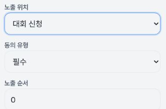

Footer resets consent to display-only. Proof row9; DOM **16:50:28.313Z**; capture **16:50:28.391Z–16:50:28.406Z**.

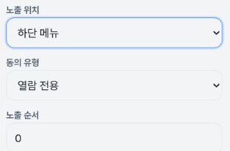

Order input after Tab. Proof row17; DOM **16:51:00.144Z**; capture **16:51:00.225Z–16:51:00.245Z**.

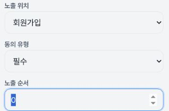

Native placement popup after Space. Proof row12; DOM **16:50:43.628Z**; capture **16:50:43.712Z–16:50:43.760Z**.

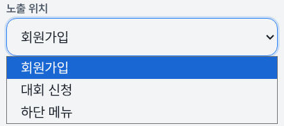

Native consent popup after Space. Proof row15; DOM **16:50:59.569Z**; capture **16:50:59.660Z–16:50:59.707Z**.

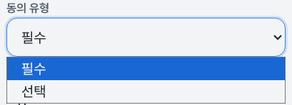

### Tablet

Placement after ArrowDown. Proof row21; DOM **16:51:41.453Z**; capture **16:51:41.539Z–16:51:41.563Z**.

Footer resets consent to display-only. Proof row29; DOM **16:51:43.697Z**; capture **16:51:43.783Z–16:51:43.806Z**.

Order input after Tab. Proof row37; DOM **16:52:05.564Z**; capture **16:52:05.651Z–16:52:05.681Z**.

Native placement popup after Space. Proof row32; DOM **16:52:04.145Z**; capture **16:52:04.241Z–16:52:04.289Z**.

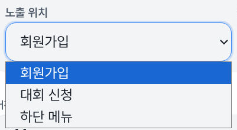

Native consent popup after Space. Proof row35; DOM **16:52:04.991Z**; capture **16:52:05.070Z–16:52:05.111Z**.

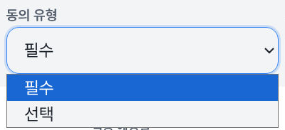

### Desktop

Placement after ArrowDown. Proof row41; DOM **16:52:38.880Z**; capture **16:52:38.982Z–16:52:39.013Z**.

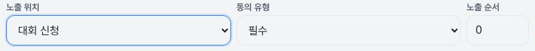

Footer resets consent to display-only. Proof row49; DOM **16:52:41.254Z**; capture **16:52:41.345Z–16:52:41.371Z**.

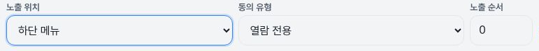

Order input after Tab. Proof row57; DOM **16:53:03.122Z**; capture **16:53:03.218Z–16:53:03.239Z**.

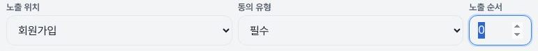

Native placement popup after Space. Proof row52; DOM **16:53:01.637Z**; capture **16:53:01.731Z–16:53:01.779Z**.

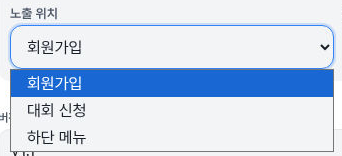

Native consent popup after Space. Proof row55; DOM **16:53:02.518Z**; capture **16:53:02.615Z–16:53:02.659Z**.

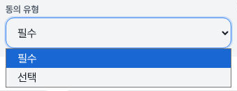

## Local restoration and limits

The final keyboard values are signup/required/order0. The final-local-state record timestamp16:53:45.486Z summarizes values from proof59 at16:53:03.831Z; it is not a new DOM sample. After the notices-tab action at16:53:45.486–16:53:45.641Z, the early exit snapshot has no creation heading but still has the terms URL; it is not a settled notices-route proof. The fresh local editor at16:53:46.662Z records the three default control values and empty observed body textarea. Its active element is the new-policy button outside the editor, so it is not a61st keyboard-focus success. Final exit at**16:53:47.523Z** records `/admin/content` with no creation heading.

The blank-field collector matches input[type=text] and textarea; inputs with an omitted type attribute were missed. Its arrays only contain the body textarea, so `allObservedFreeTextBlank` is not an all-fields/reset/storage guarantee. Version defaults to v1.1 and was not edited. No typing was performed according to the collector.

Consent here means local placement configuration, not a user's legal agreement. No policy creation, save, publication, archive, exposure-checkbox change, Enter, legal consent or inquiry-state change was performed according to the collector. This is not an HTTP/database-write audit. No screen-reader speech, mobile virtual keyboard, full panel cycle, DOM node identity equality or remount-cause test was performed. Images alone do not prove focus retention; DOM/AX and input-call records provide the focus evidence. Source-original crop equality remains collector-attested; the publisher inspected only the15 safe images, not full original screenshots.
