# Tournament step4: promotion toggles and remaining mobile prize width

Issue [#1439](https://github.com/kim-song-jun/matchup-sports-platform/issues/1439), related [PR1492](https://github.com/kim-song-jun/matchup-sports-platform/pull/1492) and [PR1498](https://github.com/kim-song-jun/matchup-sports-platform/pull/1498). New alpha UI observations cover **402×606, 787×505 and1181×757 CSS px**. **Both promotion switches collapse their edit bodies when OFF; enabling either exposes its nine named text/number controls. The mobile prize-content input remains narrow, and its full cash-or-trophy example is not readable at once.** This is a partial acceptance result for the original issue.

Observed range: **2026-10-03T15:19:36.309–15:29:18.754Z**. The untouched navigation baseline was405px wide; measured step4 mobile rows are402px. There are **22 step4 DOM rows,32 selected action-call records and18 safe crops**. The44 switch records are observations of two controls across those rows, not44 independent interactions.

[DOM proof](proof.json) · [Actions](actions.json) · [Initial state](initial.json) · [Date navigation](navigation.json) · [Exit](exit.json) · [Scope and limitations](summary.json) · [Recalculation](verification.json) · [Provenance](provenance.json) · [Manifest](manifest.json)

## Confirmed switch and layout behavior

At each width: both OFF → home ON → list ON with home OFF → both OFF restored. The selected action ledger records separate OFF/ON clicks. Each switch button is **46×44 CSS px**, its track **46×28**, and its white pseudo-element knob **22×22**. OFF is gray with transform `none`; ON is blue with transform `matrix(1,0,0,1,18,0)`, an **18px** horizontal displacement. These are sampled endpoint styles, not animation timing or keyboard tests.

An ON state has nine named promotion text/number controls. OFF has none of those nine in the collected nonzero-box/visibility field list. Raw totals23/13 also include1×1 file inputs, so they are not counts of visible editable controls. Mobile promotion title, badge and introduction stack; tablet/desktop title and badge share a row, with a wider introduction below. Some recorded controls are outside the viewport; screenshots show selected visible subsets.

| CSS viewport | Prize content width | Total-prize input width | Promotion title / introduction width |
| --- | ---: | ---: | ---: |
| 402×606 | 161.287506px | 328.800018px | 295.200012 /295.200012px |
| 787×505 | 373.208344px | 682px | 318.333344 /648.666687px |
| 1181×757 | 455.40625px | 819px | 386.5 /785px |

All three prize-content inputs are44px high at each width. Name, content and delete remain on one row. On mobile, the example “예: 600,000원 또는 우승 트로피” is clipped at the right; tablet and desktop crops show the full example, with the pointer partly covering the focused first row. Other rows provide an unobscured comparison. The nearby helper still explains that trophies/gift certificates can be entered. This is reduced example readability and editing width, not an observed input or save failure. A possible follow-up is a full-width mobile content row, retaining name/delete together.

Document scrollWidth equals reported viewport width in all22 rows. Empty-input scrollWidth equals clientWidth, but that does **not** show whether placeholder text fits; the clipping conclusion comes from actual pixels.

## Original acceptance criteria

- OFF editing burden: improved in the observed three-width states; both bodies collapse
- ON/OFF entered-value retention: not repeated; empty custom titles and local enabled flags do not establish this criterion
- Mobile important input/preview width: prize-content width remains a residual; complete preview behavior was not certified
- Tablet/desktop alignment: selected prize rows and promotion controls were consistent
- Final pre-publication summary: unverified; step5 was disabled and not entered

All22 DOM rows contain one disabled step5 record. The separate query at **15:29:18.424Z** also finds one disabled step5 button. The top list-link exit call is **15:29:18.442–15:29:18.524Z**; at **15:29:18.754Z** the URL is `/admin/tournaments`, with the wizard title field and step5 button absent.

## Safe images and time attribution

Each image below has a distinct DOM observation and capture-call interval listed in provenance and verification. Full source rasters are **402×605,787×504,1181×757 pixels**; those differ from the reported mobile/tablet CSS heights. DPR values are1.25/1.5/1. The crops preserve source pixels and contain only synthetic local form content, generic UI labels and controls.

### Mobile

Prize input widths and example text. DOM **15:22:56.788Z**; capture **15:22:56.792Z–15:22:56.825Z**; proof row0.

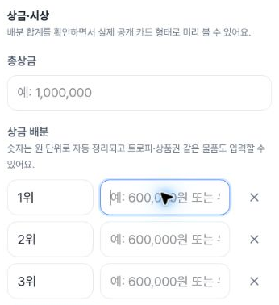

Both promotion bodies OFF. DOM **15:23:21.434Z**; capture **15:23:21.438Z–15:23:21.455Z**; proof row1.

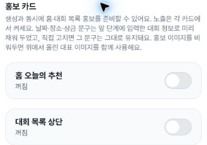

Home promotion ON. DOM **15:24:00.679Z**; capture **15:24:00.683Z–15:24:00.699Z**; proof row2.

Home promotion fields. DOM **15:24:01.040Z**; capture **15:24:01.044Z–15:24:01.062Z**; proof row3.

List promotion ON; home OFF. DOM **15:24:17.217Z**; capture **15:24:17.222Z–15:24:17.238Z**; proof row4.

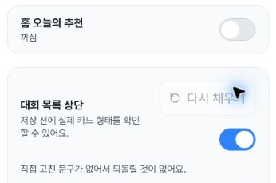

List promotion fields. DOM **15:24:17.583Z**; capture **15:24:17.594Z–15:24:17.610Z**; proof row5.

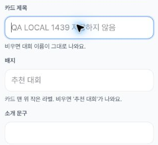

### Tablet

Prize input widths and example text. DOM **15:24:59.040Z**; capture **15:24:59.044Z–15:24:59.067Z**; proof row7.

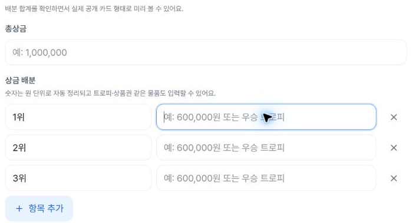

Both promotion bodies restored OFF. DOM **15:27:33.810Z**; capture **15:27:33.815Z–15:27:33.837Z**; proof row14.

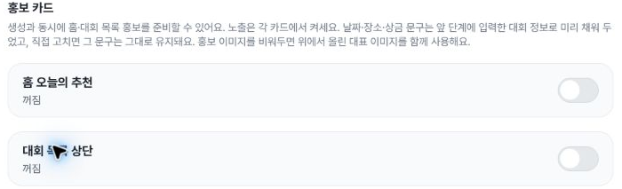

Home promotion ON. DOM **15:26:43.518Z**; capture **15:26:43.523Z–15:26:43.549Z**; proof row10.

Home promotion fields. DOM **15:27:12.842Z**; capture **15:27:12.847Z–15:27:12.871Z**; proof row11.

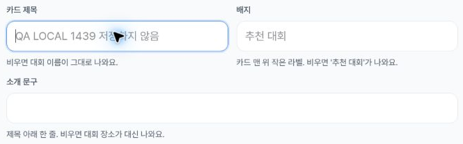

List promotion ON; home OFF. DOM **15:27:13.888Z**; capture **15:27:13.893Z–15:27:13.925Z**; proof row12.

List promotion fields. DOM **15:27:33.113Z**; capture **15:27:33.121Z–15:27:33.146Z**; proof row13.

### Desktop

Prize input widths and example text. DOM **15:28:01.774Z**; capture **15:28:01.779Z–15:28:01.803Z**; proof row15.

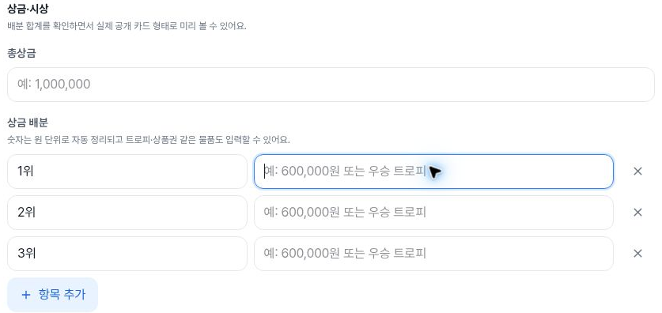

Both promotion bodies OFF. DOM **15:28:02.141Z**; capture **15:28:02.149Z–15:28:02.172Z**; proof row16.

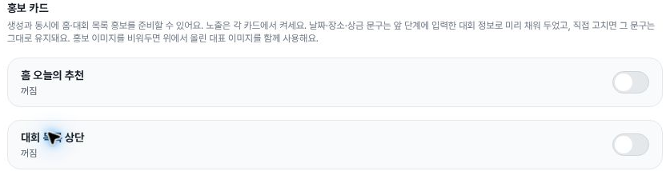

Home promotion ON. DOM **15:28:20.118Z**; capture **15:28:20.124Z–15:28:20.149Z**; proof row17.

Home promotion fields. DOM **15:28:20.496Z**; capture **15:28:20.502Z–15:28:20.525Z**; proof row18.

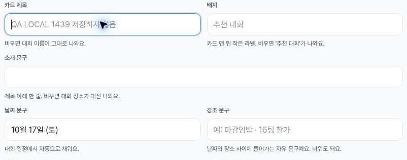

List promotion ON; home OFF. DOM **15:28:47.731Z**; capture **15:28:47.737Z–15:28:47.758Z**; proof row19.

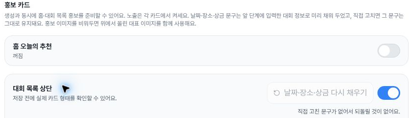

List promotion fields. DOM **15:28:48.110Z**; capture **15:28:48.115Z–15:28:48.140Z**; proof row20.

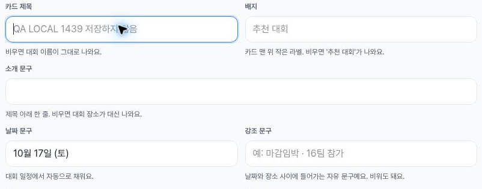

## Execution and evidence limits

Two early tablet OFF source frames partly clip the lower card behind the footer and are excluded from the public image set. Their DOM rows8/9 remain preserved. A transport interruption occurred after row8; row9 is a later OFF recovery observation. The fully visible tablet OFF image comes from later row14. No missing interval is reconstructed. The pointer partly covers the tablet home-ON knob; its18px movement is supported by DOM pseudo-element styles, and other ON images show the knob unobscured.

Minimal synthetic local title/sport/date values were used to reach step4. The first calendar attempt left values blank after Escape; the later selection records start `2026-10-17T08:21` and deadline `2026-10-14T23:59`. These are local input strings, not timezone-converted instants. The title shown in the promotion controls is the synthetic title as a placeholder; DOM records the custom title fields empty. Date text and priority can be prefilled, and rank names are default values.

No prize/promotion content entry, final creation/save, step5 entry, upload, publication or notification was performed according to the collector. The32 call records are selected actions, not an exhaustive browser-event or network audit. Exiting removes the form from view but does not prove storage cleanup. No virtual keyboard, full accessibility, screen-reader speech, runtime commit identity or database-write absence was verified. Runtime serving SHA is unknown.

The publisher viewed all18 safe images and checked hashes, geometry, chronology and crop mappings. Original full screenshots remain unpublished and were not opened by the publisher; original-to-crop equality is collector-attested.
