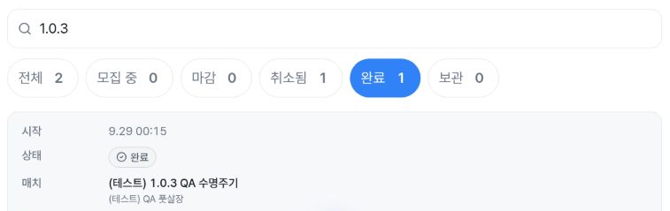
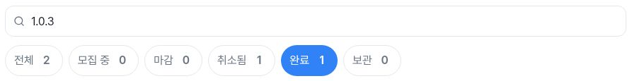
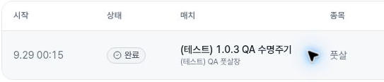

# Independent verification: immediate administrator Back photos

All three post-Back snapshots retain query **1.0.3**, selected **완료1**, and one matching synthetic result. Four safe PNG crops supply the post-Back images missing from the [earlier regression packet](https://github.com/kim-song-jun/matchup-sports-platform/blob/879da904c41cfaf0f97148c4da9b4ed1bf367a36/docs/qa/2026-10-04-admin-match-filter-recheck/README.md). These are new2026-10-04 observations at10:11–10:12 UTC, not retimed earlier photos. The14 prepared files are preserved unchanged; [publisher-verification.json](publisher-verification.json) contains independent arithmetic and scope.

## Exact capture ordering

| Viewport | Back completed UTC | Post-Back DOM UTC | Capture interval UTC | Completion→capture start |
| --- | --- | --- | --- | --- |
|402×606, DPR1.25 |10:11:11.702 |10:11:11.756, proof3 |10:11:11.762–10:11:12.033 |60ms |
|788×505, DPR1.5 |10:12:01.970 |10:12:02.011, proof6 |10:12:02.014–10:12:02.286 |44ms |
|1182×757, DPR1 |10:12:32.177 |10:12:32.221, proof9 |10:12:32.227–10:12:32.502 |50ms |

Back completion, DOM time and screenshot start/end are different events. The collector reports URL/field readiness and DOM reads between Back and capture, without another UI action. The recorded action ledger contains no intervening UI call, and the supplied intervals recompute exactly. These numbers are **capture sequencing**, not measured application/network response times. Desktop filters and row are two crops of one source capture, so four PNGs represent three screenshot calls. All source raster dimensions match CSS viewport dimensions in these captures; private source encodings are reported JPEG, public outputs PNG.

The actual crop pixels show search1.0.3, the selected completed filter, completed status and the same synthetic `(테스트)1.0.3 QA 수명주기` row with a synthetic test venue. The desktop crops separate filters and row to exclude the host column/account sidebar. Crop frames do not show an entire result table; the total rendered-row assertion additionally uses the saved visibleRows/lifeCycleRows counters. All post-Back search/filter controls are44px high and their recorded rectangles fit their viewport.

The detail aliases are identical at proof1/2/5/8. Current collector provenance reports resolved URL SHA25693615425e596a175cf159e1758b60fc3d45c4b8451083b0b0e8b2c02f5ebadc5, matching the earlier immutable public provenance. The publisher independently compared those supplied hashes, not the private original URL bytes. The alias URL is not a live route. Detail snapshots establish route identity; their empty headings arrays are not evidence that detail content finished rendering despite intended labels such as settled detail heading.

## Exclusions, restoration and limits

Collector counter definitions are narrow: visibleRows counts elements with role=button and aria-label ending in 상세 보기 whose bounding width and height are positive. lifeCycleRows is the exact synthetic-label subset. Offscreen positive rectangles can count; these fields do not measure viewport visibility. dialogs likewise counts positive-size role=dialog elements, without viewport intersection, aria-hidden, computed visibility or transform checks. The recorded mobile/tablet value1 is preserved and does not establish an open modal; its cause was not collected or assigned to a sidebar. Desktop/exit count0 is limited to that predicate.

Mobile pre-detail proof0 shows completed selected but two rows; it is preserved as a transitional state and excluded from settled-count conclusions. The actual return3 shows one row. This does not silently turn the first two-row observation into a passing state.

Observed scrollY changes are mobile0→26.399999619 and tablet0→94; desktop0→0. No exact scroll-restoration claim is made. Earlier rapid-input and empty-result tests are linked historical evidence, not repeated by this supplement. Row/detail labels and source predicates have their own evidence scope; screenshots do not establish backend data identity beyond the recorded fixture comparison.

At10:13:01.980Z proof10 returns to queryless/admin/matches, empty search, selected 전체29 and20 recorded result rows. Separate exit10:13:01.992Z confirms empty search/all filter and dialogs0. This is restoration of the tested UI filters, not an audit of server or storage bytes. Status **filters** were activated; no match-status save/moderation, fixture edit, query-history submit, application or final-create control was activated. HTTP/DB activity was not audited.

[Workflow37192728828](https://github.com/kim-song-jun/matchup-sports-platform/actions/runs/37192728828) independently reads success SHA951a67e3423dec502697f8bab2d78696d9374cc5 updated09:49:29Z, before fresh navigation10:09:23.772–29.008. Healthy/version remain reported context; browser runtime serving identity is unknown. The exact951 query hook Git blob5474aea9b1643cb86220a0e06deb747ad2068bda matches the previously inspected hook: URL restoration and debounced search are local hook behavior, not a global no-write/network guarantee.

All14 input checksums,11 DOM records,17 completed selected actions,56 repeated rectangles and four actual PNGs were inspected. Image dimensions/bounds/hash/capture linkage agree. Original safe-source hashes and private-source crop equality remain collector attestations because private originals were not opened. [publisher-manifest.json](publisher-manifest.json) covers the complete delivered set while the original inventories retain their14-file scope. This supplement does not itself decide issue closure.
