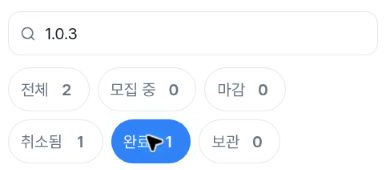
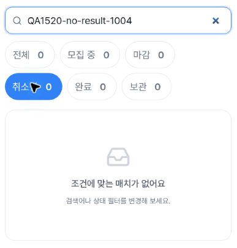
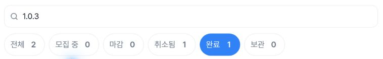
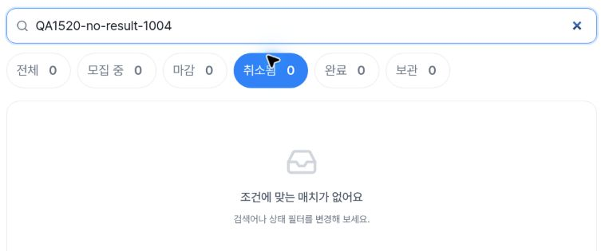
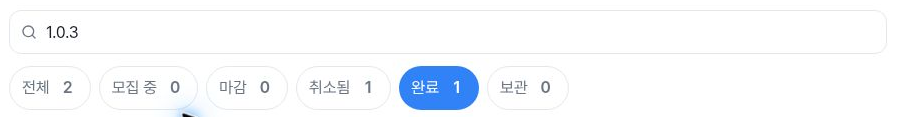
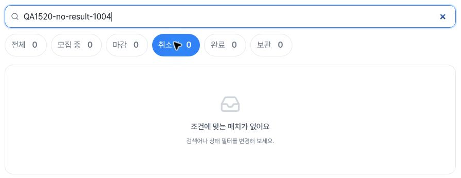

# Independent verification: administrator match filters

The17-file input packet is preserved byte-for-byte. [README](README.md) and [summary](summary.json) describe the recorded three-width scenarios; [publisher-verification.json](publisher-verification.json) independently checks their internal consistency, hashes, crop geometry and timing. No live test or private original was opened during publication review.

At402×606,788×505 and1182×757, recorded search1.0.3 with completed filter yields one lifecycle-row counter. Each actual detail visit has the same canonical URL hash and the synthetic lifecycle heading. Browser Back restores that query/filter and result counter. The rapid query1.0→cancelled filter→1.0.3 action spans recompute to132/144/124ms; final snapshots show1.0.3/cancelled, one edited-row counter and zero lifecycle rows. This checks recorded actions/endpoints, not HTTP counts or exact debounce scheduling. The actual static query hook at4c81 separately contains a300ms API-search debounce and latest-draft merging; its source link/hash is retained in the verification.

The synthetic no-result query with cancelled filter yields zero rows and the exact empty message in all three widths. allVisibleRowsMatchQuery=true is a vacuous every() result there; it supplies no nonempty matching evidence. Aggregate counters/predicates were recorded by the collector. This sanitized packet omits full row text and result screenshots, so those predicates were not independently rerun against raw rows. Screenshots show only controls and empty panels.

| Width | Filter controls | Empty result |
| --- | --- | --- |
| Mobile402 |  |  |
| Tablet788 |  |  |
| Desktop1182 |  |  |

Pointers partially overlap some selected-chip wording; exact labels/counts also have independent DOM fields. No host/account/sidebar content appears in the six actual crops. They decode as RGB PNG, while source-capture JPEG encoding is prior provenance. Output hashes, sizes, crop bounds and all recorded DOM→capture intervals pass review. Exact private-source pixel equality is preparer-attested, not independently repeated here.

The completed filter condition is restored after each empty check. Final DOM08:55:52.473Z and separate exit08:55:52.491Z show blank query, all-status filter, total29,20 rows with nonzero rectangles and no dialog. This is not proof all20 rows are inside the viewport. No page-navigation test was done. Browser Back scrollY26.3999996 on mobile and94 on tablet is retained; an exact scroll restoration PASS is not established.

All19 observations and35 selected completed actions retain their exactUTC. The packet's provenance field named preparedUTC contains **2026-10-04T18:00:24.571247+09:00**, a valid offset timestamp equivalent to **2026-10-04T09:00:24.571247Z**. Its original bytes remain unchanged; that packaging timestamp is not a new browser observation.

Public workflow readback confirms4c81 success updated08:22:48Z before fresh navigation08:50:40.070–08:50:45.423Z. This is deployment context, not browser serving-SHA proof. The packet's wider source read-boundary report remains an attributed static inspection; no tests were run and no new network audit was performed. Status filters are distinct from moderation status-change actions. No moderation modal/save/business mutation was exercised according to the recorded scope, but shared error telemetry can write and there is no global zero-POST/zero-write guarantee. ForcedAPI errors and whole-issue regression coverage remain outside this evidence.

[publisher-manifest.json](publisher-manifest.json) covers the complete delivered set. Original manifest/SHA256SUMS still cover their17 unchanged input files.
