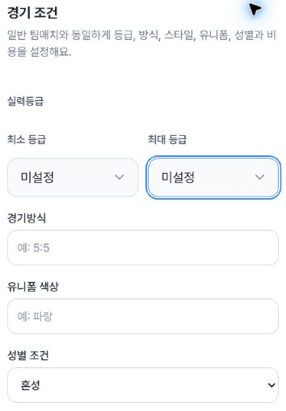
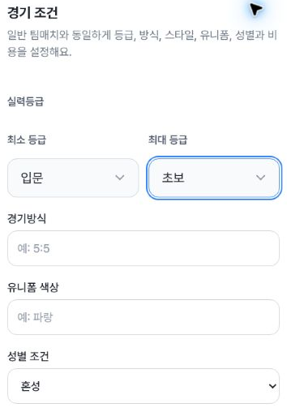
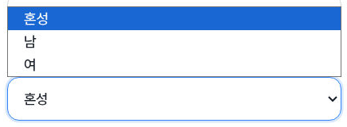
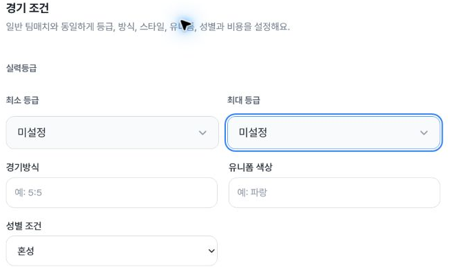
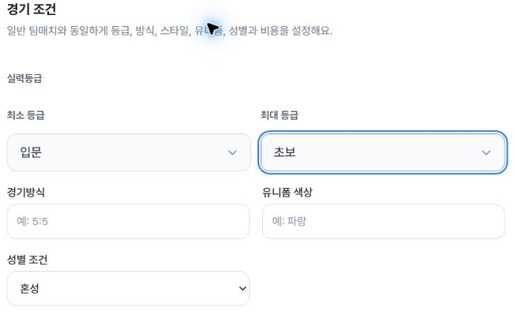
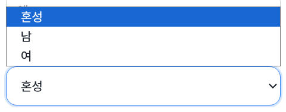
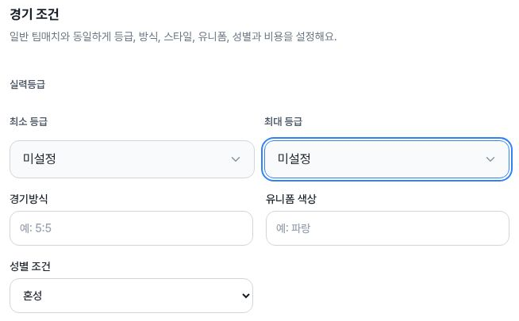
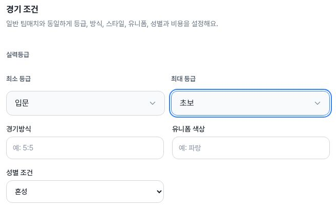
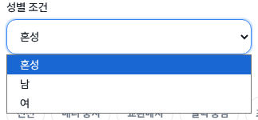

# Administrator team-match skill range and mixed gender QA

Fresh browser observations on 4 October 2026, 10:54–10:57 UTC, on `/admin/team-matches/new`. The creation link was read from the administrator list and clicked. This is a separate administrator run; prior consumer creation evidence is not reused as an admin result.

The selected local controls passed at 402×606, 788×505 and 1182×757 CSS pixels. Both grade endpoints start at 미설정, with visible minimum/maximum labels. The displayed gender is 혼성 and the DOM option value is 성별 무관. Each width has visible range inputs (48px tall), native keyboard focus, equal and partial range selection, both cross-boundary corrections, explicit blank restoration, and gender 혼성→남→혼성 restoration.

Actual ArrowDown changes the selection. Tab/ShiftTab moves focus between grade fields and through format/uniform to gender. Space opens the native gender menu and Escape closes it without changing the selected value. Extreme range choices and 미설정 used the supported selectOption UI action. The native menus are shown in three desktop-surface crops; page screenshots do not render these browser menus.

After explicit UI restoration, browser Back returned to the admin list. Reentering through the observed creation link showed blank grades, 혼성, blank text inputs and a disabled final action; a final Back left the browser on the list. This is not a dirty-draft discard test. No sport, region, title, timing, image, cost or other fixture values were entered. The final create button was never activated; actual save/API/DB behavior is untested, and this packet is not a network audit.

The release context is reported alpha 951a67e, deployed at 09:49:29 UTC. Actual serving runtime identity is unknown. Immutable source review establishes local state and the final POST boundary, not observed network traffic.

## Evidence

`summary.json` maps the 40 DOM observations to the exact actions, viewports and restoration endpoints. `actions.json` contains successful action calls. `ax.json` contains three full target excerpts plus one earlier empty diff, explicitly excluded. `crop-provenance.json` records each picture’s source encoding, bounds, DOM index and separate capture interval. `source-contract.json` provides immutable source references; `deployment-context.json` separates release context from runtime identity.

| Width | Blank range and focus | Partial range | Native gender menu |
|---|---|---|---|
| Mobile |  |  |  |
| Tablet |  |  |  |
| Desktop |  |  |  |

Limits include actual creation, storage/DB persistence, existing edit forms, other roles, full screenreader speech and physical mobile devices. Resize/offscreen intermediate observations and screenshot/DOM time differences are preserved in the JSON and are not promoted to PASS conditions.
