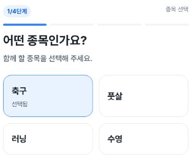
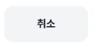

# Independent verification: FAB actual create entry and Cancel

The visible mobile plus with saved href **/matches/new/sport** was activated and the actual first sport-selection page rendered. Its **취소** control returned to the queryless match list with the plus still present. This is one new402×606, DPR1.25 entry/return observation for issue1601, supplementing the [earlier three-width cost/focus packet](https://github.com/kim-song-jun/matchup-sports-platform/blob/fb9580f68213dd5fa93187a60039a613723cbab2/docs/qa/2026-10-04-individual-fab-after/README.md). It does not retime or replace that packet's previously unexecuted entry condition.

## Recorded sequence

All times are UTC on2026-10-04. Fresh list navigation is10:15:38.035–43.382. Source-list DOM10:16:13.417 shows one positive-size56×56 plus with the saved href. Activation call10:16:13.420–.511 precedes first-step DOM10:16:46.909: exact sport URL, progress value1 and label 매치 만들기1단계/4단계, headings 매치 만들기 / 어떤 종목인가요?, and enabled 취소/다음 controls. The first screenshot runs10:16:46.913–.931; its sport and Cancel crops share that one capture. Cancel call10:16:46.932–47.002 precedes returned-list DOM10:17:56.690. The second screenshot runs10:17:56.695–.714.

The gaps between action completion and later DOM reads are observation timing, not measured loading/response latency. The summary's endedUTC is the final DOM time; the final screenshot ends24ms later. Three PNG crops represent two actual screenshot calls. Each source raster is402×606, matching the recorded CSS viewport; source images are reported JPEG and public outputs are PNG.

The first crop directly shows1/4, the sport question and four choices. Football is already pressed=true; 풋살/러닝/수영 are false. No selection call was made, so default versus restored origin is unknown. The native input/textarea/select count0 excludes button-based sport choices and does not establish that hidden/stored fields are blank. The top 매치 만들기 heading and enabled 다음 are recorded DOM evidence outside these minimal crop bounds; Next was not activated.

The returned plus retains the same href and56×56 size; its top is457.200012px versus458px before entry. This minor position difference is preserved, not rounded into exact geometry identity. The final URL is/matches without query, search is empty, firstStepPresent=false, and the recorded visibleDialogCount is0. The plus crop alone does not prove list content/order/scroll restoration.

## Source, privacy and scope

The publisher independently fetched the exact951 source files and matched both Git blob hashes in [source-contract.json](source-contract.json). The sport route renders MatchCreatePageClient step=sport. The client reads/hydrates draft and sport/region selection; a post-hydration effect calls local expiring-draft persistence. Its final createMatch.mutate and upload callback are separate actions. Entry without manual selection therefore does not imply local-storage bytes or expiry are unchanged. The actual origin of this football selection was not inspected. Static client inspection does not establish actual network/API/DB behavior or a global zero-write result.

[Workflow37192728828](https://github.com/kim-song-jun/matchup-sports-platform/actions/runs/37192728828) was independently read as successful SHA951a67e3423dec502697f8bab2d78696d9374cc5, updated09:49:29Z before this fresh navigation. Healthy/version are reported context; browser runtime serving SHA remains unknown.

All14 input files are preserved byte-for-byte. All13 checksum entries,12 manifest payloads, three DOM records, six completed selected actions and three actual safe PNGs were checked. Crop dimensions, bounds, output hashes and capture linkage agree. The images contain product controls and values; no readable private account/host data or identifying PNG metadata was found. Original source/capture hashes and exact source-to-crop equality remain collector attestations because those private originals were not read.

No manual input, sport selection, Next, upload, application, search submit or final create/save was recorded. Creation stages beyond entry, other viewport entry paths, hidden draft contents, API/DB acceptance, screen-reader speech and physical devices remain outside this supplement. [publisher-verification.json](publisher-verification.json) and [publisher-manifest.json](publisher-manifest.json) cover this delivered result; issue closure should use this alongside the earlier cost/focus evidence and its exclusions.
