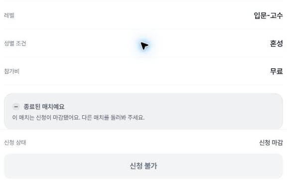
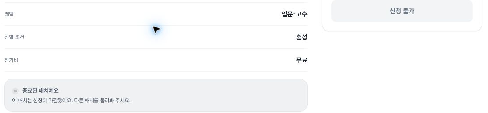

# Free-cost detail: remaining tablet and desktop checks

The previous cost-label packet covered the free list card in three widths and the free detail only on mobile. This new run fills only the missing tablet and desktop detail checks for that same synthetic fixture. The actual current card href and detail URL share the previous base-URL hash; the previous from query is not reused.

At 788×505 and 1182×757 CSS pixels, the visible detail row reads 참가비 / 무료. The free text remains intact, with no added 원, 0원, currency or per-person suffix. The preceding gender row, following closed-match notice and disabled application control do not cover the fee row in the two settled observations. The row is 56px tall on tablet and 52px on desktop; the following notice starts16px below it. Each visible free-text element has matching client/scroll width and24px height.

- Tablet settled DOM:13:22:53.151 UTC, proof2
- Desktop settled DOM:13:23:24.153 UTC, proof5
- Fresh list navigation and actual card click are recorded in actions.json
- Final queryless list:13:24:00.449 UTC, same free card and empty search

The current list started at8 main rows and ended at7; the reason was not observed. The selected free card and both numeric-cost samples remain present. This is not a list-count preservation result. Initial and immediate post-wheel DOM rows are retained separately; only settled rows2/5 correspond to the published photos.

Long arbitrary notes, currency/per-person-unit samples and nearby recommendation cards remain unobserved because the current visible list supplies only two10000 fixtures and this free fixture. Existing mobile proof is linked in fixture-identity.json and is not represented as a new run. No search submission, application, sharing, creation or save action was executed, and network/DB effects were not audited.

The reported current alpha context is56581dc7; actual serving identity remains unknown. Uncommitted1418/1578/1436 candidates are not treated as deployed fixes. Host/participant names and full screenshots are excluded from this public packet.
