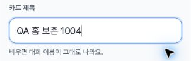
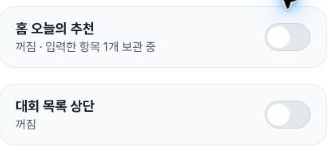
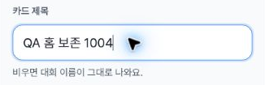
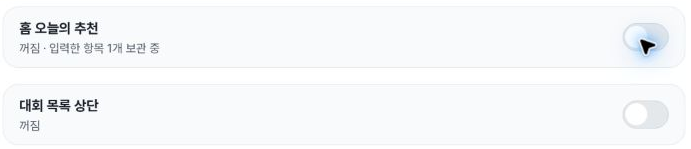
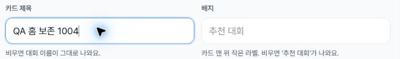
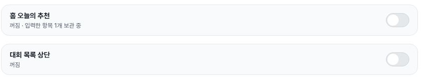
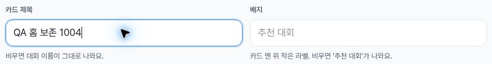
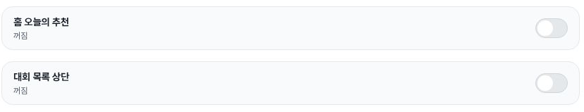

# Home promotion title retention at three widths

On 2026-10-04, the Home promotion editor retained the exact synthetic input value **QA 홈 보존 1004** through an actual OFF→ON cycle at **402×606, 788×505 and 1182×757 CSS px**. Each OFF snapshot has zero mounted Home fields and the summary “꺼짐 · 입력한 항목 1개 보관 중”; reopening restores the same nine values, including the title. Mobile also retains the title through step 4→3→4. These are 13 DOM snapshots, 23 selected action records and 8 safe screenshots, from one continuing local wizard.

[Proof](proof.json) · [Actions](actions.json) · [Summary](summary.json) · [Entry context](entry-context.json) · [Step-away observation](step-away.json) · [Exit](exit.json) · [Later shared-wizard exit supplement](wizard-exit-supplement.json) · [Capture provenance](provenance.json) · [Independent recalculation](verification.json) · [File hashes](manifest.json)

## Exact-value observations

| Width | Before / OFF / reopened proof indices | Before UTC | OFF UTC | Reopened UTC |
| --- | --- | --- | --- | --- |
| Mobile 402×606 | 1 / 2 / 3 | 05:54:29.787 | 05:54:30.154 | 05:54:30.868 |
| Tablet 788×505 | 5 / 6 / 7 | 05:55:34.708 | 05:55:35.058 | 05:55:35.780 |
| Desktop 1182×757 | 8 / 9 / 10 | 05:55:36.029 | 05:55:36.382 | 05:55:37.110 |

All times are UTC on 2026-10-04. A single title was entered on mobile and carried through the subsequent resizing and toggle cycles; these are not three independent fresh drafts. Other eight observed field values remain at their initial defaults. OFF-state retention is established by the summary and subsequent `input.value`, without inspecting hidden application state.

Mobile step 3 is separately observed at 05:54:56.917Z with the heading “참가 조건” and no promotion switches. The step 4 return at 05:54:57.670Z, proof index 4, has the same exact title and nine-field values. There is no dedicated screenshot of that stepper return; its evidence is the DOM and action sequence.

## Safe screenshots

The input crops show the actual synthetic title; the OFF crops show the retained-item summary. Images alone do not prove the whole interaction sequence.

Each capture call begins 3–5 milliseconds after its paired DOM observation. The exact start/end UTC, source raster size, crop bounds and output SHA-256 are preserved in provenance and verification. Mobile CSS height is 606 while its source raster is 605 pixels; tablet and desktop source rasters are 788×505 and 1182×757. DPR values are 1.25, 1.5 and 1. Browser resizing/zoom does not establish physical-device or software-keyboard behavior. Pointer overlap is visible in some crops; input text and OFF summaries remain readable, and exact values are independently recorded in DOM.

## Explicit restoration and later exit

At 05:56:12.857Z, proof index 11, the title has been explicitly cleared and all nine Home field names/values match the baseline in index 0: title, badge, description, emphasis, place, prize and image are blank; date text remains “10월 17일 (토)” and priority remains “0”. This is nine value comparisons, not nine separately edited fields. At 05:56:13.194Z, index 12, both Home and List promotions are OFF with the plain summary “꺼짐”. List remains OFF throughout all 13 records and its value-retention behavior was not retested here.

The wizard's title and sport values are explicitly restored blank at 05:56:13.678Z. The Cancel call runs 05:56:13.680–05:56:13.770Z; the separate observation at **05:56:13.951Z** records `/admin/tournaments`, no wizard-title element and zero promotion switches. Dates and every other wizard field were not rechecked after exit; no storage deletion, database rollback or network-write audit is claimed. `wizard-exit-supplement.json` repeats this same exit observation with its relationship to the earlier prize test; it is not another exit or test run.

## Relationship and scope

This continues the same unsaved wizard entered at **05:45:45.156–05:45:45.462Z**, after the [earlier third-prize focus observations](https://github.com/kim-song-jun/matchup-sports-platform/blob/044a2798fb4a9c1fdbfc968ade11fe8375c32b56/docs/qa/2026-10-04-prize-footer-focus/README.md). The Home selected actions start at 05:53:36.045Z and its first DOM sample is 05:54:29.674Z. The later exit supplement supplies the ending state of that shared wizard. The earlier immutable focus-defect package is unchanged; this normal retention result neither repairs nor dismisses the focus finding.

The [Oct3 List-title evidence and historical Home report](https://github.com/kim-song-jun/matchup-sports-platform/blob/fb5bfe838e67da9bd989fe02fab5f67ab96f95b1/docs/qa/2026-10-03-promotion-retention/README.md) remain separate. The three fresh Home cycles here add exact input-value evidence, without retroactively turning old screenshots into three-width value tests. Related tracking is [#1439](https://github.com/kim-song-jun/matchup-sports-platform/issues/1439).

The source files retain the previously reported 27a021 deployment context. This is historical context, not a latest-deployment assertion or a measured browser identity; **runtime serving SHA is unknown**. The source summary's reducer/storage note refers to the prior bounded source inspection linked above, not new code or storage testing in this run. No whole-application localStorage-absence claim follows.

Save/create, step 5, Enter, upload and external sending were not performed according to the collector. All 13 records show a disabled step-5 control. Nine mounted fields are not necessarily simultaneously visible, and this does not certify all field types, keyboard accessibility, screen-reader speech, save validation or the whole application.

All 8 safe images were independently viewed and their hashes/dimensions/capture mappings checked. They show generic UI and a synthetic local title, with no account/member/roster data. Private full-source screenshots were not opened or published; source-to-crop pixel equality remains collector-attested. Original safe JSON/PNG bytes are preserved. The capture-metadata hash is a collector snapshot, not independent verification of the unshared source manifest.
