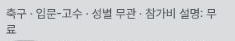
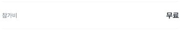

# Individual cost-label after: selected values preserved

At **402×606, 788×505 and 1182×757 CSS pixels**, the same current synthetic numeric fixture displays **참가비 설명: 10000** in the featured photo-card metadata and ordinary list row. Actual navigation opens that fixture's detail, where **참가비 / 10000** remains visible. A football-filtered fixture keeps **무료** in all three list widths and in a separately scrolled mobile detail. This is bounded after evidence for [#1586](https://github.com/kim-song-jun/matchup-sports-platform/issues/1586) / [PR1592](https://github.com/kim-song-jun/matchup-sports-platform/pull/1592).

A separate mobile observation shows the floating create button partially covering the final digit on the last featured card. It is documented in [MOBILE-FAB-OBSERVATION.md](MOBILE-FAB-OBSERVATION.md), without attributing it to this PR.

[List DOM](proof.json) · [Detail DOM](detail-proof.json) · [Actions](actions.json) · [Summary](summary.json) · [Independent calculations](verification.json) · [Provenance](provenance.json) · [Exit](exit.json) · [Source scope](source-safety-context.json) · [Source verification](source-verification.json) · [Deployment context](deployment-context.json) · [Public hashes](manifest.json) · [Original source hashes](source-manifest.json)

## Numeric and free-text observations

The exact current href matches across numeric photo card, ordinary row and detail. Public JSON consistently substitutes `synthetic-numeric-1`; original URL hashes are retained in verification. The original digit string is **10000**, not a measured monetary amount or a promise of a particular currency/per-person policy. A second numeric fixture belongs only to the separate FAB observation. No amount was edited or saved.

| CSS viewport / DPR | Photo DOM UTC | Row DOM UTC | Visible detail DOM UTC | Football free-row UTC |
| --- | --- | --- | --- | --- |
| 402×606 /1.25 | 07:21:47.601 | 07:21:54.832 | 07:23:22.364 | 07:24:50.383 |
| 788×505 /1.5 | 07:29:29.170 | 07:29:49.436 | 07:30:11.849 | 07:30:33.609 |
| 1182×757 /1 | 07:30:44.651 | 07:30:54.235 | 07:31:56.551 | 07:32:19.852 |

All times are UTC on2026-10-04. Photo metadata is one16px line in the selected samples. Numeric body metadata occupies32px/two lines on mobile and16px/one line on tablet/desktop, at12px font size and16px line height. Each selected metadata element has equal client/scroll width and height; that does not rule out an overlay covering it. The actual PNGs provide separate pixel evidence.

Mobile numeric photo, row and detail:

Tablet numeric photo, row and detail:

Desktop numeric photo, row and later visible detail:

**무료 is preserved as text**, without conversion to0원. Mobile list metadata is32px high and splits the two glyphs across lines: 무 at the end of the first line and 료 on the second. Both are visible. Tablet/desktop samples stay on one16px line. This is not an unbroken-word layout PASS. Mobile detail at07:25:56.440Z separately shows 무료 at y336–392; tablet/desktop free details were not revisited.

The [historical before evidence](https://github.com/kim-song-jun/matchup-sports-platform/blob/877d4a4c0b4a495df88003ea78112981bcce1869/docs/qa/2026-10-03-individual-copy-candidates/README.md) shows bare10000 in three placements at789/1183px. It does not record those cards' fixture IDs or hrefs. Therefore the current exact-entity consistency does **not** establish an exact-entity before/after comparison. Historical mobile cost and nearby-rail samples are absent. Current tablet/desktop widths also differ from the historical789×505 and1183×758 conditions.

## Return paths and observation boundaries

Three numeric app-Back paths return to queryless `/matches`, with8 reported main rows and the same selected metadata/hrefs. Only the selected subset is recorded; the complete eight-card order/identity was not compared. Mobile main scroll changes1248→0 and tablet1200→0, while desktop window scroll is788→788 at its first return. This is not a scroll-restoration PASS. The desktop reopens the numeric detail afterward to obtain a genuinely visible fee sample.

For the mobile free fixture, football-filtered list row4 at07:24:50.383Z leads to detail2 at07:25:20.562Z with a `from` route and Back href matching the filtered list. Browser Back returns to the same one-result list in row5 at07:25:30.611Z. Browser Forward reaches the same detail URL in detail3 at07:25:41.245Z. After scrolling to the fee, app Back returns to the same filtered one-result list in row6 at07:26:36.982Z. The three-width football lists all report1 main row and0 rail sections. The nearby-card renderer consequently remains unobserved.

Final list row17 at07:32:51.519Z and the separate exit at **07:32:51.535Z** show queryless `/matches`,8 main rows, empty search input and zero visible dialogs. Restoration is by the actual All8 links, not a search submission.

Important excluded or limited samples remain in the DOM record:

- Mobile detail0 at07:23:02.753Z is an immediate scroll sample, main190.399994; later detail1 is settled main288. The screenshot belongs to detail1.
- Tablet photo rows8/11 have rectangle-only `withinViewport:true` but are collector-observed under the bottom navigation. The published photo is row9 after main scroll160, y316.666687–332.666687. No private image was opened for the excluded samples.
- Desktop detail6 places the rendered fee at y820–872, below the757px viewport. Its first screenshot is excluded. Detail7 after a separate reopen/scroll records y340–392 and is paired with `desktop-detail-cost-visible.png`.
- The mobile free detail in rows2/3 is rendered but below the viewport at720–776. Only row4 and its separate screenshot establish visible fee text.
- `visible` means a nonzero rendered box and `withinViewport` means rectangle bounds only; neither accounts for sticky overlays. Partially scrolled horizontal cards are not automatically truncation failures.

## Capture, deployment and scope

The package contains18 list DOM observations,8 detail DOM observations,36 selected completed action records and14 actual safe crops. Repeated metadata records are not additional tests. Fresh navigation starts **07:18:35.520Z** and ends07:18:42.155Z. The first list DOM is07:21:17.262Z; there is no new-page claim for every resize.

Every screenshot has a separate exact call bracket in provenance. The mobile numeric-row image starts **07:22:17.130Z**,22.298seconds after its linked DOM. No intervening selected UI action is recorded, but this is not continuous monitoring. Other images start3–20ms after their linked DOM. Source raster sizes402×606,788×505 and1182×757 match this batch's CSS viewport dimensions; output crop dimensions are separately recorded. All14 safe outputs were inspected directly and their bytes, dimensions, bounds and hashes checked. Source-to-crop pixel equality and private source hashes remain collector attestations; no private originals were read or published.

[Deploy Alpha run37183695434](https://github.com/kim-song-jun/matchup-sports-platform/actions/runs/37183695434) independently reports success for5372ea9c3640621eb270d15c54c70a822b97d536, updated07:02:48Z before fresh navigation. Version and healthy timestamp are parent-reported context; **the browser's serving SHA remains unknown**.

The [exact source's two list renderers](https://github.com/kim-song-jun/matchup-sports-platform/blob/5372ea9c3640621eb270d15c54c70a822b97d536/apps/v1_web/src/components/matches/matches-page.tsx#L849) prefix a truthy free-text costNote; the photo renderer repeats it atL965. This is a label change, not numeric payment conversion. The inspected sport controls are href links. Search submission would reach a write-capable recent-search mutation, so no global server-write-zero assertion is made. The collector reports no search fill/submit/Enter/recent-search selection, creation/save, registration, sharing, permission/result changes or uploads in this batch; HTTP and database side effects were not audited.

Long text, existing units such as10,000원/1인 orUSD10, API null-versus-empty, normalized price/status/viewer, payment/save behavior, physical devices, soft keyboards and screen-reader speech remain untested. A selected separate card lacks a cost label, which is not proof of API null or an empty string. No fixtures were created to fill these gaps. Synthetic product captions and exact observation limits are the publication scope.
