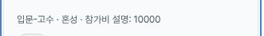

# Independent verification: individual match FAB after

The same synthetic last-card cost **10000 is fully readable** in the mobile402×606 horizontal-end and focused-at-top crops. The focused card border box is about4px left of the FAB. The22-file prepared public packet is preserved byte-for-byte; [summary](summary.json) and [publisher-verification.json](publisher-verification.json) record the limited comparisons.

## Actual after images

The mobile end capture is09:22:18.655–.923 UTC; focused-top09:25:42.593–.867; tablet pair09:28:07.774–08.057; desktop pair09:28:45.852–46.126 on2026-10-04. Each capture begins3–4ms after its separately recorded DOM read. All six outputs are exact-size PNG crops according to the collector; their private source screenshots were JPEG. The two tablet crops share one capture, as do the two desktop crops. Six files therefore represent four distinct screenshot calls. Capture rasters match recorded CSS dimensions402×606,788×505,1182×757 in these records, with DPR1.25/1.5/1 respectively.

## Geometry and route comparison

| Comparison | Proof index | Card right | Create left | Horizontal border-box gap |
| --- | --- | --- | --- | --- |
| Mobile horizontal end, main scroll0 | 1 | 299.200000763 | 325.600006104 | 26.400005341px |
| Mobile focused, main scroll65.599998474 | 5 | 321.600002289 | 325.600006104 | 4.000003815px |
| Mobile focused, main scroll0 | 8 | 321.600002289 | 325.600006104 | 4.000003815px |
| Tablet focused, main scroll166 | 14 | 614 | 618 | 4px |

Numeric and metadata bounding-box intersection with the create control is zero in these rows and desktop19. Desktop uses a static44px-high header link, spatially separate from the rail. The gap is a **border-box** distance, not a focus-outline, glyph or shadow measurement. The crops directly show all10000 digits. This does not establish full-card vertical visibility above bottom navigation or all possible content lengths.

[Original mobile defect](https://github.com/kim-song-jun/matchup-sports-platform/blob/399dee0831ab2c7034cbd0bc8c0694554926ab9f/docs/qa/2026-10-04-individual-cost-label-after/MOBILE-FAB-OBSERVATION.md) was observed at07:27:08.874Z (separate FAB DOM07:27:08.890Z), at the same CSS viewport, DPR, queryless list and main scroll0. The current collector recomputed the exact stored resolved-detail URL SHA256 as54495c2189cf0ebc47e2f897a129a0bcc00908a2693976847583fc02e871d1b0. This matches the old immutable public verification for synthetic-overlap-1; current alias is id-9645589d4a78fb40. The publisher independently compared those supplied hashes, but did not open or rehash the private original URL. Alias URLs are not live destinations.

Before rail scrollWidth/clientWidth was860/370 and terminal scrollLeft490.399994; current mobile is942/370, with measured end scrollLeft572.799988. Fractional scroll positions and integer client/scroll widths are preserved, not forced to an exact integer maximum. The before copy 성별 무관 is now 혼성. Identical cost and fixture identity do not isolate every glyph-width or visual change toPR1603.

## Keyboard sequence and excluded observations

The15 selected endpoints support first→middle→final→middle→first anchor identity, focusVisible=true, horizontal fit within the rail, and no focused-card/create border-box intersection: mobile3–7, tablet12–16, desktop17–21. Desktop first focus is retained through resize/zoom from tablet, followed by recorded Tab/ShiftTab steps; this is not a fresh desktop search-to-first traversal. Mobile prelude has14 recorded keyboard endpoints. Planned proof2 is actually football-filter focus, so first-rail proof starts at3 and its mislabeled screenshot remains excluded.

Mobile final-card Enter call09:25:42.868–.938 leads to the same detail alias at09:26:04.568; browserBack09:26:04.571–.591 leads to queryless list09:26:11.331. Rail scrollLeft resets550.400024→4. Route return is established; **rail-scroll restoration is not**. Tablet horizontal-end row11 has its cost in the bottom-navigation area and is DOM-only, not visible-cost success; visible comparison is14. Desktop three cards fit: clientWidth=scrollWidth1080, scrollLeft0, so a genuinely horizontally overflowing desktop fixture was not tested.

Actions44/45 retain their intended scroll labels. The first is followed by unexpected same-target detail route at proof23,09:30:11.602Z, scrollY630; the next planned upward scroll was on detail. Both are excluded from successful list-scroll outcomes, and the input/application cause remains unknown. The later note's recordedUTC09:30:58.359 precedes its embedded observation09:31:02.409; use the embedded observation timestamp for that endpoint. After returning to the list, **separate native wheel** calls on blank margin produce proof24/25/26 window scroll0→360→0 while staying on/matches. This does not explain or erase the unexpected transition.

There are49 completed selected action-call records, not49 successful regression assertions. There are27 main proof snapshots plus14 prelude endpoints, a separate detail endpoint and separate exit records; these are not extra independent test cases. Final list state09:34:10.184Z has empty search, main/window scroll0 and dialogs0.

## Remaining acceptance condition and evidence limits

Create-entry labels, geometry and the desktop image are independently inspectable. The destination /matches/new/sport is **collector-attributed selector/earlier AX observation only**: saved creates objects have no href field. The original scope-corrections.json shorthand predates this limitation; the corrected README/summary and this note govern it. Actual create entry was not activated, so that part of issue1601's original acceptance criteria remains unverified. Application, upload, save, share and fixture-edit controls were not activated. No search/recent-search submit was performed; HTTP/DB traffic was not audited, and no global zero-write claim is made. No screen-reader voice or physical-device claim follows from DOM focusVisible.

[Deployment run37190921568](https://github.com/kim-song-jun/matchup-sports-platform/actions/runs/37190921568) independently reads completed/success, SHA117fa596b6246b25565de5c675119e7eb59b09f2, updated09:17:42Z, before fresh navigation09:20:28.164–31.979. Healthy/version remain reported context; the actual browser runtime SHA is unknown.

All22 input hashes, counts, timestamps, crop bounds and geometry were checked. Six actual safe PNGs were inspected and contain only synthetic/product text and controls, excluding host/account data. Private source hashes, exact source-to-crop pixel equality and unchanged original8JSON remain collector attestations. [publisher-manifest.json](publisher-manifest.json) covers the delivered files; original manifest/SHA256SUMS retain the22-file prepared-packet scope. This report supports the bounded after comparison and leaves issue closure to review of the remaining conditions.
