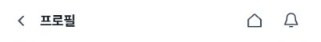
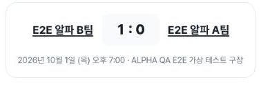
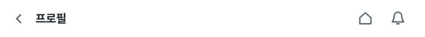
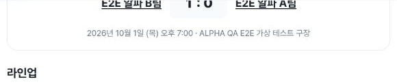
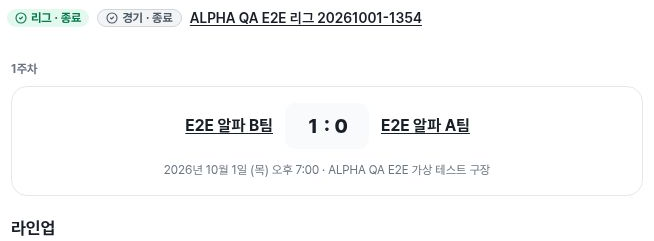
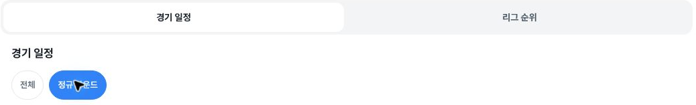
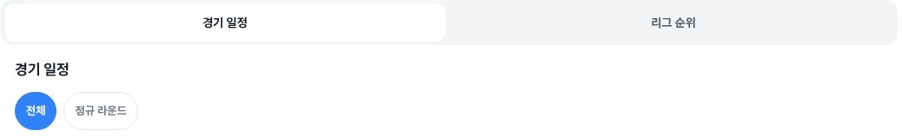
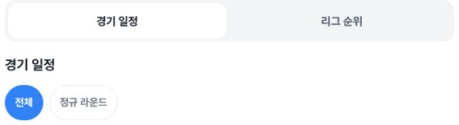

# Independent verification: league profile return and separate schedule tab residual

Actual **player profile → page Back → same league fixture** succeeds in the three selected live alpha observations. The exact natural source URL, its nested parent from, and recorded source scroll are preserved. After another Back from the fixture, a separate **정규 라운드 → 전체** schedule selection reset remains on tablet and desktop. These findings do not close #1418.

## Actual route and scroll

All times are UTC on4 October2026. Fresh navigation to the public team-match list is15:02:55.227–.946. The collector followed the visible 대회 link, regular-league filter, actual synthetic league card, bracket link and fixture card. The transitional filter result in entry.json still has /tournaments; entry-settled.json at15:04:09.420 records ?kind=league. No historical fixture URL was injected as navigation.

| CSS viewport | Source → profile → first fixture return → settled return UTC | Exact matching source/return scroll |
|---|---|---|
|402×606, DPR1.25|15:05:35.957 →15:05:57.294 →15:05:57.688 →15:06:31.981|main108.8000030517578; window0|
|788×505, DPR1.5|15:06:53.744 →15:07:20.323 →15:07:20.706 →15:07:31.174|main133.3333282470703; window0|
|1182×757, DPR1|15:08:04.263 →15:08:23.532 →15:08:23.850 →15:08:37.200|main0; window96|

The actual page-Back call intervals are15:05:57.350–.451 /15:07:20.394–.529 /15:08:23.599–.668. These are page control activations recorded in the ledger, not browser-toolbar Back or href-only predictions. Source indices1/7/13, profile2/8/14, return3/9/15 and settled4/10/16 have consistent URL/viewport/chronology. Decoding the profile from once yields the whole source relative URL, including the fixture's own encoded bracket from. The visible profile Back href matches it, and actual returned absolute URLs match exactly. Player-link rectangles also return to the same coordinates. Exact scroll equality is limited to these recorded endpoints and is not a guarantee for every navigation.

Relative outgoing href and absolute visited profile URL have different original SHA256 values by design. Resolving the relative href against the source origin yields the profile URL. The publisher independently recomputed the supplied route hashes using the historical publicly documented league/fixture/player identifiers in [the earlier league reproduction](https://github.com/kim-song-jun/matchup-sports-platform/issues/1418#issuecomment-5944873604), confirming identity without republishing names or original identifiers. This does not establish that all entity content or viewer permissions stayed the same.

## Safe pictures

| Width | Profile Back control | Returned synthetic fixture context |
|---|---|---|
|Mobile|||
|Tablet|||
|Desktop|||

All12 safe PNGs were directly inspected. They contain product controls, tabs and synthetic competition/team/score context, with no player/member names, roster rows, profile identity cards or biographies. Tablet fixture crops deliberately clip the upper score context; they are not complete score or identity screenshots. Route identity comes from the sanitized DOM chain, not from a Back-control picture alone.

The mobile source image is proof0 at main scroll0, before proof1's actual departure at108.8; that departure has DOM evidence but no separate photo. Tablet and desktop source images correspond to7/13. Return images correspond to initial returns3/9/15, followed by separately timed settled DOM checks4/10/16. Desktop source and return PNG bytes happen to be identical, but their recorded source hashes and actual capture times differ; they remain separate captures. All12 source rasters match the recorded CSS dimensions. Reported source encoding is JPEG, public output is PNG. Capture intervals start3–6ms after paired DOM snapshots and are preserved in crop-provenance.json; no screenshot time is inferred from DOM alone.

## Separate schedule-tab reset

Tablet source bracket proof6 at15:06:53.250 selects 경기 일정 +정규 라운드. After fixture entry, profile roundtrip, and one additional fixture page Back, bracket11 at15:07:31.391 selects 경기 일정 +전체. Both use the same URL and main scroll133.3333282470703. Tablet before is DOM-only; its returned-state crop shows 전체.

Desktop bracket12 at15:08:03.715 selects 경기 일정 +정규 라운드; bracket17 at15:08:37.437 selects 경기 일정 +전체. This persists in settled18 at15:09:41.386. The main tab stays 경기 일정. Desktop bracket scroll103→213 may include automatic scroll caused by the intervening fixture-link click; it is not isolated as a scroll-restoration defect.

The collector reports one fixture in each mode, but no fixtureCount field or full schedule screenshot is saved in this public packet. That count remains collector observation. Independently supported residual evidence is the selected-tab state and the shown pixels; additional row loss, a new unique issue, code cause and PR1607 regression attribution are not established. Mobile selected only the default 전체 and is not counted as a non-default reset reproduction.

## Context and limits

The source fixture has no tab controls, natural hash is empty, and recorded hash-link count is0. An event heading ID exists but is not a navigation action. Arbitrary query parameters/order, nested query-order edge cases and event-hash restoration are not live-tested. Profile activity tabs are merely recorded and were not changed. The collector's prefix selector named playerLink points to a profile-card link on profile pages; comparisons correctly use only source fixture rows1/7/13.

The historical before was guest at390×844 /768×1024 /1440×900. This run is402×606 /788×505 /1182×757 with current viewer role unknown. There is no identical-persona or pixel-identical before/after claim. The original tournament bracket/scorer, team-roster and direct/cold profile cases remain outside this run. Initial routing/loading text and a failed header-specific locator are excluded as app defects.

The publisher independently read [Deploy Alpha37210421129](https://github.com/kim-song-jun/matchup-sports-platform/actions/runs/37210421129) as successful **f614096872ccb5953722a33dc326e3fb8af246c1**, updated14:58:57 before navigation. PR1607 was merged at14:45:07. Reported release/public identity/DB health are deployment context; actual browser serving SHA remains unknown. Immutable source confirms the league caller uses useCurrentHref, passes it into shared record links, and AppBackLink chooses history Back or replace using its existing helper. Static source and PR tests do not convert unexecuted query/hash cases into live QA.

All28 input files remain byte-identical. All26 manifest payloads,27 checksums,19 main proof rows,26 timestamped collector action records, URL/scroll comparisons and crop bounds/hashes were checked. Entry, settled entry, mobile schedule entry and exit are four additional DOM records rather than additional roundtrips. Some ledger entries group keys;26 is a record count, not exactly26 individual key events. Private original JSON hashes and source-to-crop equality remain collector attestations because only public outputs were read.

Final state is the public tournament list at **15:09:42.156**, forms0 and fixture/profile routes false. No save/create/search submit/application/upload/share/result/role action is recorded; network/DB effects were not audited. This evidence supports the narrow successful league profile return and the separate tab residual, with #1418 remaining open. See [publisher-verification.json](publisher-verification.json), [return-comparison.json](return-comparison.json), [schedule-tab-residual.json](schedule-tab-residual.json) and [publisher-manifest.json](publisher-manifest.json).
