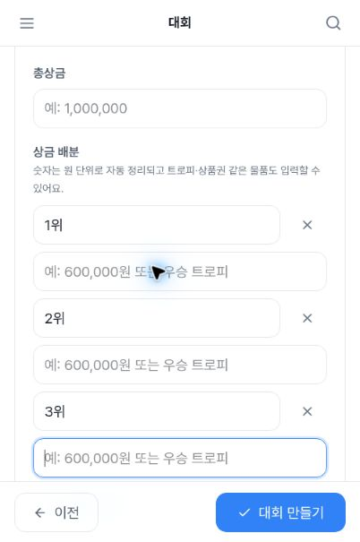
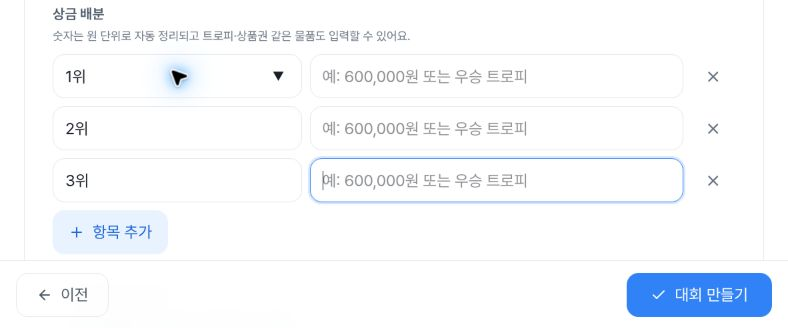
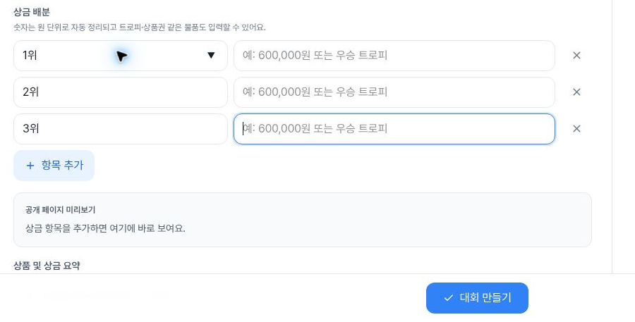
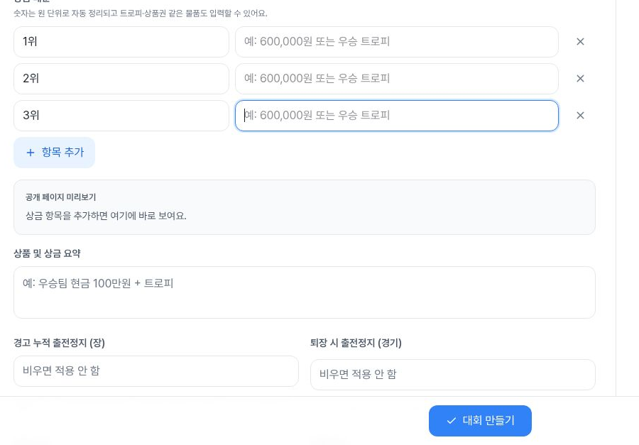

# Prize-input focus after: original Tab path clears the footer

At the original **402×606 CSS viewport**, seven native Tab presses from the first prize-name input now reveal the third content input above the fixed footer. Its44px rectangle has **zero footer intersection and3.937469px clearance**, and a later screenshot shows the focus ring. Third delete→Shift+Tab returns to the same visible content position. The same fresh Tab paths at788×505 and1182×757 also have zero overlap. This is the observed after evidence for [#1596](https://github.com/kim-song-jun/matchup-sports-platform/issues/1596) / [PR1597](https://github.com/kim-song-jun/matchup-sports-platform/pull/1597).

A separate combined width/zoom resize leaves the active input above the tablet viewport at one DOM sample. That limitation is retained below; this package does not claim that every resize preserves focus visibility.

[DOM](proof.json) · [Actions](actions.json) · [Summary](summary.json) · [Geometry/value verification](verification.json) · [Capture provenance](provenance.json) · [Entry](entry.json) · [Initial state](initial.json) · [First date attempt](navigation.json) · [Accepted dates](navigation-accepted.json) · [Step away](step-away.json) · [Basic-value restore](restore.json) · [Exit](exit.json) · [Deployment context](deployment-context.json) · [Public hashes](manifest.json) · [Original source hashes](source-manifest.json)

## Same-path before and after

The [original immutable defect evidence](https://github.com/kim-song-jun/matchup-sports-platform/blob/044a2798fb4a9c1fdbfc968ade11fe8375c32b56/docs/qa/2026-10-04-prize-footer-focus/README.md) records the mobile input fully hidden behind the footer. Its manual-scroll image was a recovery control, not a fix. This fresh run repeats the original first-name click and native Tab sequence without manual wheel before Tab7.

| Observation | UTC on2026-10-04 | CSS viewport | Third-content y range | Footer top | Overlap height | Clearance |
| --- | --- | --- | ---: | ---: | ---: | ---: |
| Before mobile Tab7 | 05:47:30.351 | 402×606 | 539.262512–583.262512 | 536.799988 | 44px | −46.462524px |
| After mobile Tab7 /7 | 07:10:13.958 | 402×606 | 488.862518–532.862518 | 536.799988 | 0px | 3.937469px |
| After mobile reverse /10 | 07:11:17.281 | 402×606 | Same | Same | 0px | Same |
| After tablet Tab7 /25 | 07:12:26.293 | 788×505 | 334.166687–378.166687 | 436 | 0px | 57.833313px |
| After desktop Tab7 /36 | 07:13:05.817 | 1182×757 | 460.5–504.5 | 688 | 0px | 183.5px |

Widths/heights/DPR match the original402×606/1.25,788×505/1.5,1182×757/1 conditions. Mobile content width is **328px now, versus328.800018px before**; it is not byte-identical geometry. Input height remains44px and first-nine-control order remains first name→content→delete, second name→content→delete, third name→content→delete. Tablet/desktop geometry for the tested third input remains consistent with the former non-overlapping controls.

The first six mobile Tabs keep scrollY944.799988. Tab7 changes it to996.799988, an observed52px increase, placing the input above the footer without manual wheel. Before focus reaches it, the inactive third-content field in rows0–6 still intersects the footer by44px; zero-overlap claims concern the active control, not every field simultaneously. A later sample at07:11:16.872Z, row8, has the same active element, rectangle and scrollY:62.914seconds after row7. These are discrete snapshots, not a continuous trace. Reverse row10 retains the position. Tablet rows18–27 keep scrollY800; desktop rows29–38 keep610. Actual original-path input/footer intersections are recomputed on both axes. The3.937469px mobile clearance must not be rounded up to an exact4px guarantee.

## Actual safe images and capture timing

Mobile Tab-after screenshot is paired with **later stable row8**, DOM07:11:16.872Z, capture07:11:16.875–07:11:16.898Z, not the first Tab7 timestamp:

Mobile reverse row10, DOM07:11:17.281Z, capture07:11:17.285–07:11:17.304Z:

Tablet row25 DOM07:12:26.293Z; image captured **07:13:03.616–07:13:03.643Z**,37.323seconds later, before the next recorded Tab action:

Desktop row36 DOM07:13:05.817Z; image captured **07:13:45.329–07:13:45.367Z**,39.512seconds later, before the next recorded Tab action:

The selected ledger records no intervening UI action in these delayed capture intervals; this does not substitute for continuous DOM monitoring. Captures have their own exact UTC brackets. `focusVisible:true` alone is not visibility proof; these safe PNGs separately show the ring and footer.

Source rasters are402×606,788×505 and1182×757. Mobile safe images intentionally crop the last pixel row to402×605; that is distinct from the original before source raster's605px height. Tablet crop is788×328; desktop Tab crop900×457 and resize crop900×627. Output hashes and bounds are independently checked. No private full-source screenshots were opened; source-to-crop equality remains collector-attested.

## Local input and restoration

After the original focus screenshots, supported locator.fill sets exact `QA 포커스 1004` at row11. That call accompanies scrollY996.799988→1204.800049, a208.000061px increase. Locator-assisted focus/centering cannot be excluded, so this is neither a native typing observation nor a proven product-induced scroll jump.

An actual native `x` at07:11:53.383–07:11:53.452Z produces `QA 포커스 1004x` in row12. Tab to third delete and Shift+Tab back preserve that value in rows13/14, with unchanged scrollY. Explicit fill restores blank in row15; all nine repeated control values match baseline. Those nine include three delete buttons with empty value strings; they are not nine editable fields.

The default1위/2위/3위 names and other contents remain unchanged in all40 snapshots. After Previous to step3, the separate07:13:46.107Z observation has heading “참가 조건” and zero prize controls. Returning to step4 at07:13:46.468Z, row39, restores the same baseline values, window scroll0 and H2 active state. No modified title/value is claimed to persist after explicit restoration.

## Resize and manual-scroll boundary retained

After input restoration, a native wheel request of120 produces a measured96px scroll increase, observed at row16. Combined native window enlargement and zoom150 then gives tablet row17 at07:12:24.780Z: third content is still active, `focusVisible:true`, but its y range is **−323.166687 to−279.166687px**, entirely above the viewport. Footer intersection is0 because it is above the page, not because it is visible. This is **DOM-only** with no dedicated screenshot and combines earlier manual scroll, width change and zoom. No single-cause diagnosis, matched pre-fix resize comparison or new footer regression is established. A fresh first-name click then starts the separate tablet Tab sequence.

Later tablet→desktop zoom reset yields row28 at07:13:04.266Z with the still-focused third content at270.5–314.5, visible above the footer. Capture07:13:04.271–07:13:04.308Z:

The original Tab/Shift+Tab condition is supported by the observed after; this mixed resize result prevents any blanket resize-visibility PASS.

## Setup, ending state and limits

Fresh navigation is **07:05:46.347–07:05:46.872Z**, distinct from the earlier05:45 wizard. Initial title/sport values are blank. The first calendar selection followed by Escape leaves all recorded dates blank at07:07:37.507Z; the subsequent Next tool call completes but does not prove stage advancement. The collector reports required errors. A later native selection dismissed through a neutral heading is separately recorded at07:08:28.022Z: start `2026-10-17T00:08`, registration deadline `2026-10-14T23:59`. These are local form strings, not UTC event times, and differ from the prior setup's time; no business-time comparison is made. The initial text-only step5 query returns an empty array, while its later explicit aria-label inspection records the disabled control. Every one of the40 prize DOM rows also records it disabled.

Title and sport are explicitly restored blank at07:14:18.647Z. Cancel runs07:14:18.650–07:14:18.730Z; the later observation at **07:14:28.230Z** records `/admin/tournaments`, zero prize inputs and zero visible dialogs. The gap is not measured navigation latency. Hidden date values were not re-entered and checked after exit; no storage erasure or persistent-draft discard is inferred. Static local-state/source claims are omitted from the public projection.

[Deploy Alpha run37183695434](https://github.com/kim-song-jun/matchup-sports-platform/actions/runs/37183695434) independently reports success for5372ea9c3640621eb270d15c54c70a822b97d536, updated07:02:48Z before fresh navigation. Version/healthy timestamp are parent-reported context; **browser runtime serving SHA remains unknown**. No causal attribution is established from the workflow alone.

This package has40 DOM snapshots,360 repeated control records and61 selected completed action calls. A completed call is not necessarily a successful intended UI transition. The standard three paths use24 forward Tab calls and3 Shift+Tab returns; the edited-value test adds one forward and one reverse call, plus a native x. The failed exact-label selector call is collector-reported outside the completed-action ledger. No new tests are created by publisher verification.

No final submit/create, save, upload, delete activation, step5 visit, search submission, result/permission change or notification action was reported; no HTTP/DB or global telemetry audit was performed. This is not a general server-write-zero assertion. Coverage is the first nine prize controls and bounded followups, not all wizard fields, actual devices, virtual keyboards, IME, screen-reader speech, final creation or full-form accessibility. The earlier immutable defect photos remain unchanged and linked. All5 new safe crops show only synthetic local wizard/default UI, and original safe source files remain unchanged.
