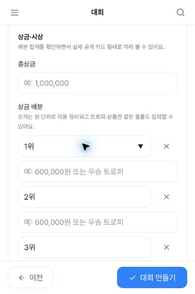
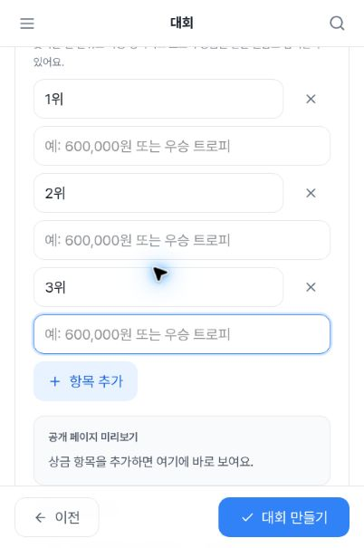
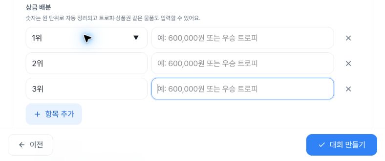

# Mobile third-prize input: keyboard focus hidden by fixed footer

New alpha observations on **2026-10-04** show a focused input fully hidden behind the creation footer. At **402×606 CSS px**, seven native Tab presses from the first prize-name input reach **“상금 항목 3 내용”**. DOM records that INPUT active with `focusVisible:true`, while its entire **44px height and328.800018px width** intersect the fixed footer and the screenshot shows no visible input. A later sample85.101seconds afterward and a Shift+Tab return record the same geometry. Manual scrolling reveals the still-focused field. The tested tablet/desktop routes do not reproduce the overlap.

This evidence supplements the existing [#1439 creation UI work](https://github.com/kim-song-jun/matchup-sports-platform/issues/1439). It contains **33 DOM snapshots, 40 selected action records and4 safe PNGs**. It does not establish input failure, a particular code cause, a WCAG conformance verdict or an entire-app failure.

[DOM proof](proof.json) · [Action ledger](actions.json) · [Entry](entry.json) · [Initial blank state](initial.json) · [Date navigation](navigation.json) · [Scope](summary.json) · [Intersection recalculation](verification.json) · [Capture provenance](provenance.json) · [Duplicate check](duplicate-check.json) · [Manifest](manifest.json)

## Reproduction and expectation

1. Enter `/admin/tournaments/new` in the authorized alpha admin session and use minimal synthetic local title/sport/date values to reach step4 without submission
2. At402×606 CSS px, click the first prize-name input
3. Press native Tab seven times: first content → first delete → second name → second content → second delete → third name → third content
4. Observe the third content INPUT as active, with its rectangle behind the fixed footer
5. Tab to third delete, then Shift+Tab back to third content; the overlap recurs
6. Manually scroll down to reveal the field as a same-session visibility control

Expected behavior is that the newly focused field can be seen above the fixed action area. In this run, its rectangle is inside the viewport yet fully behind the footer. `focusVisible:true` records a focus-state match; it does not mean the focus outline is visible through an opaque overlay. The screenshot alone cannot identify the hidden active element, so it is paired with DOM and the actual Tab ledger.

## Geometry and time

| Observation / proof row | UTC | CSS viewport | Active input y range | Fixed footer top | Vertical intersection | Clearance above footer |
| --- | --- | --- | ---: | ---: | ---: | ---: |
| Mobile Tab7 /7 | 05:47:30.351 | 402×606 | 539.262512–583.262512 | 536.799988 | 44px | −46.462524px |
| Mobile later sample /8 | 05:48:55.452 | 402×606 | Same | Same | 44px | Same |
| Mobile Shift+Tab return /10 | 05:48:55.813 | 402×606 | Same | Same | 44px | Same |
| Mobile manual-scroll settled /12 | 05:49:16.729 | 402×606 | 347.262512–391.262512 | 536.799988 | 0px | 145.537476px |
| Tablet Tab7 /20 | 05:49:54.182 | 788×505 | 334.166687–378.166687 | 436 | 0px | 57.833313px |
| Desktop Tab7 /30 | 05:50:13.900 | 1182×757 | 460.5–504.5 | 688 | 0px | 183.5px |

Mobile input x36.8–365.600018 is fully within the footer x0–402.399994. Footer y536.799988–605.599991 covers all44px of the input. Intersection is recomputed on both axes; mere viewport containment is insufficient. The mobile document width is402px, separately recorded from the footer's fractional402.399994px width.

Mobile scrollY is947.200012 at rows0–10. Row8 is85.101seconds after row7 and has identical focus, input/footer rectangles and scrollY. These are discrete samples, not a continuous trace of that entire interval. The collector reports one unsuccessful typing-tool attempt during this period; successful text entry is not established.

The manual scroll call requests180 units at05:48:55.817–05:48:56.087. Row11 at05:48:56.162 is an in-progress scroll sample and is retained in the raw proof but **excluded from settled control comparisons**. Its image is not published. Row12 is the separate settled control: measured scrollY1139.199951, a net increase of191.999939 CSS px from row10. Requested scroll units are not substituted for measured displacement, and the time gap is not a scroll-duration measurement.

Each width traverses the first nine prize controls using eight forward Tab calls and one Shift+Tab return:24 forward calls and3 reverse calls in total. The three baseline snapshots,27 call endpoints, one later sample and two manual-scroll samples account for33 DOM rows. The297 stored control records are nine controls repeated across33 snapshots, not297 interactions. Tablet/desktop third-delete and reverse-content samples also have no footer intersection; this does not certify other controls or viewport sizes.

## Safe visual evidence

Mobile hidden field, DOM05:47:30.351Z; capture **05:47:30.354–05:47:30.372Z**. The active third content is entirely behind the footer; the third name remains visible above it.

Same-session manual-scroll control, DOM05:49:16.729Z; capture **05:49:16.734–05:49:16.752Z**. This is manual recovery, not a fix or deployed after.

Tablet788×505, DOM05:49:54.182Z; capture **05:49:54.186–05:49:54.228Z**.

Desktop1182×757, DOM05:50:13.900Z; capture **05:50:13.906–05:50:13.945Z**.

CSS viewport/DPR values are402×606/1.25,788×505/1.5 and1182×757/1. Source rasters are402×605,788×505 and1182×757 pixels. Delivered images are402×605,402×605,788×329 and900×457. Mobile raster height605 is distinct from CSS height606. Window resizing/browser zoom is not physical-device or software-keyboard testing.

## Relationship to existing issues

The [timestamped duplicate check](duplicate-check.json) searches open and closed issues through seven bounded queries, then reads #1439 and its three existing comments plus related issue bodies. It finds no exact third-prize-content same-step Tab reproduction in those results. Issue routing remains separate from this evidence publication; no issue is created here.

- [#1439](https://github.com/kim-song-jun/matchup-sports-platform/issues/1439) concerns creation promotion density, prize width and final-preview flow. Its [Oct3 after comment](https://github.com/kim-song-jun/matchup-sports-platform/issues/1439#issuecomment-5972591015) explicitly left third-row Tab untested. This new execution adds that focus-boundary evidence. Earlier mobile width improvement remains independently valid
- [#1437](https://github.com/kim-song-jun/matchup-sports-platform/issues/1437) concerns scroll/heading focus when changing wizard stages, not Tab within the same step
- [#1534](https://github.com/kim-song-jun/matchup-sports-platform/issues/1534) concerns the team-creation level SELECT on another route
- [#1430](https://github.com/kim-song-jun/matchup-sports-platform/issues/1430) concerns participant-roster inputs and a sticky Add action

The earlier Oct3 inactive third-row field below the fold did not prove a focus defect. This run does not retroactively relabel it, and it does not attribute the newly observed failure to PR1593 or any other change without cause evidence. Recorded `scrollMarginBottom:0px` is a sampled property, not a proven root cause.

## Execution limits and ending state

Fresh navigation is **05:45:45.156–05:45:45.462Z**; proof observations are **05:47:29.210–05:50:14.317Z**. The previously reported [Deploy Alpha run37143395492](https://github.com/kim-song-jun/matchup-sports-platform/actions/runs/37143395492),27a021fc, has independently re-read success metadata updated2026-10-03T18:31:28Z. [This historical context](deployment-context.json) is not a claim that it is the latest deployment or the browser's serving identity. **Runtime serving SHA is unknown**.

The native typing attempt is reported by the collector as an unavailable accessibility input provider. It is not a separately timestamped record among the40 selected actions. All33 snapshots independently show blank prize-content values and unchanged1위/2위/3위 names. No successful blind typing or application input-validation failure is claimed. Local title/sport/date setup succeeded through its separately recorded controls. Date strings `2026-10-17T22:46` and `2026-10-14T23:59` are local input strings, not timezone-converted instants.

All33 proof rows contain one disabled step5 record. Save/create, step5, uploads, delete activation, official-result changes and notifications were not performed according to the collector. Selected actions are not a network/database audit. No full-form accessibility, WCAG verdict, screen-reader speech, actual-device keyboard or save outcome is established.

At the last proof row, the local wizard remains open at step4 with desktop third-content focus for subsequent authorized QA. **This package has no exit/cleanup proof**; later work must retain its own timestamps and evidence. All four safe images were independently viewed and output hashes, dimensions, bounds and DOM mappings checked. They contain generic UI/default values. Private full-source screenshots were not opened or published; original-to-crop equality remains collector-attested. Source files are unchanged and source hashes are retained separately from public-file hashes.
