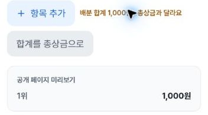
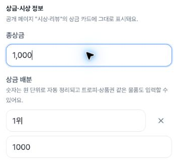
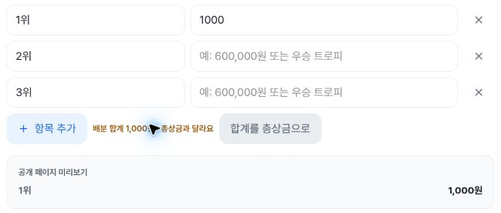
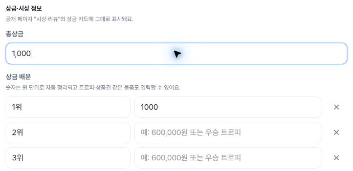
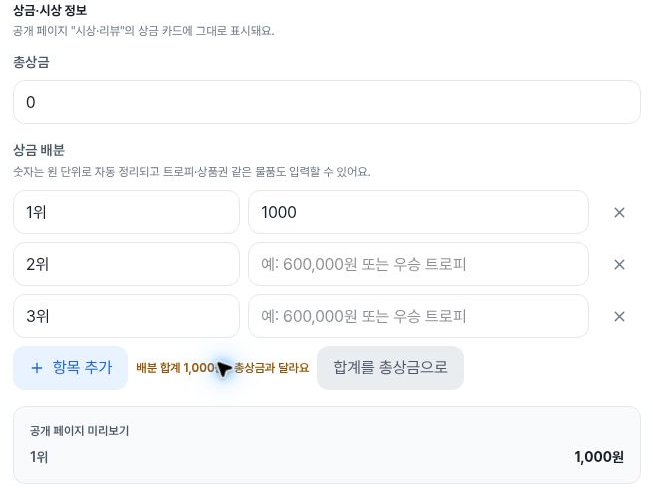
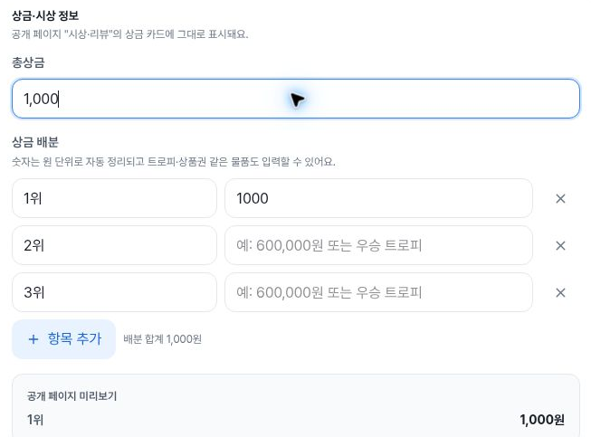

# QA129 item13: prize-sum warning and local correction

At **402×606, 788×505 and 1182×757 CSS px**, the existing synthetic tournament's inline prize editor shows a mismatch when total prize is 0 and the first allocation is 1000. One click on **“합계를 총상금으로”** changes only the total to the displayed value **1,000**. The mismatch clause and correction button disappear, while the neutral **“배분 합계 1,000원”** remains. This supports the bounded warning-and-correction criterion in [QA129 item13](https://github.com/kim-song-jun/matchup-sports-platform/issues/129), whose current body was independently read on 2026-10-04.

[DOM proof](proof.json) · [Actions](actions.json) · [Initial values](initial.json) · [Entry](entry.json) · [Restoration and exit](exit.json) · [Summary](summary.json) · [Capture provenance](provenance.json) · [Recalculation](verification.json) · [Public file hashes](manifest.json)

## Observed cycles

| CSS viewport | Mismatch / corrected / restored indices | Mismatch UTC | Corrected UTC | Restored UTC |
| --- | --- | --- | --- | --- |
| Mobile 402×606 | 0 / 1 / 2 | 06:01:19.018 | 06:01:19.732 | 06:01:19.969 |
| Tablet 788×505 | 3 / 4 / 5 | 06:02:20.859 | 06:02:21.610 | 06:02:21.843 |
| Desktop 1182×757 | 6 / 7 / 8 | 06:02:22.525 | 06:02:23.265 | 06:02:23.514 |

All UTC values are on **2026-10-04**. The fresh navigation call is **05:59:46.115–05:59:53.074Z** and initial values are observed at **05:59:54.592Z**. There are 10 indexed proof snapshots, 25 selected action records, 80 repeated field records and 53 repeated button records; those field/button counts are not additional interactions. Initial and exit observations are separately stored. Three actual correction clicks and six explicit value-restoration actions are recorded.

For each width, independent recalculation uses the recorded allocation strings: first content `1000`, second and third content blank, sum 1000. Exactly one enabled correction control has `type="button"`. Comparing all eight named field values before and after correction shows only `총상금` changes from `0` to `1,000`; the first content stays `1000` and the other fields stay unchanged. The control is separate from the still-present “상금 정보 저장” button.

The collector key `warningLines` includes all sum-related text, including the neutral line. Its corrected value is `["배분 합계 1,000원"]`, not an empty array. Only after explicitly restoring total 0 and blank allocations does the array become empty. This confirms the recorded UI case, not all money formats, negatives, decimals, multiple allocations, non-numeric prizes or save-validation boundaries.

## Safe before/corrected images

The pointer partly covers the mismatch text. Its exact full wording, “배분 합계 1,000원 · 총상금과 달라요”, is established by DOM records. The before and corrected photos use different scroll positions; they are not fixed-position visual diffs.

Mobile mismatch capture **06:01:19.023–06:01:19.040Z**; corrected **06:01:19.736–06:01:19.752Z**:

Tablet mismatch capture **06:02:20.865–06:02:20.890Z**; corrected **06:02:21.616–06:02:21.636Z**:

Desktop mismatch capture **06:02:22.532–06:02:22.553Z**; corrected **06:02:23.270–06:02:23.292Z**:

Mobile and tablet corrected crops omit the sum/action row. Their DOM records establish removal of the mismatch clause and correction button; the desktop image visually corroborates that transition. Each capture starts 4–7 ms after its paired DOM record and completes before the next dependent correction or restore action. All output dimensions and crop bounds match provenance.

CSS/DPR values are 402×606/1.25, 788×505/1.5 and 1182×757/1. The mobile source raster is **402×605**, distinct from the CSS height606. Safe output sizes are 352×196, 352×317, 718×306, 722×351, 653×490 and 653×483 pixels. This is cloud-browser resize/zoom testing, not real-device or screen-reader testing.

## Restoration and final state

After each cycle, explicit actions clear first allocation and restore total0. All eight named values match the original baseline at proof rows2,5,8: total0, names1위/2위/3위, three blank contents, and unchanged synthetic “상품 및 상금” description. These are value comparisons, not eight fields individually edited each time.

Overview is observed at **06:02:51.825Z** with zero prize inputs. Reentering Info produces proof row9 at **06:02:52.306Z**, whose eight values again equal the initial baseline. The final Overview observation at **06:02:52.629Z** has zero prize inputs and zero visible dialogs. Reentry values are DOM observations; the editor fields are below the visible viewport at that snapshot, so simultaneous visual exposure is not claimed.

Save, Enter, upload, creation, official-result mutation and notifications were not performed according to the collector, and the selected action ledger contains no such activation. UI restoration and route changes do not establish a direct network/database or persistent-storage audit. This is not a saved-prize or public-page-update test, and it does not address the separate empty-save criterion in QA129 item22.

## Separate execution and evidence scope

This fresh existing-tournament editor run begins after the [Home retention wizard's 05:56:13.951Z exit](https://github.com/kim-song-jun/matchup-sports-platform/blob/4260593339ce0aba3f7fa9f63e07467325c50528/docs/qa/2026-10-04-home-retention/README.md). It is separate from the [creation wizard's third-input focus defect](https://github.com/kim-song-jun/matchup-sports-platform/blob/044a2798fb4a9c1fdbfc968ade11fe8375c32b56/docs/qa/2026-10-04-prize-footer-focus/README.md); neither earlier immutable package is changed, and this arithmetic control result does not resolve that focus issue.

The previously reported alpha27a021 commit is historical deployment context only. **Browser runtime serving SHA is unknown**. Unverified static source-contract assertions from the collector summary are omitted from this public projection; no particular runtime implementation or code cause is inferred.

All 6 actual safe images were independently inspected and contain generic prize UI and synthetic numbers, without fixture title, account/member names, rosters or cover images. All safe PNG bytes and the actions/initial JSON bytes are preserved. Entry/proof/exit replace the synthetic fixture UUID with a stable route template and preserve each original URL's SHA-256. The original safe files remain unchanged; original source hashes and projected-public hashes are explicitly separate. Private source screenshots and capture metadata were not opened; original-to-crop equality and their hashes remain collector attestations. No issue, comment or app-code change is part of this evidence publication.
