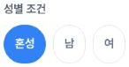

# Team-create gender label: sanitized after evidence

The team-create condition screen visibly shows **혼성** selected, with **남** and **여** unselected, at the mobile, tablet and desktop endpoints captured on 2026-10-04. This packet contains three minimal screenshot crops, four DOM/AX snapshots (one offscreen), and 18 recorded actions. It verifies the display in this flow only.

## Scope and deployment context

- Page: https://alpha.teameet.co.kr/team-matches/new/condition
- A fresh document navigation ran from **08:36:52.894 to 08:36:58.089 UTC**.
- Reported deployment: commit `4c81d071ede5bba14575f2aeb1097326797cbd08`, version `1.1.5-alpha.20261004.g4c81d071ede5`, run `37188018237`; reported healthy at 08:22:31.618 UTC and successful at 08:22:48 UTC on 2026-10-04.
- Those deployment facts are supplied context. The browser capture does **not** identify its runtime SHA, so temporal ordering alone does not prove which commit was served.
- [Earlier before evidence](https://github.com/kim-song-jun/matchup-sports-platform/blob/a678ea98bc4b6d162921534892841214ca6fe07a/docs/qa/2026-10-04-team-skill-gender-before/README.md)

## Visible evidence

All timestamps below are UTC on 2026-10-04. Screenshot acquisition and DOM/AX observations are recorded separately.

| Endpoint | Proof index | CSS viewport; DPR | DOM | AX | Screenshot start–end | Crop |
|---|---:|---|---|---|---|---|
| Mobile | 0 | 402 × 606; 1.25 | 08:39:33.963 | 08:39:34.008 | 08:39:34.010–08:39:34.037 | [mobile-gender.png](mobile-gender.png) |
| Tablet | 1 | 788 × 505; 1.5 | 08:40:13.550 | 08:40:13.588 | 08:40:13.588–08:40:13.620 | [tablet-gender.png](tablet-gender.png) |
| Desktop, after scroll | 3 | 1182 × 757; 1 | 08:40:51.207 | 08:40:51.245 | 08:40:51.245–08:40:51.269 | [desktop-gender.png](desktop-gender.png) |

The fourth DOM/AX snapshot, **proof 2**, is an offscreen desktop observation at DOM 08:40:13.806 and AX 08:40:13.853. Its controls occupy y=840–884 below a 757-pixel-high viewport. Its screenshot was acquired 08:40:13.854–08:40:13.885, is excluded from this packet, and supplies no visible gender proof. The original DOM entry remains unchanged in `safe/proof.json`; proof 3 is the visible desktop endpoint.

Across all four DOM snapshots, the three gender labels are `혼성`, `남`, `여`, with `aria-pressed` values `true`, `false`, `false`. AX values are 1, 0, 0. Each `valueAttribute` is null. All four grade chips (`입문`, `초보`, `중수`, `고수`) have `aria-pressed=false` at each endpoint. No recorded action changed a gender or grade selection.

Reported static source context maps the canonical value `성별 무관` to display label `혼성`. The captured DOM and AX establish the displayed label and selected state; they do **not** establish the actual stored, API or database payload.

## Local title restoration and exit

The title was initially blank, temporarily set to `QA 혼성 표시 1004` to reach the condition screen, explicitly restored to blank, and verified blank on fresh reentry. Description stayed blank in each captured title/description checkpoint. See the unmodified `initial.json`, `restore.json` and `reentry.json` source copies.

The leave dialog says the draft is retained on this device so writing can resume later. Exit therefore must **not** be characterized as discarding or cancelling the draft. Draft changes can refresh the 24-hour TTL; the packet establishes restoration of the title, not deletion of all local draft state or restoration of a prior expiration timestamp.

Final exit was observed at **08:43:19.020 UTC** on `https://alpha.teameet.co.kr/team-matches`, with no title field and zero visible dialogs. No save, create or upload action was performed in this recorded QA sequence. There was no network audit, and this packet makes no claim that global server writes were zero.

## Limits

This is display evidence for the team-create condition screen only. List/filter/detail/admin/edit behavior and the whole pull request were not verified. Runtime SHA and live stored/API/database payload remain unobserved. The title restoration checks do not imply that exit discards a draft.

## Pixel provenance and file integrity

The three PNGs contain only `성별 조건` and its `혼성 / 남 / 여` controls. Each final crop was visually inspected. No original screenshots or adjacent form content are included.

All four original files have `.png` basenames but **JPEG** encoding. Source hashes were checked against the private capture ledger. The originals were decoded locally and only exact RGB pixel subsets were saved losslessly as PNG, with no resizing, resampling, annotation, redaction or color conversion. Published PNGs carry no source metadata. Screenshot dimensions already equal CSS viewport dimensions; the crop coordinates do not multiply by DPR.

| Published file | Source basename | Crop [left, top, right, bottom), pixels | Output dimensions |
|---|---|---|---|
| `mobile-gender.png` | `mobile-mixed-after.png` | [16, 216, 162, 292) | 146 × 76 |
| `tablet-gender.png` | `tablet-mixed-after.png` | [110, 189, 255, 265) | 145 × 76 |
| `desktop-gender.png` | `desktop-mixed-visible-after.png` | [327, 212, 474, 288) | 147 × 76 |

`crop-provenance.json` records original basenames, source formats/dimensions/hashes, separate screenshot/DOM/AX timestamps, crop coordinates, output hashes, decoded pixel hashes and the explicit proof-2 exclusion. `summary.json` records the bounded findings and context.

The seven files under `safe/` are byte-for-byte copies of the immutable sanitized source JSON. `manifest.json` covers all payload files except itself and `SHA256SUMS`; `SHA256SUMS` covers all package files except itself, including the manifest. Verify from this directory with `sha256sum -c SHA256SUMS`.

This directory is prepared for review only. No GitHub publishing or external upload was performed in preparing it.
