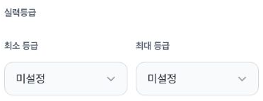
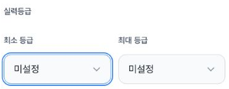
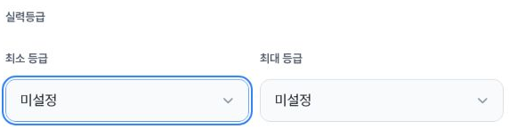
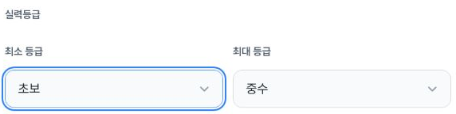
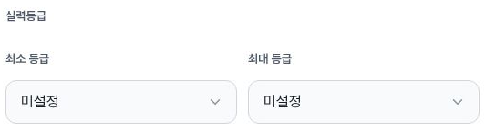
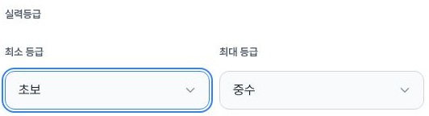
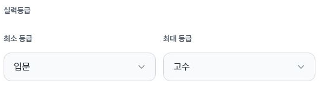

# Independent verification: team-match creation skill range

Three recorded viewports show native **최소 등급 / 최대 등급** controls and normal 미설정, same-level, partial-range and crossing behavior. Actual Tab/ShiftTab endpoints remain on the intended selects. The25-file prepared packet is preserved byte-for-byte; [coverage](coverage.json), [proof](proof.json) and [publisher-verification.json](publisher-verification.json) provide the exact scope. This verifies local creation-form behavior for issue1599/PR1602, not final creation or every surface in the PR.

## Actual safe crops

All eight are separate screenshot calls. PNG pixels show only product labels and range values, excluding locations, teams, member/account details and source images. Their paired DOM/capture times are listed in [crop provenance](crop-provenance.json); capture starts3–8ms after DOM and lasts21–84ms. The collector reports exact decoded subsets of JPEG source captures; private originals were not opened by the publisher. Source rasters match CSS402×606,788×505 and1182×757 at DPR1.25/1.5/1 in these captures.

## Values and keyboard scope

| Recorded behavior | Mobile402 proof | Tablet788 proof | Desktop1182 proof |
| --- | --- | --- | --- |
| Initial unset / unset | 1 | 14 | 24 |
| Set minimum 초보; both become novice | 2 | 15 | 25 |
| Raise maximum to 중수; novice / intermediate | 3 | 16 | 26 |
| Raise minimum to 고수; both advanced | 4 | 17 | 27 |
| Lower maximum to 입문; both beginner | 5 | 18 | 28 |
| Keyboard partial range, max then reverse min focus | 10 / 11 | 19 / 20 | 29 / 30 |
| Local Next/Previous return | 9, novice/intermediate | 22, novice/intermediate | 33, beginner/advanced |
| Both restored to unset | 13, settled | 23 | 35 then reload36 |

Mobile ArrowDown first changes both beginner→novice at6 with minimum SELECT active/focusVisible; Tab and maximum ArrowDown produce novice/intermediate at7 with maximum active. Tablet/desktop record the combined ArrowDown→Tab→ArrowDown outcome at19/29 and reverse outcome20/30. Locator.press establishes focus before sending a key, so these endpoints do not prove uninterrupted whole-page keyboard traversal or screen-reader speech. Mobile planned reverse8 is actually BUTTON focus and excluded from reverse-select success; separate successful10/11 are used. Select12 already reads unset;13 is its later settled screenshot, not an additional reset.

Every one of68 repeated select records across34 condition snapshots is48px high, fits the recorded viewport rectangle and has scrollWidth=clientWidth and aria-invalid=false. Observed control widths are174.800003px mobile,274px tablet and254px desktop. This is not a guarantee for arbitrary text, all occluding layers or every viewport. Options are explicitly recorded for28 select records in proof1–14; later records retain selectedText/value/labels and geometry but omit option arrays. All34 condition snapshots retain 혼성 pressed=true, 남/여 false; many gender rectangles are offscreen, and those controls were not activated or photographed for this test.

Full 입문–고수 range was selected **only on desktop**, at31 (09:56:50.271Z), retained through condition→place-time32→condition33, then fresh reload action09:57:34.269–.582 and DOM34 at09:57:35.296. Mobile partial range has recorded Next/Previous calls and restored condition9; it lacks a separate saved intermediate place-time snapshot, so the intermediate route is collector action evidence. Tablet21 and desktop32 retain actual place-time route endpoints with unrelated location values/options removed.

## Restoration and excluded prelude

The initial info snapshot09:42:32.642Z has blank title/description. A temporary13-character synthetic title was used. Grade endpoints returned to visible 미설정 through a normal selector; desktop reload36 at09:58:01.577Z confirms unset. Info37 retains the temporary title; direct restoration produces blank title/description38, fresh info reload produces blank39, and Escape closes the leave dialog back to blank info40. Explicit 나가기 then reaches /team-matches at09:58:48.774Z with no title field or dialog.

Leaving **retains the local draft**. UI values are restored; expiry/update timestamps and selection hydration may change. No original storage-byte or draft-deletion claim is made. Description values are confirmed where the field is mounted; null on condition/place-time is absence, not an empty-field assertion. Final create/save, upload, application, permission and result controls were not activated. No API/DB/network audit or unconditional server-write-zero claim follows.

Proof0's planned label says initial range unset, but actual route is place-time with no range selects and is excluded. The historical info-next-note says the first Next remained on info, but its actual09:48:50.981Z endpoint is /condition with title:null. The appended correction makes this actual URL authoritative. The second call labeled Next after settled title was therefore followed by place-time proof0; Previous returned to condition1. This prelude is not a navigation-latency or normal one-click failure/success test. Collector targeting failures and unavailable/denied tool calls are not successful regression cases. The58 records are calls recorded only after await returned successfully, not58 passing assertions. Failed-call partial UI effects were not audited or inferred.

## Deployment and source boundaries

Proof7 at09:50:55.518Z uses select IDs _r_h_-min/max; proof8 at09:52:31.575Z uses _r_2_-min/max. No explicit reload/goto is recorded in that interval; the collector reports none was sent. The cause is unknown and a remount or reload is neither established nor ruled out. This packet does not prove uninterrupted document identity across that interval.

Fresh info navigation09:42:14.048–19.353 follows [initial workflow37192161237](https://github.com/kim-song-jun/matchup-sports-platform/actions/runs/37192161237), independently read as success SHA19e192d577544b26986799a47f76e8b259a1a8e2, updated09:40:35Z. [Later workflow37192728828](https://github.com/kim-song-jun/matchup-sports-platform/actions/runs/37192728828) reports success SHA951a67e3423dec502697f8bab2d78696d9374cc5 updated09:49:29Z during the run. Explicit later document reloads at09:57:34,09:58:00 and09:58:20 are separately recorded. Healthy/version remain reported context. Actual runtime SHA is unknown; earlier observations are not retroactively assigned to the later deployment.

The publisher independently fetched the three exact19e192 source files and matched their Git blob hashes against [source-contract.json](source-contract.json). [Range component](https://github.com/kim-song-jun/matchup-sports-platform/blob/19e192d577544b26986799a47f76e8b259a1a8e2/apps/v1_web/src/components/team-matches/team-match-level-range-field.tsx#L18) defines empty reset and adjustment of the opposite endpoint on crossing. [Create client](https://github.com/kim-song-jun/matchup-sports-platform/blob/19e192d577544b26986799a47f76e8b259a1a8e2/apps/v1_web/src/components/team-matches/team-matches-create-client.tsx#L600) persists draft changes locally, while final submission is a separate mutation. These static paths explain the bounded test and do not prove which bundle served each snapshot, final payload correctness, malformed/legacy data handling, existing edit or administrator creation.

[Earlier creation controls](https://github.com/kim-song-jun/matchup-sports-platform/blob/a678ea98bc4b6d162921534892841214ca6fe07a/docs/qa/2026-10-04-team-skill-gender-before/README.md) remain a separate earlier observation. This packet tests new range behavior and normal UI restoration; it does not replace or expand earlier results. Original25-file inventories remain unchanged; [publisher-manifest.json](publisher-manifest.json) covers the complete delivered set. All safe JSON, eight actual PNGs, hashes, crop linkage, timestamps, values and geometry were independently inspected; source preservation and source-to-crop equality remain collector-attested.
