# Android 실기기 전체 화면 감사 — 2026-09-19

Canonical task: [Task 156](../../.github/tasks/156-android-app-fcm-foundation.md).

## 환경과 검증 범위

- 기준 dev: `82698757d`. Samsung Galaxy A32(SM-A325N), Android 13, 1080×2400, WebView CSS width 411px.
- Actions `34565292770`의 최신 Alpha APK를 SHA256 확인 후 사용자 승인하에 재설치했다. 빌드 SHA `11bdded28`의 Android 소스는 기준 dev와 동일하다.
- 사용자가 일반 계정 → 관리자 계정으로 직접 로그인했다. 계정/세션은 수집하거나 공개하지 않는다.
- v1 page route **180/180 처리**, **177개 경로 실기기 캡처**(중복 재검증 포함 242장). 나머지 3개는 개인 리뷰 상세·팀 컨택 상세·담당 경기 상세의 실제 계정 데이터가 없다. 일반 사용자, 관리자 63경로 추가 캡처 및 누락된 실제 상세 ID 재검증을 구분한다. 캡처 수는 기능 동작 성공 수가 아니다.
- 실제 Alpha에서 읽기/탐색/키보드 열고 닫기/스크롤을 확인했다. 채팅 전송, 신청, 결제, 운영 결과 변경은 수행하지 않았다.
- 로컬 headed Chromium: 390/768/1440px. 실제 API를 사용하는 독립 QA DB. 이벤트 이미지 실패 회귀만 공개 campaign 응답을 사용한 명시적 fixture다.

## 확인한 결함과 수정

| 문제 | 원인 / 수정 | 증거 |
|---|---|---|
| 채팅 IME 위 48px 중복 공간 | Native inline safe-bottom이 CSS보다 우선. 키보드 열린 동안만 `!important`로 0 적용 | 실기기 입력바 128.76→80.76px, 닫힘 시 safe-bottom 48px 복원. 배포 전 임시 CSS 비교임 |
| 비동기 제목 변경 시 React 경고 | 렌더 중 외부 shell store 갱신 → layout effect에서 게시/소유 snapshot cleanup | 경고 및 제목 갱신 RED→GREEN, 공통 shell 테스트 5개 |
| 양 팀 겸직자의 리뷰 카드 key 충돌 | sourceId가 같아도 reviewerTeam이 다른 카드는 별개 | reviewerTeam.teamId를 key에 포함, 실제 로컬 리뷰 재캡처 오류 0 |
| 이벤트 이미지 실패 시 대체 그림이 64px로 축소 | fallback div의 높이 계약 누락 | 390/768/1440에서 슬롯과 fallback 높이 일치, 아래 전후 비교 |
| 관리자 신청 대시보드 링크 404 | regular_league 신청이 대회 전용 집계에 섞임 | Alpha 링크의 ID는 공개 league API 200/대회 API 404. 기존 TOURNAMENT_SURFACE_KIND 적용, RED→GREEN 및 관리자 53 tests |
| 전술보드 403 후 무한 로딩 | entries가 null인 로딩 분기가 오류 분기를 가림. 조회 오류를 우선 표시하고 팀원 조회 실패도 재시도 제공 | 실기기 403 후 지속 skeleton 확인, RED 4건→GREEN 10 tests, 3폭 오류 안내 캡처 |
| Next route 타입 검사 실패 | 대회 page의 임의 named export | 내부 함수로 변경, 테스트는 실제 default page 사용. Web 타입 검사 및 대회 테스트 15개 통과 |

하단 바는 홈/마이/팀 상세의 마지막 항목까지 스크롤해 버튼과 시스템 내비게이션 겹침이 없음을 확인했다. IME 열림 viewport 506px, 닫힘 884px. 이 실기기 검증은 Samsung Android 13 한 기기의 결과이며 다른 OEM/OS 결과를 뜻하지 않는다.

## 이미지 비교

아래 이미지는 공개 가능한 로컬 QA 데이터다. 실기기 계정 데이터가 포함된 원본은 로컬 산출물에만 보관한다.

| 상태 | Mobile 390 | Tablet 768 | Desktop 1440 |
|---|---|---|---|
| 이벤트 수정 전 | 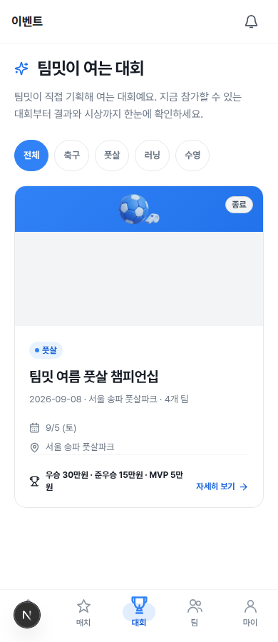 | 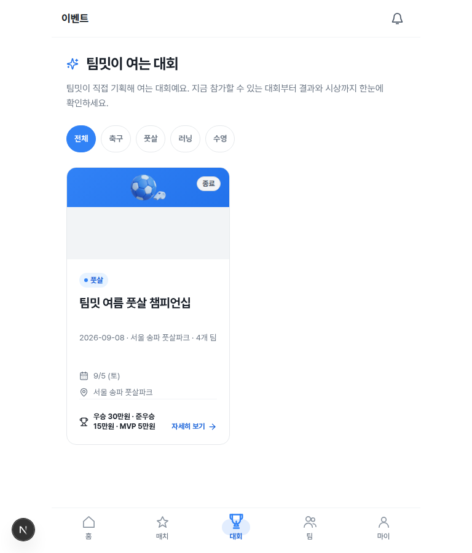 | 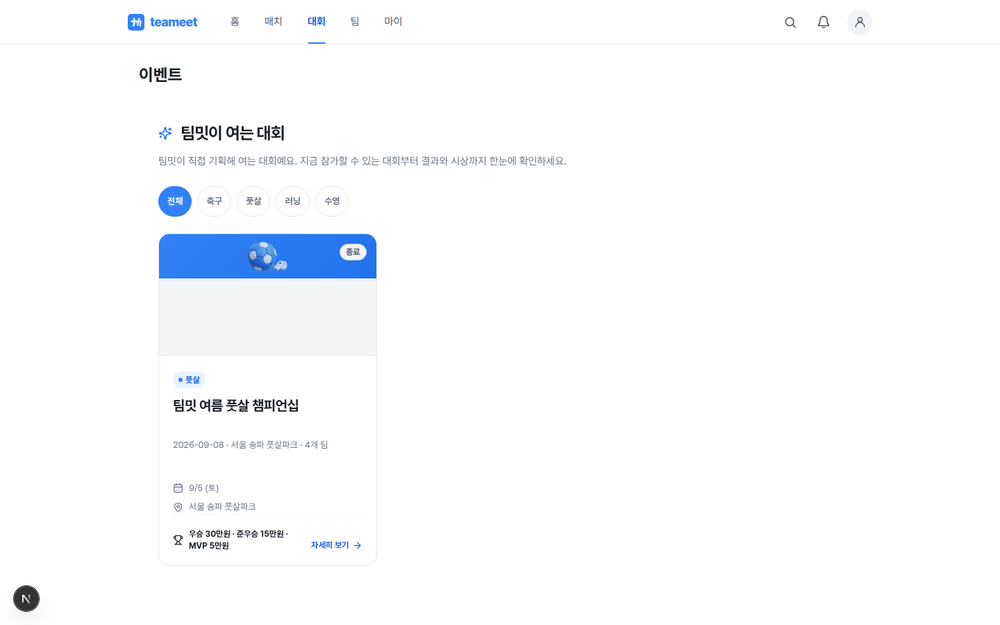 |
| 이벤트 수정 후 | 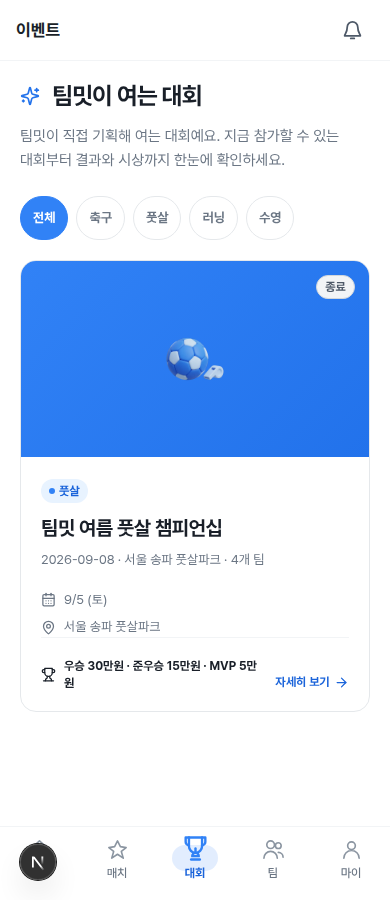 | 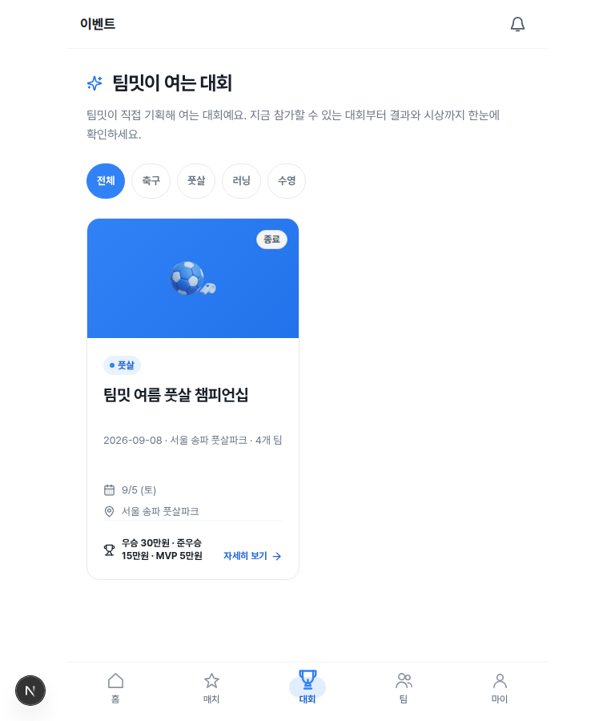 | 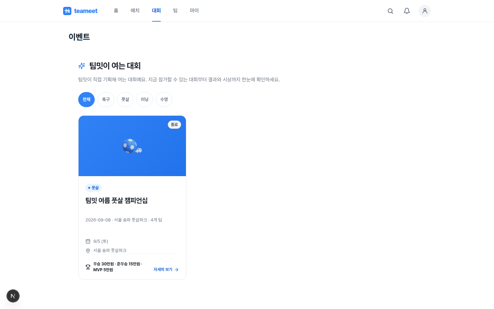 |
| 채팅 수정 후 | 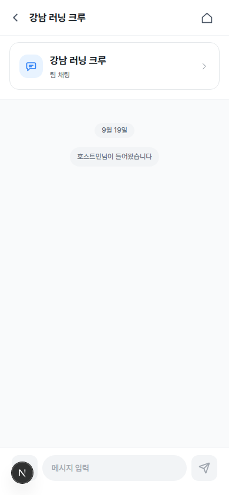 | 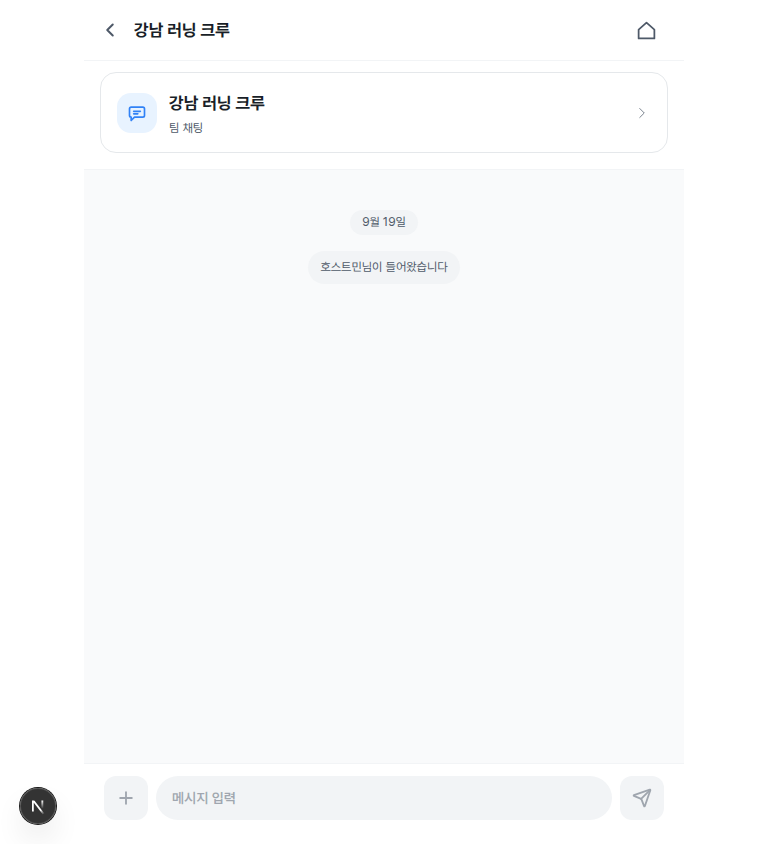 | 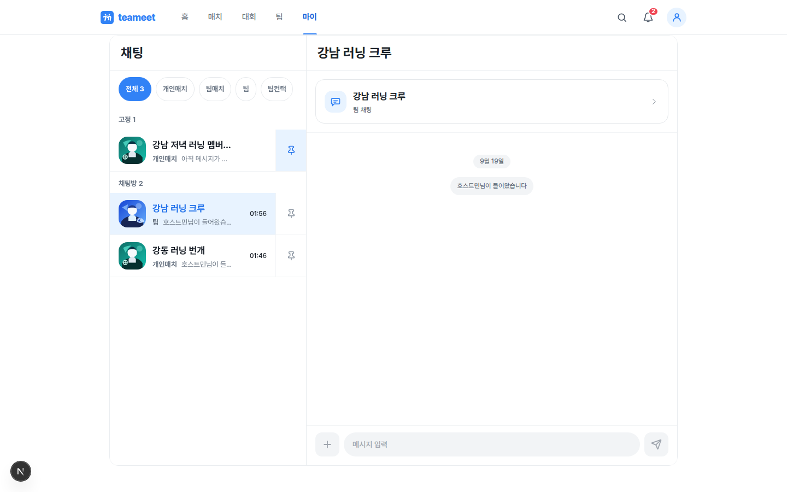 |

[Native inline inset 계약을 재현한 로컬 IME 비교](../screenshots/android-ui-20260919/chat-ime-after-390.png)는 브라우저 제어 viewport이며 실제 Android 키보드 증거와 구분한다.

전술보드 오류 안내의 로컬 3폭 비교(실기기 before는 개인정보가 있어 로컬 보관):

| Mobile 390 | Tablet 768 | Desktop 1440 |
|---|---|---|
| 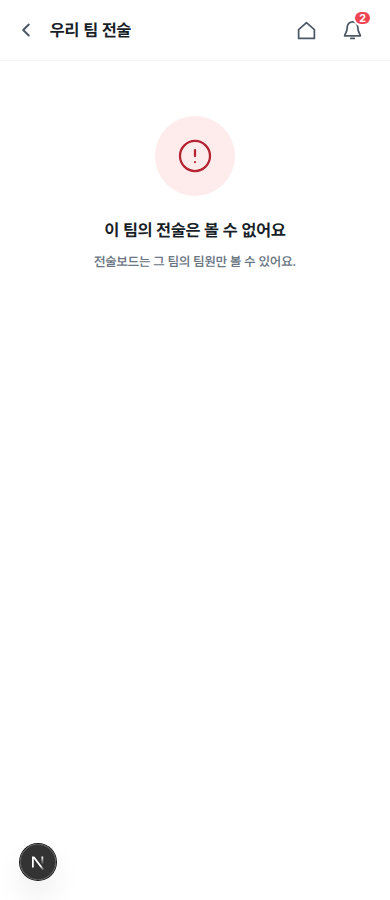 | 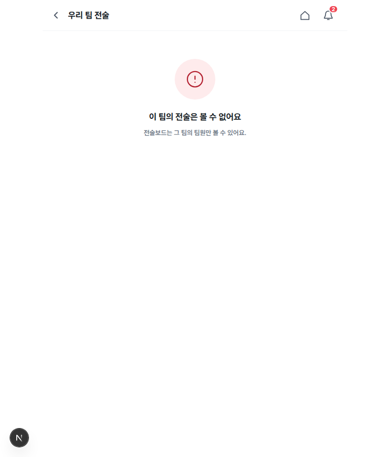 | 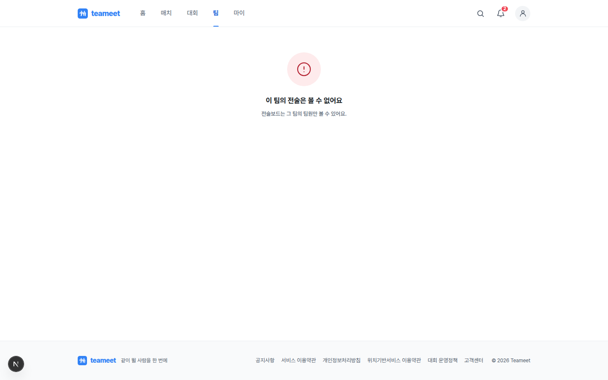 |

## 검증과 잔여 조건

- Web 관련 117 tests, API 관리자 53 tests, Web/API 타입 검사, v1 pattern check 통과. source/DTO/Prisma 스키마 변경 없음; migration 불필요.
- 원본: `output/playwright/visual-audit/android-20260919/`의 inventory, browser/device/admin/supplement/final JSON, PNG, 갤러리. 런타임 오류·권한 안내·redirect·데이터 부재를 성공으로 합산하지 않는다.
- 일시적 ALB `403 Forbidden`은 일반 앱 권한 오류와 구분했다. 낮은 요청 속도로 재검증해 관리자·운영 대상이 다시 열리는 것을 확인했다.
- 관리자 계정도 팀장·참가팀 권한을 자동으로 얻지 않는다. 팀 일정 수정/선수 명단 등 권한 제한 내부 화면과 해당 계정에 데이터가 없는 개인 상세는 미검증으로 남긴다.
- 현재 수정안의 실기기 CSS 비교와 배포본 확인은 별도 단계다. dev/Alpha 반영과 최종 배포 상태는 Task 156 Progress Snapshot을 따른다.
