# 팀매치 참석명단 경기 전 Alpha QA

## 실행 결과

- 실행일: 2026-09-22
- 환경: `https://alpha.teameet.co.kr`
- 배포 커밋: `fa7602023a7089e7436413ec4429d1e81f00088a`
- 팀매치: `ALPHA QA 참석명단 경기 전 09221721`
- 팀매치 ID: `8dbee6b7-2e43-4462-bff8-fab6f57ecf82`
- 경기 시작: 2026-09-23 19:00 KST
- 상태: `matched`
- 호스트: 마포 레인저스, 참석 6명, 참석명단 `SUBMITTED`
- 상대팀: 송파 유나이티드, 참석 6명, 참석명단 `SUBMITTED`
- 뷰포트: 데스크톱 1440×900, 모바일 390×844
- 캡처: 20장
- 브라우저 검증: console error 0, page error 0, API request failure 0, 가로 넘침 0

팀매치는 경기 시작 전 상태로 남겼다. 양 팀은 실제 Alpha 테스트 계정으로 로그인했고, 매칭 승인 뒤 팀 일정의 참석 상태를 `GOING`으로 변경했다. 참석명단 화면에서는 실제 버튼으로 선수 6명을 추가하고 골키퍼를 지정한 다음 제출했다.

공용 참석명단 불러오기 컴포넌트의 기본 용어는 `라인업`으로 유지된다. 팀매치 라우트에서만 `참석명단`을 주입하므로 대회·리그 화면 문구는 바뀌지 않는다.

## 1. 모집과 신청

| 데스크톱 | 모바일 |
|---|---|
| 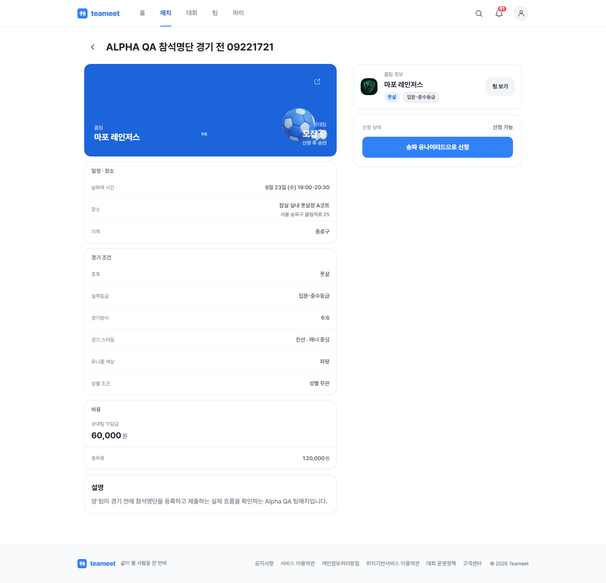 | 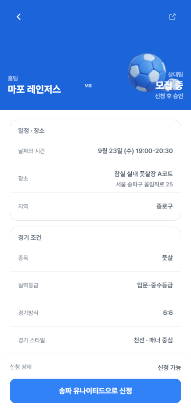 |
| 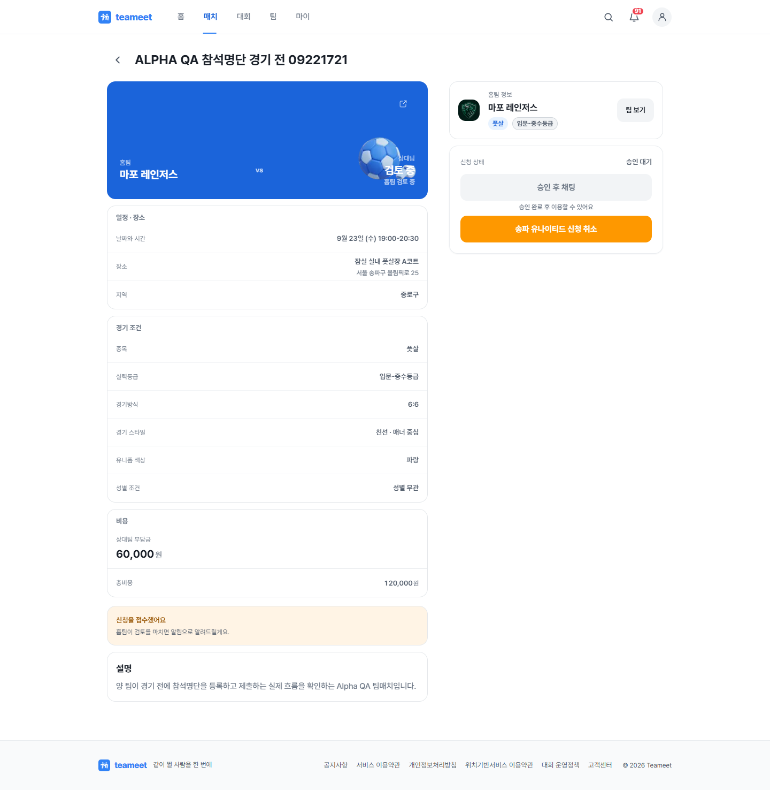 | 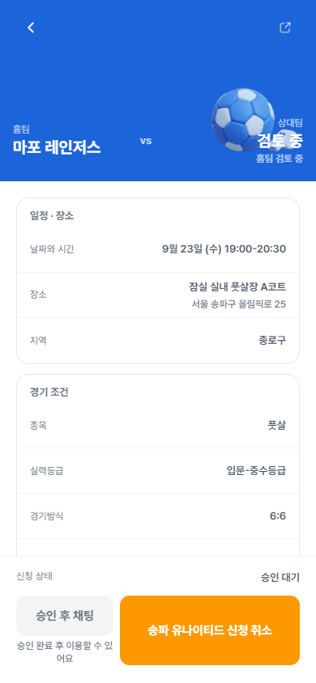 |
| 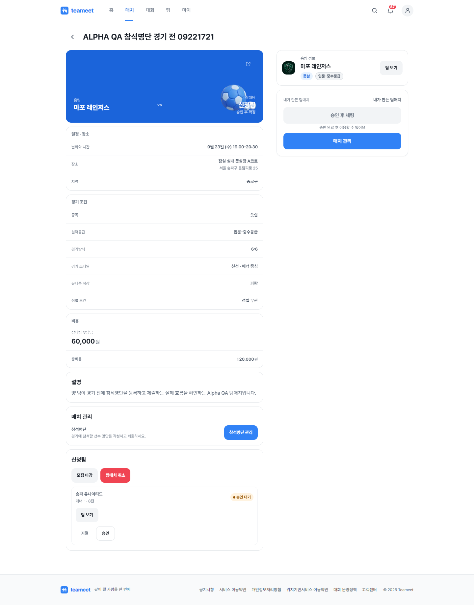 | 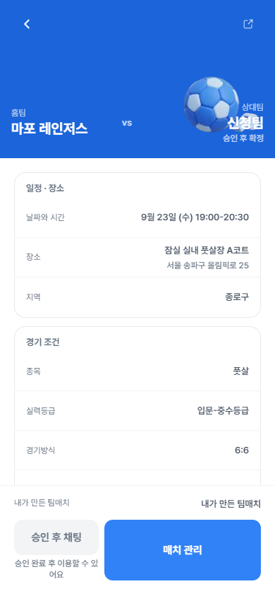 |

## 2. 매칭 완료와 참석명단 진입

| 데스크톱 | 모바일 |
|---|---|
|  | 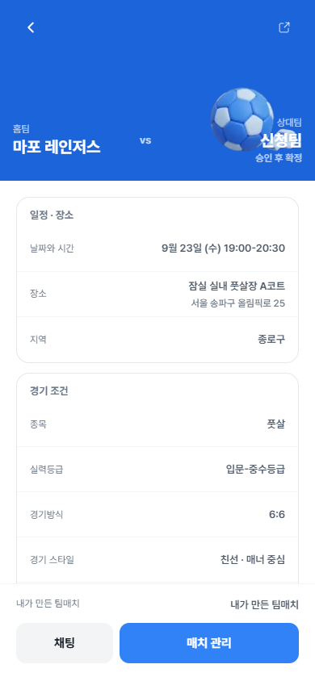 |

상세 화면에서 팀매치 전용 `참석명단` 및 `참석명단 관리` 문구를 확인했다.

## 3. 호스트 참석명단 등록

| 단계 | 데스크톱 | 모바일 |
|---|---|---|
| 비어 있음 | 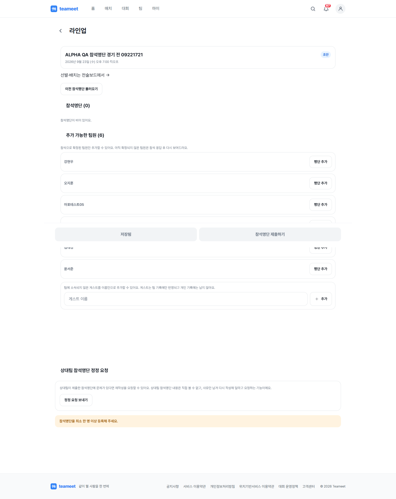 | 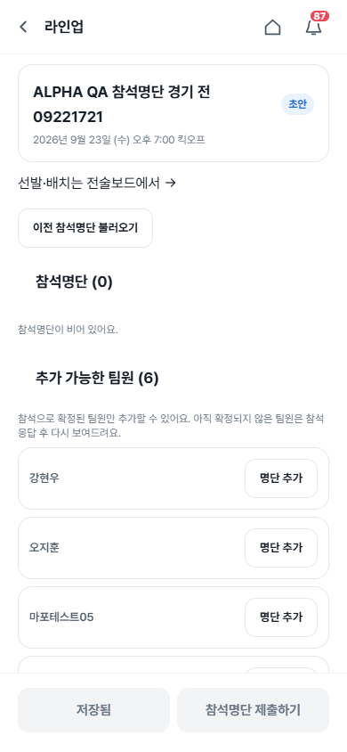 |
| 선수 6명 등록·GK 지정 | 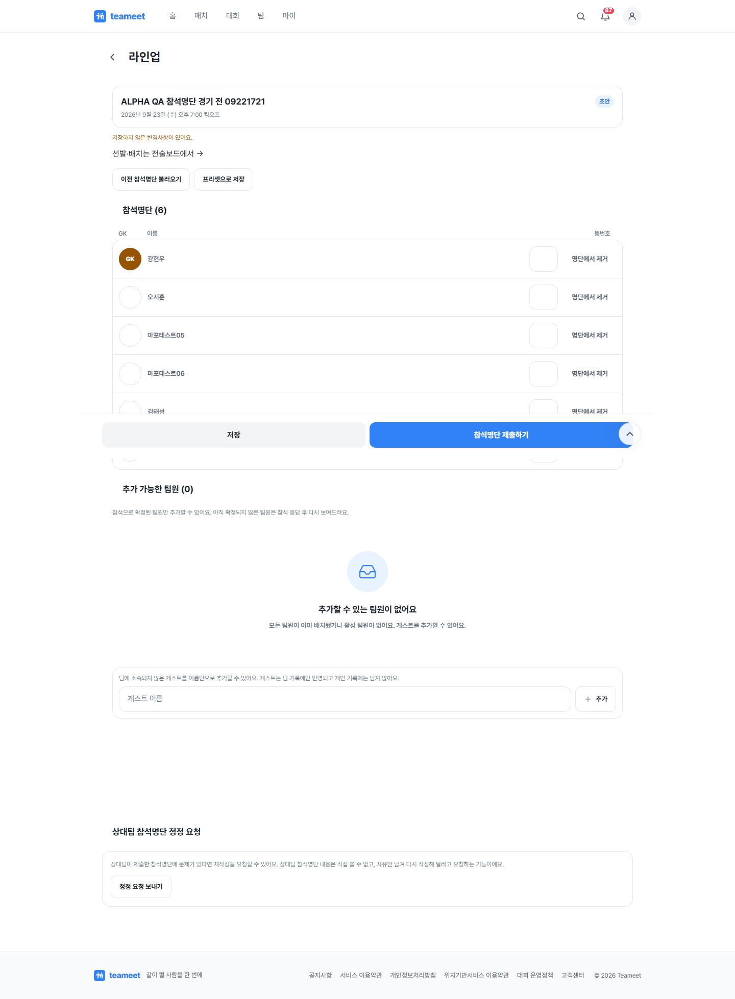 | 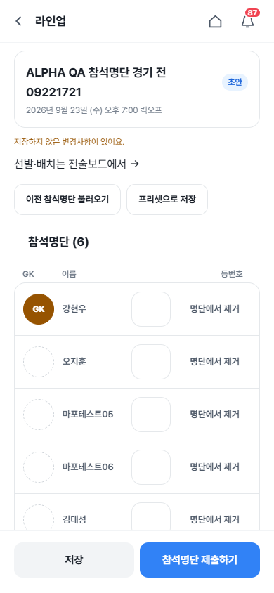 |
| 제출 완료 |  | 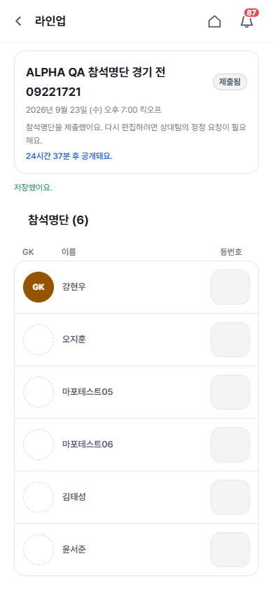 |

## 4. 상대팀 참석명단 등록

| 단계 | 데스크톱 | 모바일 |
|---|---|---|
| 비어 있음 | 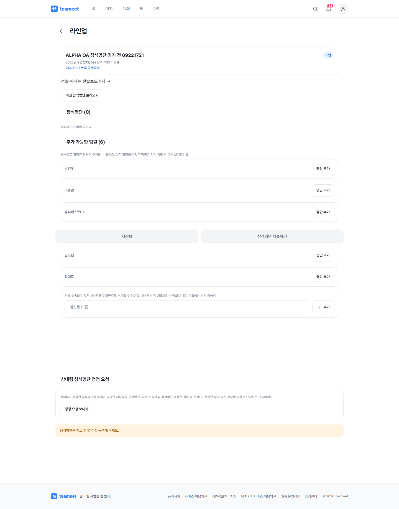 | 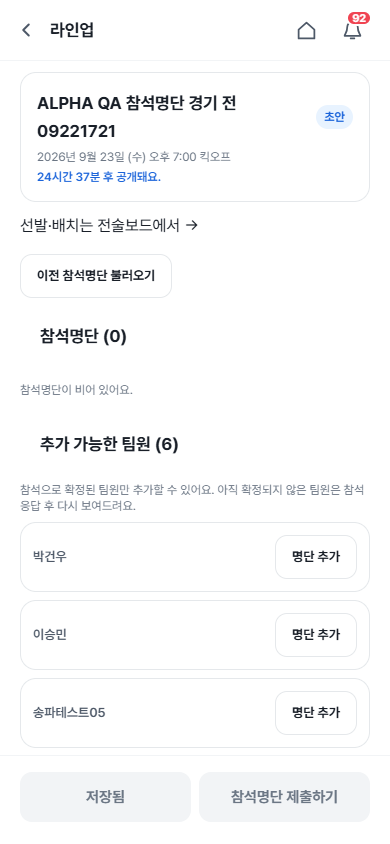 |
| 선수 6명 등록·GK 지정 | 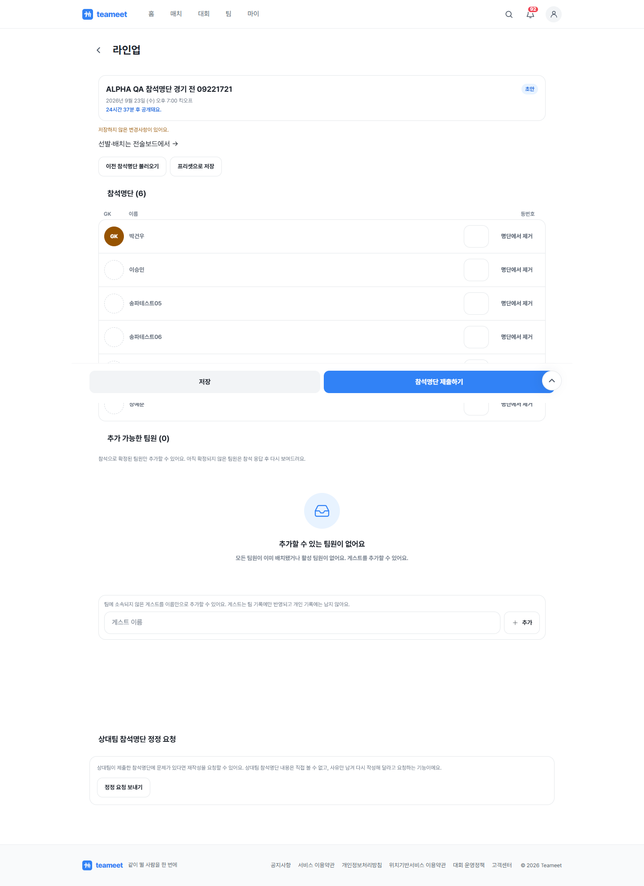 | 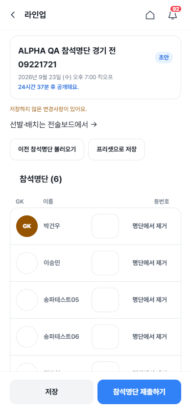 |
| 제출 완료 | 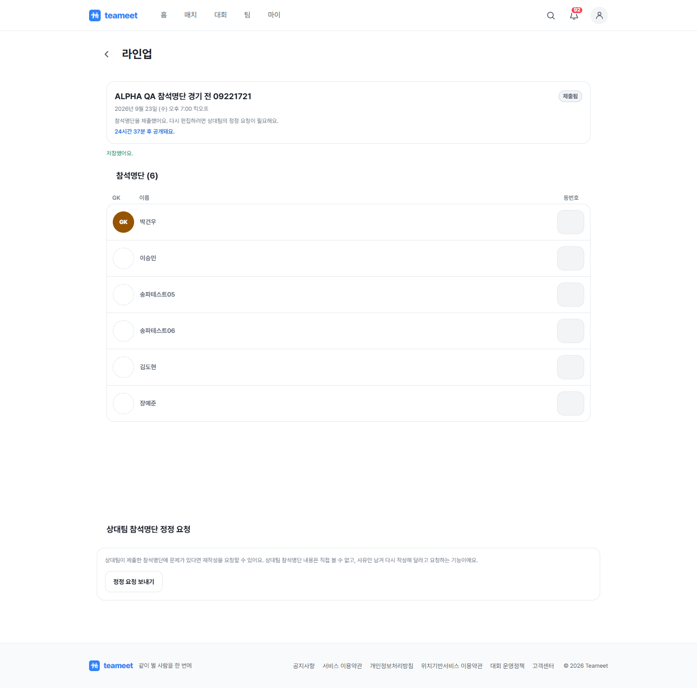 |  |

## 재현과 원시 결과

- 캡처 스크립트: `scripts/qa/capture-team-match-attendance-roster-pre-match.mjs`
- 실행 결과: `docs/screenshots/task173-team-match-attendance-roster-pre-match/qa-summary.json`
- 비밀번호와 세션 값은 파일에 저장하지 않는다. 실행 시 `QA_PASSWORD` 환경 변수만 사용한다.
