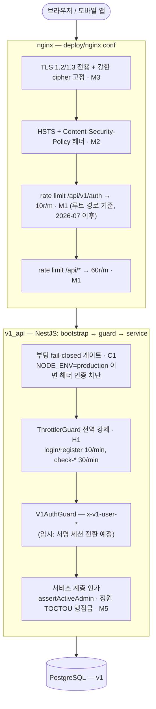
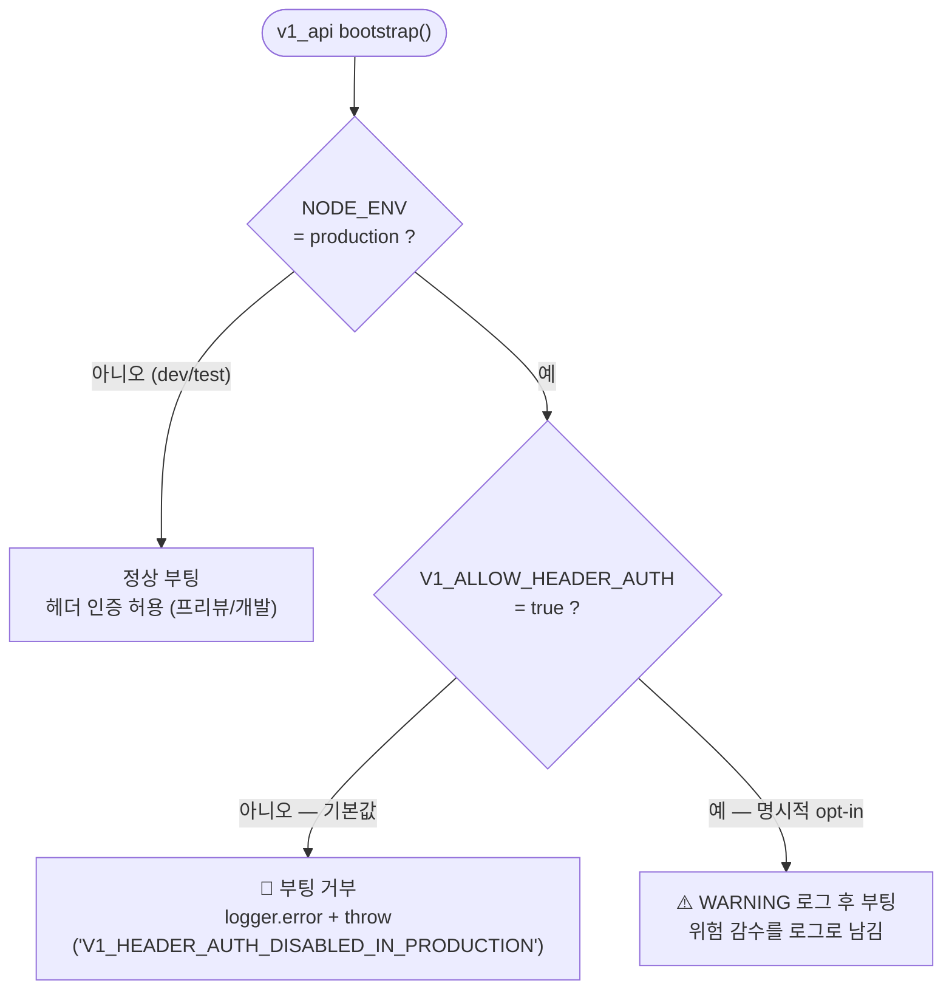
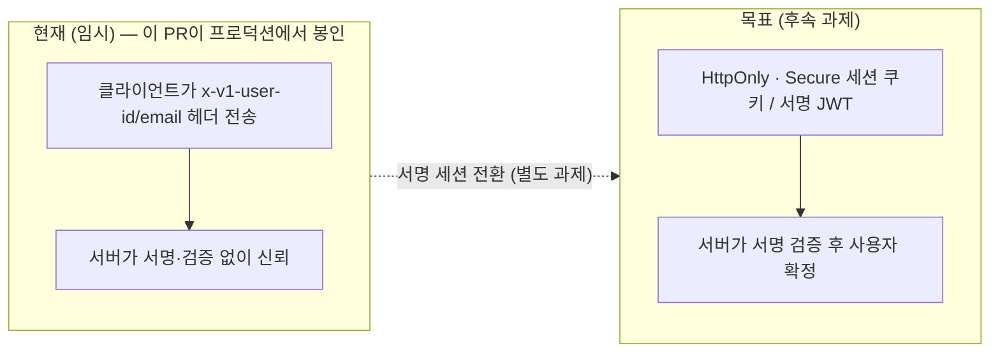

# v1 스택 프로덕션 배포 보안 강화 (Security Hardening)

> 목적: v1 스택(`apps/v1_api` + `apps/v1_web`)을 실 배포 환경에 올리기 전, 8차원 보안 감사(인증·인가 / 시크릿·설정 / 인젝션 / 인프라 / DoS / 데이터노출 / 프론트 / 안정성)에서 **적대적 검증으로 확정된** 결함을 다층 방어로 해소한다. 이 문서는 그 보안/권한 아키텍처의 구조도이자 근거 기록이다.
>
> 감사 방식: 차원별 finder → finding별 독립 적대검증(REFUTE 시도) → 생존분만 채택. CORS 와일드카드·데모계정 prod 생성·하드코딩 시크릿 등은 검증 단계에서 오탐으로 **기각**되었다(아래 "기각된 finding" 참조).

---

## 1. 위협 모델 요약

v1 인증은 **헤더 신뢰(header-trust)** 방식이다 — 클라이언트가 보낸 `x-v1-user-id` / `x-v1-user-email` 헤더를 서명·검증 없이 그대로 신뢰해 사용자를 조회한다(`apps/v1_api/src/auth/v1-auth.guard.ts`). 이는 원래 **개발/프리뷰 전용 메커니즘**이며, 프로덕션에 그대로 노출되면 `curl -H 'x-v1-user-id: <uuid>'` 한 줄로 임의 계정(관리자 포함)을 완전히 가장할 수 있다.

이 PR의 핵심 전략은 두 갈래다.

1. **근본 결함(C1)은 fail-closed 게이트로 봉인** — 프로덕션에서 헤더 인증이 실수로 배포되는 것을 코드가 막는다. 실제 서명 세션 인증으로의 전환은 후속 과제로 명시한다.
2. **주변 방어층(레이트리밋·OAuth CSRF·TLS·헤더·컨테이너 권한 등)을 다층으로 강화** — 단일 결함이 뚫려도 피해 반경을 줄인다.

---

## 2. 다층 방어 구조도 (이 PR이 강화한 계층)



**계층별 요약**

| 계층 | 파일 | 강화 내용 |
|------|------|--------------|
| Edge (nginx) | `deploy/nginx.conf` | TLS 프로토콜/cipher 고정(M3), HSTS·CSP(M2), `/api/v1/auth` 및 `/api/*` rate limit(M1). **2026-07**: `/v1/*` 브라우저 경로 제거 → `return 404`. 루트 경로(`/`)에서 직접 v1_web 서빙. |
| Bootstrap | `apps/v1_api/src/main.ts` | 헤더 인증 프로덕션 fail-closed 게이트(C1), graceful shutdown hook(L1) |
| Guard | `apps/v1_api/src/app.module.ts`, `auth/auth.controller.ts` | ThrottlerGuard 전역 바인딩 + 무인증·고비용 엔드포인트 per-route 한도(H1) |
| Service | `matches/matches.service.ts`, `search/*` | 매치 정원 TOCTOU 행잠금(M5), 검색 기록 row/payload 상한(M4) |
| Container / Deploy | `deploy/Dockerfile.v1-*`, `docker-compose.prod.yml`, `prisma/seed.ts` | non-root 실행(L2), nginx 메모리 제한(L4), seed 기본 비번 fail-closed(L5). **2026-07**: `NEXT_PUBLIC_BASE_PATH=/v1` 제거, `NEXT_PUBLIC_API_URL=/api/v1` (no /v1 prefix). |
| Frontend | `apps/v1_web/src/components/auth/*`, `src/lib/notification-route.ts` | 카카오 OAuth `state` — 로그인 CSRF 방지(H2). **2026-07**: notification href same-origin guard, geolocation user-action-only 보장. |

---

## 3. C1 — 헤더 인증 프로덕션 fail-closed 게이트

가장 중요한 변경. 헤더 신뢰 인증은 프로덕션에서 **기본적으로 부팅을 거부**하고, 위험을 의식적으로 감수하는 경우에만 `V1_ALLOW_HEADER_AUTH=true` 로 명시적 opt-in 해야 한다.



- 게이트는 `NestFactory.create` **이전**에 위치 → DB 연결 시도 없이 즉시 실패(빠른 crash, 명확한 로그).
- 라이브 검증: `NODE_ENV=production` + opt-in 없음 → `V1_HEADER_AUTH_DISABLED_IN_PRODUCTION` throw, 리슨 안 함. opt-in=true → WARNING 후 부팅 진행. dev → 게이트 스킵.

> **운영자 필수 조치**: 현재 배포를 유지하려면 `V1_ALLOW_HEADER_AUTH=true` 를 환경에 설정해야 부팅된다(설정 안 하면 fail-closed로 부팅 거부 — 이것이 의도된 안전 기본값). 이 플래그는 "헤더 인증은 임시이며 서명 세션으로 전환해야 한다"는 부채를 가시화하기 위한 의도적 마찰이다. `deploy/.env.prod.example` 참조.

---

## 3.1 운영자 조치 체크리스트 (배포 전/중)

이번 하드닝은 배포 환경에서 아래 조치가 함께 이뤄져야 안전·정상 동작한다.

- [ ] **`V1_ALLOW_HEADER_AUTH=true`** 설정 (C1) — 미설정 시 프로덕션 부팅 거부(의도된 fail-closed).
- [ ] **uploads 볼륨 소유권** (L2) — 컨테이너가 이제 non-root `app`(UID/GID **1001**)로 실행된다. **기존 root 소유 uploads 볼륨을 재사용**하는 환경이라면 최초 배포 시 볼륨을 1001 소유로 맞춰야 업로드 쓰기가 가능하다. 예:
  ```bash
  docker run --rm -v <v1_uploads_volume>:/data alpine chown -R 1001:1001 /data
  ```
  (fresh 볼륨은 이미지가 1001 소유로 초기화하므로 조치 불필요.)
- [ ] **HSTS `includeSubDomains`** (M2/M3) — `teameet.co.kr` **모든 서브도메인에 HTTPS 를 강제**한다. HTTP-only 서브도메인이 있으면 접속이 깨지므로, 그런 서브도메인이 없음을 확인한 뒤 배포한다. `preload` 는 되돌리기 어려워 의도적으로 제외했다.
- [ ] **레이트리밋 강제 범위** (H1) — 애플리케이션 레이트리밋(`V1ThrottlerGuard`)은 **`NODE_ENV=production`에서만** 강제된다. dev/test/e2e 에서는 스킵되어 테스트 flakiness(429)를 유발하지 않는다. 프로덕션에서만 login 10/min·check 30/min·전역 1000/min 이 적용된다.

---

## 4. 현재 vs 목표 인증 모델



C1 게이트는 "현재" 모델을 프로덕션에서 안전하게 봉인하는 **정지선**이고, "목표" 모델(서명 세션)로의 전환이 진짜 해결이다. 프론트엔드에서 userId(UUID)가 팀 화면 등에 노출되는 것도 목표 모델 전환으로 무해해진다(현재는 그 값이 곧 credential이라 문제).

---

## 5. 확정 findings 및 조치

| # | 심각도 | 이슈 | 조치 | 위치 |
|---|--------|------|------|------|
| **C1** | Critical | 헤더 신뢰 인증, 프로덕션 게이팅 전무 | 프로덕션 fail-closed 게이트 + `V1_ALLOW_HEADER_AUTH` opt-in | `main.ts` |
| **H1** | High | ThrottlerModule 미강제 → 레이트리밋 전무 | `APP_GUARD`로 ThrottlerGuard 전역 바인딩 + auth 엔드포인트 per-route 한도 | `app.module.ts`, `auth.controller.ts` |
| **H2** | High | 카카오 OAuth `state` 부재 → 로그인 CSRF | 클릭 시점 CSPRNG state 생성·sessionStorage 저장, 콜백 대조 검증 | `auth.view-model.ts`, `kakao-login-button.tsx`(신규), `kakao-callback-client.tsx` |
| **M1** | Medium | nginx `/v1/api` 레이트리밋 없음 | `v1api`(60r/m)·`v1auth`(10r/m) zone 추가·적용 | `nginx.conf` |
| **M2** | Medium | HSTS·CSP 헤더 전무 | 전 location에 HSTS + permissive CSP 베이스라인(nonce 강화는 후속) | `nginx.conf` |
| **M3** | Medium | TLS 프로토콜/cipher 미고정 | `ssl_protocols TLSv1.2 TLSv1.3` + Mozilla intermediate cipher | `nginx.conf` |
| **M4** | Medium | 검색 기록 익명 무제한 row 생성 | identity당 20행 상한 + filters payload 2000자 제한(트랜잭션) | `search/search.service.ts`, `search/dto/search-history.dto.ts` |
| **M5** | Medium | 매치 승인 정원 TOCTOU 레이스 | 트랜잭션 내 `SELECT ... FOR UPDATE` 행잠금 후 정원 재검증 | `matches/matches.service.ts` |
| **L1** | Low | graceful shutdown hook 부재 | `app.enableShutdownHooks()` | `main.ts` |
| **L2** | Low | 컨테이너 root 실행 | 두 Dockerfile에 non-root `app` 유저 추가 | `Dockerfile.v1-api`, `Dockerfile.v1-web` |
| **L4** | Low | nginx만 compose 리소스 제한 없음 | `deploy.resources.limits.memory: 256M` | `docker-compose.prod.yml` |
| **L5** | Low | seed 기본 비번 `11111111` fallback | fallback 제거 + demo 모드에서 값 없으면 fail-closed throw | `prisma/seed.ts` |

---

## 6. 이 PR에서 다루지 않은 것 (투명성)

- **L3 — v1-api 이미지 devDependencies 미제거(prune)**: **의도적 보류**. `deploy/restart-containers.sh`·`setup-ec2.sh`가 배포 시 컨테이너 내부에서 `ts-node`(devDependency)로 v1 seed를 실행한다. 무단 `pnpm prune --prod`는 `ts-node`를 제거해 **배포 seed 스텝을 깨뜨린다**. 안전한 해결은 (a) `ts-node`를 `dependencies`로 이동 후 prune, 또는 (b) seed 실행을 컴파일된 JS로 전환하는 별도 작업이 필요하므로 후속 과제로 남긴다. (이미지 비대 = Low 심각도, 배포 안정성 > 이미지 슬림화.)
- **CSP nonce 강화**: 현재 CSP는 Next.js 호환을 위한 permissive 베이스라인(`script-src 'self' 'unsafe-inline' 'unsafe-eval'`). 스테이징에서 실제 리소스 로딩을 검증한 뒤 nonce 기반으로 좁히는 것이 후속 과제.
- **서명 세션 인증 전환**: C1의 근본 해결. 이 PR은 프로덕션 노출을 봉인하는 정지선까지만 담당한다.

## 7. 기각된 finding (적대검증에서 오탐 판정)

- **CORS 와일드카드 + credentials**: finder가 제기했으나, `cors@2.8.6` 미들웨어 실제 경로 추적 결과 `FRONTEND_URL` 미설정 시 `origin: undefined`가 되어 CORS 헤더를 **아예 붙이지 않고 fail-closed**(브라우저 same-origin 차단)됨을 확인 → 취약점 아님. 게다가 nginx가 `/v1/api`를 v1_web과 same-origin으로 서빙.
- **데모 계정·기본 비번 prod 자동 생성**: seed 기본 모드 `base`가 `seedUsers()` 이전에 early-return하며, demo/coverage/all 모드는 `assertDemoSeedAllowed`가 프로덕션에서 차단(`V1_ALLOW_DEMO_SEED` 필요) + `DEPLOY_SYNC_V1_SEED_DATA` 기본 비활성 → 현재 배포 경로에서 미도달.
- **하드코딩 시크릿 / Swagger `/docs` 노출**: 전자는 실제 시크릿 없음, 후자는 nginx가 `/docs`를 프록시하지 않아 외부 도달 불가.

---

## 8. 라우팅 구조 변경 (2026-07 — 브라우저 /v1 basePath 제거)

> **이 섹션은 2026-07 세션 3 변경의 보안·운영 근거다.**

### 변경 전 (basePath=/v1 시대)

| 경로 | 동작 |
|------|------|
| `/` | 301 → `/v1` |
| `/*` | 301 → `/v1$request_uri` |
| `/v1/api/*` | rewrite `/v1/api/` → `/api/` → v1_api |
| `/v1/*` | v1_web (Next.js basePath=/v1) |

### 변경 후 (루트 경로 직접 서빙)

| 경로 | 동작 |
|------|------|
| `/api/v1/auth/*` | v1_api (rate limit 10r/m) |
| `/api/*` | v1_api (rate limit 60r/m) |
| `/_next/static/*` | v1_web (long-cache) |
| `/uploads/*` | v1_api (rate limit 10r/m) |
| `/v1` | **404** |
| `/v1/*` | **404** |
| `/*` | v1_web (Next.js 루트) |

### 보안 영향 분석

1. **공격 표면 축소**: `/v1/api/auth/` 경로가 없어지므로 `^~ /v1/api/auth/` 매칭이 불필요. 이제 `/api/v1/auth/` 하나로 명확.
2. **rate limit 위치 동일 유지**: auth 10r/m + 일반 60r/m 한도는 경로 변경 후에도 유지됨.
3. **구 /v1/* → 404**: 북마크/외부링크로 남아있는 구 URL이 v1_web을 타지 않으므로 서버 렌더 부하 없음.
4. **nginx rewrite 제거**: `/v1/api/(.*)` → `/api/$1` rewrite 삭제로 nginx 설정 단순화.
5. **NEXT_PUBLIC_BASE_PATH 제거**: Next.js가 더 이상 basePath를 사용하지 않으므로 `NEXT_PUBLIC_BASE_PATH` 환경변수 불필요. Dockerfile과 docker-compose.prod.yml에서 제거.
6. **알림 href 안전 가드 추가**: `notification-route.ts`의 `safeNotificationHref()`가 DB에 남아있는 `/v1/*` 경로를 자동 마이그레이션하고, 절대 URL·`javascript:` 등 외부 링크를 차단.
7. **geolocation 자동 요청 제거**: `home-client.tsx`의 `useEffect` 자동 위치 요청 제거. 사용자가 명시적으로 새로고침 버튼을 클릭해야만 위치 권한을 요청함.
