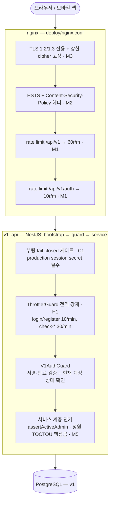
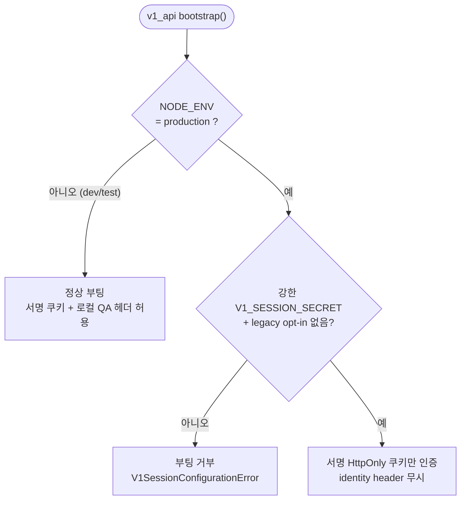
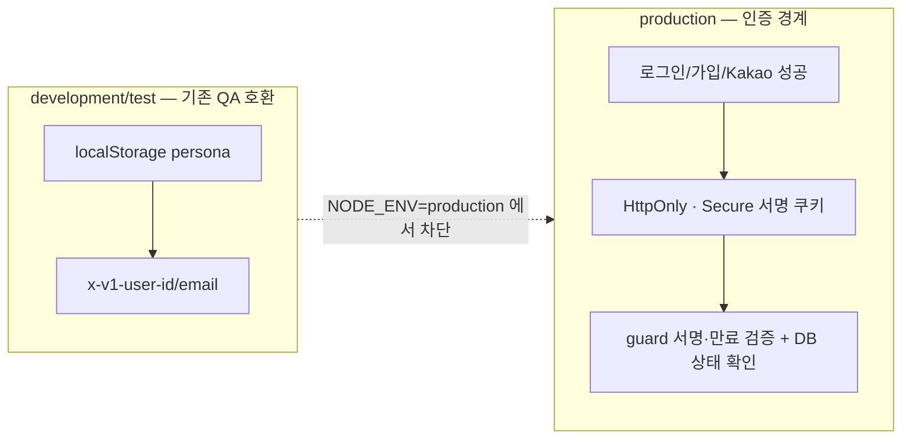

# v1 스택 프로덕션 배포 보안 강화 (Security Hardening)

> 목적: v1 스택(`apps/v1_api` + `apps/v1_web`)을 실 배포 환경에 올리기 전, 8차원 보안 감사(인증·인가 / 시크릿·설정 / 인젝션 / 인프라 / DoS / 데이터노출 / 프론트 / 안정성)에서 **적대적 검증으로 확정된** 결함을 다층 방어로 해소한다. 이 문서는 그 보안/권한 아키텍처의 구조도이자 근거 기록이다.
>
> 감사 방식: 차원별 finder → finding별 독립 적대검증(REFUTE 시도) → 생존분만 채택. CORS 와일드카드·데모계정 prod 생성·하드코딩 시크릿 등은 검증 단계에서 오탐으로 **기각**되었다(아래 "기각된 finding" 참조).

---

## 1. 위협 모델 요약

v1 인증은 production에서 **서명된 HttpOnly 세션 쿠키**를 사용한다. 로그인·회원가입·Kakao 인증 응답이 7일 만료 HMAC-SHA256 세션을 발급하고, 필수/optional guard가 서명·만료를 검증한 뒤 현재 계정 상태를 DB에서 다시 확인한다. `x-v1-user-id` / `x-v1-user-email`은 development/test의 기존 persona QA에만 남으며 production에서는 nginx가 제거하고 API guard도 무시한다.

프로덕션 route gate는 localStorage 힌트 유무와 관계없이 `/auth/me`로 HttpOnly 쿠키를 확인한다. 브라우저 저장소가 지워져도 유효한 쿠키 세션이 로그인 화면으로 잘못 이탈하지 않으며, localStorage에는 사용자 id·email을 저장하지 않는다.

이 PR의 핵심 전략은 두 갈래다.

1. **근본 결함(C1)은 서명 세션 경계로 해결** — production은 32자 이상의 `V1_SESSION_SECRET`이 없으면 부팅을 거부하고 caller-controlled identity header를 절대 인증 근거로 사용하지 않는다.
2. **쿠키 기반 상태 변경은 origin을 검증** — production의 브라우저 POST/PATCH/PUT/DELETE 요청은 canonical `FRONTEND_URL`과 정확히 같은 `Origin`만 허용한다. `Origin`이 없는 서버 간 요청은 유지한다.
3. **주변 방어층(레이트리밋·OAuth CSRF·TLS·헤더·컨테이너 권한 등)을 다층으로 강화** — 단일 결함이 뚫려도 피해 반경을 줄인다.

`www.teameet.co.kr`과 HTTP 요청은 nginx에서 canonical `https://teameet.co.kr`로 301 정규화한다. 따라서 브라우저 mutation origin, SEO canonical URL, 세션이 사용하는 실제 서비스 origin이 하나로 유지된다.

---

## 2. 다층 방어 구조도 (이 PR이 강화한 계층)



**계층별 요약**

| 계층 | 파일 | 이 PR의 강화 |
|------|------|--------------|
| Edge (nginx) | `deploy/nginx.conf` | TLS 프로토콜/cipher 고정(M3), HSTS·production CSP(M2), `/api/v1` 및 `/api/v1/auth` rate limit(M1) |
| Bootstrap | `apps/v1_api/src/main.ts` | production session secret fail-closed 게이트(C1), graceful shutdown hook(L1) |
| Guard | `apps/v1_api/src/app.module.ts`, `auth/auth.controller.ts` | ThrottlerGuard 전역 바인딩 + 무인증·고비용 엔드포인트 per-route 한도(H1) |
| Service | `matches/matches.service.ts`, `search/*` | 매치 정원 TOCTOU 행잠금(M5), 검색 기록 row/payload 상한(M4) |
| Container / Deploy | `deploy/Dockerfile.v1-*`, `docker-compose.prod.yml`, `prisma/seed.ts` | non-root 실행(L2), nginx 메모리 제한(L4), seed 기본 비번 fail-closed(L5) |
| Frontend | `apps/v1_web/src/components/auth/*` | 카카오 OAuth `state` — 로그인 CSRF 방지(H2) |

---

## 3. C1 — 서명 세션과 production 헤더 격리

가장 중요한 변경이다. production은 `V1_SESSION_SECRET` 또는 배포 compose의 기존 `V1_JWT_SECRET` fallback으로 32자 이상의 서명 secret을 받아야 부팅한다. 위험 opt-in은 제거됐으며 `V1_ALLOW_HEADER_AUTH=true`가 남아 있으면 오히려 부팅을 거부한다.



- 게이트는 `NestFactory.create` **이전**에 위치 → DB 연결 시도 없이 즉시 실패(빠른 crash, 명확한 로그).
- session cookie는 `HttpOnly`, production `Secure`, `SameSite=Lax`, `Path=/api/v1`, 7일 만료다.
- 모든 보호 요청은 쿠키 subject로 사용자를 조회하고 suspended/blocked/deleted 상태를 다시 거부한다. 로그아웃은 인증 상태와 무관한 멱등 endpoint로 동일 경로의 쿠키를 제거하므로 만료·손상된 세션도 사용자가 직접 정리할 수 있다.
- production 브라우저는 user id·email을 localStorage에 보존하지 않고 비민감한 세션 힌트만 저장한다. 개발/test의 persona header 호환 키는 production API 요청에 포함되지 않는다.

> **운영자 필수 조치**: `V1_SESSION_SECRET`을 32자 이상의 무작위 값으로 설정한다. 기존 `V1_JWT_SECRET`이 충분히 길면 production compose가 fallback으로 전달하지만, 장기적으로는 세션 전용 secret을 분리하고 회전 절차를 둔다.

---

## 3.1 운영자 조치 체크리스트 (배포 전/중)

이번 하드닝은 배포 환경에서 아래 조치가 함께 이뤄져야 안전·정상 동작한다.

- [ ] **`V1_SESSION_SECRET` 32자 이상** 설정 (C1) — 미설정/약한 값/legacy header-auth opt-in이면 production 부팅 거부.
- [ ] **uploads 볼륨 소유권** (L2) — 컨테이너가 이제 non-root `app`(UID/GID **1001**)로 실행된다. **기존 root 소유 uploads 볼륨을 재사용**하는 환경이라면 최초 배포 시 볼륨을 1001 소유로 맞춰야 업로드 쓰기가 가능하다. 예:
  ```bash
  docker run --rm -v <v1_uploads_volume>:/data alpine chown -R 1001:1001 /data
  ```
  (fresh 볼륨은 이미지가 1001 소유로 초기화하므로 조치 불필요.)
- [ ] **HSTS `includeSubDomains`** (M2/M3) — `teameet.co.kr` **모든 서브도메인에 HTTPS 를 강제**한다. HTTP-only 서브도메인이 있으면 접속이 깨지므로, 그런 서브도메인이 없음을 확인한 뒤 배포한다. `preload` 는 되돌리기 어려워 의도적으로 제외했다.
- [ ] **레이트리밋 강제 범위** (H1) — 애플리케이션 레이트리밋(`V1ThrottlerGuard`)은 **`NODE_ENV=production`에서만** 강제된다. dev/test/e2e 에서는 스킵되어 테스트 flakiness(429)를 유발하지 않는다. 프로덕션에서만 login 10/min·check 30/min·전역 1000/min 이 적용된다.

---

## 4. 개발 vs production 인증 모델



프론트엔드의 localStorage user id/email은 development persona와 클라이언트 표시 상태를 위한 호환 데이터일 뿐 production credential이 아니다. production Web 빌드는 identity header를 전송하지 않으며, nginx와 API 양쪽이 외부 identity header를 제거/무시한다.

---

## 5. 확정 findings 및 조치

| # | 심각도 | 이슈 | 조치 | 위치 |
|---|--------|------|------|------|
| **C1** | Critical | caller-controlled header로 임의 계정/관리자 가장 | signed HttpOnly session, production header 무시, nginx strip, strong-secret fail-closed | `v1-session.ts`, guards, `main.ts`, `nginx.conf` |
| **H1** | High | ThrottlerModule 미강제 → 레이트리밋 전무 | `APP_GUARD`로 ThrottlerGuard 전역 바인딩 + auth 엔드포인트 per-route 한도 | `app.module.ts`, `auth.controller.ts` |
| **H2** | High | 카카오 OAuth `state` 부재 → 로그인 CSRF | 클릭 시점 CSPRNG state 생성·sessionStorage 저장, 콜백 대조 검증 | `auth.view-model.ts`, `kakao-login-button.tsx`(신규), `kakao-callback-client.tsx` |
| **M1** | Medium | nginx `/api/v1` 레이트리밋 없음 | `v1api`(60r/m)·`v1auth`(10r/m) zone 추가·적용 | `nginx.conf` |
| **M2** | Medium | HSTS·CSP 헤더 전무 | 전 location에 HSTS + production CSP 적용, `unsafe-eval` 제거, obsolete XSS auditor 비활성화 | `nginx.conf` |
| **M3** | Medium | TLS 프로토콜/cipher 미고정 | `ssl_protocols TLSv1.2 TLSv1.3` + Mozilla intermediate cipher | `nginx.conf` |
| **M4** | Medium | 검색 기록 익명 무제한 row 생성 | identity당 20행 상한 + filters payload 2000자 제한(트랜잭션) | `search/search.service.ts`, `search/dto/search-history.dto.ts` |
| **M5** | Medium | 매치 승인 정원 TOCTOU 레이스 | 트랜잭션 내 `SELECT ... FOR UPDATE` 행잠금 후 정원 재검증 | `matches/matches.service.ts` |
| **L1** | Low | graceful shutdown hook 부재 | `app.enableShutdownHooks()` | `main.ts` |
| **L2** | Low | 컨테이너 root 실행 | 두 Dockerfile에 non-root `app` 유저 추가 | `Dockerfile.v1-api`, `Dockerfile.v1-web` |
| **L4** | Low | nginx만 compose 리소스 제한 없음 | `deploy.resources.limits.memory: 256M` | `docker-compose.prod.yml` |
| **L5** | Low | seed 기본 비번 `11111111` fallback | fallback 제거 + demo 모드에서 값 없으면 fail-closed throw | `prisma/seed.ts` |

---

## 6. 이 PR에서 다루지 않은 것 (투명성)

- **L3 — v1-api 이미지 devDependencies 미제거(prune)**: **의도적 보류**. `deploy/restart-containers.sh`·`setup-ec2.sh`가 배포 시 컨테이너 내부에서 `ts-node`(devDependency)로 v1 seed를 실행한다. 무단 `pnpm prune --prod`는 `ts-node`를 제거해 **배포 seed 스텝을 깨뜨린다**. 안전한 해결은 (a) `ts-node`를 `dependencies`로 이동 후 prune, 또는 (b) seed 실행을 컴파일된 JS로 전환하는 별도 작업이 필요하므로 후속 과제로 남긴다. (이미지 비대 = Low 심각도, 배포 안정성 > 이미지 슬림화.)
- **CSP 잔여 경계**: production 정책에서 `unsafe-eval`은 제거했다. Next.js inline bootstrap 호환 때문에 `unsafe-inline`은 유지하며, 임의 외부 script·object·base URI와 외부 frame embedding은 허용하지 않는다. nonce 기반 정책은 모든 페이지를 동적 렌더링하게 만드는 별도 아키텍처 선택이므로 현재 배포 계약에는 포함하지 않는다.
- **서버측 세션 철회 목록/키 회전**: 현재 토큰은 계정 상태를 매 요청 확인하고 로그아웃 시 브라우저 쿠키를 지우지만, 이미 탈취된 토큰의 즉시 서버측 폐기를 위한 session row/jti denylist는 별도 hardening 대상이다.

## 7. 기각된 finding (적대검증에서 오탐 판정)

- **CORS 와일드카드 + credentials**: finder가 제기했으나, `cors@2.8.6` 미들웨어 실제 경로 추적 결과 `FRONTEND_URL` 미설정 시 `origin: undefined`가 되어 CORS 헤더를 **아예 붙이지 않고 fail-closed**(브라우저 same-origin 차단)됨을 확인 → 취약점 아님. 게다가 nginx가 `/api/v1`을 v1_web과 same-origin으로 서빙.
- **데모 계정·기본 비번 prod 자동 생성**: seed 기본 모드 `base`가 `seedUsers()` 이전에 early-return하며, demo/coverage/all 모드는 `assertDemoSeedAllowed`가 프로덕션에서 차단(`V1_ALLOW_DEMO_SEED` 필요) + `DEPLOY_SYNC_V1_SEED_DATA` 기본 비활성 → 현재 배포 경로에서 미도달.
- **하드코딩 시크릿 / Swagger `/docs` 노출**: 전자는 실제 시크릿 없음, 후자는 nginx가 `/docs`를 프록시하지 않아 외부 도달 불가.
