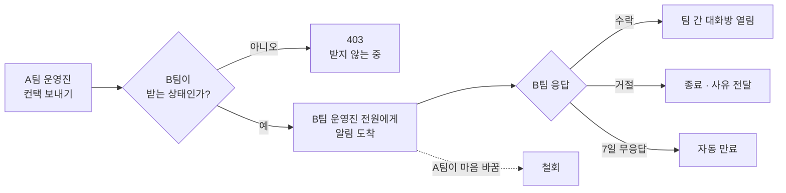

# 팀 간 컨택 메시지 사용 매뉴얼

> 매치를 잡기 전에 상대 팀 운영진과 먼저 이야기할 수 있는 기능입니다. 팀장·운영진이 다른 팀에
> 컨택을 보내면 그 팀의 팀장·운영진 전원에게 전달되고, 상대가 수락하면 팀 간 대화방이 열립니다.

이 문서의 화면은 모두 alpha 실환경에서 캡처한 것입니다.

---

## 목차

1. [한눈에 보기](#1-한눈에-보기)
2. [누가 쓸 수 있나요](#2-누가-쓸-수-있나요)
3. [컨택 보내기](#3-컨택-보내기)
4. [받은 컨택 처리하기](#4-받은-컨택-처리하기)
5. [컨택 수신 설정](#5-컨택-수신-설정)
6. [팀 차단하기](#6-팀-차단하기)
7. [신고하기](#7-신고하기)
8. [운영자 화면 — 신고 확인](#8-운영자-화면--신고-확인)
9. [규칙과 제한](#9-규칙과-제한)
10. [이럴 땐 어떻게 하나요](#10-이럴-땐-어떻게-하나요)

---

## 1. 한눈에 보기

컨택은 **요청 → 수락 → 대화** 순서입니다. 바로 대화가 열리지 않는 이유는, 원치 않는 팀에게서
갑자기 대화방이 생기는 것을 막기 위해서입니다.

---

## 2. 누가 쓸 수 있나요

| 동작 | 필요 권한 |
|---|---|
| 컨택 보내기 | 보내는 팀의 **팀장 또는 운영진** |
| 받은 컨택 수락·거절 | 받는 팀의 **팀장 또는 운영진** |
| 수신 설정 변경 | 그 팀의 **팀장 또는 운영진** |
| 팀 차단·차단 해제 | 그 팀의 **팀장 또는 운영진** |
| 신고 | 컨택 당사자 (양 팀 운영진) |

일반 팀원에게는 컨택 관련 버튼이 보이지 않습니다.

---

## 3. 컨택 보내기

상대 팀 상세 화면에서 시작합니다.

| 팀 상세 | 컨택 작성 |
|---|---|
|  |  |

1. 상대 팀 상세 화면에서 **컨택 보내기** 를 누릅니다.
2. **보내는 팀** 을 고릅니다. 운영진으로 있는 팀이 여러 개면 선택지가 나옵니다.
3. 메시지를 씁니다(최대 500자). 어떤 경기를 원하는지 구체적으로 쓸수록 답을 받기 쉽습니다.
4. 보내면 상대 팀 운영진 **전원** 에게 알림이 갑니다.

> 상대 팀이 컨택을 받지 않는 상태면 보내기가 거절됩니다. 자세한 이유는 [9. 규칙과 제한](#9-규칙과-제한)을 보세요.

---

## 4. 받은 컨택 처리하기

**마이 → 팀 컨택** 에서 주고받은 컨택을 모두 볼 수 있습니다.

| 컨택 목록 | 컨택 상세 |
|---|---|
|  |  |

- **수락** — 두 팀의 운영진이 함께 있는 대화방이 열립니다.
- **거절** — 사유를 적어 보낼 수 있습니다. 상대에게 그대로 전달됩니다.
- **철회** — 내가 보낸 컨택을 거둬들입니다. 상대가 아직 답하지 않았을 때 쓸 수 있습니다.

상세 화면에는 남은 시간이 표시됩니다(예: `6일 23시간 후 만료돼요`). 실제 남은 시간보다
짧게 표시되도록 **내림** 하므로, 표시된 시간이 지나기 전에 답하면 됩니다.

---

## 5. 컨택 수신 설정

**팀 상세 → 운영 → 컨택 설정** 에서 우리 팀이 컨택을 받을 조건을 정합니다.

| 설정 | 뜻 |
|---|---|
| **항상 받기** (기본값) | 어느 팀이든 컨택을 보낼 수 있습니다. |
| **모집 중일 때만 받기** | 우리 팀이 **상대를 구하는 팀매치 공고를 올려둔 동안만** 받습니다. |
| **받지 않기** | 아무도 컨택을 보낼 수 없습니다. |

> **"모집 중" 의 기준**은 그 팀이 주최한 팀매치 중 모집 상태인 것이 하나라도 있는지입니다.
> 공고를 모두 마감하면 자동으로 컨택도 닫힙니다.

---

## 6. 팀 차단하기

특정 팀만 막고 싶을 때 씁니다. **컨택 상세 화면의 `차단하기`** 가 유일한 차단 시작점입니다.

- 실수로 누르는 것을 막기 위해 **한 번 더 확인** 을 거칩니다.
- 차단은 **양방향** 입니다. 차단한 팀은 우리에게 컨택을 보낼 수 없고, 우리도 그 팀에 보낼 수 없습니다.
- 해제는 **컨택 설정 화면의 차단 목록** 에서 합니다. 언제든 되돌릴 수 있습니다.

---

## 7. 신고하기

부적절한 컨택을 받았다면 컨택 상세에서 **신고하기** 를 누릅니다.

- 사유는 다섯 가지 중에 고릅니다: **스팸·광고 / 괴롭힘·욕설 / 사칭·허위 팀 / 부적절한 내용 / 기타**
- 상세 설명은 선택입니다.
- 신고는 **컨택 상태와 관계없이** 언제든 할 수 있습니다. 거절되거나 만료된 뒤에 신고할 이유가
  생기는 경우가 오히려 많기 때문입니다.

접수된 신고는 기존 문의 창구로 들어가 운영팀이 확인합니다.

---

## 8. 운영자 화면 — 신고 확인

운영 센터의 **문의 관리** 에서 확인합니다.

| 문의 목록 (분류 칸에 사유 표시) | 신고 사유로 좁히기 |
|---|---|
|  |  |

- 분류를 **신고** 로 바꾸면 **신고 사유 필터** 가 나타납니다.
- 각 사유 옆 숫자는 "이 사유를 고르면 몇 건이 되는지" 를 뜻합니다. 하나를 골라도 다른 사유의
  건수는 그대로 보입니다.
- 목록 행의 분류 칸에는 사유가 함께 표시됩니다(예: `신고 / 스팸·광고`).

> 분류를 신고가 아닌 값으로 바꾸면 사유 선택은 자동으로 초기화됩니다.

---

## 9. 규칙과 제한

| 항목 | 값 | 이유 |
|---|---|---|
| 하루 발신 한도 | 팀당 **10건** / 24시간 | 무차별 발송 방지 |
| 유효 기간 | **7일** | 방치된 요청 정리 |
| 같은 팀에 중복 발신 | 진행 중인 컨택이 있으면 불가 | 같은 요청 반복 방지 |
| 자기 팀에 발신 | 불가 | — |

### 거절 사유를 알려주지 않는 이유

컨택 발신이 막히는 경우는 세 가지입니다 — **차단당했거나**, 상대가 **받지 않기** 로 두었거나,
**모집 중일 때만** 인데 지금 모집 중이 아니거나.

이 셋은 **모두 똑같은 안내** 를 보여줍니다:

> 이 팀은 지금 컨택을 받지 않고 있어요.

셋을 구분해서 알려주면 **"우리가 저 팀에게 차단당했구나" 를 역으로 알아낼 수 있기 때문** 입니다.
차단은 조용히 작동해야 의미가 있습니다.

---

## 10. 이럴 땐 어떻게 하나요

**컨택 보내기 버튼이 안 보여요**
→ 그 팀의 팀장이나 운영진이 아니면 보이지 않습니다. 또는 이미 진행 중인 컨택이 있을 수 있습니다.

**"이 팀은 지금 컨택을 받지 않고 있어요" 가 떠요**
→ 상대 팀의 설정 때문일 수도, 차단 때문일 수도 있습니다. 구분해서 알려드리지 않습니다
([9번](#9-규칙과-제한) 참고). 상대 팀과 다른 경로로 연락이 닿는다면 그쪽으로 확인해 주세요.

**오늘 컨택을 더 못 보내요**
→ 하루 10건 한도에 걸린 것입니다. 24시간이 지나면 다시 보낼 수 있습니다.

**차단했는데 목록에 안 보여요**
→ 차단 목록은 **컨택 설정 화면** 에 있습니다. 차단을 건 팀의 운영진만 볼 수 있습니다.

**컨택이 사라졌어요**
→ 7일이 지나 자동 만료됐을 수 있습니다. 만료된 컨택은 목록에서 `만료됨` 상태로 남습니다.
같은 팀에 다시 보낼 수 있습니다.

---

## 관련 문서

- 설계 명세: `docs/superpowers/specs/2026-08-20-team-contact-message-design.md`
- 시각 검증 갤러리: PR #641, #649 코멘트
